# lagal1990
**https://twitter.com/lagal1990/status/1442699114681151488 _at 2021-09-28 03:54:07_**
<blockquote>
CVE-2021-30632 Chrome V8 RCE full POC released.
and some bugs fixed. #chrome #v8 #rce #0day
https://t.co/aac6UmAJac
</blockquote>

* https://github.com/Lagal1990/CVE-2021-30632

<table><tr>
<td>Quotes: <code>2</code></td>
<td>Replies: <code>4</code></td>
<td>Retweets: <code>77</code></td>
<td>Favorites: <code>170</code></td>
</tr></table>

---

# aaronportnoy
**https://twitter.com/aaronportnoy/status/1442548934682021891 _at 2021-09-27 17:57:21_**
<blockquote>
The @RandoriAttack team achieved reliable RCE this weekend with CVE-2021-2200{5,6} against vCenter. Active exploitation is being reported in the wild, so we'll release some additional details soon.
</blockquote>

<table><tr>
<td>Quotes: <code>3</code></td>
<td>Replies: <code>4</code></td>
<td>Retweets: <code>23</code></td>
<td>Favorites: <code>51</code></td>
</tr></table>

---

# ptracesecurity
**https://twitter.com/ptracesecurity/status/1442430591346089988 _at 2021-09-27 10:07:06_**
<blockquote>
CVE-2021-40444 - Fully Weaponized Microsoft Office Word RCE Exploit https://t.co/rRkfTvPwT8  #Pentesting #RCE #CVE #CyberSecurity #Infosec https://t.co/cIHxvy8vGQ
</blockquote>

* https://github.com/klezVirus/CVE-2021-40444

<table><tr>
<td></td>
</table></tr>
<table><tr>
<td>Quotes: <code>2</code></td>
<td>Replies: <code>0</code></td>
<td>Retweets: <code>31</code></td>
<td>Favorites: <code>72</code></td>
</tr></table>

---

# reverseame
**https://twitter.com/reverseame/status/1442369388137619458 _at 2021-09-27 06:03:54_**
<blockquote>
CVE-2021-34486: Event Tracing for Windows (ETW) TimerCallbackContext Object Use-After-Free Vulnerability https://t.co/nBqyLn2py0
</blockquote>

* https://www.pixiepointsecurity.com/blog/cve-2021-34486.html

<table><tr>
<td>Quotes: <code>2</code></td>
<td>Replies: <code>0</code></td>
<td>Retweets: <code>38</code></td>
<td>Favorites: <code>67</code></td>
</tr></table>

---

# ptracesecurity
**https://twitter.com/ptracesecurity/status/1442176169814765570 _at 2021-09-26 17:16:07_**
<blockquote>
RCE in Citrix ShareFile Storage Zones Controller (CVE-2021-22941) – A Walk-Through  https://t.co/qnlJZHXBs1  #Pentesting #RCE #CVE #Vulnerability #Infosec https://t.co/6hmwszSMVH
</blockquote>

* https://codewhitesec.blogspot.com/2021/09/citrix-sharefile-rce-cve-2021-22941.html

<table><tr>
<td></td>
<td></td>
<td></td>
<td></td>
</table></tr>
<table><tr>
<td>Quotes: <code>1</code></td>
<td>Replies: <code>0</code></td>
<td>Retweets: <code>35</code></td>
<td>Favorites: <code>66</code></td>
</tr></table>

---

# sec_r0
**https://twitter.com/sec_r0/status/1442168410788425729 _at 2021-09-26 16:45:17_**
<blockquote>
I was sharing a tip with a friend today, for escalating SSTI to RCE, I suggested him the use of this tool : https://t.co/1FqERTjE94
This is great, I have been using this to escalate SSTI to RCE, do try.

#Learn365 #security #infosec #appsec #bugbountytips #bugbountytip
</blockquote>

* https://github.com/epinna/tplmap

<table><tr>
<td>Quotes: <code>0</code></td>
<td>Replies: <code>2</code></td>
<td>Retweets: <code>52</code></td>
<td>Favorites: <code>167</code></td>
</tr></table>

---

# stevematindi
**https://twitter.com/stevematindi/status/1441861882827137028 _at 2021-09-25 20:27:16_**
<blockquote>
Malicious docx generator to exploit CVE-2021-40444 (Microsoft MSHTML Remote Code Execution Vulnerability) via @lockedbyte 

Have a look =&gt; https://t.co/57aaaRUUIc https://t.co/iow9DhEw0U
</blockquote>

* https://github.com/lockedbyte/CVE-2021-40444

<table><tr>
<td>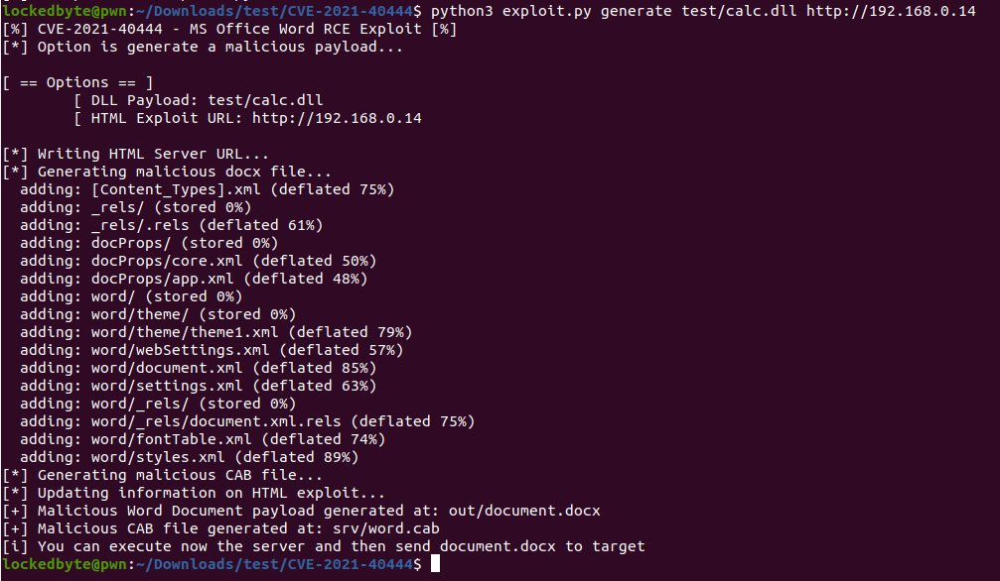</td>
</table></tr>
<table><tr>
<td>Quotes: <code>0</code></td>
<td>Replies: <code>0</code></td>
<td>Retweets: <code>2</code></td>
<td>Favorites: <code>0</code></td>
</tr></table>

---

# netalexx
**https://twitter.com/netalexx/status/1441778938636812291 _at 2021-09-25 14:57:40_**
<blockquote>
Malicious docx generator to exploit CVE-2021-40444 (Microsoft Office Word Remote Code Execution)
https://t.co/6TdfdAwNcX
</blockquote>

* https://github.com/lockedbyte/CVE-2021-40444

<table><tr>
<td>Quotes: <code>0</code></td>
<td>Replies: <code>0</code></td>
<td>Retweets: <code>1</code></td>
<td>Favorites: <code>0</code></td>
</tr></table>

---

# alyssarzg
**https://twitter.com/alyssarzg/status/1441751323574079490 _at 2021-09-25 13:07:56_**
<blockquote>
Correction: that link is to a kernel memory leak that could panic the iOS kernel but not exploit. A more relevant bug is CVE-2020-9768, a kernel use-after-free relating to JPEG. It's also apparently popular to use the JPEG kernel driver for spraying in exploits.
</blockquote>

<table><tr>
<td>Quotes: <code>0</code></td>
<td>Replies: <code>3</code></td>
<td>Retweets: <code>5</code></td>
<td>Favorites: <code>72</code></td>
</tr></table>

---

# impost0r_
**https://twitter.com/impost0r_/status/1441745976465805313 _at 2021-09-25 12:46:41_**
<blockquote>
In solidarity with https://t.co/QcrhWVBqPq and out of my own spite and frustration for Apple covering up my own bug, I've decided to make the Rotten Apples codesigning translocation vulnerability as easy to access as possible.

https://t.co/hEqcQzBKnB
It's that simple. (1/2)
</blockquote>

* https://habr.com/en/post/579714/
* https://github.com/impost0r/Rotten-Apples/blob/main/README.md

<table><tr>
<td>Quotes: <code>3</code></td>
<td>Replies: <code>4</code></td>
<td>Retweets: <code>60</code></td>
<td>Favorites: <code>173</code></td>
</tr></table>

---

# binitamshah
**https://twitter.com/binitamshah/status/1441745055761399823 _at 2021-09-25 12:43:02_**
<blockquote>
Malicious docx generator to exploit CVE-2021-40444 (Microsoft Office Word RCE ) - CVE-2021-40444 PoC   : https://t.co/nht86rILsi credits @lockedbyte https://t.co/0DSSm88TAh
</blockquote>

* https://github.com/lockedbyte/CVE-2021-40444

<table><tr>
<td></td>
</table></tr>
<table><tr>
<td>Quotes: <code>1</code></td>
<td>Replies: <code>0</code></td>
<td>Retweets: <code>39</code></td>
<td>Favorites: <code>101</code></td>
</tr></table>

---

# binitamshah
**https://twitter.com/binitamshah/status/1441686358104285187 _at 2021-09-25 08:49:47_**
<blockquote>
Unauthenticated Remote Code Execution (RCE) vulnerability in Hikvision IP cameras/NVR firmware   ,Patch now (*CVE-2021-36260) : https://t.co/DHaSjiAYcr  credits @Watchful_IP https://t.co/82ypjEwrzX
</blockquote>

* https://watchfulip.github.io/2021/09/18/Hikvision-IP-Camera-Unauthenticated-RCE.html

<table><tr>
<td></td>
<td></td>
<td></td>
<td></td>
</table></tr>
<table><tr>
<td>Quotes: <code>1</code></td>
<td>Replies: <code>1</code></td>
<td>Retweets: <code>28</code></td>
<td>Favorites: <code>76</code></td>
</tr></table>

---

# alyssarzg
**https://twitter.com/alyssarzg/status/1441597024239902728 _at 2021-09-25 02:54:48_**
<blockquote>
Prior art: an iOS kernel exploit (and jailbreak) attacking AppleJPEGDriver.

Yep, M1 macOS has a nearly unused kernel driver with a history of vulnerabilities... accessible to unprivileged userspace.

Nothing further, Your Honour.

https://t.co/jUcc2M1zzp
</blockquote>

* https://github.com/bazad/AppleJPEGDriver-memleak/blob/master/AppleJPEGDriver-memleak/AppleJPEGDriver-memleak.c

<table><tr>
<td>Quotes: <code>3</code></td>
<td>Replies: <code>5</code></td>
<td>Retweets: <code>34</code></td>
<td>Favorites: <code>289</code></td>
</tr></table>

---

# USCERT_gov
**https://twitter.com/USCERT_gov/status/1441525712838660098 _at 2021-09-24 22:11:26_**
<blockquote>
.@CISAgov expects widespread exploitation of VMware vCenter Server CVE-2021-22005, but mitigation is available. Patch immediately or apply the temporary workaround. Learn more at https://t.co/M5OMrM4ec7. #Cybersecurity #InfoSec
</blockquote>

* https://go.usa.gov/xMnCS

<table><tr>
<td>Quotes: <code>13</code></td>
<td>Replies: <code>4</code></td>
<td>Retweets: <code>176</code></td>
<td>Favorites: <code>252</code></td>
</tr></table>

---

# maddiestone
**https://twitter.com/maddiestone/status/1441469674894487554 _at 2021-09-24 18:28:46_**
<blockquote>
TAG has been busy... and so has Chrome ("Reported on 9-21, patched 9-24"!)

CVE-2021-37973 in-the-wild use after free in Portals discovered by @_clem1

https://t.co/ha1wb4sB6n
</blockquote>

* https://chromereleases.googleblog.com/2021/09/stable-channel-update-for-desktop_24.html

<table><tr>
<td>Quotes: <code>5</code></td>
<td>Replies: <code>3</code></td>
<td>Retweets: <code>23</code></td>
<td>Favorites: <code>96</code></td>
</tr></table>

---

# KlezVirus
**https://twitter.com/KlezVirus/status/1441445515439198211 _at 2021-09-24 16:52:46_**
<blockquote>
Just updated https://t.co/uJfx5N1uVn. Now it's possible to generate/test the attacks for IE-only and CAB-less RAR-based attacks. Also added a possible exploitable case for alternate URI schemes using the plain old HTML smuggling technique
</blockquote>

* https://github.com/klezVirus/CVE-2021-40444

<table><tr>
<td>Quotes: <code>2</code></td>
<td>Replies: <code>0</code></td>
<td>Retweets: <code>52</code></td>
<td>Favorites: <code>150</code></td>
</tr></table>

---

# hackyseguridad
**https://twitter.com/hackyseguridad/status/1441284944387469321 _at 2021-09-24 06:14:43_**
<blockquote>
Vulnerabilidad Azure (RCE) CVE-2021-38647 "OMIGOD", permite escalado de privilegios y ejecución remota de código en agente de software Open Management Infrastructure (OMI) instalado por Microsoft instancias de Azure. https://IP/wsman/  Exploit: https://t.co/b3SLRlCH1i
</blockquote>

* https://github.com/horizon3ai/CVE-2021-38647/

<table><tr>
<td>Quotes: <code>0</code></td>
<td>Replies: <code>0</code></td>
<td>Retweets: <code>0</code></td>
<td>Favorites: <code>0</code></td>
</tr></table>

---

# ptracesecurity
**https://twitter.com/ptracesecurity/status/1441279207741534221 _at 2021-09-24 05:51:55_**
<blockquote>
XSS payloads for bypassing WAF. This repository is updating continuously.  https://t.co/gK8dT9SUac  #Pentesting #Hacking #BugBounty #CyberSecurity #Infosec https://t.co/K65tyrNXMN
</blockquote>

* https://github.com/Walidhossain010/WAF-bypass-xss-payloads

<table><tr>
<td>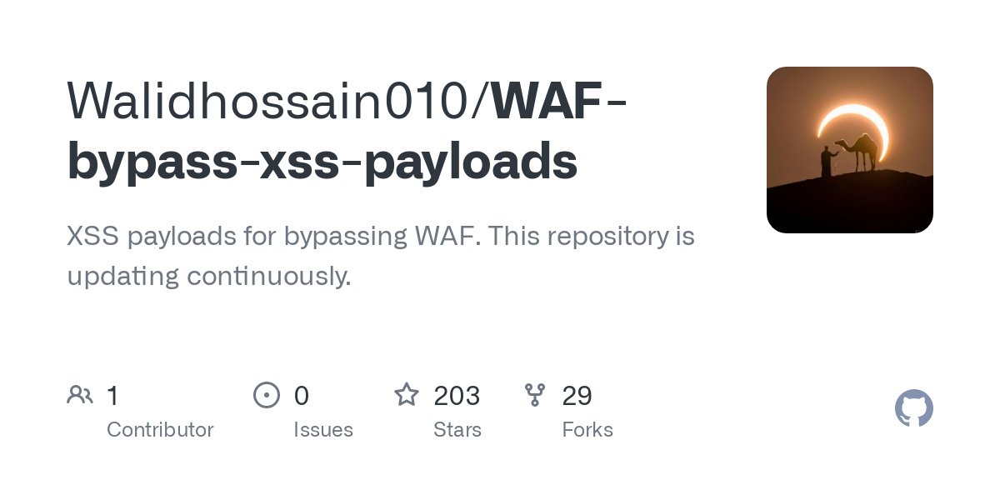</td>
</table></tr>
<table><tr>
<td>Quotes: <code>0</code></td>
<td>Replies: <code>1</code></td>
<td>Retweets: <code>52</code></td>
<td>Favorites: <code>56</code></td>
</tr></table>

---

# campuscodi
**https://twitter.com/campuscodi/status/1441077310640164866 _at 2021-09-23 16:29:39_**
<blockquote>
A PoC for the CVE-2021-30632 Chrome zero-day has been published on GitHub here: https://t.co/srl5ZjQD0P
</blockquote>

* https://github.com/Phuong39/PoC-CVE-2021-30632

<table><tr>
<td>Quotes: <code>1</code></td>
<td>Replies: <code>0</code></td>
<td>Retweets: <code>17</code></td>
<td>Favorites: <code>27</code></td>
</tr></table>

---

# securitytrails
**https://twitter.com/securitytrails/status/1441070314838921226 _at 2021-09-23 16:01:51_**
<blockquote>
A popular but overlooked software, fail2ban, had a Remote Code Execution (RCE) bug which could lead to root-level code execution. CVE-2021-32749

#fail2ban #linux #infosec

https://t.co/EENjJoJbMc
</blockquote>

* https://research.securitum.com/fail2ban-remote-code-execution/

<table><tr>
<td>Quotes: <code>4</code></td>
<td>Replies: <code>2</code></td>
<td>Retweets: <code>38</code></td>
<td>Favorites: <code>107</code></td>
</tr></table>

---

# 01_security_01
**https://twitter.com/01_security_01/status/1440977887750930433 _at 2021-09-23 09:54:35_**
<blockquote>
lockedbyte/CVE-2021-40444: CVE-2021-40444 PoC -   https://t.co/iUTWVZmvGP #0day #0day #cybersecurity
</blockquote>

* https://github.com/lockedbyte/CVE-2021-40444

<table><tr>
<td>Quotes: <code>0</code></td>
<td>Replies: <code>0</code></td>
<td>Retweets: <code>1</code></td>
<td>Favorites: <code>0</code></td>
</tr></table>

---

# stokfredrik
**https://twitter.com/stokfredrik/status/1440933792412221440 _at 2021-09-23 06:59:22_**
<blockquote>
So there’s a bunch of scanning for CVE-2021-22005 but do anyone have a rce poc or proof of execution? trying to figure out how it worked past the arbitrary file upload,
</blockquote>

<table><tr>
<td>Quotes: <code>0</code></td>
<td>Replies: <code>4</code></td>
<td>Retweets: <code>8</code></td>
<td>Favorites: <code>61</code></td>
</tr></table>

---

# Securityblog
**https://twitter.com/Securityblog/status/1440750682772885511 _at 2021-09-22 18:51:45_**
<blockquote>
GitHub - RyouYoo/CVE-2021-24499: Mass exploitation of CVE-2021-24499 unauthenticated upload leading to remote code execution in Workreap theme. https://t.co/EGtQeE8ll2
</blockquote>

* https://github.com/RyouYoo/CVE-2021-24499

<table><tr>
<td>Quotes: <code>0</code></td>
<td>Replies: <code>0</code></td>
<td>Retweets: <code>3</code></td>
<td>Favorites: <code>3</code></td>
</tr></table>

---

# Dinosn
**https://twitter.com/Dinosn/status/1440659430958239754 _at 2021-09-22 12:49:09_**
<blockquote>
Automated Tool That Generate A Powershell Oneliner That Can Create Meterpreter Shell On Metasploit,Bypass AMSI,Bypass Firewall,Bypass UAC,And Bypass Windows Defender.

https://t.co/pBrhJpzfq9
</blockquote>

* https://github.com/GetRektBoy724/MeterPwrShell

<table><tr>
<td>Quotes: <code>1</code></td>
<td>Replies: <code>0</code></td>
<td>Retweets: <code>25</code></td>
<td>Favorites: <code>64</code></td>
</tr></table>

---

# Dinosn
**https://twitter.com/Dinosn/status/1440514372971876352 _at 2021-09-22 03:12:44_**
<blockquote>
XSS payloads for bypassing WAF. https://t.co/x6CNnKhCdb
</blockquote>

* https://github.com/Walidhossain010/WAF-bypass-xss-payloads

<table><tr>
<td>Quotes: <code>4</code></td>
<td>Replies: <code>0</code></td>
<td>Retweets: <code>59</code></td>
<td>Favorites: <code>204</code></td>
</tr></table>

---

# uuallan
**https://twitter.com/uuallan/status/1440381124950179843 _at 2021-09-21 18:23:15_**
<blockquote>
Ransomware, and other, groups are already exploiting CVE-2021-21985, this new vCenter RCE vulnerability, CVE-2021-22005, looks even worse. Please patch or enable compensating controls. via @serghei  https://t.co/Qp5raYRkrF
</blockquote>

* https://www.bleepingcomputer.com/news/security/vmware-warns-of-critical-bug-in-default-vcenter-server-installs/#.YUoiQlUeVM8

<table><tr>
<td>Quotes: <code>5</code></td>
<td>Replies: <code>3</code></td>
<td>Retweets: <code>68</code></td>
<td>Favorites: <code>114</code></td>
</tr></table>

---

# chiragsavla94
**https://twitter.com/chiragsavla94/status/1440345221951148032 _at 2021-09-21 16:00:35_**
<blockquote>
Published a quick blog post on unauthenticated RCE #OMIGOD (CVE-2021-38647) with the PoC

https://t.co/G3wCjL4Br2

#Linux #RCE
</blockquote>

* https://www.alteredsecurity.com/post/omigod-cve-2021-38647

<table><tr>
<td>Quotes: <code>1</code></td>
<td>Replies: <code>1</code></td>
<td>Retweets: <code>25</code></td>
<td>Favorites: <code>67</code></td>
</tr></table>

---

# nikhil_mitt
**https://twitter.com/nikhil_mitt/status/1440344220670173184 _at 2021-09-21 15:56:37_**
<blockquote>
Now that Microsoft has started updating existing Linux VMs on #Azure, we have released a cute little PoC for #OMIGOD.
Enjoy!
https://t.co/LOn4G3aX56
</blockquote>

* https://github.com/AlteredSecurity/CVE-2021-38647

<table><tr>
<td>Quotes: <code>2</code></td>
<td>Replies: <code>1</code></td>
<td>Retweets: <code>33</code></td>
<td>Favorites: <code>124</code></td>
</tr></table>

---

# RhinoSecurity
**https://twitter.com/RhinoSecurity/status/1440344052143058962 _at 2021-09-21 15:55:56_**
<blockquote>
New Rhino Blog: CVE-2021-38112: AWS WorkSpaces Remote Code Execution
https://t.co/MlKtfBL4G8
</blockquote>

* https://bit.ly/3kzeyr7

<table><tr>
<td>Quotes: <code>8</code></td>
<td>Replies: <code>1</code></td>
<td>Retweets: <code>52</code></td>
<td>Favorites: <code>107</code></td>
</tr></table>

---

# 01_security_01
**https://twitter.com/01_security_01/status/1440200006447681537 _at 2021-09-21 06:23:33_**
<blockquote>
Phuong39/PoC-CVE-2021-30632: PoC CVE-2021-30632 -   https://t.co/u0QUvhiUAQ #0day #hacker #cyberintelligence
</blockquote>

* https://github.com/Phuong39/PoC-CVE-2021-30632

<table><tr>
<td>Quotes: <code>0</code></td>
<td>Replies: <code>0</code></td>
<td>Retweets: <code>1</code></td>
<td>Favorites: <code>0</code></td>
</tr></table>

---

# 01_security_01
**https://twitter.com/01_security_01/status/1440158444468666379 _at 2021-09-21 03:38:24_**
<blockquote>
0vercl0k/CVE-2021-31166: Proof of concept for CVE-2021-31166, a remote HTTP.sys use-after-free triggered remotely. -   https://t.co/047rrclJVK #leak #infosec #cyberthreat
</blockquote>

* https://github.com/0vercl0k/CVE-2021-31166

<table><tr>
<td>Quotes: <code>0</code></td>
<td>Replies: <code>0</code></td>
<td>Retweets: <code>4</code></td>
<td>Favorites: <code>3</code></td>
</tr></table>

---

# bad_packets
**https://twitter.com/bad_packets/status/1440140776269238272 _at 2021-09-21 02:28:12_**
<blockquote>
CVE-2021-38647 exploit activity detected from 5.149.248.66 (🇳🇱) and 44.238.21.135 (🇺🇸).

Target:
Azure Linux OMI endpoints vulnerable to remote code execution (https://t.co/ioxDgZ9AlM).

Payload URLs:
http://5.149.248.66:1080/re/b.x86
http://45.137.21.9/re/r.x86
#threatintel https://t.co/d83rsYyzIq
</blockquote>

* https://www.wiz.io/blog/omigod-critical-vulnerabilities-in-omi-azure

<table><tr>
<td></td>
<td></td>
</table></tr>
<table><tr>
<td>Quotes: <code>2</code></td>
<td>Replies: <code>1</code></td>
<td>Retweets: <code>39</code></td>
<td>Favorites: <code>71</code></td>
</tr></table>

---

# campuscodi
**https://twitter.com/campuscodi/status/1440085864395116546 _at 2021-09-20 22:50:00_**
<blockquote>
One of the Ryuk/Conti ransomware affiliates appears to have weaponized and is already using that IE/Office zero-day (CVE-2021-40444) disclosed two weeks ago by Microsoft

https://t.co/es2ubgdYNs https://t.co/bYRbpz1VYi
</blockquote>

* https://www.riskiq.com/blog/external-threat-management/wizard-spider-windows-0day-exploit/

<table><tr>
<td></td>
</table></tr>
<table><tr>
<td>Quotes: <code>1</code></td>
<td>Replies: <code>3</code></td>
<td>Retweets: <code>66</code></td>
<td>Favorites: <code>88</code></td>
</tr></table>

---

# pdnuclei
**https://twitter.com/pdnuclei/status/1440026344859987968 _at 2021-09-20 18:53:29_**
<blockquote>
The first security release for Nuclei is out, and here's a brief overview of the vulnerability. Thanks to @c3l3si4n for reporting this to us.

Blog - https://t.co/uEpqzmIPPE
Changelog - https://t.co/VMrZGew8qN

#hackwithautomation #security https://t.co/JgwazP34Dc
</blockquote>

* https://blog.projectdiscovery.io/nuclei-v2-5-2-release/
* https://github.com/projectdiscovery/nuclei/releases/

<table><tr>
<td>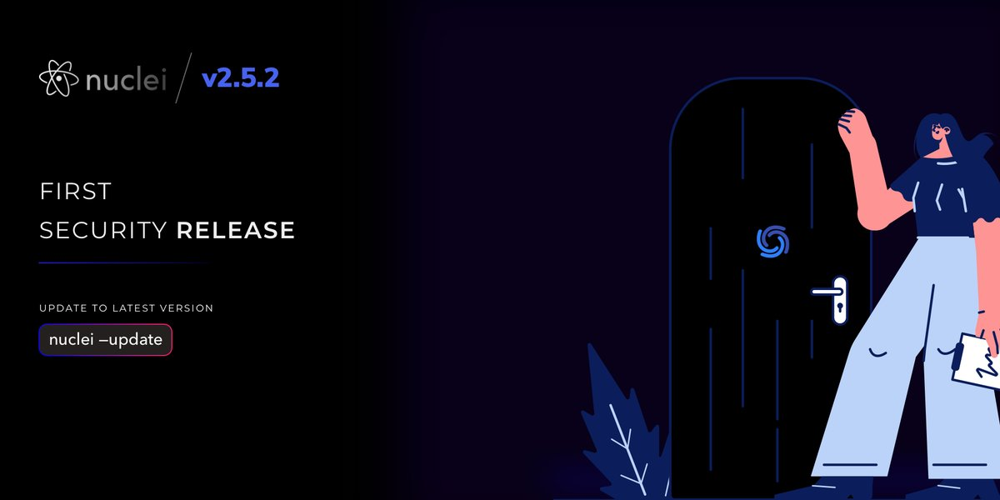</td>
</table></tr>
<table><tr>
<td>Quotes: <code>0</code></td>
<td>Replies: <code>2</code></td>
<td>Retweets: <code>17</code></td>
<td>Favorites: <code>96</code></td>
</tr></table>

---

# cKure7
**https://twitter.com/cKure7/status/1440009125484716032 _at 2021-09-20 17:45:04_**
<blockquote>
■■■■■ Zero-Day: PoC CVE-2021-30632 - Out of bounds write in V8.

Tested against Samsung Internet Browser v15.0.2.47, which does not yet have Google's patch.

https://t.co/1AvkRD9gmF
</blockquote>

* https://github.com/Phuong39/PoC-CVE-2021-30632

<table><tr>
<td>Quotes: <code>0</code></td>
<td>Replies: <code>0</code></td>
<td>Retweets: <code>1</code></td>
<td>Favorites: <code>0</code></td>
</tr></table>

---

# CVEnew
**https://twitter.com/CVEnew/status/1439631657863155716 _at 2021-09-19 16:45:08_**
<blockquote>
CVE-2021-41073 loop_rw_iter in fs/io_uring.c in the Linux kernel through 5.14.6 allows local users to gain privileges by using IORING_OP_PROVIDE_BUFFERS to trigger a free of a kernel buffer, as demonstrated by using /proc/&lt;pid&gt;/maps for exploitation. https://t.co/6FXtO7VK5a
</blockquote>

* https://cve.mitre.org/cgi-bin/cvename.cgi?name=CVE-2021-41073

<table><tr>
<td>Quotes: <code>11</code></td>
<td>Replies: <code>5</code></td>
<td>Retweets: <code>69</code></td>
<td>Favorites: <code>243</code></td>
</tr></table>

---

# youngd241
**https://twitter.com/youngd241/status/1439572393169670153 _at 2021-09-19 12:49:39_**
<blockquote>
GitHub - klezVirus/CVE-2021-40444: CVE-2021-40444 - Fully Weaponized Microsoft Office Word RCE Exploit https://t.co/8VQiLCLJ8N
</blockquote>

* https://github.com/klezVirus/CVE-2021-40444

<table><tr>
<td>Quotes: <code>0</code></td>
<td>Replies: <code>0</code></td>
<td>Retweets: <code>3</code></td>
<td>Favorites: <code>4</code></td>
</tr></table>

---

# c3l3si4n
**https://twitter.com/c3l3si4n/status/1439393108530192384 _at 2021-09-19 00:57:14_**
<blockquote>
Nuclei &lt; v2.5.2 was vulnerable to RCE.
I found that you could achieve RCE by using a malicious .yaml template and exploiting nuclei's headless browser feature, which runs with sandbox disabled.

Thanks @pdnuclei for the quick update and fix.
PoC:
https://t.co/IyL1nB9gl2
</blockquote>

* https://gist.github.com/c3l3si4n/88f750d20110ba603939b7473a8012ba

<table><tr>
<td>Quotes: <code>12</code></td>
<td>Replies: <code>3</code></td>
<td>Retweets: <code>68</code></td>
<td>Favorites: <code>319</code></td>
</tr></table>

---

# spaceraccoonsec
**https://twitter.com/spaceraccoonsec/status/1439282533137408002 _at 2021-09-18 17:37:51_**
<blockquote>
CVE-2021-33035: RCE in Apache OpenOffice up to 4.1.10 - pure memory corruption. Just talked about it at #hacktivitycon and full writeup at https://t.co/qYutUfml6J. More to come on CVE-2021-38646 Microsoft Office RCE... https://t.co/S3xmiHYYw8
</blockquote>

* https://medium.com/csg-govtech/all-your-d-base-are-belong-to-us-part-1-code-execution-in-apache-openoffice-cve-2021-33035-767fc7d6daf7?source=friends_link&sk=0cf113d71481c25f1a233e0c4f507357

<table><tr>
<td>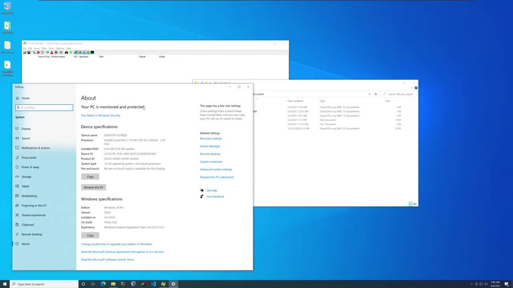</td>
</table></tr>
<table><tr>
<td>Quotes: <code>4</code></td>
<td>Replies: <code>10</code></td>
<td>Retweets: <code>128</code></td>
<td>Favorites: <code>382</code></td>
</tr></table>

---

# Hacker0x01
**https://twitter.com/Hacker0x01/status/1439274279430930437 _at 2021-09-18 17:05:03_**
<blockquote>
Our next speaker, @spaceraccoonsec was just recognized by @msftsecresponse for CVE-2021-38646  - “Microsoft Office Access Connectivity Engine Remote Code Execution Vulnerability”. Hear more about his research in 5 minutes at #hacktivitycon2021 https://t.co/BXaHyt6BQ3 https://t.co/38OWaOuVfN
</blockquote>

* http://twitch.tv/hackeronetv

<table><tr>
<td></td>
</table></tr>
<table><tr>
<td>Quotes: <code>2</code></td>
<td>Replies: <code>0</code></td>
<td>Retweets: <code>12</code></td>
<td>Favorites: <code>56</code></td>
</tr></table>

---

# 0xdea
**https://twitter.com/0xdea/status/1439123834775420933 _at 2021-09-18 07:07:14_**
<blockquote>
Analysis of CVE-2021-35211 (Serv-U SSH pre-auth RCE)

https://t.co/VJP4KXt003
</blockquote>

* https://yichenchai.github.io/blog/serv-u-part-1

<table><tr>
<td>Quotes: <code>1</code></td>
<td>Replies: <code>0</code></td>
<td>Retweets: <code>17</code></td>
<td>Favorites: <code>45</code></td>
</tr></table>

---

# 0xc7m
**https://twitter.com/0xc7m/status/1438905011573039106 _at 2021-09-17 16:37:42_**
<blockquote>
Malicious docx generator to exploit CVE-2021-40444, works with arbitrary DLL files.
Fully Weaponized CVE-2021-40444 #redteam #infosec
#pentest
https://t.co/jqsHrl2rEs
</blockquote>

* https://github.com/klezVirus/CVE-2021-40444

<table><tr>
<td>Quotes: <code>0</code></td>
<td>Replies: <code>0</code></td>
<td>Retweets: <code>0</code></td>
<td>Favorites: <code>0</code></td>
</tr></table>

---

# Dinosn
**https://twitter.com/Dinosn/status/1438841600034099200 _at 2021-09-17 12:25:44_**
<blockquote>
Fully Weaponized CVE-2021-40444
https://t.co/MsPlX0oeZq
</blockquote>

* https://github.com/klezVirus/CVE-2021-40444

<table><tr>
<td>Quotes: <code>2</code></td>
<td>Replies: <code>0</code></td>
<td>Retweets: <code>38</code></td>
<td>Favorites: <code>104</code></td>
</tr></table>

---

# reverseame
**https://twitter.com/reverseame/status/1438801041940701191 _at 2021-09-17 09:44:34_**
<blockquote>
CVE-2017-11176 PoC for Linux Kernel version 4.8.11, bypassing SMEP and SMAP (by stack pivoting inside the kernel and ROP) [UAF vuln] https://t.co/kODYH8t4zj
</blockquote>

* https://github.com/MaherAzzouzi/LinuxKernelStudy/tree/main/CVE-2017-11176

<table><tr>
<td>Quotes: <code>0</code></td>
<td>Replies: <code>0</code></td>
<td>Retweets: <code>3</code></td>
<td>Favorites: <code>5</code></td>
</tr></table>

---

# Anastasis_King
**https://twitter.com/Anastasis_King/status/1438786364267499522 _at 2021-09-17 08:46:15_**
<blockquote>
OMIGOD - Proof on Concept Exploit for CVE-2021-38647

CVE-2021-38647 is an unauthenticated RCE vulnerability effecting the OMI agent as root.

https://t.co/onBJsPobB4
</blockquote>

* https://github.com/horizon3ai/CVE-2021-38647

<table><tr>
<td>Quotes: <code>0</code></td>
<td>Replies: <code>0</code></td>
<td>Retweets: <code>1</code></td>
<td>Favorites: <code>0</code></td>
</tr></table>

---

# bad_packets
**https://twitter.com/bad_packets/status/1438753415106994179 _at 2021-09-17 06:35:19_**
<blockquote>
Mass scanning activity detected from 45.146.164.110 (🇷🇺) checking for Azure Linux OMI endpoints vulnerable to remote code execution (CVE-2021-38647).

Vendor advisory: https://t.co/PO4A8mK5PI

Proof of concept: https://t.co/ioxDgZ9AlM
#threatintel https://t.co/TKHFVTOmpb
</blockquote>

* https://msrc.microsoft.com/update-guide/en-US/vulnerability/CVE-2021-38647
* https://www.wiz.io/blog/omigod-critical-vulnerabilities-in-omi-azure

<table><tr>
<td></td>
</table></tr>
<table><tr>
<td>Quotes: <code>5</code></td>
<td>Replies: <code>0</code></td>
<td>Retweets: <code>26</code></td>
<td>Favorites: <code>44</code></td>
</tr></table>

---

# objective_see
**https://twitter.com/objective_see/status/1438677271317913601 _at 2021-09-17 01:32:45_**
<blockquote>
Wondering exactly how remote attackers were able exploit a zero-click 0day to infect Apple devices ...and how Apple patched it?  

Read our latest guest blog post, from Tom McGuire (a Senior Instructor at @JohnsHopkins) on CVE-2021-30860: https://t.co/kVbcHfqG0a
</blockquote>

* https://objective-see.com/blog/blog_0x67.html

<table><tr>
<td>Quotes: <code>4</code></td>
<td>Replies: <code>4</code></td>
<td>Retweets: <code>177</code></td>
<td>Favorites: <code>453</code></td>
</tr></table>

---

# JekiCode
**https://twitter.com/JekiCode/status/1438662464095367169 _at 2021-09-17 00:33:55_**
<blockquote>
CVE-2021-40444: CVE-2021-40444 - Fully Weaponized Microsoft Office Word RCE Exploit https://t.co/6QcWJotZMS #HTML
</blockquote>

* https://github.com/klezVirus/CVE-2021-40444

<table><tr>
<td>Quotes: <code>0</code></td>
<td>Replies: <code>0</code></td>
<td>Retweets: <code>1</code></td>
<td>Favorites: <code>2</code></td>
</tr></table>

---

# n0ipr0cs
**https://twitter.com/n0ipr0cs/status/1438621751626326020 _at 2021-09-16 21:52:08_**
<blockquote>
GitHub - klezVirus/CVE-2021-40444: CVE-2021-40444 - Fully Weaponized Microsoft Office Word RCE Exploit https://t.co/DZtjdNt1YP
</blockquote>

* https://github.com/klezVirus/CVE-2021-40444

<table><tr>
<td>Quotes: <code>0</code></td>
<td>Replies: <code>0</code></td>
<td>Retweets: <code>1</code></td>
<td>Favorites: <code>1</code></td>
</tr></table>

---

# t31m0
**https://twitter.com/t31m0/status/1438533247898640387 _at 2021-09-16 16:00:27_**
<blockquote>
PoC ---- exploit for CVE-2021-38647 RCE in OMI
https://t.co/sC4IgFba3v
</blockquote>

* https://github.com/Immersive-Labs-Sec/cve-2021-38647

<table><tr>
<td>Quotes: <code>0</code></td>
<td>Replies: <code>0</code></td>
<td>Retweets: <code>2</code></td>
<td>Favorites: <code>7</code></td>
</tr></table>

---

# _r_netsec
**https://twitter.com/_r_netsec/status/1438532657843871752 _at 2021-09-16 15:58:06_**
<blockquote>
RCE Proof of Concept for CVE-2021-38647 (OMIGOD) https://t.co/Q4TGbURPuH
</blockquote>

* https://github.com/horizon3ai/CVE-2021-38647

<table><tr>
<td>Quotes: <code>2</code></td>
<td>Replies: <code>0</code></td>
<td>Retweets: <code>25</code></td>
<td>Favorites: <code>54</code></td>
</tr></table>

---

# 0dayCTF
**https://twitter.com/0dayCTF/status/1438512577244373003 _at 2021-09-16 14:38:19_**
<blockquote>
Malicious .docx Generator (Microsoft Office Word RCE) | CVE-2021-40444
-
Repo: https://t.co/bKyi7omP5p
-
Creator: @lockedbyte 
-
Blog: https://t.co/hasffNJ02A
-
#cybersecurity  #infosec  #bugbounty  #bugbountytips #CTF #CVE https://t.co/oYaxcWiqmL
</blockquote>

* https://github.com/lockedbyte/CVE-2021-40444
* https://xret2pwn.github.io/CVE-2021-40444-Analysis-and-Exploit/

<table><tr>
<td></td>
</table></tr>
<table><tr>
<td>Quotes: <code>0</code></td>
<td>Replies: <code>1</code></td>
<td>Retweets: <code>59</code></td>
<td>Favorites: <code>150</code></td>
</tr></table>

---

# KitPloit
**https://twitter.com/KitPloit/status/1438506576478760966 _at 2021-09-16 14:14:28_**
<blockquote>
CVE-2021-40444 PoC - Malicious docx generator to exploit CVE-2021-40444 (Microsoft Office Word Remote Code Execution) https://t.co/uH7GbFPfRD https://t.co/rJRI0bvWUH
</blockquote>

* https://ift.tt/3hFDoDz

<table><tr>
<td></td>
</table></tr>
<table><tr>
<td>Quotes: <code>3</code></td>
<td>Replies: <code>0</code></td>
<td>Retweets: <code>27</code></td>
<td>Favorites: <code>62</code></td>
</tr></table>

---

# JGamblin
**https://twitter.com/JGamblin/status/1438471322670178304 _at 2021-09-16 11:54:23_**
<blockquote>
A new malicious DOCX generator to exploit CVE-2021-40444.  Patch Now! This is one of only ten CVEs with a 
@KennaSecurity score of 100/100 this year.  https://t.co/GBhcLqgGIT
</blockquote>

* https://github.com/klezVirus/CVE-2021-40444

<table><tr>
<td>Quotes: <code>1</code></td>
<td>Replies: <code>0</code></td>
<td>Retweets: <code>15</code></td>
<td>Favorites: <code>21</code></td>
</tr></table>

---

# cKure7
**https://twitter.com/cKure7/status/1438453054609707017 _at 2021-09-16 10:41:48_**
<blockquote>
Fully Weaponized CVE-2021-40444

Malicious docx generator to exploit CVE-2021-40444 (Microsoft Office Word Remote Code Execution), works with arbitrary DLL files.

https://t.co/xcbKpvvUu0
</blockquote>

* https://github.com/klezVirus/CVE-2021-40444

<table><tr>
<td>Quotes: <code>0</code></td>
<td>Replies: <code>0</code></td>
<td>Retweets: <code>1</code></td>
<td>Favorites: <code>0</code></td>
</tr></table>

---

# tais9
**https://twitter.com/tais9/status/1438449312153759746 _at 2021-09-16 10:26:55_**
<blockquote>
klezVirus/CVE-2021-40444: CVE-2021-40444 - Fully Weaponized Microsoft Office Word RCE Exploit https://t.co/rGne9Pz6wA
</blockquote>

* https://github.com/klezVirus/CVE-2021-40444

<table><tr>
<td>Quotes: <code>0</code></td>
<td>Replies: <code>0</code></td>
<td>Retweets: <code>1</code></td>
<td>Favorites: <code>0</code></td>
</tr></table>

---

# d4rckh
**https://twitter.com/d4rckh/status/1438447159402278915 _at 2021-09-16 10:18:22_**
<blockquote>
klezVirus - fully Weaponized CVE-2021-40444 POC released, since patch is out (offensive research) #infosec #security #cybersecurity #technology https://t.co/PAGCuaBTnL
</blockquote>

* https://github.com/klezVirus/CVE-2021-40444

<table><tr>
<td>Quotes: <code>0</code></td>
<td>Replies: <code>0</code></td>
<td>Retweets: <code>0</code></td>
<td>Favorites: <code>0</code></td>
</tr></table>

---

# KlezVirus
**https://twitter.com/KlezVirus/status/1438405281055117312 _at 2021-09-16 07:31:57_**
<blockquote>
https://t.co/uJfx5MJU3P
As the official patch has been released, I guessed it would be fine to release my version of #CVE202140444. This was quite fun to play with, tbh. This generator works to load arbitrary DLLs, and give a decent description of the required CAB patches
</blockquote>

* https://github.com/klezVirus/CVE-2021-40444

<table><tr>
<td>Quotes: <code>2</code></td>
<td>Replies: <code>2</code></td>
<td>Retweets: <code>83</code></td>
<td>Favorites: <code>238</code></td>
</tr></table>

---

# spaceraccoonsec
**https://twitter.com/spaceraccoonsec/status/1438322918862163971 _at 2021-09-16 02:04:41_**
<blockquote>
For Patch Tuesday, @msftsecresponse patched my report as CVE-2021-38646, "Microsoft Office Access Connectivity Engine Remote Code Execution Vulnerability", that led to RCE in Microsoft Office Access. More details soon.. maybe at my #hacktivitycon2021 talk? https://t.co/GCZRDui8N0 https://t.co/DralEBM0AF
</blockquote>

* http://hacktivitycon.com/

<table><tr>
<td></td>
</table></tr>
<table><tr>
<td>Quotes: <code>2</code></td>
<td>Replies: <code>3</code></td>
<td>Retweets: <code>11</code></td>
<td>Favorites: <code>150</code></td>
</tr></table>

---

# cglyer
**https://twitter.com/cglyer/status/1438298523900985345 _at 2021-09-16 00:27:45_**
<blockquote>
There’s a lot to unpack in @MsftSecIntel’s latest blog on the CVE-2021-40444 vulnerability. Here’s a thread of some of the details that I think are notable
</blockquote>

<table><tr>
<td>Quotes: <code>1</code></td>
<td>Replies: <code>1</code></td>
<td>Retweets: <code>34</code></td>
<td>Favorites: <code>98</code></td>
</tr></table>

---

# MsftSecIntel
**https://twitter.com/MsftSecIntel/status/1438291542142246920 _at 2021-09-16 00:00:00_**
<blockquote>
New blog post: Analyzing attacks that exploit the CVE-2021-40444 MSHTML vulnerability https://t.co/UJbuvdMU1r
</blockquote>

* https://msft.it/6011XTGHN

<table><tr>
<td>Quotes: <code>15</code></td>
<td>Replies: <code>6</code></td>
<td>Retweets: <code>385</code></td>
<td>Favorites: <code>769</code></td>
</tr></table>

---

# yuridiogenes
**https://twitter.com/yuridiogenes/status/1438162235013091330 _at 2021-09-15 15:26:11_**
<blockquote>
Using #Azure #Security Center to identify machines that are vulnerable to #OMIGOD CVE-2021-38647 in less than 30 seconds 👇 https://t.co/GzJCGuJ00Z
</blockquote>

<table><tr>
<td>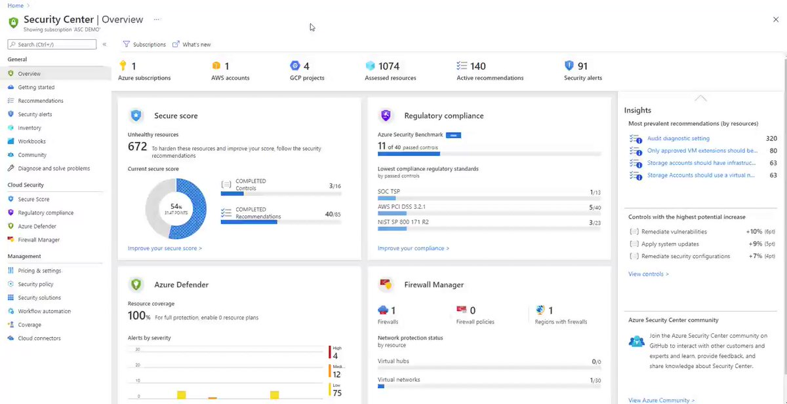</td>
</table></tr>
<table><tr>
<td>Quotes: <code>8</code></td>
<td>Replies: <code>8</code></td>
<td>Retweets: <code>112</code></td>
<td>Favorites: <code>235</code></td>
</tr></table>

---

# _mattata
**https://twitter.com/_mattata/status/1438161989558226946 _at 2021-09-15 15:25:12_**
<blockquote>
@GreyNoiseIO is now tracking CVE-2021-38647, Azure Open Management Infrastructure Remote Code Execution Vulnerability
https://t.co/pM15XIfSvH
</blockquote>

* https://www.greynoise.io/viz/query/?gnql=tags%3A%22Azure%20OMI%20RCE%20Attempt%22

<table><tr>
<td>Quotes: <code>4</code></td>
<td>Replies: <code>2</code></td>
<td>Retweets: <code>23</code></td>
<td>Favorites: <code>42</code></td>
</tr></table>

---

# optionalctf
**https://twitter.com/optionalctf/status/1438095465908740097 _at 2021-09-15 11:00:52_**
<blockquote>
I can finally share my blog post for CVE-2020-35340 - LFI in ExpertPDFs HTML to PDF .NET library. 

Read more about it in my blog post below:   
https://t.co/Bh16K2zWW6
</blockquote>

* https://optionalctf.com/cve-2020-35340-local-file-inclusion-in-expertpdf-9-5-0-14-1-0/

<table><tr>
<td>Quotes: <code>1</code></td>
<td>Replies: <code>0</code></td>
<td>Retweets: <code>4</code></td>
<td>Favorites: <code>37</code></td>
</tr></table>

---

# wdormann
**https://twitter.com/wdormann/status/1437887530247069704 _at 2021-09-14 21:14:36_**
<blockquote>
Everything old is new again.
Or rather, anything not completely patched will be the gift that keeps on giving.
Reading the https://t.co/D00qXB9Rv2 writeup on CVE-2018-8495 is giving me some serious déjà vu.
And some wonders why it took so long for somebody to discover / exploit.
</blockquote>

* https://leucosite.com/Microsoft-Edge-RCE/

<table><tr>
<td>Quotes: <code>0</code></td>
<td>Replies: <code>1</code></td>
<td>Retweets: <code>25</code></td>
<td>Favorites: <code>66</code></td>
</tr></table>

---

# BleepinComputer
**https://twitter.com/BleepinComputer/status/1437873871731007496 _at 2021-09-14 20:20:20_**
<blockquote>
Microsoft fixes Windows CVE-2021-40444 MSHTML zero-day bug - @serghei
https://t.co/FYqwJTqriD
</blockquote>

* https://www.bleepingcomputer.com/news/microsoft/microsoft-fixes-windows-cve-2021-40444-mshtml-zero-day-bug/

<table><tr>
<td>Quotes: <code>1</code></td>
<td>Replies: <code>0</code></td>
<td>Retweets: <code>43</code></td>
<td>Favorites: <code>73</code></td>
</tr></table>

---

# ryHanson
**https://twitter.com/ryHanson/status/1437873170552279040 _at 2021-09-14 20:17:32_**
<blockquote>
I’m surprised Microsoft didn’t prevent CVE-2021-40444 when they patched CVE-2018-8495?

CVE-2018-8495: Every HKCR\ProgID is a URL Protocol
CVE-2021-40444: Every HKCR\.ext is a URL Protocol

Is there a reason the registry lookup didn’t ensure “HKCR\*\URL Protocol” actually exists?
</blockquote>

<table><tr>
<td>Quotes: <code>4</code></td>
<td>Replies: <code>1</code></td>
<td>Retweets: <code>21</code></td>
<td>Favorites: <code>69</code></td>
</tr></table>

---

# campuscodi
**https://twitter.com/campuscodi/status/1437871896838778884 _at 2021-09-14 20:12:29_**
<blockquote>
Microsoft patches IE/Office zero-day (CVE-2021-40444) in today’s Patch Tuesday as attacks ramp up

https://t.co/ZeHstkjEVB https://t.co/vhBDLme8fP
</blockquote>

* https://therecord.media/microsoft-patches-office-zero-day-in-todays-patch-tuesday/

<table><tr>
<td></td>
</table></tr>
<table><tr>
<td>Quotes: <code>2</code></td>
<td>Replies: <code>1</code></td>
<td>Retweets: <code>38</code></td>
<td>Favorites: <code>66</code></td>
</tr></table>

---

# campuscodi
**https://twitter.com/campuscodi/status/1437830261610266630 _at 2021-09-14 17:27:02_**
<blockquote>
The Microsoft September 2021 Patch Tuesday is out

-86 vulnerabilities fixed this month
-48 are Chromium-related bugs
-fix for the CVE-2021-40444 zero-day also included

https://t.co/lkWPEpdnCv https://t.co/AdHmlu3HlC
</blockquote>

* https://rawcdn.githack.com/campuscodi/Microsoft-Patch-Tuesday-Security-Reports/b433082c2156fbeb6f7c7d2d2720f3ecbc207b83/Reports/MSRC_CVEs2021-Sep.html

<table><tr>
<td></td>
</table></tr>
<table><tr>
<td>Quotes: <code>17</code></td>
<td>Replies: <code>4</code></td>
<td>Retweets: <code>137</code></td>
<td>Favorites: <code>264</code></td>
</tr></table>

---

# s3xcur1ty
**https://twitter.com/s3xcur1ty/status/1437805445033381894 _at 2021-09-14 15:48:25_**
<blockquote>
CVE-2021-25646 Apache Druid RCE POC

https://t.co/ImstYfNdz3

#InfoSec #CyberSecurity #Apache #RCE
</blockquote>

* https://gist.github.com/FanqXu/36c5e0070fd8e0b6646993b4e386a6b1

<table><tr>
<td>Quotes: <code>0</code></td>
<td>Replies: <code>0</code></td>
<td>Retweets: <code>1</code></td>
<td>Favorites: <code>0</code></td>
</tr></table>

---

# 6a616b6f6d
**https://twitter.com/6a616b6f6d/status/1437804777514143750 _at 2021-09-14 15:45:46_**
<blockquote>
CVE-2018-18925
Exploitation of CVE-2018-18925 a Remote Code Execution against the Git self hosted tool: Gogs.
https://t.co/jFNQiEzVXS
#CVE #CyberSecurity  #RCE
</blockquote>

* https://github.com/RyouYoo/CVE-2018-18925

<table><tr>
<td>Quotes: <code>0</code></td>
<td>Replies: <code>0</code></td>
<td>Retweets: <code>2</code></td>
<td>Favorites: <code>1</code></td>
</tr></table>

---

# InQuest
**https://twitter.com/InQuest/status/1437769887552782346 _at 2021-09-14 13:27:08_**
<blockquote>
Once again, Microsoft will be keeping the Defenders busy.

Now to watch the wave of iterations, collect samples, and improve detection....

DDE --&gt; Equation Editor --&gt; CVE-2021-40444

Find useful info here: https://t.co/MDDtkWJ4rj

#CVE202140444 #0day

@Autow00t @DmitriyMelikov https://t.co/12PdoyDxJA
</blockquote>

* https://inquest.net/blog/2021/09/13/cve-2021-40444

<table><tr>
<td></td>
</table></tr>
<table><tr>
<td>Quotes: <code>5</code></td>
<td>Replies: <code>0</code></td>
<td>Retweets: <code>35</code></td>
<td>Favorites: <code>61</code></td>
</tr></table>

---

# 0day_sniper
**https://twitter.com/0day_sniper/status/1437754743712063491 _at 2021-09-14 12:26:57_**
<blockquote>
CVE-2021-30632 #Chrome #0day #PoC 

var a;
function foo() {
    a = new Uint32Array(100);
}
%PrepareFunctionForOptimization(foo);
foo();
foo();
a["xxx"] =1;
delete a["xxx"];
%OptimizeFunctionOnNextCall(foo);
foo();
</blockquote>

<table><tr>
<td>Quotes: <code>3</code></td>
<td>Replies: <code>3</code></td>
<td>Retweets: <code>195</code></td>
<td>Favorites: <code>623</code></td>
</tr></table>

---

# t31m0
**https://twitter.com/t31m0/status/1437566349170053122 _at 2021-09-13 23:58:20_**
<blockquote>
PoC ---&gt; Malicious docx generator to exploit CVE-2021-40444 (Microsoft Office Word Remote Code Execution)

https://t.co/c3egfOWMUE
</blockquote>

* https://github.com/lockedbyte/CVE-2021-40444

<table><tr>
<td>Quotes: <code>1</code></td>
<td>Replies: <code>0</code></td>
<td>Retweets: <code>13</code></td>
<td>Favorites: <code>25</code></td>
</tr></table>

---

# Max_Mal_
**https://twitter.com/Max_Mal_/status/1437564247324639234 _at 2021-09-13 23:49:59_**
<blockquote>
#MSHTML RCE Vulnerability #CVE-2021-40444 (#CVE202140444)

#DFIR #BlueTeam - Not only Control - CPL‼️

Potentially the exploit could run:
 #LOLBins 🔥🔥🔥🔥
MSHTA - HTA ✅
WSCRIPT - JS, JSE, VBA, WSF...✅
JAVAW - JAR ✅
MSIEXEC - MSI ✅
RegEdit - REG ✅

And MORE (?) https://t.co/CupB3SOmKV
</blockquote>

<table><tr>
<td></td>
<td>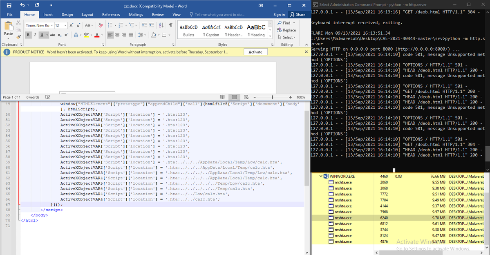</td>
<td></td>
<td></td>
</table></tr>
<table><tr>
<td>Quotes: <code>9</code></td>
<td>Replies: <code>9</code></td>
<td>Retweets: <code>146</code></td>
<td>Favorites: <code>335</code></td>
</tr></table>

---

# campuscodi
**https://twitter.com/campuscodi/status/1437525514831507459 _at 2021-09-13 21:16:05_**
<blockquote>
Google has released Chrome 93.0.4577.82

This version comes with fixes for two zero-days:
-CVE-2021-30632
-CVE-2021-30633

Zero details about both. Anyone have any insights?

https://t.co/k74mum8t6t https://t.co/Lp5PadUM6q
</blockquote>

* https://chromereleases.googleblog.com/2021/09/stable-channel-update-for-desktop.html

<table><tr>
<td></td>
</table></tr>
<table><tr>
<td>Quotes: <code>3</code></td>
<td>Replies: <code>1</code></td>
<td>Retweets: <code>15</code></td>
<td>Favorites: <code>37</code></td>
</tr></table>

---

# BleepinComputer
**https://twitter.com/BleepinComputer/status/1437523864351920128 _at 2021-09-13 21:09:31_**
<blockquote>
Called FORCEDENTRY, the vulnerability was discovered by Citizen Lab being used to install the NSO Pegasus spyware. 

The bug is tracked as CVE-2021-30860 and allows malicious PDFs to perform remote code execution.
</blockquote>

<table><tr>
<td>Quotes: <code>1</code></td>
<td>Replies: <code>2</code></td>
<td>Retweets: <code>19</code></td>
<td>Favorites: <code>86</code></td>
</tr></table>

---

# maddiestone
**https://twitter.com/maddiestone/status/1437512920770834434 _at 2021-09-13 20:26:02_**
<blockquote>
...and Chrome just patched 2 in-the-wild 0-days CVE-2021-30632 (out of bounds write in v8) and CVE-2021-30633 (use-after-free in Indexed DB)

What a Monday 

https://t.co/19tqlf4Fss
</blockquote>

* https://chromereleases.googleblog.com/2021/09/stable-channel-update-for-desktop.html

<table><tr>
<td>Quotes: <code>17</code></td>
<td>Replies: <code>5</code></td>
<td>Retweets: <code>147</code></td>
<td>Favorites: <code>401</code></td>
</tr></table>

---

# CacharroHacks
**https://twitter.com/CacharroHacks/status/1437445896707379211 _at 2021-09-13 15:59:42_**
<blockquote>
Probando el CVE-2021-40444 (Microsoft Office Word Remote Code Execution)....Omito la parte de como paso el doc de un equipo a otro....El git de la POC os lo dejo en un segundo tweet https://t.co/z1dYfce565
</blockquote>

<table><tr>
<td>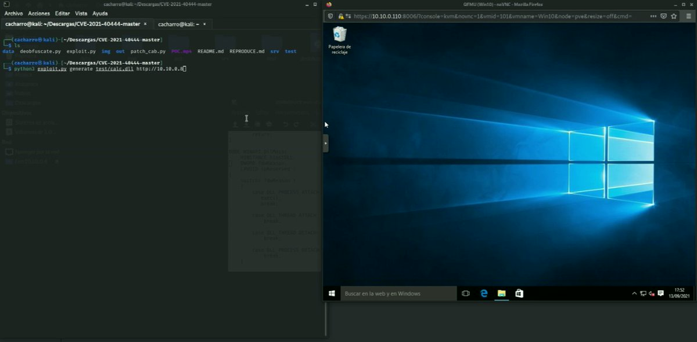</td>
</table></tr>
<table><tr>
<td>Quotes: <code>1</code></td>
<td>Replies: <code>3</code></td>
<td>Retweets: <code>18</code></td>
<td>Favorites: <code>59</code></td>
</tr></table>

---

# TheHackersNews
**https://twitter.com/TheHackersNews/status/1437414386436481025 _at 2021-09-13 13:54:30_**
<blockquote>
A high-severity remote code execution #vulnerability (CVE-2021-23406) has been identified in Pac-Resolver, a popular NPC package with about 3 million weekly downloads, affecting Node.js applications.

Read: https://t.co/GQ92qOa906

#infosec #cybersecurity #hacking
</blockquote>

* https://thehackernews.com/2021/09/critical-bug-reported-in-npm-package.html

<table><tr>
<td>Quotes: <code>5</code></td>
<td>Replies: <code>2</code></td>
<td>Retweets: <code>120</code></td>
<td>Favorites: <code>153</code></td>
</tr></table>

---

# j00sean
**https://twitter.com/j00sean/status/1437390861499838466 _at 2021-09-13 12:21:01_**
<blockquote>
I'm too late at CVE-2021-40444 party. But i just wanted to take a look at MSIE exploitation. Awesome to see a full exploit (RCE w/ sandbox escape) only using 6 lines of javascript code. Cool no doubt. https://t.co/PzfXL46ARW
</blockquote>

<table><tr>
<td>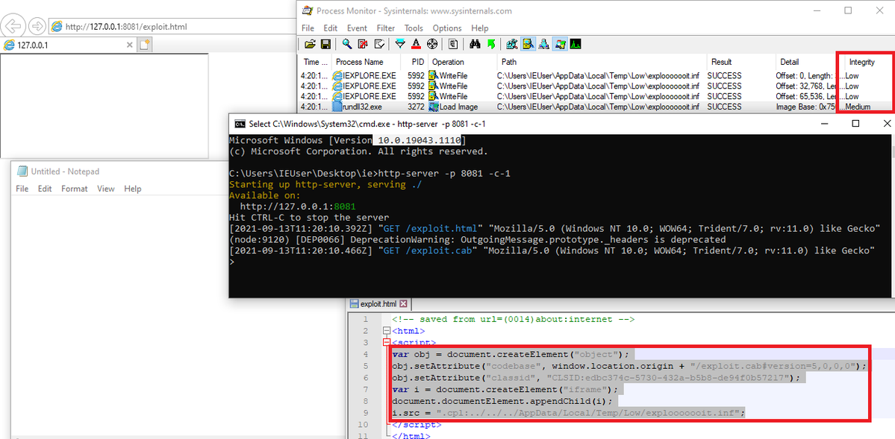</td>
</table></tr>
<table><tr>
<td>Quotes: <code>7</code></td>
<td>Replies: <code>5</code></td>
<td>Retweets: <code>174</code></td>
<td>Favorites: <code>526</code></td>
</tr></table>

---

# testanull
**https://twitter.com/testanull/status/1437359994207227910 _at 2021-09-13 10:18:22_**
<blockquote>
Just published some analysis on CVE-2021-2400 &amp; CVE-2021-2401, Oracle BI XXE
And some case study to get RCE with it
Have fun!
 https://t.co/UDS24aO3lh
</blockquote>

* https://link.medium.com/WHh3Vau1vjb

<table><tr>
<td>Quotes: <code>4</code></td>
<td>Replies: <code>1</code></td>
<td>Retweets: <code>98</code></td>
<td>Favorites: <code>300</code></td>
</tr></table>

---

# imabhisarpandey
**https://twitter.com/imabhisarpandey/status/1437318380818628616 _at 2021-09-13 07:33:00_**
<blockquote>
Access Control Vulnerability resources!!!
(1/3)
Blogs:
https://t.co/P7EuA1bV14
https://t.co/hU1dFCCSaX
https://t.co/SFLiAvZaXS
https://t.co/gp3bae7D4r
https://t.co/tNlyxH6SX8
 
https://t.co/IYlgVxlcaC
#cybersecurity #bugbounty #infosecwriteups  #infosec
</blockquote>

* https://www.csoonline.com/article/3251714/what-is-access-control-a-key-component-of-data-security.html
* https://www.usenix.org/legacy/event/sec11/tech/full_papers/Sun.pdf
* https://www.packetlabs.net/broken-access-control/
* https://infosecwriteups.com/begineers-crash-course-for-finding-access-control-vulnerabilities-in-the-web-apps-part-1-5b61cf4396c4
* https://github.com/HannanHaseeb11/Broken-Access-Control-BAC-
* https://portswigger.net/web-security/access-control

<table><tr>
<td>Quotes: <code>1</code></td>
<td>Replies: <code>1</code></td>
<td>Retweets: <code>74</code></td>
<td>Favorites: <code>116</code></td>
</tr></table>

---

# ASL_IT
**https://twitter.com/ASL_IT/status/1437126855887253506 _at 2021-09-12 18:51:57_**
<blockquote>
I have made 3 builders for docx, cab, and HTML for CVE-2021-40444. Goal is to test how easily we can bypass static AV detections for the DOCX file, by just tampering with some characters.

https://t.co/54pwDdgjwt

The results were very predictable.
#infosec #hacking #redteam https://t.co/tWbzEWkHur
</blockquote>

* https://github.com/aslitsecurity/CVE-2021-40444_builders

<table><tr>
<td></td>
</table></tr>
<table><tr>
<td>Quotes: <code>3</code></td>
<td>Replies: <code>6</code></td>
<td>Retweets: <code>87</code></td>
<td>Favorites: <code>192</code></td>
</tr></table>

---

# kmkz_security
**https://twitter.com/kmkz_security/status/1436996351615770625 _at 2021-09-12 10:13:22_**
<blockquote>
Analysis of CVE-2021-26897 DNS Server RCE - by @CoreSecurity 
https://t.co/N1Oxz1vKxh
</blockquote>

* https://www.coresecurity.com/core-labs/articles/analysis-cve-2021-26897-dns-server-rce

<table><tr>
<td>Quotes: <code>1</code></td>
<td>Replies: <code>0</code></td>
<td>Retweets: <code>29</code></td>
<td>Favorites: <code>90</code></td>
</tr></table>

---

# 7h3h4ckv157
**https://twitter.com/7h3h4ckv157/status/1436918472957575172 _at 2021-09-12 05:03:55_**
<blockquote>
Microsoft MSHTML Remote Code Execution Vulnerability

CVE-2021-40444

This one 🔥🔥🔥💥👌🏻!!!

https://t.co/Lyv11JNVRQ https://t.co/awtt6Vgp8i
</blockquote>

* https://github.com/lockedbyte/CVE-2021-40444

<table><tr>
<td>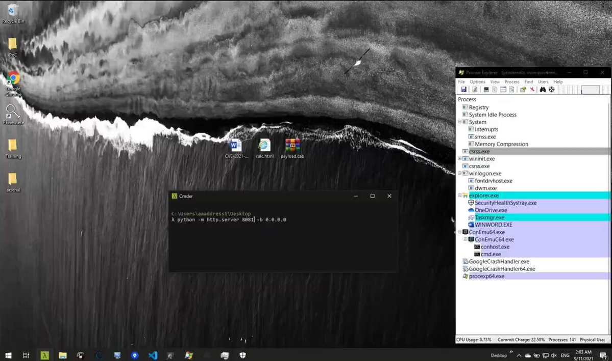</td>
</table></tr>
<table><tr>
<td>Quotes: <code>0</code></td>
<td>Replies: <code>0</code></td>
<td>Retweets: <code>2</code></td>
<td>Favorites: <code>6</code></td>
</tr></table>

---

# WilfridBlanc
**https://twitter.com/WilfridBlanc/status/1436811804265566211 _at 2021-09-11 22:00:03_**
<blockquote>
Malicious docx generator to #exploit #CVE-2021-40444 (Microsoft Office Word Remote Code Execution) https://t.co/qX7TjppY8t
</blockquote>

* https://github.com/lockedbyte/CVE-2021-40444

<table><tr>
<td>Quotes: <code>0</code></td>
<td>Replies: <code>0</code></td>
<td>Retweets: <code>1</code></td>
<td>Favorites: <code>0</code></td>
</tr></table>

---

# catnap707
**https://twitter.com/catnap707/status/1436578465642254338 _at 2021-09-11 06:32:51_**
<blockquote>
GitHub - lockedbyte/CVE-2021-40444: CVE-2021-40444 PoC https://t.co/M5z7dEfS6g
"Malicious docx generator to exploit CVE-2021-40444 (Microsoft Office Word Remote Code Execution)"
</blockquote>

* https://github.com/lockedbyte/CVE-2021-40444

<table><tr>
<td>Quotes: <code>0</code></td>
<td>Replies: <code>1</code></td>
<td>Retweets: <code>0</code></td>
<td>Favorites: <code>0</code></td>
</tr></table>

---

# _r_netsec
**https://twitter.com/_r_netsec/status/1436384753880424449 _at 2021-09-10 17:43:06_**
<blockquote>
CVE-2021-40444 - 0day Affecting MSHTML Engine Leading to RCE via Crafted Microsoft Office or RTF File https://t.co/NctycdWtoa
</blockquote>

* https://www.huntress.com/blog/cybersecurity-advisory-hackers-are-exploiting-cve-2021-40444

<table><tr>
<td>Quotes: <code>2</code></td>
<td>Replies: <code>0</code></td>
<td>Retweets: <code>19</code></td>
<td>Favorites: <code>43</code></td>
</tr></table>

---

# bad_packets
**https://twitter.com/bad_packets/status/1436362114478718976 _at 2021-09-10 16:13:09_**
<blockquote>
Mass scanning activity detected from 185.216.25.110 (🇫🇷) targeting Fortinet VPN servers vulnerable to unauthenticated arbitrary file read (CVE-2018-13379) leading to disclosure of usernames and passwords in plaintext. #threatintel https://t.co/WgnNDOkx8a
</blockquote>

<table><tr>
<td></td>
</table></tr>
<table><tr>
<td>Quotes: <code>2</code></td>
<td>Replies: <code>2</code></td>
<td>Retweets: <code>28</code></td>
<td>Favorites: <code>43</code></td>
</tr></table>

---

# KorbenD_Intel
**https://twitter.com/KorbenD_Intel/status/1436338559628230657 _at 2021-09-10 14:39:33_**
<blockquote>
@James_inthe_box @JAMESWT_MHT @malwrhunterteam @Arkbird_SOLG @cyb3rops in case you didn't already know, the Confluence CVE-2021-26084 was updated to any unauthenticated user can exploit, regardless of configuration https://t.co/CvqpPkmvAi
</blockquote>

<table><tr>
<td></td>
</table></tr>
<table><tr>
<td>Quotes: <code>1</code></td>
<td>Replies: <code>2</code></td>
<td>Retweets: <code>14</code></td>
<td>Favorites: <code>40</code></td>
</tr></table>

---

# Trapmine
**https://twitter.com/Trapmine/status/1436319093678817283 _at 2021-09-10 13:22:12_**
<blockquote>
TRAPMINE VS Microsoft Office Zero-Day (CVE-2021-40444) https://t.co/hVcVriBq27
</blockquote>

<table><tr>
<td>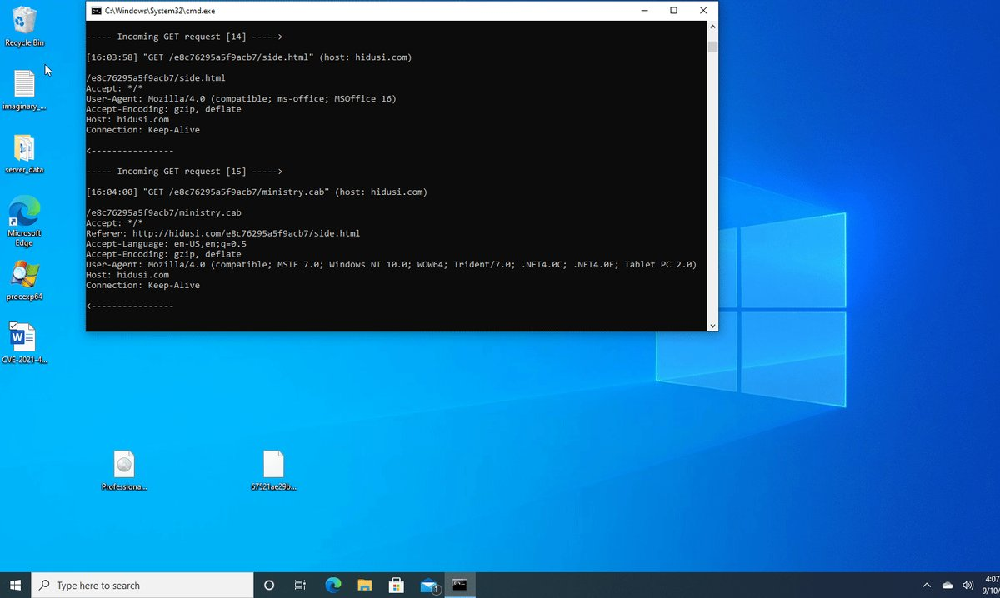</td>
</table></tr>
<table><tr>
<td>Quotes: <code>2</code></td>
<td>Replies: <code>0</code></td>
<td>Retweets: <code>13</code></td>
<td>Favorites: <code>68</code></td>
</tr></table>

---

# imabhisarpandey
**https://twitter.com/imabhisarpandey/status/1436172767255097370 _at 2021-09-10 03:40:45_**
<blockquote>
Thread for Escalating LFI to RCE:
(1/4)
(blogs)
https://t.co/otH41ff3ei

https://t.co/lNmO2Oeldy

https://t.co/WPlKWWBETA

https://t.co/IaRTPbHKFF

https://t.co/h9zWPglz9n

https://t.co/tu3VVRTeNj

https://t.co/0YiJBux5ge

https://t.co/KvbqnHnHx4

https://t.co/kfORuF2XhK
#lfi
</blockquote>

* https://shahjerry33.medium.com/rce-via-lfi-log-poisoning-the-death-potion-c0831cebc16d
* https://infosecwriteups.com/bugbounty-journey-from-lfi-to-rce-how-a69afe5a0899
* https://outpost24.com/blog/from-local-file-inclusion-to-remote-code-execution-part-1
* https://outpost24.com/blog/from-local-file-inclusion-to-remote-code-execution-part-2
* https://book.hacktricks.xyz/pentesting-web/file-inclusion
* https://resources.infosecinstitute.com/topic/local-file-inclusion-code-execution/
* https://github.com/swisskyrepo/PayloadsAllTheThings/blob/master/File%20Inclusion/README.md
* https://www.corben.io/zip-to-rce-lfi/
* https://www.exploit-db.com/papers/12992

<table><tr>
<td>Quotes: <code>0</code></td>
<td>Replies: <code>1</code></td>
<td>Retweets: <code>105</code></td>
<td>Favorites: <code>200</code></td>
</tr></table>

---

# AdamOfDc949
**https://twitter.com/AdamOfDc949/status/1436165629531369472 _at 2021-09-10 03:12:23_**
<blockquote>
@grimmcyber just got assigned CVE-2021-40847 for a vulnerability that allows remote code execution as root from the WAN side of 11 models of SOHO routers to MitM attackers. Exploit is 100% stable.

We're working with the vendor. Disclosure deadline is September 21st.
</blockquote>

<table><tr>
<td>Quotes: <code>2</code></td>
<td>Replies: <code>4</code></td>
<td>Retweets: <code>28</code></td>
<td>Favorites: <code>70</code></td>
</tr></table>

---

# jq0904
**https://twitter.com/jq0904/status/1436155700212744211 _at 2021-09-10 02:32:56_**
<blockquote>
CVE-2021-40444 is so bad🤦‍♂️ https://t.co/3Gu9ahwmHd
</blockquote>

<table><tr>
<td></td>
</table></tr>
<table><tr>
<td>Quotes: <code>47</code></td>
<td>Replies: <code>24</code></td>
<td>Retweets: <code>530</code></td>
<td>Favorites: <code>1512</code></td>
</tr></table>

---

# rootsecdev
**https://twitter.com/rootsecdev/status/1436112328316096516 _at 2021-09-09 23:40:35_**
<blockquote>
Microsoft updated their workaround guidance. Do the GPO option. It’s cleaner.

CVE-2021-40444 - Security Update Guide - Microsoft - Microsoft MSHTML Remote Code Execution Vulnerability https://t.co/gSVPaQ1hif
</blockquote>

* https://msrc.microsoft.com/update-guide/vulnerability/CVE-2021-40444

<table><tr>
<td>Quotes: <code>5</code></td>
<td>Replies: <code>5</code></td>
<td>Retweets: <code>73</code></td>
<td>Favorites: <code>182</code></td>
</tr></table>

---

# 0x09AL
**https://twitter.com/0x09AL/status/1436072416791437312 _at 2021-09-09 21:01:59_**
<blockquote>
I managed to reproduce the Microsoft Word CVE-2021–40444 exploit. The chain is relatively complex, but to weaponise the current samples is easy, so we will probably see some more attacks on the wild. #MicrosoftWord #0day #CVE-2021-40444
https://t.co/s3WyhJ889N
</blockquote>

* https://www.youtube.com/watch?v=oM6UaaXJ46I

<table><tr>
<td>Quotes: <code>2</code></td>
<td>Replies: <code>4</code></td>
<td>Retweets: <code>59</code></td>
<td>Favorites: <code>185</code></td>
</tr></table>

---

# lasq88
**https://twitter.com/lasq88/status/1436016353052270597 _at 2021-09-09 17:19:13_**
<blockquote>
I analyzed a circulating sample of CVE-2021-40444 zero-day exploit. This exploit allows infecting users by opening a malicious document without any macros on a current version of Windows.

https://t.co/1l7dykDx30

#CVE202140444
</blockquote>

* https://youtu.be/Oz16xte5UeU

<table><tr>
<td>Quotes: <code>7</code></td>
<td>Replies: <code>2</code></td>
<td>Retweets: <code>39</code></td>
<td>Favorites: <code>100</code></td>
</tr></table>

---

# YourAnonNews
**https://twitter.com/YourAnonNews/status/1436012495605481477 _at 2021-09-09 17:03:53_**
<blockquote>
Attackers are exploiting zero-day RCE flaw to target Windows users (CVE-2021-40444) https://t.co/jABdxWLmZU
</blockquote>

* https://www.helpnetsecurity.com/2021/09/08/cve-2021-40444/

<table><tr>
<td>Quotes: <code>0</code></td>
<td>Replies: <code>2</code></td>
<td>Retweets: <code>26</code></td>
<td>Favorites: <code>130</code></td>
</tr></table>

---

# felixw3000
**https://twitter.com/felixw3000/status/1436007209067024384 _at 2021-09-09 16:42:53_**
<blockquote>
🙋Having a hard time replicating Office samples exploiting CVE-2021-40444 (MSHTML Remote Code Execution Vulnerability) because the server side component is taken down? ⚙️Imaginary C2 got you covered, it allows to easily simulate the server side component: https://t.co/kQk0HCFvrt https://t.co/lei7EklTfV
</blockquote>

* https://github.com/felixweyne/imaginaryC2/tree/master/examples/use-case-10-CVE-2021-40444

<table><tr>
<td></td>
</table></tr>
<table><tr>
<td>Quotes: <code>5</code></td>
<td>Replies: <code>5</code></td>
<td>Retweets: <code>142</code></td>
<td>Favorites: <code>296</code></td>
</tr></table>

---

# NakedSecurity
**https://twitter.com/NakedSecurity/status/1435936941900500993 _at 2021-09-09 12:03:40_**
<blockquote>
Latest on CVE-2021-40444 🚨

Details are scarce so far, but Microsoft is warning Office users about a bug that’s dubbed CVE-2021-40444, and described as Microsoft MSHTML Remote Code Execution Vulnerability.

1/6
</blockquote>

<table><tr>
<td>Quotes: <code>2</code></td>
<td>Replies: <code>1</code></td>
<td>Retweets: <code>22</code></td>
<td>Favorites: <code>44</code></td>
</tr></table>

---

# TheHackersNews
**https://twitter.com/TheHackersNews/status/1435842539513270274 _at 2021-09-09 05:48:32_**
<blockquote>
CISA warns of a zero-day #vulnerability (CVE-2021-40539) affecting Zoho ManageEngine ADSelfService Plus that has been actively exploited in the wild.

Details: https://t.co/fJGnPKNyaC

The authentication bypass flaw could lead to arbitrary remote code execution attacks.

#infosec
</blockquote>

* https://thehackernews.com/2021/09/cisa-warns-of-actively-exploited-zoho.html

<table><tr>
<td>Quotes: <code>3</code></td>
<td>Replies: <code>0</code></td>
<td>Retweets: <code>56</code></td>
<td>Favorites: <code>62</code></td>
</tr></table>

---

# netikus
**https://twitter.com/netikus/status/1435709556726902789 _at 2021-09-08 21:00:07_**
<blockquote>
EventSentry users can utilize a new validation script (https://t.co/zyhJmTYgnL)  to detect hosts that do not have Application Guard enabled. #0day #exploit #apt #office #CVE-2021-40444
</blockquote>

* https://www.eventsentry.com/validationscripts

<table><tr>
<td>Quotes: <code>0</code></td>
<td>Replies: <code>0</code></td>
<td>Retweets: <code>3</code></td>
<td>Favorites: <code>572</code></td>
</tr></table>

---

# lagal1990
**https://twitter.com/lagal1990/status/1435481020271316996 _at 2021-09-08 05:51:59_**
<blockquote>
CVE-2021-40444 Office Word .docx 0day exploit #0day #rce #word https://t.co/zkvGy8p90Z
</blockquote>

<table><tr>
<td>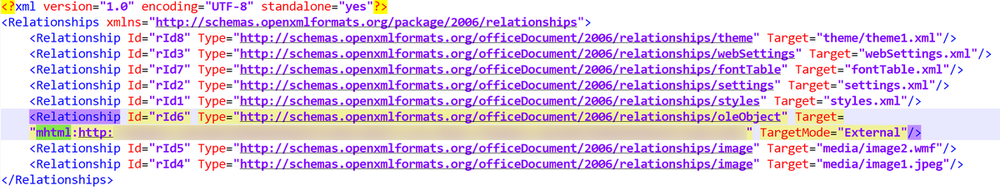</td>
</table></tr>
<table><tr>
<td>Quotes: <code>6</code></td>
<td>Replies: <code>7</code></td>
<td>Retweets: <code>87</code></td>
<td>Favorites: <code>162</code></td>
</tr></table>

---

# TheHackersNews
**https://twitter.com/TheHackersNews/status/1435448698926817283 _at 2021-09-08 03:43:33_**
<blockquote>
Microsoft has issued an advisory WARNING its users about a new actively exploited ZERO-DAY vulnerability (CVE-2021-40444 // CVSS score: 8.8) that attackers are using to hijack Windows systems by leveraging weaponized Office documents.

Details: https://t.co/6zd9mFDJrD

#infosec
</blockquote>

* https://thehackernews.com/2021/09/new-0-day-attack-targeting-windows.html

<table><tr>
<td>Quotes: <code>23</code></td>
<td>Replies: <code>5</code></td>
<td>Retweets: <code>299</code></td>
<td>Favorites: <code>436</code></td>
</tr></table>

---

# EXPMON_
**https://twitter.com/EXPMON_/status/1435384582132600832 _at 2021-09-07 23:28:47_**
<blockquote>
Our system detects the Microsoft #CVE-2021-40444 #zero-day attack like this. We output the keyword "zero-day" if we think a sample is an unpatched zero-day exploit.

(had to redact some info for now, as we don't want to help other malicious actors)

#0day #exploit #apt #office https://t.co/RMniCTTols
</blockquote>

<table><tr>
<td></td>
</table></tr>
<table><tr>
<td>Quotes: <code>2</code></td>
<td>Replies: <code>1</code></td>
<td>Retweets: <code>44</code></td>
<td>Favorites: <code>115</code></td>
</tr></table>

---

# USCERT_gov
**https://twitter.com/USCERT_gov/status/1435342618704191491 _at 2021-09-07 20:42:02_**
<blockquote>
.@CISAgov encourages users and organizations to review Microsoft's mitigations and workarounds to address CVE-2021-40444, a remote code execution vulnerability in Microsoft Windows: https://t.co/PY3WTgvzRa
</blockquote>

* https://msrc.microsoft.com/update-guide/vulnerability/CVE-2021-40444

<table><tr>
<td>Quotes: <code>9</code></td>
<td>Replies: <code>3</code></td>
<td>Retweets: <code>93</code></td>
<td>Favorites: <code>112</code></td>
</tr></table>

---

# ImposeCost
**https://twitter.com/ImposeCost/status/1435311131183271944 _at 2021-09-07 18:36:55_**
<blockquote>
CVE-2021-40444 - Microsoft is aware of targeted attacks that attempt to exploit this vulnerability by using specially-crafted Microsoft Office documents. 

Rick Cole (MSTIC)
Dhanesh Kizhakkinan of Mandiant
Haifei Li of EXPMON
Bryce Abdo of Mandiant

https://t.co/q87XlO2vew
</blockquote>

* https://msrc.microsoft.com/update-guide/vulnerability/CVE-2021-40444

<table><tr>
<td>Quotes: <code>17</code></td>
<td>Replies: <code>6</code></td>
<td>Retweets: <code>170</code></td>
<td>Favorites: <code>367</code></td>
</tr></table>

---

# cycatz2
**https://twitter.com/cycatz2/status/1435206707949408257 _at 2021-09-07 11:41:58_**
<blockquote>
#bugbountytips #bugbounty CVE-2021-26084 Confluence Server- Unauthenticated attacker to execute arbitrary code on a Confluence Server 

More..https://t.co/5WEePPyDcF https://t.co/2tHeKRoC90
</blockquote>

* https://bit.ly/3tjYA6G

<table><tr>
<td></td>
</table></tr>
<table><tr>
<td>Quotes: <code>1</code></td>
<td>Replies: <code>0</code></td>
<td>Retweets: <code>22</code></td>
<td>Favorites: <code>58</code></td>
</tr></table>

---

# tbbhunter
**https://twitter.com/tbbhunter/status/1434988821280591872 _at 2021-09-06 21:16:10_**
<blockquote>
RCE 0 day for GhostScript-9.50

PoC for RCE 0-day for GhostScript 9.50 - Payload generator

https://t.co/9KXSMDntpc
</blockquote>

* https://github.com/duc-nt/RCE-0-day-for-GhostScript-9.50

<table><tr>
<td>Quotes: <code>0</code></td>
<td>Replies: <code>0</code></td>
<td>Retweets: <code>7</code></td>
<td>Favorites: <code>31</code></td>
</tr></table>

---

# labmlai
**https://twitter.com/labmlai/status/1434792516704899075 _at 2021-09-06 08:16:07_**
<blockquote>
"ETA Prediction with Graph Neural Networks in Google Maps"

✏️ Highlighted paper from our reading session

https://t.co/LD93qF2ZRL

This has been deployed and has reduced the number of incorrect (off by a margin) ETA predictions by 20-50% in Google Maps. https://t.co/9o4pjGb5Z6
</blockquote>

* https://github.com/labmlai/annotated_deep_learning_paper_implementations/blob/master/papers/google_maps_eta.pdf

<table><tr>
<td>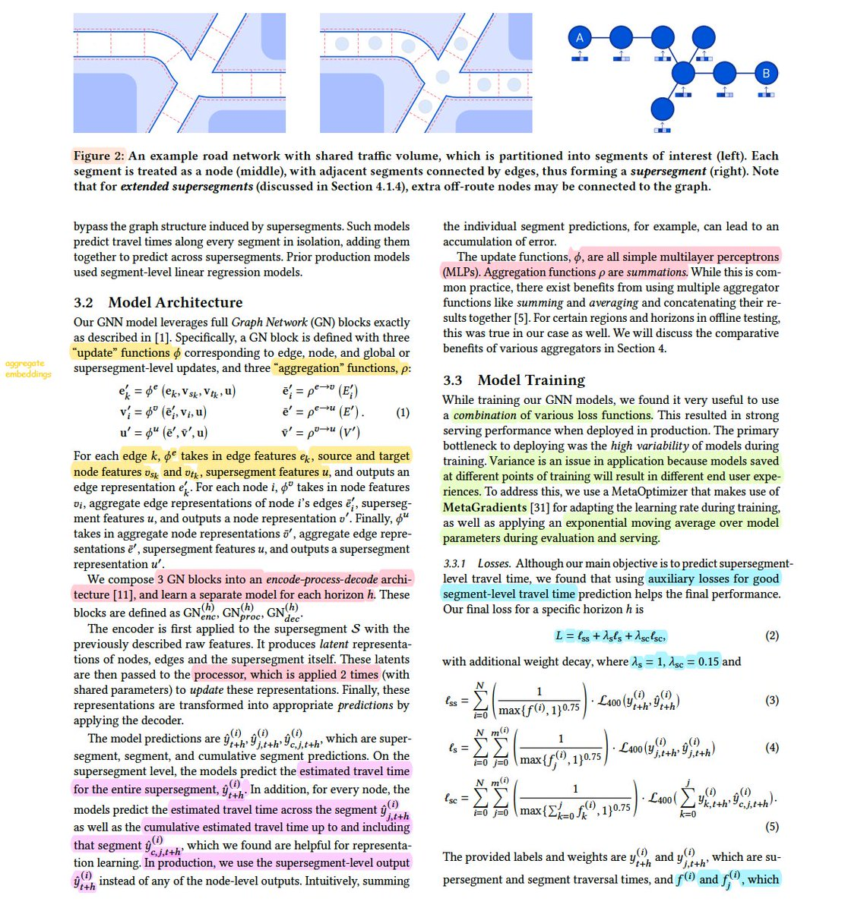</td>
</table></tr>
<table><tr>
<td>Quotes: <code>3</code></td>
<td>Replies: <code>2</code></td>
<td>Retweets: <code>54</code></td>
<td>Favorites: <code>330</code></td>
</tr></table>

---

# OPOSEC
**https://twitter.com/OPOSEC/status/1434546878692139018 _at 2021-09-05 16:00:03_**
<blockquote>
Escaping the sandbox by misleading bluetoothd (CVE-2018-4087). https://t.co/Upvh5mSf8i Blog: https://t.co/vRT5CLyHFA (+) #Hack #213 (2018)
</blockquote>

* https://github.com/rani-i/bluetoothdPoC
* https://goo.gl/4RvH9T

<table><tr>
<td>Quotes: <code>0</code></td>
<td>Replies: <code>0</code></td>
<td>Retweets: <code>3</code></td>
<td>Favorites: <code>5</code></td>
</tr></table>

---

# elhackernet
**https://twitter.com/elhackernet/status/1433979125480443904 _at 2021-09-04 02:24:00_**
<blockquote>
Grave Vulnerabilidad RCE en Confluence Server y Data Center
- Confluence Server Webwork OGNL injection
- CVE-2021-26084
https://t.co/rfh1LZiH0t
PoC
https://t.co/genRz9NGX1 https://t.co/tKqxABtLE6
</blockquote>

* https://confluence.atlassian.com/doc/confluence-security-advisory-2021-08-25-1077906215.html
* https://github.com/alt3kx/CVE-2021-26084_PoC

<table><tr>
<td></td>
</table></tr>
<table><tr>
<td>Quotes: <code>0</code></td>
<td>Replies: <code>0</code></td>
<td>Retweets: <code>8</code></td>
<td>Favorites: <code>5</code></td>
</tr></table>

---

# wvuuuuuuuuuuuuu
**https://twitter.com/wvuuuuuuuuuuuuu/status/1433968760709337090 _at 2021-09-04 01:42:49_**
<blockquote>
My notes on Atlassian Confluence CVE-2021-26084 are posted here. A vuln check, RCE PoC, and log IOCs are included. Many thanks to @catc0n for writing words. https://t.co/UTjdxe3vLW
</blockquote>

* https://attackerkb.com/topics/Eu74wdMbEL/cve-2021-26084-confluence-server-ognl-injection/rapid7-analysis

<table><tr>
<td>Quotes: <code>2</code></td>
<td>Replies: <code>2</code></td>
<td>Retweets: <code>35</code></td>
<td>Favorites: <code>74</code></td>
</tr></table>

---

# CodeColorist
**https://twitter.com/CodeColorist/status/1433926987345707010 _at 2021-09-03 22:56:49_**
<blockquote>
For jailbreak users that stay below 14.4 but worry about CVE-2021-1748 (mistune) bug, here is a tweak that backports the patch: https://t.co/cUiUtCnS2x

Please note it doesn’t stop server-side XSS or open-redirect (if any) on trusted domains
</blockquote>

* https://github.com/chichou/mistune-patch-backport

<table><tr>
<td>Quotes: <code>2</code></td>
<td>Replies: <code>2</code></td>
<td>Retweets: <code>38</code></td>
<td>Favorites: <code>151</code></td>
</tr></table>

---

# pwntester
**https://twitter.com/pwntester/status/1433888159083995136 _at 2021-09-03 20:22:32_**
<blockquote>
Surprisingly the root cause for Benny Jacob's CVE-2021-26084 reported on by @imnoooob and @rootxharsh is CVE-2020-17530, which I reported in 2020. For help with impact, root cause, and variant analysis for your org, see the @ghsecuritylab advisory at https://t.co/vTX9nqhwen 1/n
</blockquote>

* https://securitylab.github.com/advisories/GHSL-2020-205-double-eval-dynattrs-struts2/

<table><tr>
<td>Quotes: <code>2</code></td>
<td>Replies: <code>2</code></td>
<td>Retweets: <code>24</code></td>
<td>Favorites: <code>114</code></td>
</tr></table>

---

# USCERT_gov
**https://twitter.com/USCERT_gov/status/1433824041526247426 _at 2021-09-03 16:07:45_**
<blockquote>
⚠️ Atlassian Confluence RCE vulnerability CVE-2021-26084 was recently detected in exploits in the wild. Atlassian released a security update for this vulnerability on August 25, 2021. Patch immediately! https://t.co/ufY4whFHli. #Cybersecurity #InfoSec
</blockquote>

* https://go.usa.gov/xMaw8

<table><tr>
<td>Quotes: <code>18</code></td>
<td>Replies: <code>12</code></td>
<td>Retweets: <code>170</code></td>
<td>Favorites: <code>261</code></td>
</tr></table>

---

# CNMF_CyberAlert
**https://twitter.com/CNMF_CyberAlert/status/1433787671785185283 _at 2021-09-03 13:43:14_**
<blockquote>
Mass exploitation of Atlassian Confluence CVE-2021-26084 is ongoing and expected to accelerate. Please patch immediately if you haven’t already— this cannot wait until after the weekend.
</blockquote>

<table><tr>
<td>Quotes: <code>297</code></td>
<td>Replies: <code>66</code></td>
<td>Retweets: <code>2183</code></td>
<td>Favorites: <code>4054</code></td>
</tr></table>

---

# johnjhacking
**https://twitter.com/johnjhacking/status/1433701262797672451 _at 2021-09-03 07:59:52_**
<blockquote>
Nuclei template to check for our netmask SSRF bypass. #infosec
https://t.co/1HqywO0sxx 
Credits on CVE: @Koroeskohr @sickcodes @kaoudis @tensor_bodega 

Easy way to make money by bypassing clientside filtering relying on netmask for ACLs &amp;&amp; escalation to LFI, RFI, RCE.
</blockquote>

* https://github.com/projectdiscovery/nuclei-templates/blob/master/cves/2021/CVE-2021-28918.yaml

<table><tr>
<td>Quotes: <code>1</code></td>
<td>Replies: <code>4</code></td>
<td>Retweets: <code>40</code></td>
<td>Favorites: <code>118</code></td>
</tr></table>

---

# therceman
**https://twitter.com/therceman/status/1433684357689053185 _at 2021-09-03 06:52:42_**
<blockquote>
Bug Bounty Resource Collection

📖 Resources &amp; Disclosed reports 
💰 For beginners and experienced players

🔹 Books
🔹 Blogs
🔹 Training Platforms
🔹 Recon
🔹 XSS
🔹 CSRF
🔹 IDOR
🔹 SSRF
🔹 XXE
🔹 SQLi
🔹 Race Condition
🔹 Subdomain Takeover

https://t.co/4zsGKVp3zp https://t.co/Km6wMFhjLv
</blockquote>

* https://github.com/HolyBugx/HolyTips/tree/main/Resources

<table><tr>
<td>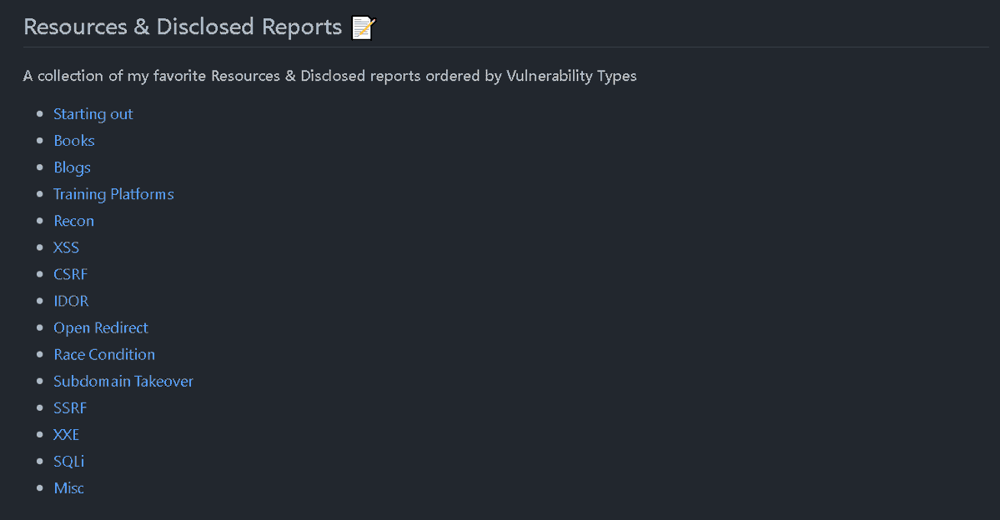</td>
</table></tr>
<table><tr>
<td>Quotes: <code>3</code></td>
<td>Replies: <code>5</code></td>
<td>Retweets: <code>137</code></td>
<td>Favorites: <code>281</code></td>
</tr></table>

---

# kenji_s
**https://twitter.com/kenji_s/status/1433655042112823300 _at 2021-09-03 04:56:12_**
<blockquote>
Deserialization of Untrusted Data in codeception/codeception · CVE-2021-23420 · GitHub Advisory Database
https://t.co/goVT0vt3kd
</blockquote>

* https://github.com/advisories/GHSA-4574-qv3w-fcmg

<table><tr>
<td>Quotes: <code>0</code></td>
<td>Replies: <code>0</code></td>
<td>Retweets: <code>1</code></td>
<td>Favorites: <code>0</code></td>
</tr></table>

---

# wilderko
**https://twitter.com/wilderko/status/1433416934322737166 _at 2021-09-02 13:10:03_**
<blockquote>
CVE-2021-26084 Remote Code Execution on Confluence Servers
https://t.co/Hs3aBtECbt

CVE-2021-26084 (PoC) | Confluence Server Webwork OGNL injection
https://t.co/TGDjLQF2DB
</blockquote>

* https://github.com/httpvoid/writeups/blob/main/Confluence-RCE.md
* https://github.com/alt3kx/CVE-2021-26084_PoC

<table><tr>
<td>Quotes: <code>0</code></td>
<td>Replies: <code>0</code></td>
<td>Retweets: <code>1</code></td>
<td>Favorites: <code>2</code></td>
</tr></table>

---

# a_anonymous94
**https://twitter.com/a_anonymous94/status/1433385309480361985 _at 2021-09-02 11:04:23_**
<blockquote>
SQL injection payloads  

https://t.co/jrN3bFvueF

https://t.co/wAHsHYBvsB

#SQLInjection 
#payload
</blockquote>

* https://github.com/payloadbox/sql-injection-payload-list
* https://github.com/swisskyrepo/PayloadsAllTheThings/tree/master/SQL%20Injection

<table><tr>
<td>Quotes: <code>0</code></td>
<td>Replies: <code>0</code></td>
<td>Retweets: <code>10</code></td>
<td>Favorites: <code>60</code></td>
</tr></table>

---

# Pentestit_ru
**https://twitter.com/Pentestit_ru/status/1433377525808390148 _at 2021-09-02 10:33:27_**
<blockquote>
RCE in Confluence Servers (CVE-2021-26084). Details and patch info https://t.co/zLkmrjIUfB

The vulnerability exploitation techniques described in the article are blocked in Nemesida WAF OnPremises due to their features and normalization mechanisms https://t.co/exJVlITMDm https://t.co/VSawre0fS0
</blockquote>

* https://github.com/httpvoid/writeups/blob/main/Confluence-RCE.md
* https://nemesida-waf.com/

<table><tr>
<td></td>
</table></tr>
<table><tr>
<td>Quotes: <code>0</code></td>
<td>Replies: <code>0</code></td>
<td>Retweets: <code>2</code></td>
<td>Favorites: <code>4</code></td>
</tr></table>

---

# bad_packets
**https://twitter.com/bad_packets/status/1433157632370511873 _at 2021-09-01 19:59:40_**
<blockquote>
We've detected mass scanning and exploit activity from hosts in 🇧🇷 🇨🇳 🇭🇰 🇳🇵🇷🇴 🇷🇺 🇺🇸 targeting Atlassian Confluence servers vulnerable to remote code execution (https://t.co/GExSx8puLm).

Query our API for "tags=CVE-2021-26084" for full payload and source IPs. #threatintel
</blockquote>

* https://confluence.atlassian.com/doc/confluence-security-advisory-2021-08-25-1077906215.html

<table><tr>
<td>Quotes: <code>2</code></td>
<td>Replies: <code>1</code></td>
<td>Retweets: <code>50</code></td>
<td>Favorites: <code>116</code></td>
</tr></table>

---

# campuscodi
**https://twitter.com/campuscodi/status/1433099452454146056 _at 2021-09-01 16:08:29_**
<blockquote>
NEW: Atlassian Confluence servers targeted with recent vulnerability

-exploited vulnerability is CVE-2021-26084, which is a pre-auth RCE with a CVSSv3 of 9.8
-mass scans are already underway and a simple PoC was published last night

https://t.co/eY1pnf9Brn https://t.co/1TQgkQ0Siv
</blockquote>

* https://therecord.media/confluence-enterprise-servers-targeted-with-recent-vulnerability/

<table><tr>
<td></td>
</table></tr>
<table><tr>
<td>Quotes: <code>10</code></td>
<td>Replies: <code>4</code></td>
<td>Retweets: <code>113</code></td>
<td>Favorites: <code>145</code></td>
</tr></table>

---

# payloadartist
**https://twitter.com/payloadartist/status/1432986068920406017 _at 2021-09-01 08:37:57_**
<blockquote>
Very detailed analysis of the CVE-2021-26084 Remote Code Execution in Confluence by @iamnoooob and @rootxharsh 🙌

https://t.co/l4xjodcOkB

#cybersecurity #infosec #bugbounty #bugbountytips
</blockquote>

* https://github.com/httpvoid/writeups/blob/main/Confluence-RCE.md

<table><tr>
<td>Quotes: <code>2</code></td>
<td>Replies: <code>3</code></td>
<td>Retweets: <code>50</code></td>
<td>Favorites: <code>142</code></td>
</tr></table>

---

# cyb3rops
**https://twitter.com/cyb3rops/status/1432968420925091842 _at 2021-09-01 07:27:49_**
<blockquote>
CVE-2021-26084 Remote Code Execution on Confluence Servers

- information on the vulnerability and hotfix 

@rootxharsh @matthias_kaiser

https://t.co/v7TUyySXnr https://t.co/ZtfkebS2Yt
</blockquote>

* https://github.com/httpvoid/writeups/blob/main/Confluence-RCE.md

<table><tr>
<td></td>
</table></tr>
<table><tr>
<td>Quotes: <code>0</code></td>
<td>Replies: <code>1</code></td>
<td>Retweets: <code>31</code></td>
<td>Favorites: <code>76</code></td>
</tr></table>

---

# Dinosn
**https://twitter.com/Dinosn/status/1432954368949686276 _at 2021-09-01 06:31:59_**
<blockquote>
Very nice writeup and POC for Confluence RCE (CVE-2021-26084) https://t.co/o0RwAGuvBH
</blockquote>

* https://github.com/httpvoid/writeups/blob/main/Confluence-RCE.md

<table><tr>
<td>Quotes: <code>1</code></td>
<td>Replies: <code>2</code></td>
<td>Retweets: <code>56</code></td>
<td>Favorites: <code>155</code></td>
</tr></table>

---

