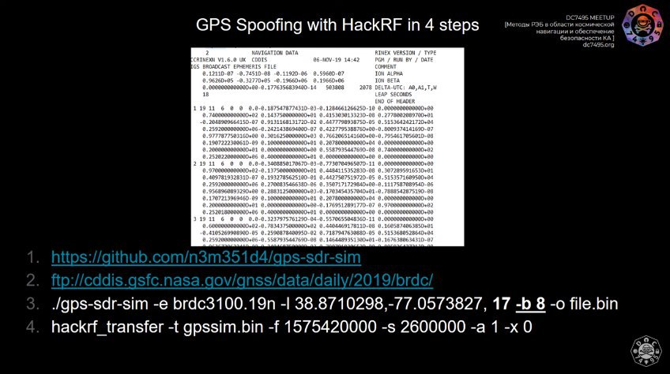

# defcon_news
`2019-11-30 07:04:33`

<blockquote>
Max Secure Anti Virus Plus - 19.0.4.020 / CVE-2019-19382 Insecure Permissions
http://seclists.org/fulldisclosure/2019/Nov/33

via Full Disclosure
</blockquote>

<table><tr><td><b>→</b><a href="https://seclists.org/fulldisclosure/2019/Nov/33">
https://seclists.org/fulldisclosure/2019/Nov/33
</a>
</td></tr></table>

---

# defcon_news
`2019-11-30 07:04:32`

<blockquote>
Re: Anhui Huami Mi Fit Android Application - Unencrypted Update Check
http://seclists.org/fulldisclosure/2019/Nov/32

via Full Disclosure
</blockquote>

<table><tr><td><b>→</b><a href="https://seclists.org/fulldisclosure/2019/Nov/32">
https://seclists.org/fulldisclosure/2019/Nov/32
</a>
</td></tr></table>

---

# defcon_news
`2019-11-30 07:04:31`

<blockquote>
CVE-2019-18922; Directory Traversal; Allied Telesis AT-GS950/8 until Firmware AT-S107 V.1.1.3 [1.00.047]
http://seclists.org/fulldisclosure/2019/Nov/31

via Full Disclosure
</blockquote>

<table><tr><td><b>→</b><a href="https://seclists.org/fulldisclosure/2019/Nov/31">
https://seclists.org/fulldisclosure/2019/Nov/31
</a>
</td></tr></table>

---

# defcon_news
`2019-11-30 07:04:30`

<blockquote>
[SYSS-2019-027]: Inateck BCST-60 Barcode Scanner - Keystroke Injection Vulnerability (CVE-2019-12503)
http://seclists.org/fulldisclosure/2019/Nov/30

via Full Disclosure
</blockquote>

<table><tr><td><b>→</b><a href="https://seclists.org/fulldisclosure/2019/Nov/30">
https://seclists.org/fulldisclosure/2019/Nov/30
</a>
</td></tr></table>

---

# defcon_news
`2019-11-30 07:04:29`

<blockquote>
NAPC Xinet Elegant 6 Asset Library Web Interface v6.1.655 / Pre-Auth SQL Injection 0Day
http://seclists.org/fulldisclosure/2019/Nov/29

via Full Disclosure
</blockquote>

<table><tr><td><b>→</b><a href="https://seclists.org/fulldisclosure/2019/Nov/29">
https://seclists.org/fulldisclosure/2019/Nov/29
</a>
</td></tr></table>

---

# defcon_news
`2019-11-29 13:03:31`

<blockquote>
[dos] SpotAuditor 5.3.2 - 'Name' Denial of Service
https://www.exploit-db.com/exploits/47727

via Exploit Database
</blockquote>

<table><tr><td><b>→</b><a href="https://www.exploit-db.com/exploits/47727">
https://www.exploit-db.com/exploits/47727
</a>
<blockquote>
SpotAuditor 5.3.2 - 'Name' Denial of Service.. dos exploit for Windows platform
</blockquote>
</td></tr></table>

---

# defcon_news
`2019-11-29 13:03:30`

<blockquote>
[local] Bash 5.0 Patch 11 - SUID Priv Drop Exploit
https://www.exploit-db.com/exploits/47726

via Exploit Database
</blockquote>

<table><tr><td><b>→</b><a href="https://www.exploit-db.com/exploits/47726">
https://www.exploit-db.com/exploits/47726
</a>
<blockquote>
Bash 5.0 Patch 11 - SUID Priv Drop Exploit.. local exploit for Linux platform
</blockquote>
</td></tr></table>

---

# defcon_news
`2019-11-29 12:53:10`

<blockquote>
[webapps] Online Inventory Manager 3.2 - Persistent Cross-Site Scripting
https://www.exploit-db.com/exploits/47725

via Exploit Database
</blockquote>

<table><tr><td><b>→</b><a href="https://www.exploit-db.com/exploits/47725?utm_source=dlvr.it&utm_medium=twitter">
https://www.exploit-db.com/exploits/47725?utm_source=dlvr.it&utm_medium=twitter
</a>
<blockquote>
Online Inventory Manager 3.2 - Persistent Cross-Site Scripting.. webapps exploit for PHP platform
</blockquote>
</td></tr></table>

---

# defcon_news
`2019-11-29 12:53:09`

<blockquote>
[local] TexasSoft CyberPlanet 6.4.131 - 'CCSrvProxy' Unquoted Service Path
https://www.exploit-db.com/exploits/47724

via Exploit Database
</blockquote>

<table><tr><td><b>→</b><a href="https://www.exploit-db.com/exploits/47724?utm_source=dlvr.it&utm_medium=twitter">
https://www.exploit-db.com/exploits/47724?utm_source=dlvr.it&utm_medium=twitter
</a>
<blockquote>
TexasSoft CyberPlanet 6.4.131 - 'CCSrvProxy' Unquoted Service Path.. local exploit for Windows platform
</blockquote>
</td></tr></table>

---

# defcon_news
`2019-11-29 12:43:17`

<blockquote>
[dos] SpotAuditor 5.3.2 - 'Key' Denial of Service
https://www.exploit-db.com/exploits/47723

via Exploit Database
</blockquote>

<table><tr><td><b>→</b><a href="https://www.exploit-db.com/exploits/47723?utm_source=dlvr.it&utm_medium=twitter">
https://www.exploit-db.com/exploits/47723?utm_source=dlvr.it&utm_medium=twitter
</a>
<blockquote>
SpotAuditor 5.3.2 - 'Key' Denial of Service.. dos exploit for Windows platform
</blockquote>
</td></tr></table>

---

# R0_Crew
`2019-11-29 02:08:02`

<blockquote>
r2con{ctf_2019_wr1t3up5} https://gist.github.com/xermicus/40e43b89f29aafe9c9e303cb421868c9 &#35;radare2 &#35;CTF &#35;r2con &#35;dukeBarman
</blockquote>

<table><tr><td><b>→</b><a href="https://gist.github.com/xermicus/40e43b89f29aafe9c9e303cb421868c9">
https://gist.github.com/xermicus/40e43b89f29aafe9c9e303cb421868c9
</a>
<blockquote>
r2con 2019 CTF writeups. GitHub Gist: instantly share code, notes, and snippets.
</blockquote>
</td></tr></table>

---

# defcon_news
`2019-11-29 01:28:20`

<blockquote>
Exploiting CVE-2018-8611: Windows Kernel Transaction Manager (KTM) Race Condition
https://www.reddit.com/r/netsec/comments/e32prd/exploiting_cve20188611_windows_kernel_transaction/

via /r/netsec - Information Security News &amp; Discussion
</blockquote>

<table><tr><td><b>→</b><a href="https://www.reddit.com/r/netsec/comments/e32prd/exploiting_cve20188611_windows_kernel_transaction/">
https://www.reddit.com/r/netsec/comments/e32prd/exploiting_cve20188611_windows_kernel_transaction/
</a>
<blockquote>
Posted in r/netsec by u/digicat • 4 points and 3 comments
</blockquote>
</td></tr></table>

---

# ctfchat
`2019-11-28 22:50:49`

<blockquote>
https://github.com/ctfcup
</blockquote>

<table><tr><td><b>→</b><a href="https://github.com/ctfcup">
https://github.com/ctfcup
</a>
<blockquote>
Кубок CTF России — это масштабный CTF-турнир. Кубок CTF России has 6 repositories available. Follow their code on GitHub.
</blockquote>
</td></tr></table>

---

# isast
`2019-11-28 14:19:14`

<blockquote>
https://github.com/nccgroup/VCG
</blockquote>

<table><tr><td><b>→</b><a href="https://github.com/nccgroup/VCG">
https://github.com/nccgroup/VCG
</a>
<blockquote>
VisualCodeGrepper - Code security scanning tool. Contribute to nccgroup/VCG development by creating an account on GitHub.
</blockquote>
</td></tr></table>

---

# defcon_news
`2019-11-28 13:43:08`

<blockquote>
[webapps] Mersive Solstice 2.8.0 - Remote Code Execution
https://www.exploit-db.com/exploits/47722

via Exploit Database
</blockquote>

<table><tr><td><b>→</b><a href="https://www.exploit-db.com/exploits/47722">
https://www.exploit-db.com/exploits/47722
</a>
<blockquote>
Mersive Solstice 2.8.0 - Remote Code Execution. CVE-2017-12945 . webapps exploit for Android platform
</blockquote>
</td></tr></table>

---

# defcon_news
`2019-11-28 12:33:08`

<blockquote>
[dos] GHIA CamIP 1.2 for iOS - 'Password' Denial of Service (PoC)
https://www.exploit-db.com/exploits/47721

via Exploit Database
</blockquote>

<table><tr><td><b>→</b><a href="https://www.exploit-db.com/exploits/47721?utm_source=dlvr.it&utm_medium=twitter">
https://www.exploit-db.com/exploits/47721?utm_source=dlvr.it&utm_medium=twitter
</a>
<blockquote>
GHIA CamIP 1.2 for iOS - 'Password' Denial of Service (PoC).. dos exploit for iOS platform
</blockquote>
</td></tr></table>

---

# defcon_news
`2019-11-28 12:33:08`

<blockquote>
[webapps] Wordpress 5.3 - User Disclosure
https://www.exploit-db.com/exploits/47720

via Exploit Database
</blockquote>

<table><tr><td><b>→</b><a href="https://www.exploit-db.com/exploits/47720">
https://www.exploit-db.com/exploits/47720
</a>
<blockquote>
WordPress Core 5.3 - User Disclosure.. webapps exploit for PHP platform
</blockquote>
</td></tr></table>

---

# defcon_news
`2019-11-27 21:23:31`

<blockquote>
[dos] SpotAuditor 5.3.2 - 'Base64' Denial Of Service (PoC)
https://www.exploit-db.com/exploits/47719

via Exploit Database
</blockquote>

<table><tr><td><b>→</b><a href="https://www.exploit-db.com/exploits/47719?utm_source=dlvr.it&utm_medium=twitter">
https://www.exploit-db.com/exploits/47719?utm_source=dlvr.it&utm_medium=twitter
</a>
<blockquote>
SpotAuditor 5.3.2 - 'Base64' Denial Of Service (PoC).. dos exploit for Windows platform
</blockquote>
</td></tr></table>

---

# defcon_news
`2019-11-27 21:23:30`

<blockquote>
[dos] Microsoft DirectX SDK 2010 - '.PIXrun' Denial Of Service (PoC)
https://www.exploit-db.com/exploits/47718

via Exploit Database
</blockquote>

<table><tr><td><b>→</b><a href="https://www.exploit-db.com/exploits/47718?utm_source=dlvr.it&utm_medium=twitter">
https://www.exploit-db.com/exploits/47718?utm_source=dlvr.it&utm_medium=twitter
</a>
<blockquote>
Microsoft DirectX SDK 2010 - '.PIXrun' Denial Of Service (PoC).. dos exploit for Windows platform
</blockquote>
</td></tr></table>

---

# freedomf0x
`2019-11-27 18:32:38`

<blockquote>
https://www.exploit-db.com/papers/41915
</blockquote>

---

# defcon_news
`2019-11-27 13:53:16`

<blockquote>
Sshtunnel - SSH Tunnels To Remote Server
https://hakin9.org/sshtunnel-ssh-tunnels-to-remote-server/

via Hakin9 – IT Security Magazine
</blockquote>

<table><tr><td><b>→</b><a href="https://hakin9.org/sshtunnel-ssh-tunnels-to-remote-server/">
https://hakin9.org/sshtunnel-ssh-tunnels-to-remote-server/
</a>
<blockquote>
Author: Pahaz  Repo: https://github.com/pahaz/sshtunnel/  Inspired by https://github.com/jmagnusson/bgtunnel, which doesn't work on Windows.  See also: https://github.com/paramiko/paramiko/blob/master/demos/forward.py          Requirements     
paramiko    Installation  sshtunnel is on PyPI, so simply run:    pip install sshtunnel  or    easy_install sshtunnel  or    conda install -c conda-forge sshtunnel  to have it installed in your environment. For installing from source,
</blockquote>
</td></tr></table>

---

# reverseengineeringx
`2019-11-27 13:20:33`

<blockquote>
Get a reverse shell within 15 seconds on both Windows or Unix based systems, using the Digispark developement board.

https://github.com/HassanShehata/KeySpark
</blockquote>

---

# reverseengineeringx
`2019-11-27 13:08:54`

<blockquote>
SMUC: Simplified MITRE Use Cases, it describes the Attack and Detection

https://github.com/karemfaisal/SMUC
</blockquote>

---

# defcon_news
`2019-11-27 10:53:08`

<blockquote>
Re: SEC Consult SA-20191125-0 :: FortiGuard XOR Encryption in Multiple Fortinet Products
http://seclists.org/fulldisclosure/2019/Nov/28

via Full Disclosure
</blockquote>

<table><tr><td><b>→</b><a href="https://seclists.org/fulldisclosure/2019/Nov/28">
https://seclists.org/fulldisclosure/2019/Nov/28
</a>
</td></tr></table>

---

# R0_Crew
`2019-11-27 10:29:46`

<blockquote>
FIDL - A sane API for IDA Pro's decompiler (library wrapping the Hex-Rays API)

Article: https://www.fireeye.com/blog/threat-research/2019/11/fidl-flare-ida-decompiler-library.html
Source: https://github.com/fireeye/FIDL
 &#35;reverse &#35;IDA &#35;dukeBarman
</blockquote>

<table><tr><td><b>→</b><a href="https://www.fireeye.com/blog/threat-research/2019/11/fidl-flare-ida-decompiler-library.html">
https://www.fireeye.com/blog/threat-research/2019/11/fidl-flare-ida-decompiler-library.html
</a>
<blockquote>
Introducing FLARE IDA Decompiler Library (FIDL), FireEye’s open source library which provides a wrapper layer around the Hex-Rays API.
</blockquote>
</td></tr></table>

---

# defcon_news
`2019-11-27 07:28:13`

<blockquote>
[local] ClamAV &lt; 0.102.0 - 'bytecode_vm' Code Execution
https://www.exploit-db.com/exploits/47687

via Exploit Database
</blockquote>

<table><tr><td><b>→</b><a href="https://www.exploit-db.com/exploits/47687">
https://www.exploit-db.com/exploits/47687
</a>
<blockquote>
ClamAV &lt; 0.102.0 - 'bytecode_vm' Code Execution.. local exploit for Linux platform
</blockquote>
</td></tr></table>

---

# defcon_news
`2019-11-26 21:40:25`

<blockquote>
CVE-2019-11932 (double free in libpl_droidsonroids_gif) many apps vulnerable
http://seclists.org/fulldisclosure/2019/Nov/27

via Full Disclosure
</blockquote>

<table><tr><td><b>→</b><a href="https://seclists.org/fulldisclosure/2019/Nov/27">
https://seclists.org/fulldisclosure/2019/Nov/27
</a>
</td></tr></table>

---

# defcon_news
`2019-11-26 21:40:24`

<blockquote>
Vulnerability in MiBox3
http://seclists.org/fulldisclosure/2019/Nov/26

via Full Disclosure
</blockquote>

<table><tr><td><b>→</b><a href="https://seclists.org/fulldisclosure/2019/Nov/26">
https://seclists.org/fulldisclosure/2019/Nov/26
</a>
</td></tr></table>

---

# defcon_news
`2019-11-26 21:40:23`

<blockquote>
Anhui Huami Mi Fit Android Application - Unencrypted Update Check
http://seclists.org/fulldisclosure/2019/Nov/24

via Full Disclosure
</blockquote>

<table><tr><td><b>→</b><a href="https://seclists.org/fulldisclosure/2019/Nov/24">
https://seclists.org/fulldisclosure/2019/Nov/24
</a>
</td></tr></table>

---

# defcon_news
`2019-11-26 21:40:23`

<blockquote>
pari/gp on debian stable allow arbitrary file write
http://seclists.org/fulldisclosure/2019/Nov/25

via Full Disclosure
</blockquote>

<table><tr><td><b>→</b><a href="https://seclists.org/fulldisclosure/2019/Nov/25">
https://seclists.org/fulldisclosure/2019/Nov/25
</a>
</td></tr></table>

---

# defcon_news
`2019-11-26 21:40:22`

<blockquote>
[CFP] Security BSides Ljubljana 0x7E4 | April 4, 2020
http://seclists.org/fulldisclosure/2019/Nov/23

via Full Disclosure
</blockquote>

<table><tr><td><b>→</b><a href="https://seclists.org/fulldisclosure/2019/Nov/23">
https://seclists.org/fulldisclosure/2019/Nov/23
</a>
</td></tr></table>

---

# R0_Crew
`2019-11-26 20:45:05`

<blockquote>
Public work for CVE-2019-0708 https://github.com/0xeb-bp/bluekeep &#35;exploit &#35;radare2
</blockquote>

<table><tr><td><b>→</b><a href="https://github.com/0xeb-bp/bluekeep">
https://github.com/0xeb-bp/bluekeep
</a>
<blockquote>
Public work for CVE-2019-0708. Contribute to 0xeb-bp/bluekeep development by creating an account on GitHub.
</blockquote>
</td></tr></table>

---

# defcon_news
`2019-11-26 17:40:24`

<blockquote>
[dos] InduSoft Web Studio 8.1 SP1 - &quot;Atributos&quot; Denial of Service (PoC)
https://www.exploit-db.com/exploits/47717

via Exploit Database
</blockquote>

<table><tr><td><b>→</b><a href="https://www.exploit-db.com/exploits/47717">
https://www.exploit-db.com/exploits/47717
</a>
<blockquote>
InduSoft Web Studio 8.1 SP1 - &quot;Atributos&quot; Denial of Service (PoC).. dos exploit for Windows platform
</blockquote>
</td></tr></table>

---

# defcon_news
`2019-11-26 17:40:20`

<blockquote>
[dos] iNetTools for iOS 8.20 - 'Whois' Denial of Service (PoC)
https://www.exploit-db.com/exploits/47716

via Exploit Database
</blockquote>

<table><tr><td><b>→</b><a href="https://www.exploit-db.com/exploits/47716">
https://www.exploit-db.com/exploits/47716
</a>
<blockquote>
iNetTools for iOS 8.20 - 'Whois' Denial of Service (PoC).. dos exploit for iOS platform
</blockquote>
</td></tr></table>

---

# defcon_news
`2019-11-26 17:40:19`

<blockquote>
[local] Microsoft Windows AppXsvc Deployment Extension - Privilege Escalation
https://www.exploit-db.com/exploits/47713

via Exploit Database
</blockquote>

<table><tr><td><b>→</b><a href="https://www.exploit-db.com/exploits/47713">
https://www.exploit-db.com/exploits/47713
</a>
<blockquote>
Microsoft Windows AppXsvc Deployment Extension - Privilege Escalation.. local exploit for Windows platform
</blockquote>
</td></tr></table>

---

# defcon_news
`2019-11-26 17:40:18`

<blockquote>
[local] Easy-Hide-IP 5.0.0.3 - 'EasyRedirect' Unquoted Service Path
https://www.exploit-db.com/exploits/47712

via Exploit Database
</blockquote>

<table><tr><td><b>→</b><a href="https://www.exploit-db.com/exploits/47712">
https://www.exploit-db.com/exploits/47712
</a>
<blockquote>
Easy-Hide-IP 5.0.0.3 - 'EasyRedirect' Unquoted Service Path.. local exploit for Windows platform
</blockquote>
</td></tr></table>

---

# defcon_news
`2019-11-26 17:40:17`

<blockquote>
[local] Waves MaxxAudio Drivers 1.1.6.0 - 'WavesSysSvc64' Unquoted Service Path
https://www.exploit-db.com/exploits/47710

via Exploit Database
</blockquote>

<table><tr><td><b>→</b><a href="https://www.exploit-db.com/exploits/47710">
https://www.exploit-db.com/exploits/47710
</a>
<blockquote>
Waves MaxxAudio Drivers 1.1.6.0 - 'WavesSysSvc64' Unquoted Service Path.. local exploit for Windows platform
</blockquote>
</td></tr></table>

---

# defcon_news
`2019-11-26 17:40:17`

<blockquote>
[dos] InTouch Machine Edition 8.1 SP1 - 'Atributos' Denial of Service (PoC)
https://www.exploit-db.com/exploits/47711

via Exploit Database
</blockquote>

<table><tr><td><b>→</b><a href="https://www.exploit-db.com/exploits/47711">
https://www.exploit-db.com/exploits/47711
</a>
<blockquote>
InTouch Machine Edition 8.1 SP1 - 'Atributos' Denial of Service (PoC).. dos exploit for Windows platform
</blockquote>
</td></tr></table>

---

# defcon_news
`2019-11-26 17:40:16`

<blockquote>
[dos] SMPlayer 19.5.0 - Denial of Service (PoC)
https://www.exploit-db.com/exploits/47709

via Exploit Database
</blockquote>

<table><tr><td><b>→</b><a href="https://www.exploit-db.com/exploits/47709">
https://www.exploit-db.com/exploits/47709
</a>
<blockquote>
SMPlayer 19.5.0 - Denial of Service (PoC).. dos exploit for Windows platform
</blockquote>
</td></tr></table>

---

# R0_Crew
`2019-11-26 00:41:32`

<blockquote>
Bad Binder: Android In-The-Wild Exploit  https://googleprojectzero.blogspot.com/2019/11/bad-binder-android-in-wild-exploit.html &#35;android &#35;exploit &#35;dukeBarman
</blockquote>

<table><tr><td><b>→</b><a href="https://googleprojectzero.blogspot.com/2019/11/bad-binder-android-in-wild-exploit.html">
https://googleprojectzero.blogspot.com/2019/11/bad-binder-android-in-wild-exploit.html
</a>
<blockquote>
Posted by Maddie Stone, Project Zero       Introduction   On October 3, 2019, we disclosed issue 1942  (CVE-2019-2215), which is a use-afte...
</blockquote>
</td></tr></table>

---

# R0_Crew
`2019-11-25 21:07:51`

<blockquote>
Generator .pyi type stubs for the entire &#35;Ghidra API https://github.com/VDOO-Connected-Trust/ghidra-pyi-generator &#35;reverse &#35;dukeBarman
</blockquote>

<table><tr><td><b>→</b><a href="https://github.com/VDOO-Connected-Trust/ghidra-pyi-generator">
https://github.com/VDOO-Connected-Trust/ghidra-pyi-generator
</a>
<blockquote>
Generates `.pyi` type stubs for the entire Ghidra API - GitHub - VDOO-Connected-Trust/ghidra-pyi-generator: Generates `.pyi` type stubs for the entire Ghidra API
</blockquote>
</td></tr></table>

---

# defcon_news
`2019-11-25 19:05:23`

<blockquote>
Anti-virus Exploitation: Local Privilege Escalation in K7 Security (CVE-2019-16897) - Exploit Development - 0x00sec
https://www.reddit.com/r/netsec/comments/e1fsk5/antivirus_exploitation_local_privilege_escalation/

via /r/netsec - Information Security News &amp; Discussion
</blockquote>

<table><tr><td><b>→</b><a href="https://www.reddit.com/r/netsec/comments/e1fsk5/antivirus_exploitation_local_privilege_escalation/">
https://www.reddit.com/r/netsec/comments/e1fsk5/antivirus_exploitation_local_privilege_escalation/
</a>
<blockquote>
Posted in r/netsec by u/Evil1337 • 14 points and 1 comment
</blockquote>
</td></tr></table>

---

# defcon_news
`2019-11-25 16:50:37`

<blockquote>
Patched GIF Processing Vulnerability CVE-2019-11932 Still Afflicts Multiple Mobile Apps
https://blog.trendmicro.com/trendlabs-security-intelligence/patched-gif-processing-vulnerability-cve-2019-11932-still-afflicts-multiple-mobile-apps/

via TrendLabs Security Intelligence Blog
</blockquote>

<table><tr><td><b>→</b><a href="https://blog.trendmicro.com/trendlabs-security-intelligence/patched-gif-processing-vulnerability-cve-2019-11932-still-afflicts-multiple-mobile-apps/?utm_source=feedburner&utm_medium=feed&utm_campaign=Feed%3A+Anti-MalwareBlog+%28Trendlabs+Security+Intelligence+Blog%29">
https://blog.trendmicro.com/trendlabs-security-intelligence/patched-gif-processing-vulnerability-cve-2019-11932-still-afflicts-multiple-mobile-apps/?utm_source=feedburner&utm_medium=feed&utm_campaign=Feed%3A+Anti-MalwareBlog+%28Trendlabs+Security+Intelligence+Blog%29
</a>
<blockquote>
CVE-2019-11932 - a vulnerability in WhatsApp for Android - allows remote code execution via specially crafted GIF files. Patches were released, but the problem in the android-gif-drawable package is continuously used by apps in older versions.
</blockquote>
</td></tr></table>

---

# defcon_news
`2019-11-25 16:50:36`

<blockquote>
SEC Consult SA-20191125-0 :: FortiGuard XOR Encryption in Multiple Fortinet Products
http://seclists.org/fulldisclosure/2019/Nov/22

via Full Disclosure
</blockquote>

<table><tr><td><b>→</b><a href="https://seclists.org/fulldisclosure/2019/Nov/22">
https://seclists.org/fulldisclosure/2019/Nov/22
</a>
</td></tr></table>

---

# defcon_news
`2019-11-24 15:55:10`

<blockquote>
[local] macOS 10.14.6 - root-&gt;kernel Privilege Escalation via update_dyld_shared_cache
https://www.exploit-db.com/exploits/47708

via Exploit Database
</blockquote>

<table><tr><td><b>→</b><a href="https://www.exploit-db.com/exploits/47708">
https://www.exploit-db.com/exploits/47708
</a>
<blockquote>
macOS 10.14.6 - root-&gt;kernel Privilege Escalation via update_dyld_shared_cache.. local exploit for macOS platform
</blockquote>
</td></tr></table>

---

# defcon_news
`2019-11-24 15:55:09`

<blockquote>
[dos] Internet Explorer - Use-After-Free in JScript Arguments During toJSON Callback
https://www.exploit-db.com/exploits/47707

via Exploit Database
</blockquote>

<table><tr><td><b>→</b><a href="https://www.exploit-db.com/exploits/47707">
https://www.exploit-db.com/exploits/47707
</a>
<blockquote>
Internet Explorer - Use-After-Free in JScript Arguments During toJSON Callback. CVE-2019-1429 . dos exploit for Windows platform
</blockquote>
</td></tr></table>

---

# defcon_news
`2019-11-24 15:55:09`

<blockquote>
[local] LiteManager 4.5.0 - Insecure File Permissions
https://www.exploit-db.com/exploits/47706

via Exploit Database
</blockquote>

<table><tr><td><b>→</b><a href="https://www.exploit-db.com/exploits/47706">
https://www.exploit-db.com/exploits/47706
</a>
<blockquote>
LiteManager 4.5.0 - Insecure File Permissions.. local exploit for Windows platform
</blockquote>
</td></tr></table>

---

# defcon_news
`2019-11-24 15:55:08`

<blockquote>
[local] ProShow Producer 9.0.3797 - ('ScsiAccess') Unquoted Service Path
https://www.exploit-db.com/exploits/47705

via Exploit Database
</blockquote>

<table><tr><td><b>→</b><a href="https://www.exploit-db.com/exploits/47705?utm_source=dlvr.it&utm_medium=twitter">
https://www.exploit-db.com/exploits/47705?utm_source=dlvr.it&utm_medium=twitter
</a>
<blockquote>
ProShow Producer 9.0.3797 - ('ScsiAccess') Unquoted Service Path.. local exploit for Windows platform
</blockquote>
</td></tr></table>

---

# R0_Crew
`2019-11-23 17:28:22`

<blockquote>
A Collection of Chrome Sandbox Escape POCs/Exploits for learning https://github.com/allpaca/chrome-sbx-db &#35;exploit &#35;dukeBarman
</blockquote>

<table><tr><td><b>→</b><a href="https://github.com/allpaca/chrome-sbx-db">
https://github.com/allpaca/chrome-sbx-db
</a>
<blockquote>
A Collection of Chrome Sandbox Escape POCs/Exploits for learning - GitHub - allpaca/chrome-sbx-db: A Collection of Chrome Sandbox Escape POCs/Exploits for learning
</blockquote>
</td></tr></table>

---

# defcon_news
`2019-11-22 21:22:12`

<blockquote>
arbitrary file capture in Kaspersky Total Security 2019
http://seclists.org/fulldisclosure/2019/Nov/21

via Full Disclosure
</blockquote>

<table><tr><td><b>→</b><a href="https://seclists.org/fulldisclosure/2019/Nov/21">
https://seclists.org/fulldisclosure/2019/Nov/21
</a>
</td></tr></table>

---

# defcon_news
`2019-11-22 08:29:46`

<blockquote>
Ребята из Project Zero описали CVE-2019-2215, используемую в качестве 0day уязвимости в удаленных установках шпиона Pegasus от NSO Group. 

Кратко:

Исходя из материалов NSO Group - работает удаленно, через браузер, давно. Функциональная часть процесса по установке Pegasus, очень универсально.

Исходя из анализа гугла - UAF, в драйвере Binder, ядро, Linux kernel &gt;&#61; 4.14, SELinux isolated_app не спасает, эксплуатируется из Chrome, песочница не спасает.

о Pegasus:
Модульная коммерческая спайварь от NSO Group. 
Читает sms, переписку, делает скриншоты, пишет звук, логгирует ввод, экспортирует контакты - полный набор для солидных господ.

об NSO Group:
Израильская компания, разрабатывающая  и продающая методы удаленного слежения через интернет, как минимум Pegasus и Chrysaor.  

&#35; https://googleprojectzero.blogspot.com/2019/11/bad-binder-android-in-wild-exploit.html
&#35; https://www.kaspersky.ru/blog/pegasus-spyware/14569/
&#35; https://en.wikipedia.org/wiki/NSO_Group
</blockquote>

---

# freedomf0x
`2019-11-22 04:10:58`

<blockquote>
https://github.com/cloudflare/flan
</blockquote>

<table><tr><td><b>→</b><a href="https://github.com/cloudflare/flan">
https://github.com/cloudflare/flan
</a>
<blockquote>
A pretty sweet vulnerability scanner. Contribute to cloudflare/flan development by creating an account on GitHub.
</blockquote>
</td></tr></table>

---

# defcon_news
`2019-11-22 02:07:29`

<blockquote>
AST-2019-008: Re-invite with T.38 and malformed SDP causes crash.
http://seclists.org/fulldisclosure/2019/Nov/20

via Full Disclosure
</blockquote>

<table><tr><td><b>→</b><a href="https://seclists.org/fulldisclosure/2019/Nov/20">
https://seclists.org/fulldisclosure/2019/Nov/20
</a>
</td></tr></table>

---

# defcon_news
`2019-11-22 02:07:28`

<blockquote>
AST-2019-007: AMI user could execute system commands.
http://seclists.org/fulldisclosure/2019/Nov/19

via Full Disclosure
</blockquote>

<table><tr><td><b>→</b><a href="https://seclists.org/fulldisclosure/2019/Nov/19">
https://seclists.org/fulldisclosure/2019/Nov/19
</a>
</td></tr></table>

---

# defcon_news
`2019-11-22 02:07:27`

<blockquote>
AST-2019-006: SIP request can change address of a SIP peer.
http://seclists.org/fulldisclosure/2019/Nov/18

via Full Disclosure
</blockquote>

<table><tr><td><b>→</b><a href="https://seclists.org/fulldisclosure/2019/Nov/18">
https://seclists.org/fulldisclosure/2019/Nov/18
</a>
</td></tr></table>

---

# defcon_news
`2019-11-22 01:47:26`

<blockquote>
CVE-2019-16861 - Code42 Server for Windows - DLL Search Order Hijacking and Potential Abuses
https://www.reddit.com/r/netsec/comments/dzquyl/cve201916861_code42_server_for_windows_dll_search/

via /r/netsec - Information Security News &amp; Discussion
</blockquote>

<table><tr><td><b>→</b><a href="https://www.reddit.com/r/netsec/comments/dzquyl/cve201916861_code42_server_for_windows_dll_search/">
https://www.reddit.com/r/netsec/comments/dzquyl/cve201916861_code42_server_for_windows_dll_search/
</a>
<blockquote>
Posted in r/netsec by u/peleghd • 6 points and 4 comments
</blockquote>
</td></tr></table>

---

# phd_soc
`2019-11-21 22:41:59`

<blockquote>
https://blog.qualys.com/webappsec/2019/10/30/php-remote-code-execution-vulnerability-cve-2019-11043
</blockquote>

<table><tr><td><b>→</b><a href="https://blog.qualys.com/webappsec/2019/10/30/php-remote-code-execution-vulnerability-cve-2019-11043">
https://blog.qualys.com/webappsec/2019/10/30/php-remote-code-execution-vulnerability-cve-2019-11043
</a>
<blockquote>
Certain versions of PHP 7 running on NGINX with php-fpm enabled can be vulnerable to the remote code execution vulnerability CVE-2019-11043. Given the simplicity of the exploit, all web servers using…
</blockquote>
</td></tr></table>

---

# defcon_news
`2019-11-21 22:02:03`

<blockquote>
Bad Binder: Android In-The-Wild Exploit
https://googleprojectzero.blogspot.com/2019/11/bad-binder-android-in-wild-exploit.html

via Project Zero
</blockquote>

<table><tr><td><b>→</b><a href="https://googleprojectzero.blogspot.com/2019/11/bad-binder-android-in-wild-exploit.html">
https://googleprojectzero.blogspot.com/2019/11/bad-binder-android-in-wild-exploit.html
</a>
<blockquote>
Posted by Maddie Stone, Project Zero       Introduction   On October 3, 2019, we disclosed issue 1942  (CVE-2019-2215), which is a use-afte...
</blockquote>
</td></tr></table>

---

# defcon_news
`2019-11-21 16:02:19`

<blockquote>
[webapps] Network Management Card 6.2.0 - Host Header Injection
https://www.exploit-db.com/exploits/47704

via Exploit Database
</blockquote>

<table><tr><td><b>→</b><a href="https://www.exploit-db.com/exploits/47704?utm_source=dlvr.it&utm_medium=twitter">
https://www.exploit-db.com/exploits/47704?utm_source=dlvr.it&utm_medium=twitter
</a>
<blockquote>
Network Management Card 6.2.0 - Host Header Injection.. webapps exploit for Hardware platform
</blockquote>
</td></tr></table>

---

# defcon_news
`2019-11-21 16:02:18`

<blockquote>
[local] GNU Mailutils 3.7 - Privilege Escalation
https://www.exploit-db.com/exploits/47703

via Exploit Database
</blockquote>

<table><tr><td><b>→</b><a href="https://www.exploit-db.com/exploits/47703">
https://www.exploit-db.com/exploits/47703
</a>
<blockquote>
GNU Mailutils 3.7 - Privilege Escalation. CVE-2019-18862 . local exploit for Linux platform
</blockquote>
</td></tr></table>

---

# defcon_news
`2019-11-21 16:02:17`

<blockquote>
[webapps] TestLink 1.9.19 - Persistent Cross-Site Scripting
https://www.exploit-db.com/exploits/47702

via Exploit Database
</blockquote>

<table><tr><td><b>→</b><a href="https://www.exploit-db.com/exploits/47702">
https://www.exploit-db.com/exploits/47702
</a>
<blockquote>
TestLink 1.9.19 - Persistent Cross-Site Scripting.. webapps exploit for Hardware platform
</blockquote>
</td></tr></table>

---

# defcon_news
`2019-11-21 15:58:45`

<blockquote>
[webapps] TestLink 1.9.19 - Persistent Cross-Site Scripting
https://www.exploit-db.com/exploits/47702

via Exploit Database
</blockquote>

<table><tr><td><b>→</b><a href="https://www.exploit-db.com/exploits/47702">
https://www.exploit-db.com/exploits/47702
</a>
<blockquote>
TestLink 1.9.19 - Persistent Cross-Site Scripting.. webapps exploit for Hardware platform
</blockquote>
</td></tr></table>

---

# defcon_news
`2019-11-21 15:58:07`

<blockquote>
[remote] Pulse Secure VPN - Arbitrary Command Execution (Metasploit)
https://www.exploit-db.com/exploits/47700

via Exploit Database
</blockquote>

<table><tr><td><b>→</b><a href="https://www.exploit-db.com/exploits/47700">
https://www.exploit-db.com/exploits/47700
</a>
<blockquote>
Pulse Secure VPN - Arbitrary Command Execution (Metasploit). CVE-2019-11539 . remote exploit for Multiple platform
</blockquote>
</td></tr></table>

---

# defcon_news
`2019-11-21 15:58:07`

<blockquote>
[local] Xorg X11 Server - Local Privilege Escalation (Metasploit)
https://www.exploit-db.com/exploits/47701

via Exploit Database
</blockquote>

<table><tr><td><b>→</b><a href="https://www.exploit-db.com/exploits/47701?utm_source=dlvr.it&utm_medium=twitter">
https://www.exploit-db.com/exploits/47701?utm_source=dlvr.it&utm_medium=twitter
</a>
<blockquote>
Xorg X11 Server - Local Privilege Escalation (Metasploit). CVE-2018-14665 . local exploit for Unix platform
</blockquote>
</td></tr></table>

---

# defcon_news
`2019-11-21 15:58:06`

<blockquote>
[remote] Bludit - Directory Traversal Image File Upload (Metasploit)
https://www.exploit-db.com/exploits/47699

via Exploit Database
</blockquote>

<table><tr><td><b>→</b><a href="https://www.exploit-db.com/exploits/47699">
https://www.exploit-db.com/exploits/47699
</a>
<blockquote>
Bludit - Directory Traversal Image File Upload (Metasploit). CVE-2019-16113 . remote exploit for PHP platform
</blockquote>
</td></tr></table>

---

# defcon_news
`2019-11-21 15:58:05`

<blockquote>
[remote] FreeSWITCH - Event Socket Command Execution (Metasploit)
https://www.exploit-db.com/exploits/47698

via Exploit Database
</blockquote>

<table><tr><td><b>→</b><a href="https://www.exploit-db.com/exploits/47698">
https://www.exploit-db.com/exploits/47698
</a>
<blockquote>
FreeSWITCH - Event Socket Command Execution (Metasploit).. remote exploit for Multiple platform
</blockquote>
</td></tr></table>

---

# defcon_news
`2019-11-21 15:58:04`

<blockquote>
[remote] FusionPBX - Operator Panel exec.php Command Execution (Metasploit)
https://www.exploit-db.com/exploits/47697

via Exploit Database
</blockquote>

<table><tr><td><b>→</b><a href="https://www.exploit-db.com/exploits/47697">
https://www.exploit-db.com/exploits/47697
</a>
<blockquote>
FusionPBX - Operator Panel exec.php Command Execution (Metasploit). CVE-2019-11409 . remote exploit for Multiple platform
</blockquote>
</td></tr></table>

---

# defcon_news
`2019-11-21 15:58:00`

<blockquote>
[local] Windows - Escalate UAC Protection Bypass (Via Shell Open Registry Key) (Metasploit)
https://www.exploit-db.com/exploits/47696

via Exploit Database
</blockquote>

<table><tr><td><b>→</b><a href="https://www.exploit-db.com/exploits/47696">
https://www.exploit-db.com/exploits/47696
</a>
<blockquote>
Microsoft Windows - Escalate UAC Protection Bypass (Via Shell Open Registry Key) (Metasploit).. local exploit for Windows platform
</blockquote>
</td></tr></table>

---

# defcon_news
`2019-11-21 15:57:59`

<blockquote>
[local] Windows - Escalate UAC Protection Bypass (Via dot net profiler) (Metasploit)
https://www.exploit-db.com/exploits/47695

via Exploit Database
</blockquote>

<table><tr><td><b>→</b><a href="https://www.exploit-db.com/exploits/47695?utm_source=dlvr.it&utm_medium=twitter">
https://www.exploit-db.com/exploits/47695?utm_source=dlvr.it&utm_medium=twitter
</a>
<blockquote>
Windows - Escalate UAC Protection Bypass (Via dot net profiler) (Metasploit).. local exploit for Windows platform
</blockquote>
</td></tr></table>

---

# defcon_news
`2019-11-21 15:57:58`

<blockquote>
[dos] iOS 12.4 - Sandbox Escape due to Integer Overflow in mediaserverd
https://www.exploit-db.com/exploits/47694

via Exploit Database
</blockquote>

<table><tr><td><b>→</b><a href="https://www.exploit-db.com/exploits/47694">
https://www.exploit-db.com/exploits/47694
</a>
<blockquote>
iOS 12.4 - Sandbox Escape due to Integer Overflow in mediaserverd.. dos exploit for iOS platform
</blockquote>
</td></tr></table>

---

# defcon_news
`2019-11-21 15:57:57`

<blockquote>
[dos] Ubuntu 19.10 - Refcount Underflow and Type Confusion in shiftfs
https://www.exploit-db.com/exploits/47693

via Exploit Database
</blockquote>

<table><tr><td><b>→</b><a href="https://www.exploit-db.com/exploits/47693">
https://www.exploit-db.com/exploits/47693
</a>
<blockquote>
Ubuntu 19.10 - Refcount Underflow and Type Confusion in shiftfs. CVE-2019-15793CVE-2019-15792CVE-2019-15791 . dos exploit for Linux platform
</blockquote>
</td></tr></table>

---

# defcon_news
`2019-11-21 15:57:56`

<blockquote>
[dos] Ubuntu 19.10 - ubuntu-aufs-modified mmap_region() Breaks Refcounting in overlayfs/shiftfs Error Path
https://www.exploit-db.com/exploits/47692

via Exploit Database
</blockquote>

<table><tr><td><b>→</b><a href="https://www.exploit-db.com/exploits/47692?utm_source=dlvr.it&utm_medium=twitter">
https://www.exploit-db.com/exploits/47692?utm_source=dlvr.it&utm_medium=twitter
</a>
<blockquote>
Ubuntu 19.10 - ubuntu-aufs-modified mmap_region() Breaks Refcounting in overlayfs/shiftfs Error Path. CVE-2019-15794 . dos exploit for Linux platform
</blockquote>
</td></tr></table>

---

# defcon_news
`2019-11-21 15:57:56`

<blockquote>
[webapps] OpenNetAdmin 18.1.1 - Remote Code Execution
https://www.exploit-db.com/exploits/47691

via Exploit Database
</blockquote>

<table><tr><td><b>→</b><a href="https://www.exploit-db.com/exploits/47691">
https://www.exploit-db.com/exploits/47691
</a>
<blockquote>
OpenNetAdmin 18.1.1 - Remote Code Execution.. webapps exploit for PHP platform
</blockquote>
</td></tr></table>

---

# defcon_news
`2019-11-21 15:57:55`

<blockquote>
[remote] Microsoft Windows 7 (x86) - 'BlueKeep' Remote Desktop Protocol (RDP) Remote Windows Kernel Use After Free
https://www.exploit-db.com/exploits/47683

via Exploit Database
</blockquote>

<table><tr><td><b>→</b><a href="https://www.exploit-db.com/exploits/47683">
https://www.exploit-db.com/exploits/47683
</a>
<blockquote>
Microsoft Windows 7 (x86) - 'BlueKeep' Remote Desktop Protocol (RDP) Remote Windows Kernel Use After Free. CVE-2019-0708 . remote exploit for Windows_x86 platform
</blockquote>
</td></tr></table>

---

# defcon_news
`2019-11-21 15:57:54`

<blockquote>
[dos] XMedia Recode 3.4.8.6 - '.m3u' Denial Of Service
https://www.exploit-db.com/exploits/47679

via Exploit Database
</blockquote>

<table><tr><td><b>→</b><a href="https://www.exploit-db.com/exploits/47679?utm_source=dlvr.it&utm_medium=twitter">
https://www.exploit-db.com/exploits/47679?utm_source=dlvr.it&utm_medium=twitter
</a>
<blockquote>
XMedia Recode 3.4.8.6 - '.m3u' Denial Of Service.. dos exploit for Windows platform
</blockquote>
</td></tr></table>

---

# defcon_news
`2019-11-21 15:57:53`

<blockquote>
[dos] scadaApp for iOS 1.1.4.0 - 'Servername' Denial of Service (PoC)
https://www.exploit-db.com/exploits/47678

via Exploit Database
</blockquote>

<table><tr><td><b>→</b><a href="https://www.exploit-db.com/exploits/47678?utm_source=dlvr.it&utm_medium=twitter">
https://www.exploit-db.com/exploits/47678?utm_source=dlvr.it&utm_medium=twitter
</a>
<blockquote>
scadaApp for iOS 1.1.4.0 - 'Servername' Denial of Service (PoC).. dos exploit for iOS platform
</blockquote>
</td></tr></table>

---

# defcon_news
`2019-11-21 15:57:52`

<blockquote>
[dos] Centova Cast 3.2.12 - Denial of Service (PoC)
https://www.exploit-db.com/exploits/47677

via Exploit Database
</blockquote>

<table><tr><td><b>→</b><a href="https://www.exploit-db.com/exploits/47677?utm_source=dlvr.it&utm_medium=twitter">
https://www.exploit-db.com/exploits/47677?utm_source=dlvr.it&utm_medium=twitter
</a>
<blockquote>
Centova Cast 3.2.12 - Denial of Service (PoC).. dos exploit for Hardware platform
</blockquote>
</td></tr></table>

---

# defcon_news
`2019-11-21 15:57:48`

<blockquote>
[local] Studio 5000 Logix Designer 30.01.00 - 'FactoryTalk Activation Service' Unquoted Service Path
https://www.exploit-db.com/exploits/47676

via Exploit Database
</blockquote>

<table><tr><td><b>→</b><a href="https://www.exploit-db.com/exploits/47676?utm_source=dlvr.it&utm_medium=twitter">
https://www.exploit-db.com/exploits/47676?utm_source=dlvr.it&utm_medium=twitter
</a>
<blockquote>
Studio 5000 Logix Designer 30.01.00 - 'FactoryTalk Activation Service' Unquoted Service Path.. local exploit for Windows platform
</blockquote>
</td></tr></table>

---

# defcon_news
`2019-11-21 15:57:47`

<blockquote>
[local] BartVPN 1.2.2 - 'BartVPNService' Unquoted Service Path
https://www.exploit-db.com/exploits/47675

via Exploit Database
</blockquote>

<table><tr><td><b>→</b><a href="https://www.exploit-db.com/exploits/47675">
https://www.exploit-db.com/exploits/47675
</a>
<blockquote>
BartVPN 1.2.2 - 'BartVPNService' Unquoted Service Path.. local exploit for Windows platform
</blockquote>
</td></tr></table>

---

# defcon_news
`2019-11-21 15:57:46`

<blockquote>
[dos] ipPulse 1.92 - 'Enter Key' Denial of Service (PoC)
https://www.exploit-db.com/exploits/47674

via Exploit Database
</blockquote>

<table><tr><td><b>→</b><a href="https://www.exploit-db.com/exploits/47674?utm_source=dlvr.it&utm_medium=twitter">
https://www.exploit-db.com/exploits/47674?utm_source=dlvr.it&utm_medium=twitter
</a>
<blockquote>
ipPulse 1.92 - 'Enter Key' Denial of Service (PoC).. dos exploit for Windows platform
</blockquote>
</td></tr></table>

---

# defcon_news
`2019-11-21 15:57:45`

<blockquote>
[local] Microsoft Windows 10 Build 1803 &lt; 1903 - 'COMahawk' Local Privilege Escalation
https://www.exploit-db.com/exploits/47684

via Exploit Database
</blockquote>

<table><tr><td><b>→</b><a href="https://www.exploit-db.com/exploits/47684">
https://www.exploit-db.com/exploits/47684
</a>
<blockquote>
Microsoft Windows 10 Build 1803 &lt; 1903 - 'COMahawk' Local Privilege Escalation. CVE-2019-1405CVE-2019-1322 . local exploit for Windows platform
</blockquote>
</td></tr></table>

---

# defcon_news
`2019-11-21 15:57:44`

<blockquote>
[local] DOUBLEPULSAR (x64) - Hooking 'srv!SrvTransactionNotImplemented' in 'srv!SrvTransaction2DispatchTable'
https://www.exploit-db.com/exploits/47685

via Exploit Database
</blockquote>

<table><tr><td><b>→</b><a href="https://www.exploit-db.com/exploits/47685">
https://www.exploit-db.com/exploits/47685
</a>
<blockquote>
DOUBLEPULSAR (x64) - Hooking 'srv!SrvTransactionNotImplemented' in 'srv!SrvTransaction2DispatchTable'.. local exploit for Windows_x86-64 platform
</blockquote>
</td></tr></table>

---

# phd_soc
`2019-11-20 21:42:19`

<blockquote>
https://github.com/lemire/simdjson
</blockquote>

<table><tr><td><b>→</b><a href="https://github.com/lemire/simdjson">
https://github.com/lemire/simdjson
</a>
<blockquote>
Parsing gigabytes of JSON per second . Contribute to simdjson/simdjson development by creating an account on GitHub.
</blockquote>
</td></tr></table>

---

# overlamer1
`2019-11-20 21:32:22`

* https://telegra.ph/Prostoj-sposob-vzloma-wi-fi-11-20

<blockquote>
Fluxion: Простой способ взломать Wi-Fi
</blockquote>

<table><tr><td><b>→</b><a href="https://telegra.ph/Prostoj-sposob-vzloma-wi-fi-11-20">
https://telegra.ph/Prostoj-sposob-vzloma-wi-fi-11-20
</a>
<blockquote>
Ну что-ж,приветствую тебя,сегодня я поведаю как же взломать соседский WI-FI используя достаточно годный скрипт FLUXION,работающий с Linux! https://github.com/wi-fi-analyzer/fluxion (сам скрипт) Надеюсь,тебе не стоит объяснять как зайти в папку с софтом через терминал. И так,после того,как вы зашли в папку с программой,прописываем это Потом у вас начнется куча загрузок и тому подобного,на всё соглашаемся После всех этих загрузок прописываем  Далее выбираем язык,русского там нет Тут выбираем All Channels…
</blockquote>
</td></tr></table>

---

# cyberoffru
`2019-11-20 20:00:24`

<blockquote>
И вот для неё ещё патч для алёртинга, т.е. чтобы на события можно было сделать хоть какую то реакцию
https://github.com/Yelp/elastalert
</blockquote>

<table><tr><td><b>→</b><a href="https://github.com/Yelp/elastalert">
https://github.com/Yelp/elastalert
</a>
<blockquote>
Easy &amp; Flexible Alerting With ElasticSearch. Contribute to Yelp/elastalert development by creating an account on GitHub.
</blockquote>
</td></tr></table>

---

# defcon_news
`2019-11-20 10:37:33`

<blockquote>
Уязвимость в DNS-сервере Unbound, допускающее удалённое выполнение кода
https://www.opennet.ru/opennews/art.shtml?num&#61;51900

via OpenNews.opennet.ru: Проблемы безопасности
</blockquote>

<table><tr><td><b>→</b><a href="https://www.opennet.ru/opennews/art.shtml?num=51900">
https://www.opennet.ru/opennews/art.shtml?num=51900
</a>
<blockquote>
В DNS-сервере Unbound выявлена уязвимость (CVE-2019-18934), которая может привести к выполнению кода атакующего при получении специально оформленных ответов. Системы подвержены проблеме только при сборке Unbound с модулем ipsec (&quot;--enable-ipsecmod&quot;) и включением ipsecmod в настройках. Уязвимость проявляется начиная с версии 1.6.4 и устранена в выпуске Unbound 1.9.5.
</blockquote>
</td></tr></table>

---

# defcon_news
`2019-11-20 10:17:13`

<blockquote>
«Камера Google» позволила взломать смартфоны Google и Samsung
https://securenews.ru/kamera-google-pozvolila-vzlomat-smartfoni/

via SecureNews
</blockquote>

<table><tr><td><b>→</b><a href="https://securenews.ru/kamera-google-pozvolila-vzlomat-smartfoni/">
https://securenews.ru/kamera-google-pozvolila-vzlomat-smartfoni/
</a>
<blockquote>
Зараженное ПО предоставило возможность злоумышленникам делать фотографии, скачивать изображения, снимать видео и прослушивать телефонные звонки с помощью приложения «Камера Google», - передает SCmagazine. Недостаток CVE-2019-2234 является проблемой обхода разрешений, которая обеспечивает доступ к телефону в реальном времени через приложение камеры, - согласно отчету Исследовательской группы безопасности Checkmarx. Взлом телефона начинается с того, что жертва загружает вредоносное приложение, которое запрашивает разрешение на доступ к хранилищу, и после загрузки создает постоянное соединение с сервером внешнего управления и контроля, которое невозможно разорвать, даже если приложение закрыто, экран выключен или телефон заблокирован. Команда Checkmarx обнаружила уязвимость в смартфонах Google Pixel 2/3 и Samsung. «Мы Читать далее
</blockquote>
</td></tr></table>

---

# defcon_news
`2019-11-20 09:02:07`

<blockquote>
CVE-2019-18934 It is possible for Unbound to allow shell code execution from a specially crafted IPSECKEY answer.
https://www.reddit.com/r/netsec/comments/dyudzw/cve201918934_it_is_possible_for_unbound_to_allow/

via /r/netsec - Information Security News &amp; Discussion
</blockquote>

<table><tr><td><b>→</b><a href="https://www.reddit.com/r/netsec/comments/dyudzw/cve201918934_it_is_possible_for_unbound_to_allow/">
https://www.reddit.com/r/netsec/comments/dyudzw/cve201918934_it_is_possible_for_unbound_to_allow/
</a>
<blockquote>
Posted in r/netsec by u/flipsideCREATIONS • 1 point and 0 comments
</blockquote>
</td></tr></table>

---

# defcon_news
`2019-11-19 23:02:26`

<blockquote>
Full Docker breakout exploit through CVE-2019-14271
https://www.reddit.com/r/netsec/comments/dypp5h/full_docker_breakout_exploit_through_cve201914271/

via /r/netsec - Information Security News &amp; Discussion
</blockquote>

<table><tr><td><b>→</b><a href="https://www.reddit.com/r/netsec/comments/dypp5h/full_docker_breakout_exploit_through_cve201914271/">
https://www.reddit.com/r/netsec/comments/dypp5h/full_docker_breakout_exploit_through_cve201914271/
</a>
<blockquote>
Posted in r/netsec by u/pingpongfifa • 174 points and 14 comments
</blockquote>
</td></tr></table>

---

# defcon_news
`2019-11-19 22:07:23`

<blockquote>
CVE-2019-16758 Lexmark Services Monitor 2.27.4.0.39 Directory Traversal
http://seclists.org/fulldisclosure/2019/Nov/17

via Full Disclosure
</blockquote>

<table><tr><td><b>→</b><a href="https://seclists.org/fulldisclosure/2019/Nov/17">
https://seclists.org/fulldisclosure/2019/Nov/17
</a>
</td></tr></table>

---

# webware
`2019-11-19 20:37:46`

<blockquote>
Remote Code Execution (RCE) в Jira (CVE-2019–11581)

https://codeby.net/threads/remote-code-execution-rce-v-jira-cve-2019-11581.68602/

&#35;pentest
</blockquote>

<table><tr><td><b>→</b><a href="https://codeby.net/threads/remote-code-execution-rce-v-jira-cve-2019-11581.68602/">
https://codeby.net/threads/remote-code-execution-rce-v-jira-cve-2019-11581.68602/
</a>
<blockquote>
Всем Салам.
Remote code execution in Atlassian Jira(CVE-2019–11581) through template engine FreeMaker.
В апреле месяце была обнаружена RCE в продукте Atlassian Confluence, а если быть точнее в...
</blockquote>
</td></tr></table>

---

# defcon_news
`2019-11-19 17:27:23`

<blockquote>
[Injecting .NET Ransomware into Unmanaged Process]
https://www.reddit.com/r/Malware/comments/dykux6/injecting_net_ransomware_into_unmanaged_process/

via Malware Analysis &amp; Reports
</blockquote>

<table><tr><td><b>→</b><a href="https://www.reddit.com/r/Malware/comments/dykux6/injecting_net_ransomware_into_unmanaged_process/">
https://www.reddit.com/r/Malware/comments/dykux6/injecting_net_ransomware_into_unmanaged_process/
</a>
<blockquote>
DNCI – .NET Code Injector [https://github.com/guibacellar/DNCI](https://github.com/guibacellar/DNCI) NxRansomware - fully written using a .NET...
</blockquote>
</td></tr></table>

---

# R0_Crew
`2019-11-19 16:10:00`

<blockquote>
Slides for the Grehack's &#35;radare2 workshop 2019 https://github.com/jvoisin/grehack_2019 &#35;reverse &#35;conference &#35;dukeBarman
</blockquote>

<table><tr><td><b>→</b><a href="https://github.com/jvoisin/grehack_2019">
https://github.com/jvoisin/grehack_2019
</a>
<blockquote>
Contribute to jvoisin/grehack_2019 development by creating an account on GitHub.
</blockquote>
</td></tr></table>

---

# isast
`2019-11-19 15:47:04`

* https://www.sourcetrail.com/blog/open_source/
* https://github.com/CoatiSoftware/Sourcetrail
* https://t.me/itgram_channel/162

<blockquote>
Тут заопенсурсили sourcetrail:

+ пост 
+ исходники 

Это такая штука для отображения графа связей между компонентами для кода на C, C++, Java, Python. Я попробовал. Интерфейс довольно мучительный, да ещё с HiDPI на Linux не дружит. ЦПУ жрёт как не в себя. Но граф выходит интересный, оно довольно хорошо разрешает зависимости. Можно красиво посмотреть, где функция используется, что использует внутри, удобно гулять между этими вызовами. Я уже несколько раз писал про визуальные языки программирования, ну и это ещё один шаг к визуализации кода, что радует. Но до сих пор не очень удобно и всё ещё не кажется, что завтра я вместе с IDE открою эту вот визуализацию, чтобы быстрее читать код.
</blockquote>

<table><tr><td><b>→</b><a href="https://www.sourcetrail.com/blog/open_source/">
https://www.sourcetrail.com/blog/open_source/
</a>
<blockquote>
We transitioned to an open-source model. The source code is now available on GitHub and the project will further be funded via Patreon.
</blockquote>
</td></tr></table>

---

# R0_Crew
`2019-11-19 12:57:34`

<blockquote>
Sourcetrail is now free and open-source!  https://github.com/CoatiSoftware/Sourcetrail &#35;codereview &#35;dukeBarman
</blockquote>

<table><tr><td><b>→</b><a href="https://github.com/CoatiSoftware/Sourcetrail">
https://github.com/CoatiSoftware/Sourcetrail
</a>
<blockquote>
Sourcetrail - free and open-source interactive source explorer - GitHub - CoatiSoftware/Sourcetrail: Sourcetrail - free and open-source interactive source explorer
</blockquote>
</td></tr></table>

---

# overlamer1
`2019-11-19 12:01:22`

* https://telegra.ph/Sozdanie-vredonosnyh-QR-kodov-dlya-vzloma-telefonov-i-drugih-ustrojstv-11-19

<blockquote>
Создаём вредоносные QR коды
</blockquote>

<table><tr><td><b>→</b><a href="https://telegra.ph/Sozdanie-vredonosnyh-QR-kodov-dlya-vzloma-telefonov-i-drugih-ustrojstv-11-19">
https://telegra.ph/Sozdanie-vredonosnyh-QR-kodov-dlya-vzloma-telefonov-i-drugih-ustrojstv-11-19
</a>
<blockquote>
Установка QRGen Для начала нам нужно скачать репозиторий с github. git clone https://github.com/h0nus/QRGen.git После загрузки измените каталог с помощью cd. cd /QRGen Давайте посмотрим файл README.md. Теперь нам нужно установить некоторые требования и библиотеки, которые требуются для QRGen. pip3 install -r requirements.txt Если эта команда не работает, есть другая альтернатива.python3 -m pip install -r requirements.txt Создание вредоносного QRCode из полезной нагрузки Теперь, когда мы установили QRGen…
</blockquote>
</td></tr></table>

---

# cyberoffru
`2019-11-18 23:48:20`

<blockquote>
Аудит:
https://vulners.com/audit
Nmap:
https://github.com/vulnersCom/nmap-vulners/blob/master/README.md
</blockquote>

<table><tr><td><b>→</b><a href="https://github.com/vulnersCom/nmap-vulners/blob/master/README.md">
https://github.com/vulnersCom/nmap-vulners/blob/master/README.md
</a>
<blockquote>
NSE script based on Vulners.com API. Contribute to vulnersCom/nmap-vulners development by creating an account on GitHub.
</blockquote>
</td></tr></table>

---

# cyberoffru
`2019-11-18 19:56:35`

<blockquote>
https://github.com/microsoft/MSRC-Microsoft-Security-Updates-API
</blockquote>

<table><tr><td><b>→</b><a href="https://github.com/microsoft/MSRC-Microsoft-Security-Updates-API">
https://github.com/microsoft/MSRC-Microsoft-Security-Updates-API
</a>
<blockquote>
Repo with getting started projects for the Microsoft Security Updates API (portal.msrc.microsoft.com) - GitHub - microsoft/MSRC-Microsoft-Security-Updates-API: Repo with getting started projects fo...
</blockquote>
</td></tr></table>

---

# defcon_news
`2019-11-18 17:57:10`

<blockquote>
CVE-2019-16662 &amp; CVE-2019-16663 - Unauthenticated remote code execution vulnerabilities in rConfig
https://www.reddit.com/r/netsec/comments/dy43t3/cve201916662_cve201916663_unauthenticated_remote/

via /r/netsec - Information Security News &amp; Discussion
</blockquote>

<table><tr><td><b>→</b><a href="https://www.reddit.com/r/netsec/comments/dy43t3/cve201916662_cve201916663_unauthenticated_remote/">
https://www.reddit.com/r/netsec/comments/dy43t3/cve201916662_cve201916663_unauthenticated_remote/
</a>
<blockquote>
Posted in r/netsec by u/civilraptor • 1 point and 0 comments
</blockquote>
</td></tr></table>

---

# defcon_news
`2019-11-18 15:53:12`

<blockquote>
[remote] nipper-ng 0.11.10 - Remote Buffer Overflow (PoC)
https://www.exploit-db.com/exploits/47673

via Exploit Database
</blockquote>

<table><tr><td><b>→</b><a href="https://www.exploit-db.com/exploits/47673?utm_source=dlvr.it&utm_medium=twitter">
https://www.exploit-db.com/exploits/47673?utm_source=dlvr.it&utm_medium=twitter
</a>
<blockquote>
nipper-ng 0.11.10 - Remote Buffer Overflow (PoC). CVE-2019-17424 . remote exploit for Linux platform
</blockquote>
</td></tr></table>

---

# defcon_news
`2019-11-18 15:53:12`

<blockquote>
[webapps] TemaTres 3.0 - 'value' Persistent Cross-site Scripting
https://www.exploit-db.com/exploits/47672

via Exploit Database
</blockquote>

<table><tr><td><b>→</b><a href="https://www.exploit-db.com/exploits/47672?utm_source=dlvr.it&utm_medium=twitter">
https://www.exploit-db.com/exploits/47672?utm_source=dlvr.it&utm_medium=twitter
</a>
<blockquote>
TemaTres 3.0 - 'value' Persistent Cross-site Scripting. CVE-2019–14343 . webapps exploit for PHP platform
</blockquote>
</td></tr></table>

---

# defcon_news
`2019-11-18 15:53:10`

<blockquote>
[dos] Foscam Video Management System 1.1.4.9 - 'Username' Denial of Service (PoC)
https://www.exploit-db.com/exploits/47671

via Exploit Database
</blockquote>

<table><tr><td><b>→</b><a href="https://www.exploit-db.com/exploits/47671?utm_source=dlvr.it&utm_medium=twitter">
https://www.exploit-db.com/exploits/47671?utm_source=dlvr.it&utm_medium=twitter
</a>
<blockquote>
Foscam Video Management System 1.1.4.9 - 'Username' Denial of Service (PoC).. dos exploit for Windows platform
</blockquote>
</td></tr></table>

---

# defcon_news
`2019-11-18 15:53:06`

<blockquote>
[webapps] TemaTres 3.0 - Cross-Site Request Forgery (Add Admin)
https://www.exploit-db.com/exploits/47670

via Exploit Database
</blockquote>

<table><tr><td><b>→</b><a href="https://www.exploit-db.com/exploits/47670?utm_source=dlvr.it&utm_medium=twitter">
https://www.exploit-db.com/exploits/47670?utm_source=dlvr.it&utm_medium=twitter
</a>
<blockquote>
TemaTres 3.0 - Cross-Site Request Forgery (Add Admin). CVE-2019–14345 . webapps exploit for PHP platform
</blockquote>
</td></tr></table>

---

# defcon_news
`2019-11-18 15:53:06`

<blockquote>
[webapps] Centova Cast 3.2.11 - Arbitrary File Download
https://www.exploit-db.com/exploits/47669

via Exploit Database
</blockquote>

<table><tr><td><b>→</b><a href="https://www.exploit-db.com/exploits/47669?utm_source=dlvr.it&utm_medium=twitter">
https://www.exploit-db.com/exploits/47669?utm_source=dlvr.it&utm_medium=twitter
</a>
<blockquote>
Centova Cast 3.2.11 - Arbitrary File Download.. webapps exploit for Hardware platform
</blockquote>
</td></tr></table>

---

# defcon_news
`2019-11-18 15:53:05`

<blockquote>
[local] NCP_Secure_Entry_Client 9.2 - Unquoted Service Paths
https://www.exploit-db.com/exploits/47668

via Exploit Database
</blockquote>

<table><tr><td><b>→</b><a href="https://www.exploit-db.com/exploits/47668?utm_source=dlvr.it&utm_medium=twitter">
https://www.exploit-db.com/exploits/47668?utm_source=dlvr.it&utm_medium=twitter
</a>
<blockquote>
NCP_Secure_Entry_Client 9.2 - Unquoted Service Paths.. local exploit for Windows platform
</blockquote>
</td></tr></table>

---

# defcon_news
`2019-11-18 15:53:04`

<blockquote>
[local] MobileGo 8.5.0 - Insecure File Permissions
https://www.exploit-db.com/exploits/47667

via Exploit Database
</blockquote>

<table><tr><td><b>→</b><a href="https://www.exploit-db.com/exploits/47667?utm_source=dlvr.it&utm_medium=twitter">
https://www.exploit-db.com/exploits/47667?utm_source=dlvr.it&utm_medium=twitter
</a>
<blockquote>
MobileGo 8.5.0 - Insecure File Permissions.. local exploit for Windows platform
</blockquote>
</td></tr></table>

---

# defcon_news
`2019-11-18 15:53:03`

<blockquote>
[webapps] Crystal Live HTTP Server 6.01 - Directory Traversal
https://www.exploit-db.com/exploits/47666

via Exploit Database
</blockquote>

<table><tr><td><b>→</b><a href="https://www.exploit-db.com/exploits/47666">
https://www.exploit-db.com/exploits/47666
</a>
<blockquote>
Crystal Live HTTP Server 6.01 - Directory Traversal.. webapps exploit for ASP platform
</blockquote>
</td></tr></table>

---

# defcon_news
`2019-11-18 15:52:59`

<blockquote>
[dos] Open Proficy HMI-SCADA 5.0.0.25920 - 'Password' Denial of Service (PoC)
https://www.exploit-db.com/exploits/47665

via Exploit Database
</blockquote>

<table><tr><td><b>→</b><a href="https://www.exploit-db.com/exploits/47665?utm_source=dlvr.it&utm_medium=twitter">
https://www.exploit-db.com/exploits/47665?utm_source=dlvr.it&utm_medium=twitter
</a>
<blockquote>
Open Proficy HMI-SCADA 5.0.0.25920 - 'Password' Denial of Service (PoC).. dos exploit for iOS platform
</blockquote>
</td></tr></table>

---

# defcon_news
`2019-11-18 15:52:58`

<blockquote>
[local] ASUS HM Com Service 1.00.31 - 'asHMComSvc' Unquoted Service Path
https://www.exploit-db.com/exploits/47664

via Exploit Database
</blockquote>

<table><tr><td><b>→</b><a href="https://www.exploit-db.com/exploits/47664?utm_source=dlvr.it&utm_medium=twitter">
https://www.exploit-db.com/exploits/47664?utm_source=dlvr.it&utm_medium=twitter
</a>
<blockquote>
ASUS HM Com Service 1.00.31 - 'asHMComSvc' Unquoted Service Path.. local exploit for Windows platform
</blockquote>
</td></tr></table>

---

# defcon_news
`2019-11-18 15:52:57`

<blockquote>
[webapps] Lexmark Services Monitor 2.27.4.0.39 - Directory Traversal
https://www.exploit-db.com/exploits/47663

via Exploit Database
</blockquote>

<table><tr><td><b>→</b><a href="https://www.exploit-db.com/exploits/47663">
https://www.exploit-db.com/exploits/47663
</a>
<blockquote>
Lexmark Services Monitor 2.27.4.0.39 - Directory Traversal. CVE-2019-16758 . webapps exploit for Hardware platform
</blockquote>
</td></tr></table>

---

# defcon_news
`2019-11-18 15:52:57`

<blockquote>
[dos] iSmartViewPro 1.3.34 - Denial of Service (PoC)
https://www.exploit-db.com/exploits/47662

via Exploit Database
</blockquote>

<table><tr><td><b>→</b><a href="https://www.exploit-db.com/exploits/47662?utm_source=dlvr.it&utm_medium=twitter">
https://www.exploit-db.com/exploits/47662?utm_source=dlvr.it&utm_medium=twitter
</a>
<blockquote>
iSmartViewPro 1.3.34 - Denial of Service (PoC).. dos exploit for Windows platform
</blockquote>
</td></tr></table>

---

# defcon_news
`2019-11-18 15:52:56`

<blockquote>
[local] Emerson PAC Machine Edition 9.70 Build 8595 - 'FxControlRuntime' Unquoted Service Path
https://www.exploit-db.com/exploits/47661

via Exploit Database
</blockquote>

<table><tr><td><b>→</b><a href="https://www.exploit-db.com/exploits/47661?utm_source=dlvr.it&utm_medium=twitter">
https://www.exploit-db.com/exploits/47661?utm_source=dlvr.it&utm_medium=twitter
</a>
<blockquote>
Emerson PAC Machine Edition 9.70 Build 8595 - 'FxControlRuntime' Unquoted Service Path.. local exploit for Windows platform
</blockquote>
</td></tr></table>

---

# cyberoffru
`2019-11-18 15:18:16`

<blockquote>
https://cxsecurity.com
https://www.exploit-db.com

общеновостные habr, securitylab
</blockquote>

<table><tr><td><b>→</b><a href="https://cxsecurity.com/">
https://cxsecurity.com/
</a>
<blockquote>
CXSECURITY (Independent information about security) is a huge collection of information on data communications safety. Its main objective is to inform about errors in various applications.
</blockquote>
</td></tr></table>

---

# defcon_news
`2019-11-18 08:32:36`

<blockquote>
XSSer v.1.8[2] - &quot;The Hiv3!&quot; released
http://seclists.org/fulldisclosure/2019/Nov/16

via Full Disclosure
</blockquote>

<table><tr><td><b>→</b><a href="https://seclists.org/fulldisclosure/2019/Nov/16">
https://seclists.org/fulldisclosure/2019/Nov/16
</a>
</td></tr></table>

---

# freedomf0x
`2019-11-17 13:43:48`

<blockquote>
https://github.com/PacktPublishing/Python-3-For-Offensive-PenTest-A-Complete-Practical-Course
</blockquote>

---

# defcon_news
`2019-11-17 10:35:13`

<blockquote>
Уязвимости в видеодрайвере Intel i915
https://www.opennet.ru/opennews/art.shtml?num&#61;51880

via OpenNews.opennet.ru: Проблемы безопасности
</blockquote>

<table><tr><td><b>→</b><a href="https://www.opennet.ru/opennews/art.shtml?num=51880">
https://www.opennet.ru/opennews/art.shtml?num=51880
</a>
<blockquote>
В графическом драйвере Intel i915 выявлены две уязвимости. Первая уязвимость (CVE-2019-0155) затрагивает системы c GPU Intel Gen9 (Skylake) и позволяет из пространства пользователя изменить записи в таблице страниц памяти через манипуляции с MMIO (Memory Mapped Input Output). Проблема позволяет атакующему получить доступ к информации, хранящейся в памяти ядра, и потенциально повысить свои привилегии в системе.
</blockquote>
</td></tr></table>

---

# defcon_news
`2019-11-17 07:51:26`

<blockquote>
CVE-2019-1347: When a mouse over a file is enough to crash your system
https://www.reddit.com/r/netsec/comments/dxgf0i/cve20191347_when_a_mouse_over_a_file_is_enough_to/

via /r/netsec - Information Security News &amp; Discussion
</blockquote>

<table><tr><td><b>→</b><a href="https://www.reddit.com/r/netsec/comments/dxgf0i/cve20191347_when_a_mouse_over_a_file_is_enough_to/?utm_source=ifttt">
https://www.reddit.com/r/netsec/comments/dxgf0i/cve20191347_when_a_mouse_over_a_file_is_enough_to/?utm_source=ifttt
</a>
<blockquote>
Posted in r/netsec by u/civilraptor • 278 points and 22 comments
</blockquote>
</td></tr></table>

---

# defcon_news
`2019-11-17 03:32:12`

<blockquote>
WhatsApp bug: CVE-2019-11931
https://www.reddit.com/r/netsec/comments/dxcyjd/whatsapp_bug_cve201911931/

via /r/netsec - Information Security News &amp; Discussion
</blockquote>

<table><tr><td><b>→</b><a href="https://www.reddit.com/r/netsec/comments/dxcyjd/whatsapp_bug_cve201911931/">
https://www.reddit.com/r/netsec/comments/dxcyjd/whatsapp_bug_cve201911931/
</a>
<blockquote>
Posted in r/netsec by u/ga-vu • 36 points and 4 comments
</blockquote>
</td></tr></table>

---

# defcon_news
`2019-11-16 21:25:23`

<blockquote>
WhatsApp flaw CVE-2019-11931 could be exploited to install spyware
https://www.reddit.com/r/netsec/comments/dx9xcr/whatsapp_flaw_cve201911931_could_be_exploited_to/

via /r/netsec - Information Security News &amp; Discussion
</blockquote>

<table><tr><td><b>→</b><a href="https://www.reddit.com/r/netsec/comments/dx9xcr/whatsapp_flaw_cve201911931_could_be_exploited_to/?utm_source=ifttt">
https://www.reddit.com/r/netsec/comments/dx9xcr/whatsapp_flaw_cve201911931_could_be_exploited_to/?utm_source=ifttt
</a>
<blockquote>
Posted in r/netsec by u/civilraptor • 5 points and 2 comments
</blockquote>
</td></tr></table>

---

# freedomf0x
`2019-11-16 16:14:56`

<blockquote>
Best regards to @N3M351DA

https://github.com/n3m351d4/gps-sdr-sim

ftp://cddis.gsfc.nasa.gov/gnss/data/daily/
</blockquote>

---

# overlamer1
`2019-11-16 16:00:38`

* https://telegra.ph/Btlejuicefrejmvork-dlya-vypolneniya-MITM-atak-v-otnoshenii-ustrojstv-Bluetooth-11-15

<blockquote>
Btlejuice:Bluetooth MITM атаки(Мы не несём гарантий и ответственность за ссылки,и ваши действия)
</blockquote>

<table><tr><td><b>→</b><a href="https://telegra.ph/Btlejuicefrejmvork-dlya-vypolneniya-MITM-atak-v-otnoshenii-ustrojstv-Bluetooth-11-15">
https://telegra.ph/Btlejuicefrejmvork-dlya-vypolneniya-MITM-atak-v-otnoshenii-ustrojstv-Bluetooth-11-15
</a>
<blockquote>
Описание BtleJuice BtleJuice – это законченный фреймворк для выполнения атак человек-посередине в отношении устройств Bluetooth с низким энергопотреблением (также известных как Bluetooth Smart device или Bluetooth Low Energy). Он состоит из: перехватывающего ядра перехватывающего прокси выделенного веб-интерфейса привязок на Python и Node.js Домашняя страница: https://github.com/DigitalSecurity/btlejuice Автор: Econocom Digital Security Лицензия: MIT Справка по BtleJuice Справка отсутствует. Руководство по…
</blockquote>
</td></tr></table>

---

# R0_Crew
`2019-11-16 11:18:23`

<blockquote>
AFL in-memory fuzzing with Frida JS - absolutely useless https://github.com/andreafioraldi/frida-js-afl-instr &#35;fuzzing &#35;frida &#35;android &#35;dukeBarman
</blockquote>

<table><tr><td><b>→</b><a href="https://github.com/andreafioraldi/frida-js-afl-instr">
https://github.com/andreafioraldi/frida-js-afl-instr
</a>
<blockquote>
An example on how to do performant in-memory fuzzing with AFL++ and Frida - andreafioraldi/frida-js-afl-instr
</blockquote>
</td></tr></table>

---

# defcon_news
`2019-11-15 23:55:15`

<blockquote>
[AIT-SA-20191112-01] CVE-2019-10143: Privilege Escalation via Logrotate in FreeRadius
http://seclists.org/fulldisclosure/2019/Nov/14

via Full Disclosure
</blockquote>

<table><tr><td><b>→</b><a href="https://seclists.org/fulldisclosure/2019/Nov/14">
https://seclists.org/fulldisclosure/2019/Nov/14
</a>
</td></tr></table>

---

# defcon_news
`2019-11-15 23:55:14`

<blockquote>
c0c0n 2020 Middle East| Abu Dhabhi | The cy0ps c0n - CFP &amp; CFW is Open !
http://seclists.org/fulldisclosure/2019/Nov/15

via Full Disclosure
</blockquote>

<table><tr><td><b>→</b><a href="https://seclists.org/fulldisclosure/2019/Nov/15">
https://seclists.org/fulldisclosure/2019/Nov/15
</a>
</td></tr></table>

---

# defcon_news
`2019-11-15 23:55:14`

<blockquote>
Raritan CommandCenter Secure Gateway XSS Vulnerability on &lt; 8.0
http://seclists.org/fulldisclosure/2019/Nov/12

via Full Disclosure
</blockquote>

<table><tr><td><b>→</b><a href="https://seclists.org/fulldisclosure/2019/Nov/12">
https://seclists.org/fulldisclosure/2019/Nov/12
</a>
</td></tr></table>

---

# defcon_news
`2019-11-15 23:55:13`

<blockquote>
Raritan CommandCenter Secure Gateway XML External Entity &lt; 8.0
http://seclists.org/fulldisclosure/2019/Nov/11

via Full Disclosure
</blockquote>

<table><tr><td><b>→</b><a href="https://seclists.org/fulldisclosure/2019/Nov/11">
https://seclists.org/fulldisclosure/2019/Nov/11
</a>
</td></tr></table>

---

# defcon_news
`2019-11-15 23:55:12`

<blockquote>
Stored XSS Vulnerability on TP-Link Archer VR300 v1
http://seclists.org/fulldisclosure/2019/Nov/10

via Full Disclosure
</blockquote>

<table><tr><td><b>→</b><a href="https://seclists.org/fulldisclosure/2019/Nov/10">
https://seclists.org/fulldisclosure/2019/Nov/10
</a>
</td></tr></table>

---

# defcon_news
`2019-11-15 23:55:11`

<blockquote>
WordPress Plugin Social Photo Gallery 1.0 - Remote Code Execution
http://seclists.org/fulldisclosure/2019/Nov/13

via Full Disclosure
</blockquote>

<table><tr><td><b>→</b><a href="https://seclists.org/fulldisclosure/2019/Nov/13">
https://seclists.org/fulldisclosure/2019/Nov/13
</a>
</td></tr></table>

---

# defcon_news
`2019-11-15 23:35:46`

<blockquote>
Centraleyezer: Unrestricted File Upload — [CVE-2019–12311]
http://seclists.org/fulldisclosure/2019/Nov/9

via Full Disclosure
</blockquote>

<table><tr><td><b>→</b><a href="https://seclists.org/fulldisclosure/2019/Nov/9">
https://seclists.org/fulldisclosure/2019/Nov/9
</a>
</td></tr></table>

---

# defcon_news
`2019-11-15 23:35:45`

<blockquote>
Centraleyezer: Stored XSS using HTML Entities — [CVE-2019–12299]
http://seclists.org/fulldisclosure/2019/Nov/8

via Full Disclosure
</blockquote>

<table><tr><td><b>→</b><a href="https://seclists.org/fulldisclosure/2019/Nov/8">
https://seclists.org/fulldisclosure/2019/Nov/8
</a>
</td></tr></table>

---

# defcon_news
`2019-11-15 23:35:44`

<blockquote>
Centraleyezer: Unrestricted File Upload -[CVE-2019-12271]
http://seclists.org/fulldisclosure/2019/Nov/7

via Full Disclosure
</blockquote>

<table><tr><td><b>→</b><a href="https://seclists.org/fulldisclosure/2019/Nov/7">
https://seclists.org/fulldisclosure/2019/Nov/7
</a>
</td></tr></table>

---

# defcon_news
`2019-11-15 23:35:43`

<blockquote>
Getting the server ip from a hosted XenForo CMS
http://seclists.org/fulldisclosure/2019/Nov/6

via Full Disclosure
</blockquote>

<table><tr><td><b>→</b><a href="https://seclists.org/fulldisclosure/2019/Nov/6">
https://seclists.org/fulldisclosure/2019/Nov/6
</a>
</td></tr></table>

---

# defcon_news
`2019-11-15 23:20:53`

<blockquote>
ScanGuard Antivirus (latest version) / Insecure Permissions
http://seclists.org/fulldisclosure/2019/Nov/5

via Full Disclosure
</blockquote>

<table><tr><td><b>→</b><a href="https://seclists.org/fulldisclosure/2019/Nov/5">
https://seclists.org/fulldisclosure/2019/Nov/5
</a>
</td></tr></table>

---

# defcon_news
`2019-11-15 23:05:17`

<blockquote>
Vulnerability Disclosure and CVE assign
http://seclists.org/fulldisclosure/2019/Nov/4

via Full Disclosure
</blockquote>

<table><tr><td><b>→</b><a href="https://seclists.org/fulldisclosure/2019/Nov/4">
https://seclists.org/fulldisclosure/2019/Nov/4
</a>
</td></tr></table>

---

# defcon_news
`2019-11-15 16:05:31`

<blockquote>
[local] Shrew Soft VPN Client 2.2.2 - 'iked' Unquoted Service Path
https://www.exploit-db.com/exploits/47660

via Exploit Database
</blockquote>

<table><tr><td><b>→</b><a href="https://www.exploit-db.com/exploits/47660?utm_source=dlvr.it&utm_medium=twitter">
https://www.exploit-db.com/exploits/47660?utm_source=dlvr.it&utm_medium=twitter
</a>
<blockquote>
Shrew Soft VPN Client 2.2.2 - 'iked' Unquoted Service Path.. local exploit for Windows platform
</blockquote>
</td></tr></table>

---

# defcon_news
`2019-11-15 16:05:27`

<blockquote>
[webapps] Xfilesharing 2.5.1 - Arbitrary File Upload
https://www.exploit-db.com/exploits/47659

via Exploit Database
</blockquote>

<table><tr><td><b>→</b><a href="https://www.exploit-db.com/exploits/47659">
https://www.exploit-db.com/exploits/47659
</a>
<blockquote>
Xfilesharing 2.5.1 - Arbitrary File Upload. CVE-2019-18951 . webapps exploit for PHP platform
</blockquote>
</td></tr></table>

---

# defcon_news
`2019-11-15 16:05:26`

<blockquote>
[local] oXygen XML Editor 21.1.1 - XML External Entity Injection
https://www.exploit-db.com/exploits/47658

via Exploit Database
</blockquote>

<table><tr><td><b>→</b><a href="https://www.exploit-db.com/exploits/47658?utm_source=dlvr.it&utm_medium=twitter">
https://www.exploit-db.com/exploits/47658?utm_source=dlvr.it&utm_medium=twitter
</a>
<blockquote>
oXygen XML Editor 21.1.1 - XML External Entity Injection.. local exploit for Windows platform
</blockquote>
</td></tr></table>

---

# defcon_news
`2019-11-15 16:05:25`

<blockquote>
[dos] Siemens Desigo PX 6.00 - Denial of Service (PoC)
https://www.exploit-db.com/exploits/47657

via Exploit Database
</blockquote>

<table><tr><td><b>→</b><a href="https://www.exploit-db.com/exploits/47657?utm_source=dlvr.it&utm_medium=twitter">
https://www.exploit-db.com/exploits/47657?utm_source=dlvr.it&utm_medium=twitter
</a>
<blockquote>
Siemens Desigo PX 6.00 - Denial of Service (PoC).. dos exploit for Hardware platform
</blockquote>
</td></tr></table>

---

# defcon_news
`2019-11-15 16:05:24`

<blockquote>
[local] ScanGuard Antivirus 2020 - Insecure Folder Permissions
https://www.exploit-db.com/exploits/47656

via Exploit Database
</blockquote>

<table><tr><td><b>→</b><a href="https://www.exploit-db.com/exploits/47656?utm_source=dlvr.it&utm_medium=twitter">
https://www.exploit-db.com/exploits/47656?utm_source=dlvr.it&utm_medium=twitter
</a>
<blockquote>
ScanGuard Antivirus 2020 - Insecure Folder Permissions.. local exploit for Windows platform
</blockquote>
</td></tr></table>

---

# defcon_news
`2019-11-15 16:05:23`

<blockquote>
[webapps] Fastweb Fastgate 0.00.81 - Remote Code Execution
https://www.exploit-db.com/exploits/47654

via Exploit Database
</blockquote>

<table><tr><td><b>→</b><a href="https://www.exploit-db.com/exploits/47654">
https://www.exploit-db.com/exploits/47654
</a>
<blockquote>
Fastweb Fastgate 0.00.81 - Remote Code Execution.. webapps exploit for Hardware platform
</blockquote>
</td></tr></table>

---

# defcon_news
`2019-11-15 15:56:15`

<blockquote>
[webapps] Fastweb Fastgate 0.00.81 - Remote Code Execution
https://www.exploit-db.com/exploits/47654

via Exploit Database
</blockquote>

<table><tr><td><b>→</b><a href="https://www.exploit-db.com/exploits/47654">
https://www.exploit-db.com/exploits/47654
</a>
<blockquote>
Fastweb Fastgate 0.00.81 - Remote Code Execution.. webapps exploit for Hardware platform
</blockquote>
</td></tr></table>

---

# defcon_news
`2019-11-15 15:55:38`

<blockquote>
[webapps] gSOAP 2.8 - Directory Traversal
https://www.exploit-db.com/exploits/47653

via Exploit Database
</blockquote>

<table><tr><td><b>→</b><a href="https://www.exploit-db.com/exploits/47653">
https://www.exploit-db.com/exploits/47653
</a>
<blockquote>
gSOAP 2.8 - Directory Traversal.. webapps exploit for PHP platform
</blockquote>
</td></tr></table>

---

# defcon_news
`2019-11-15 15:55:37`

<blockquote>
[webapps] Technicolor TC7300.B0 - 'hostname' Persistent Cross-Site Scripting
https://www.exploit-db.com/exploits/47652

via Exploit Database
</blockquote>

<table><tr><td><b>→</b><a href="https://www.exploit-db.com/exploits/47652">
https://www.exploit-db.com/exploits/47652
</a>
<blockquote>
Technicolor TC7300.B0 - 'hostname' Persistent Cross-Site Scripting.. webapps exploit for Hardware platform
</blockquote>
</td></tr></table>

---

# defcon_news
`2019-11-15 15:55:36`

<blockquote>
[webapps] Technicolor TD5130.2 - Remote Command Execution
https://www.exploit-db.com/exploits/47651

via Exploit Database
</blockquote>

<table><tr><td><b>→</b><a href="https://www.exploit-db.com/exploits/47651">
https://www.exploit-db.com/exploits/47651
</a>
<blockquote>
Technicolor TD5130.2 - Remote Command Execution. CVE-2019-18396 . webapps exploit for Hardware platform
</blockquote>
</td></tr></table>

---

# defcon_news
`2019-11-15 15:55:35`

<blockquote>
[webapps] FUDForum 3.0.9 - Remote Code Execution
https://www.exploit-db.com/exploits/47650

via Exploit Database
</blockquote>

<table><tr><td><b>→</b><a href="https://www.exploit-db.com/exploits/47650">
https://www.exploit-db.com/exploits/47650
</a>
<blockquote>
FUDForum 3.0.9 - Remote Code Execution. CVE-2019-18873 . webapps exploit for PHP platform
</blockquote>
</td></tr></table>

---

# defcon_news
`2019-11-15 15:55:33`

<blockquote>
[webapps] Linear eMerge E3 1.00-06 - Remote Code Execution
https://www.exploit-db.com/exploits/47649

via Exploit Database
</blockquote>

<table><tr><td><b>→</b><a href="https://www.exploit-db.com/exploits/47649">
https://www.exploit-db.com/exploits/47649
</a>
<blockquote>
Linear eMerge E3 1.00-06 - Remote Code Execution.. webapps exploit for Hardware platform
</blockquote>
</td></tr></table>

---

# defcon_news
`2019-11-15 15:55:32`

<blockquote>
[webapps] Bematech Printer MP-4200 - Denial of Service
https://www.exploit-db.com/exploits/47648

via Exploit Database
</blockquote>

<table><tr><td><b>→</b><a href="https://www.exploit-db.com/exploits/47648?utm_source=dlvr.it&utm_medium=twitter">
https://www.exploit-db.com/exploits/47648?utm_source=dlvr.it&utm_medium=twitter
</a>
<blockquote>
Bematech Printer MP-4200 - Denial of Service.. webapps exploit for Hardware platform
</blockquote>
</td></tr></table>

---

# defcon_news
`2019-11-15 15:55:31`

<blockquote>
[local] Wondershare Application Framework Service - &quot;WsAppService&quot; Unquote Service Path
https://www.exploit-db.com/exploits/47647

via Exploit Database
</blockquote>

<table><tr><td><b>→</b><a href="https://www.exploit-db.com/exploits/47647?utm_source=dlvr.it&utm_medium=twitter">
https://www.exploit-db.com/exploits/47647?utm_source=dlvr.it&utm_medium=twitter
</a>
<blockquote>
Wondershare Application Framework Service - &quot;WsAppService&quot;  Unquote Service Path.. local exploit for Windows platform
</blockquote>
</td></tr></table>

---

# defcon_news
`2019-11-15 15:55:30`

<blockquote>
[local] Control Center PRO 6.2.9 - Local Stack Based Buffer Overflow (SEH)
https://www.exploit-db.com/exploits/47645

via Exploit Database
</blockquote>

<table><tr><td><b>→</b><a href="https://www.exploit-db.com/exploits/47645?utm_source=dlvr.it&utm_medium=twitter">
https://www.exploit-db.com/exploits/47645?utm_source=dlvr.it&utm_medium=twitter
</a>
<blockquote>
Control Center PRO 6.2.9 - Local Stack Based Buffer Overflow (SEH).. local exploit for Windows platform
</blockquote>
</td></tr></table>

---

# defcon_news
`2019-11-15 15:55:29`

<blockquote>
[webapps] FlexAir Access Control 2.3.35 - Authentication Bypass
https://www.exploit-db.com/exploits/47644

via Exploit Database
</blockquote>

<table><tr><td><b>→</b><a href="https://www.exploit-db.com/exploits/47644?utm_source=dlvr.it&utm_medium=twitter">
https://www.exploit-db.com/exploits/47644?utm_source=dlvr.it&utm_medium=twitter
</a>
<blockquote>
FlexAir Access Control 2.3.35 - Authentication Bypass. CVE-2019-7666 . webapps exploit for Hardware platform
</blockquote>
</td></tr></table>

---

# defcon_news
`2019-11-15 15:55:28`

<blockquote>
[webapps] Adrenalin Core HCM 5.4.0 - 'ReportID' Reflected Cross-Site Scripting
https://www.exploit-db.com/exploits/47643

via Exploit Database
</blockquote>

<table><tr><td><b>→</b><a href="https://www.exploit-db.com/exploits/47643">
https://www.exploit-db.com/exploits/47643
</a>
<blockquote>
Adrenalin Core HCM 5.4.0 - 'ReportID' Reflected Cross-Site Scripting. CVE-2018-12653 . webapps exploit for ASPX platform
</blockquote>
</td></tr></table>

---

# defcon_news
`2019-11-15 15:55:24`

<blockquote>
[local] RTK IIS Codec Service 6.4.10041.133 - 'RtkI2SCodec' Unquote Service Path
https://www.exploit-db.com/exploits/47642

via Exploit Database
</blockquote>

<table><tr><td><b>→</b><a href="https://www.exploit-db.com/exploits/47642?utm_source=dlvr.it&utm_medium=twitter">
https://www.exploit-db.com/exploits/47642?utm_source=dlvr.it&utm_medium=twitter
</a>
<blockquote>
RTK IIS Codec Service 6.4.10041.133 - 'RtkI2SCodec' Unquote Service Path.. local exploit for Windows platform
</blockquote>
</td></tr></table>

---

# defcon_news
`2019-11-15 15:55:23`

<blockquote>
[webapps] Optergy 2.3.0a - Remote Code Execution (Backdoor)
https://www.exploit-db.com/exploits/47641

via Exploit Database
</blockquote>

<table><tr><td><b>→</b><a href="https://www.exploit-db.com/exploits/47641?utm_source=dlvr.it&utm_medium=twitter">
https://www.exploit-db.com/exploits/47641?utm_source=dlvr.it&utm_medium=twitter
</a>
<blockquote>
Optergy 2.3.0a - Remote Code Execution (Backdoor). CVE-2019-7276 . webapps exploit for Hardware platform
</blockquote>
</td></tr></table>

---

# defcon_news
`2019-11-15 15:55:22`

<blockquote>
[webapps] Optergy 2.3.0a - Username Disclosure
https://www.exploit-db.com/exploits/47640

via Exploit Database
</blockquote>

<table><tr><td><b>→</b><a href="https://www.exploit-db.com/exploits/47640?utm_source=dlvr.it&utm_medium=twitter">
https://www.exploit-db.com/exploits/47640?utm_source=dlvr.it&utm_medium=twitter
</a>
<blockquote>
Optergy 2.3.0a - Username Disclosure. CVE-2019-7272 . webapps exploit for Hardware platform
</blockquote>
</td></tr></table>

---

# defcon_news
`2019-11-15 15:55:21`

<blockquote>
[webapps] Optergy 2.3.0a - Cross-Site Request Forgery (Add Admin)
https://www.exploit-db.com/exploits/47639

via Exploit Database
</blockquote>

<table><tr><td><b>→</b><a href="https://www.exploit-db.com/exploits/47639?utm_source=dlvr.it&utm_medium=twitter">
https://www.exploit-db.com/exploits/47639?utm_source=dlvr.it&utm_medium=twitter
</a>
<blockquote>
Optergy 2.3.0a - Cross-Site Request Forgery (Add Admin). CVE-2019-7273 . webapps exploit for Hardware platform
</blockquote>
</td></tr></table>

---

# defcon_news
`2019-11-15 15:55:20`

<blockquote>
[webapps] FlexAir Access Control 2.4.9api3 - Remote Code Execution
https://www.exploit-db.com/exploits/47638

via Exploit Database
</blockquote>

<table><tr><td><b>→</b><a href="https://www.exploit-db.com/exploits/47638?utm_source=dlvr.it&utm_medium=twitter">
https://www.exploit-db.com/exploits/47638?utm_source=dlvr.it&utm_medium=twitter
</a>
<blockquote>
FlexAir Access Control 2.4.9api3 - Remote Code Execution.. webapps exploit for Hardware platform
</blockquote>
</td></tr></table>

---

# defcon_news
`2019-11-15 15:55:19`

<blockquote>
[local] Alps Pointing-device Controller 8.1202.1711.04 - 'ApHidMonitorService' Unquoted Service Path
https://www.exploit-db.com/exploits/47637

via Exploit Database
</blockquote>

<table><tr><td><b>→</b><a href="https://www.exploit-db.com/exploits/47637?utm_source=dlvr.it&utm_medium=twitter">
https://www.exploit-db.com/exploits/47637?utm_source=dlvr.it&utm_medium=twitter
</a>
<blockquote>
Alps Pointing-device Controller 8.1202.1711.04 - 'ApHidMonitorService' Unquoted Service Path.. local exploit for Windows platform
</blockquote>
</td></tr></table>

---

# defcon_news
`2019-11-15 15:55:18`

<blockquote>
[webapps] Optergy 2.3.0a - Remote Code Execution
https://www.exploit-db.com/exploits/47636

via Exploit Database
</blockquote>

<table><tr><td><b>→</b><a href="https://www.exploit-db.com/exploits/47636?utm_source=dlvr.it&utm_medium=twitter">
https://www.exploit-db.com/exploits/47636?utm_source=dlvr.it&utm_medium=twitter
</a>
<blockquote>
Optergy 2.3.0a - Remote Code Execution. CVE-2019-7274 . webapps exploit for Hardware platform
</blockquote>
</td></tr></table>

---

# defcon_news
`2019-11-15 15:55:17`

<blockquote>
[webapps] Atlassian Confluence 6.15.1 - Directory Traversal (Metasploit)
https://www.exploit-db.com/exploits/47635

via Exploit Database
</blockquote>

<table><tr><td><b>→</b><a href="https://www.exploit-db.com/exploits/47635">
https://www.exploit-db.com/exploits/47635
</a>
<blockquote>
Atlassian Confluence 6.15.1 - Directory Traversal (Metasploit).. webapps exploit for JSP platform
</blockquote>
</td></tr></table>

---

# defcon_news
`2019-11-15 15:55:16`

<blockquote>
[webapps] Prima Access Control 2.3.35 - Arbitrary File Upload
https://www.exploit-db.com/exploits/47634

via Exploit Database
</blockquote>

<table><tr><td><b>→</b><a href="https://www.exploit-db.com/exploits/47634">
https://www.exploit-db.com/exploits/47634
</a>
<blockquote>
Prima Access Control 2.3.35 - Arbitrary File Upload. CVE-2019-9189 . webapps exploit for Hardware platform
</blockquote>
</td></tr></table>

---

# defcon_news
`2019-11-15 15:55:15`

<blockquote>
[webapps] Prima Access Control 2.3.35 - 'HwName' Persistent Cross-Site Scripting
https://www.exploit-db.com/exploits/47633

via Exploit Database
</blockquote>

<table><tr><td><b>→</b><a href="https://www.exploit-db.com/exploits/47633">
https://www.exploit-db.com/exploits/47633
</a>
<blockquote>
Prima Access Control 2.3.35 - 'HwName' Persistent Cross-Site Scripting. CVE-2019-7671 . webapps exploit for Alpha platform
</blockquote>
</td></tr></table>

---

# webware
`2019-11-15 04:25:19`

* http://telegra.ph/SQL-Nightmare---Instrument-ehkspluatacii-SQL-servera-05-11

<blockquote>
SQL Nightmare - Инструмент эксплуатации SQL сервера
</blockquote>

<table><tr><td><b>→</b><a href="http://telegra.ph/SQL-Nightmare---Instrument-ehkspluatacii-SQL-servera-05-11">
http://telegra.ph/SQL-Nightmare---Instrument-ehkspluatacii-SQL-servera-05-11
</a>
<blockquote>
t.me/webware Приветствую, коллеги! В данной публикации ознакомимся с SQL Nightmare - Инструментом эксплуатации SQL сервера. Информации об инструменте как таковой нет, поэтому проведем беглый осмотр функционала с кратким описанием. Зависимости: · Wine &amp; MonoDevelop · Visual Studio Функции: · Навигация по директориям сервера · Дамп базы данных сервера · Чтение файлов на сервере · Рождение shell’a Для начала, клонируем SQL Nightmare с github: &gt; git clone https://github.com/rummykhan/SQL-nightmare Затем перейдем…
</blockquote>
</td></tr></table>

---

# R0_Crew
`2019-11-15 02:58:35`

<blockquote>
H2HC 2019 Materials https://github.com/h2hconference/2019 &#35;conference &#35;h2hconference &#35;dukeBarman
</blockquote>

<table><tr><td><b>→</b><a href="https://github.com/h2hconference/2019">
https://github.com/h2hconference/2019
</a>
<blockquote>
H2HC 2019 Slides/Materials/Presentations. Contribute to h2hconference/2019 development by creating an account on GitHub.
</blockquote>
</td></tr></table>

---

# defcon_news
`2019-11-14 21:54:52`

<blockquote>
CVE-2019-12758 - Symantec Endpoint Protection - Self-Defense Bypass and Potential Usages
https://www.reddit.com/r/netsec/comments/dwbkbo/cve201912758_symantec_endpoint_protection/

via /r/netsec - Information Security News &amp; Discussion
</blockquote>

<table><tr><td><b>→</b><a href="https://www.reddit.com/r/netsec/comments/dwbkbo/cve201912758_symantec_endpoint_protection/">
https://www.reddit.com/r/netsec/comments/dwbkbo/cve201912758_symantec_endpoint_protection/
</a>
<blockquote>
Posted in r/netsec by u/peleghd • 1 point and 0 comments
</blockquote>
</td></tr></table>

---

# defcon_news
`2019-11-14 21:54:51`

<blockquote>
PoC for CVE-2019-1405 and CVE-2019-1322 (Privilege Escalation)
https://www.reddit.com/r/netsec/comments/dway1o/poc_for_cve20191405_and_cve20191322_privilege/

via /r/netsec - Information Security News &amp; Discussion
</blockquote>

<table><tr><td><b>→</b><a href="https://www.reddit.com/r/netsec/comments/dway1o/poc_for_cve20191405_and_cve20191322_privilege/">
https://www.reddit.com/r/netsec/comments/dway1o/poc_for_cve20191405_and_cve20191322_privilege/
</a>
<blockquote>
Posted in r/netsec by u/Fs0x30 • 29 points and 2 comments
</blockquote>
</td></tr></table>

---

# reverseengineeringx
`2019-11-14 17:51:07`

<blockquote>
https://github.com/KosBeg/ctf-writeups/blob/master/Viettel_Mates_CTF_2018/find_my_password.md
</blockquote>

<table><tr><td><b>→</b><a href="https://github.com/KosBeg/ctf-writeups/blob/master/Viettel_Mates_CTF_2018/find_my_password.md">
https://github.com/KosBeg/ctf-writeups/blob/master/Viettel_Mates_CTF_2018/find_my_password.md
</a>
<blockquote>
My ctf-writeups. Contribute to KosBeg/ctf-writeups development by creating an account on GitHub.
</blockquote>
</td></tr></table>

---

# R0_Crew
`2019-11-14 17:26:22`

<blockquote>
Sojobo - A binary analysis framework based on B2R2 (https://github.com/B2R2-org/B2R2) - https://github.com/enkomio/Sojobo &#35;reverse &#35;dukeBarman
</blockquote>

<table><tr><td><b>→</b><a href="https://github.com/B2R2-org/B2R2">
https://github.com/B2R2-org/B2R2
</a>
<blockquote>
B2R2 is a collection of useful algorithms, functions, and tools for binary analysis. - GitHub - B2R2-org/B2R2: B2R2 is a collection of useful algorithms, functions, and tools for binary analysis.
</blockquote>
</td></tr></table>

---

# R0_Crew
`2019-11-14 17:26:06`

<blockquote>
EFI DXE Emulator and Interactive Debugger

Source: https://github.com/gdbinit/efi_dxe_emulator
Article: https://reverse.put.as/2019/10/29/crafting-an-efi-emulator/
&#35;debugger &#35;efi &#35;dukeBarman
</blockquote>

<table><tr><td><b>→</b><a href="https://github.com/gdbinit/efi_dxe_emulator">
https://github.com/gdbinit/efi_dxe_emulator
</a>
<blockquote>
EFI DXE Emulator and Interactive Debugger. Contribute to gdbinit/efi_dxe_emulator development by creating an account on GitHub.
</blockquote>
</td></tr></table>

---

# defcon_news
`2019-11-14 16:24:22`

<blockquote>
Уязвимость TPM-Fail, позволяющая восстановить ключи, хранимые в TPM-модулях
https://www.opennet.ru/opennews/art.shtml?num&#61;51862

via OpenNews.opennet.ru: Проблемы безопасности
</blockquote>

<table><tr><td><b>→</b><a href="https://www.opennet.ru/opennews/art.shtml?num=51862">
https://www.opennet.ru/opennews/art.shtml?num=51862
</a>
<blockquote>
Группа исследователей из Вустерского политехнического института, Любекского университета и Калифорнийского университета в Сан-Диего разработала метод атаки по сторонним каналам, позволяющий восстановить значение закрытых ключей, хранимых в TPM (Trusted Platform Module). Атака получила кодовое имя TPM-Fail и затрагивает fTPM (программная реализация на базе прошивки, работающая на отдельном микропроцессоре внутри CPU) от компании Intel (CVE-2019-11090) и аппаратные TPM на чипах STMicroelectronics ST33 (CVE-2019-16863).
</blockquote>
</td></tr></table>

---

# R0_Crew
`2019-11-14 09:47:55`

<blockquote>
crauEmu is a modified version of uEmu for developing and analyzing payloads for code-reuse attacks https://github.com/DSecurity/crauEmu &#35;reverse &#35;ida &#35;ZeroNights
</blockquote>

<table><tr><td><b>→</b><a href="https://github.com/DSecurity/crauEmu">
https://github.com/DSecurity/crauEmu
</a>
<blockquote>
crauEmu is an uEmu extension for developing and analyzing payloads for code-reuse attacks - GitHub - DSecurity/crauEmu: crauEmu is an uEmu extension for developing and analyzing payloads for code-r...
</blockquote>
</td></tr></table>

---

# defcon_news
`2019-11-14 03:44:05`

<blockquote>
Ghost Potato (CVE-2019-1384) - NTLM reflection is back after all these years
https://www.reddit.com/r/netsec/comments/dvhkqr/ghost_potato_cve20191384_ntlm_reflection_is_back/

via /r/netsec - Information Security News &amp; Discussion
</blockquote>

<table><tr><td><b>→</b><a href="https://www.reddit.com/r/netsec/comments/dvhkqr/ghost_potato_cve20191384_ntlm_reflection_is_back/">
https://www.reddit.com/r/netsec/comments/dvhkqr/ghost_potato_cve20191384_ntlm_reflection_is_back/
</a>
<blockquote>
Posted in r/netsec by u/jurkov • 1 point and 0 comments
</blockquote>
</td></tr></table>

---

# freedomf0x
`2019-11-14 03:11:20`

<blockquote>
https://github.com/techgaun/github-dorks
</blockquote>

<table><tr><td><b>→</b><a href="https://github.com/techgaun/github-dorks">
https://github.com/techgaun/github-dorks
</a>
<blockquote>
Find leaked secrets via github search. Contribute to techgaun/github-dorks development by creating an account on GitHub.
</blockquote>
</td></tr></table>

---

# webware
`2019-11-13 19:39:12`

<blockquote>
Критическая уязвимость в службе удаленного рабочего стола Windows (CVE-2019-0708 | BlueKeep)

https://codeby.net/threads/kriticheskaja-ujazvimost-v-sluzhbe-udalennogo-rabochego-stola-windows-cve-2019-0708-bluekeep.69095/

&#35;pentest &#35;exploit
</blockquote>

<table><tr><td><b>→</b><a href="https://codeby.net/threads/kriticheskaja-ujazvimost-v-sluzhbe-udalennogo-rabochego-stola-windows-cve-2019-0708-bluekeep.69095/">
https://codeby.net/threads/kriticheskaja-ujazvimost-v-sluzhbe-udalennogo-rabochego-stola-windows-cve-2019-0708-bluekeep.69095/
</a>
<blockquote>
Введение
Доброго времени суток, друзья!
Давненько меня тут не было. Сегодня решил поделиться с вами обзором уже довольно известной уязвимости под названием BlueKeep (CVE-2019-0708). Первая версия...
</blockquote>
</td></tr></table>

---

# defcon_news
`2019-11-13 19:04:10`

<blockquote>
CVE-2019-1405 and CVE-2019-1322 – Elevation to SYSTEM via the UPnP Device Host Service and the Update Orchestrator Service
https://www.reddit.com/r/netsec/comments/dvswez/cve20191405_and_cve20191322_elevation_to_system/

via /r/netsec - Information Security News &amp; Discussion
</blockquote>

<table><tr><td><b>→</b><a href="https://www.reddit.com/r/netsec/comments/dvswez/cve20191405_and_cve20191322_elevation_to_system/">
https://www.reddit.com/r/netsec/comments/dvswez/cve20191405_and_cve20191322_elevation_to_system/
</a>
<blockquote>
Posted in r/netsec by u/digicat • 1 point and 0 comments
</blockquote>
</td></tr></table>

---

# sysadm_in_channel
`2019-11-13 18:34:03`

<blockquote>
Чувак запилил музыкальный секвенсор на Excel, музыка ничего так, ритмичная. В видосе автор рассказывает историю создания сабжа :)

https://youtu.be/To2JIXGoYzA
</blockquote>

<table><tr><td><b>→</b><a href="https://youtu.be/To2JIXGoYzA">
https://youtu.be/To2JIXGoYzA
</a>
<blockquote>
and you can do more than just play drums with it

download link in description

Please consider supporting me on patreon:
Patreon: https://www.patreon.com/dylantallchief

Download Drum Machine (tested on Excel 2019/Office 365):
https://drive.google.com/drive/folders/17WMca2GEw-yn1j9R15lu_63h-uTVDrgM
Enable editing and allow macro's to run!  You can trust me, but you shouldn't trust random excel documents you find on the internet in general.

Note: In Ableton, don't link loopmidi to a Control Surface (i didnt mean to show that in the screenshot)

https://www.twitter.com/dylantallchief
https://soundcloud.com/dylantallchief

https://facebook.com/dylantallchief
https://www.twitch.tv/dylantallchief

Disclaimer: The content in this video has been used for educational purposes in accordance with section 107 of US Copyright Law.
</blockquote>
</td></tr></table>

---

# defcon_news
`2019-11-13 15:54:11`

<blockquote>
Выявлен новый вариант атаки Zombieload на процессоры Intel
https://www.opennet.ru/opennews/art.shtml?num&#61;51852

via OpenNews.opennet.ru: Проблемы безопасности
</blockquote>

<table><tr><td><b>→</b><a href="https://www.opennet.ru/opennews/art.shtml?num=51852">
https://www.opennet.ru/opennews/art.shtml?num=51852
</a>
<blockquote>
Исследователи из Грацского технического университета (Австрия) раскрыли сведения о новом методе атаки по сторонним каналам ZombieLoad 2.0 (CVE-2019-11135), позволяющем извлечь конфиденциальную информацию из других процессов, операционной системы, виртуальных машин и защищённых анклавов (TEE, Trusted Execution Environment). Проблема затрагивает только процессоры Intel. Компоненты для блокирования проблемы предложены во вчерашнем обновлении микрокода.
</blockquote>
</td></tr></table>

---

# defcon_news
`2019-11-13 11:34:20`

<blockquote>
CVE-2019-3648 - McAfee - All Editions (MTP, AVP, MIS) - Self-Defense Bypass and Potential Usages
https://www.reddit.com/r/netsec/comments/dvo4mw/cve20193648_mcafee_all_editions_mtp_avp_mis/

via /r/netsec - Information Security News &amp; Discussion
</blockquote>

<table><tr><td><b>→</b><a href="https://www.reddit.com/r/netsec/comments/dvo4mw/cve20193648_mcafee_all_editions_mtp_avp_mis/">
https://www.reddit.com/r/netsec/comments/dvo4mw/cve20193648_mcafee_all_editions_mtp_avp_mis/
</a>
<blockquote>
Posted in r/netsec by u/peleghd • 2 points and 0 comments
</blockquote>
</td></tr></table>

---

# defcon_news
`2019-11-12 22:49:39`

<blockquote>
Уязвимость в библиотеке libjpeg-turbo
https://www.opennet.ru/opennews/art.shtml?num&#61;51847

via OpenNews.opennet.ru: Проблемы безопасности
</blockquote>

<table><tr><td><b>→</b><a href="https://www.opennet.ru/opennews/art.shtml?num=51847">
https://www.opennet.ru/opennews/art.shtml?num=51847
</a>
<blockquote>
В libjpeg-turbo, библиотеке для кодирования и декодирования изображений в формате JPEG, выявлена уязвимость (CVE-2019-2201), приводящая к целочисленному переполнению и последующему повреждению содержимого кучи при обработке определённым образом оформленных файлов в формате JPEG. Потенциально уязвимость не исключает возможность создания эксплоита для организации выполнения кода в системе (для атаки требуется обработка очень большого изображения с разрешением на уровне 26755 x 26755).
</blockquote>
</td></tr></table>

---

# defcon_news
`2019-11-12 18:29:12`

<blockquote>
Exploiting CVE-2017-8295: Wordpress host header injection / auth bypass
https://www.reddit.com/r/netsec/comments/dvbgeq/exploiting_cve20178295_wordpress_host_header/

via /r/netsec - Information Security News &amp; Discussion
</blockquote>

<table><tr><td><b>→</b><a href="https://www.reddit.com/r/netsec/comments/dvbgeq/exploiting_cve20178295_wordpress_host_header/?utm_source=ifttt">
https://www.reddit.com/r/netsec/comments/dvbgeq/exploiting_cve20178295_wordpress_host_header/?utm_source=ifttt
</a>
<blockquote>
Posted in r/netsec by u/nextgens • 83 points and 9 comments
</blockquote>
</td></tr></table>

---

# defcon_news
`2019-11-12 16:14:35`

<blockquote>
[webapps] Joomla 3.9.13 - 'Host' Header Injection
https://www.exploit-db.com/exploits/47632

via Exploit Database
</blockquote>

<table><tr><td><b>→</b><a href="https://www.exploit-db.com/exploits/47632">
https://www.exploit-db.com/exploits/47632
</a>
<blockquote>
Joomla! 3.9.13 - 'Host' Header Injection.. webapps exploit for PHP platform
</blockquote>
</td></tr></table>

---

# defcon_news
`2019-11-12 16:14:34`

<blockquote>
[webapps] CBAS-Web 19.0.0 - 'id' Boolean-based Blind SQL Injection
https://www.exploit-db.com/exploits/47631

via Exploit Database
</blockquote>

<table><tr><td><b>→</b><a href="https://www.exploit-db.com/exploits/47631?utm_source=dlvr.it&utm_medium=twitter">
https://www.exploit-db.com/exploits/47631?utm_source=dlvr.it&utm_medium=twitter
</a>
<blockquote>
CBAS-Web 19.0.0 - 'id' Boolean-based Blind SQL Injection.. webapps exploit for PHP platform
</blockquote>
</td></tr></table>

---

# defcon_news
`2019-11-12 16:14:34`

<blockquote>
[webapps] CBAS-Web 19.0.0 - Username Enumeration
https://www.exploit-db.com/exploits/47630

via Exploit Database
</blockquote>

<table><tr><td><b>→</b><a href="https://www.exploit-db.com/exploits/47630?utm_source=dlvr.it&utm_medium=twitter">
https://www.exploit-db.com/exploits/47630?utm_source=dlvr.it&utm_medium=twitter
</a>
<blockquote>
CBAS-Web 19.0.0 - Username Enumeration. CVE-2019-10848 . webapps exploit for Hardware platform
</blockquote>
</td></tr></table>

---

# defcon_news
`2019-11-12 16:14:33`

<blockquote>
[remote] CBAS-Web 19.0.0 - Information Disclosure
https://www.exploit-db.com/exploits/47629

via Exploit Database
</blockquote>

<table><tr><td><b>→</b><a href="https://www.exploit-db.com/exploits/47629?utm_source=dlvr.it&utm_medium=twitter">
https://www.exploit-db.com/exploits/47629?utm_source=dlvr.it&utm_medium=twitter
</a>
<blockquote>
CBAS-Web 19.0.0 - Information Disclosure. CVE-2019-10849 . remote exploit for Hardware platform
</blockquote>
</td></tr></table>

---

# defcon_news
`2019-11-12 16:14:31`

<blockquote>
[webapps] CBAS-Web 19.0.0 - Cross-Site Request Forgery (Add Super Admin)
https://www.exploit-db.com/exploits/47628

via Exploit Database
</blockquote>

<table><tr><td><b>→</b><a href="https://www.exploit-db.com/exploits/47628?utm_source=dlvr.it&utm_medium=twitter">
https://www.exploit-db.com/exploits/47628?utm_source=dlvr.it&utm_medium=twitter
</a>
<blockquote>
CBAS-Web 19.0.0 - Cross-Site Request Forgery (Add Super Admin). CVE-2019-10847 . webapps exploit for Hardware platform
</blockquote>
</td></tr></table>

---

# defcon_news
`2019-11-12 16:14:30`

<blockquote>
[webapps] CBAS-Web 19.0.0 - Remote Code Execution
https://www.exploit-db.com/exploits/47627

via Exploit Database
</blockquote>

<table><tr><td><b>→</b><a href="https://www.exploit-db.com/exploits/47627">
https://www.exploit-db.com/exploits/47627
</a>
<blockquote>
CBAS-Web 19.0.0 - Remote Code Execution.. webapps exploit for Hardware platform
</blockquote>
</td></tr></table>

---

# defcon_news
`2019-11-12 16:14:29`

<blockquote>
[remote] eMerge E3 Access Controller 4.6.07 - Remote Code Execution (Metasploit)
https://www.exploit-db.com/exploits/47626

via Exploit Database
</blockquote>

<table><tr><td><b>→</b><a href="https://www.exploit-db.com/exploits/47626">
https://www.exploit-db.com/exploits/47626
</a>
<blockquote>
eMerge E3 Access Controller 4.6.07 - Remote Code Execution (Metasploit).. remote exploit for Hardware platform
</blockquote>
</td></tr></table>

---

# defcon_news
`2019-11-12 16:14:28`

<blockquote>
[remote] eMerge E3 Access Controller 4.6.07 - Remote Code Execution
https://www.exploit-db.com/exploits/47625

via Exploit Database
</blockquote>

<table><tr><td><b>→</b><a href="https://www.exploit-db.com/exploits/47625?utm_source=dlvr.it&utm_medium=twitter">
https://www.exploit-db.com/exploits/47625?utm_source=dlvr.it&utm_medium=twitter
</a>
<blockquote>
eMerge E3 Access Controller 4.6.07 - Remote Code Execution. CVE-2019-7265 . remote exploit for Hardware platform
</blockquote>
</td></tr></table>

---

# defcon_news
`2019-11-12 16:14:27`

<blockquote>
[webapps] eMerge50P 5000P 4.6.07 - Remote Code Execution
https://www.exploit-db.com/exploits/47624

via Exploit Database
</blockquote>

<table><tr><td><b>→</b><a href="https://www.exploit-db.com/exploits/47624?utm_source=dlvr.it&utm_medium=twitter">
https://www.exploit-db.com/exploits/47624?utm_source=dlvr.it&utm_medium=twitter
</a>
<blockquote>
eMerge50P 5000P 4.6.07 - Remote Code Execution. CVE-2019-7269 . webapps exploit for Hardware platform
</blockquote>
</td></tr></table>

---

# defcon_news
`2019-11-12 16:05:07`

<blockquote>
[webapps] eMerge50P 5000P 4.6.07 - Remote Code Execution
https://www.exploit-db.com/exploits/47624

via Exploit Database
</blockquote>

<table><tr><td><b>→</b><a href="https://www.exploit-db.com/exploits/47624?utm_source=dlvr.it&utm_medium=twitter">
https://www.exploit-db.com/exploits/47624?utm_source=dlvr.it&utm_medium=twitter
</a>
<blockquote>
eMerge50P 5000P 4.6.07 - Remote Code Execution. CVE-2019-7269 . webapps exploit for Hardware platform
</blockquote>
</td></tr></table>

---

# defcon_news
`2019-11-12 16:04:27`

<blockquote>
[webapps] eMerge E3 1.00-06 - 'layout' Reflected Cross-Site Scripting
https://www.exploit-db.com/exploits/47623

via Exploit Database
</blockquote>

<table><tr><td><b>→</b><a href="https://www.exploit-db.com/exploits/47623?utm_source=dlvr.it&utm_medium=twitter">
https://www.exploit-db.com/exploits/47623?utm_source=dlvr.it&utm_medium=twitter
</a>
<blockquote>
eMerge E3 1.00-06 - 'layout' Reflected Cross-Site Scripting. CVE-2019-7255 . webapps exploit for Hardware platform
</blockquote>
</td></tr></table>

---

# defcon_news
`2019-11-12 16:04:26`

<blockquote>
[webapps] eMerge E3 1.00-06 - Arbitrary File Upload
https://www.exploit-db.com/exploits/47622

via Exploit Database
</blockquote>

<table><tr><td><b>→</b><a href="https://www.exploit-db.com/exploits/47622">
https://www.exploit-db.com/exploits/47622
</a>
<blockquote>
eMerge E3 1.00-06 - Arbitrary File Upload. CVE-2019-7257 . webapps exploit for Hardware platform
</blockquote>
</td></tr></table>

---

# defcon_news
`2019-11-12 16:04:25`

<blockquote>
[webapps] Atlassian Confluence 6.15.1 - Directory Traversal
https://www.exploit-db.com/exploits/47621

via Exploit Database
</blockquote>

<table><tr><td><b>→</b><a href="https://www.exploit-db.com/exploits/47621">
https://www.exploit-db.com/exploits/47621
</a>
<blockquote>
Atlassian Confluence 6.15.1 - Directory Traversal. CVE-2019-3398 . webapps exploit for JSP platform
</blockquote>
</td></tr></table>

---

# defcon_news
`2019-11-12 16:04:24`

<blockquote>
[webapps] eMerge E3 1.00-06 - Cross-Site Request Forgery
https://www.exploit-db.com/exploits/47620

via Exploit Database
</blockquote>

<table><tr><td><b>→</b><a href="https://www.exploit-db.com/exploits/47620?utm_source=dlvr.it&utm_medium=twitter">
https://www.exploit-db.com/exploits/47620?utm_source=dlvr.it&utm_medium=twitter
</a>
<blockquote>
eMerge E3 1.00-06 - Cross-Site Request Forgery. CVE-2019-7262 . webapps exploit for Hardware platform
</blockquote>
</td></tr></table>

---

# defcon_news
`2019-11-12 16:04:23`

<blockquote>
[webapps] eMerge E3 1.00-06 - Remote Code Execution
https://www.exploit-db.com/exploits/47619

via Exploit Database
</blockquote>

<table><tr><td><b>→</b><a href="https://www.exploit-db.com/exploits/47619?utm_source=dlvr.it&utm_medium=twitter">
https://www.exploit-db.com/exploits/47619?utm_source=dlvr.it&utm_medium=twitter
</a>
<blockquote>
eMerge E3 1.00-06 - Remote Code Execution. CVE-2019-7256 . webapps exploit for Hardware platform
</blockquote>
</td></tr></table>

---

# defcon_news
`2019-11-12 16:04:22`

<blockquote>
[webapps] eMerge E3 1.00-06 - Privilege Escalation
https://www.exploit-db.com/exploits/47618

via Exploit Database
</blockquote>

<table><tr><td><b>→</b><a href="https://www.exploit-db.com/exploits/47618?utm_source=dlvr.it&utm_medium=twitter">
https://www.exploit-db.com/exploits/47618?utm_source=dlvr.it&utm_medium=twitter
</a>
<blockquote>
eMerge E3 1.00-06 - Privilege Escalation. CVE-2019-7254 . webapps exploit for Hardware platform
</blockquote>
</td></tr></table>

---

# defcon_news
`2019-11-12 16:04:21`

<blockquote>
[webapps] eMerge E3 1.00-06 - Unauthenticated Directory Traversal
https://www.exploit-db.com/exploits/47616

via Exploit Database
</blockquote>

<table><tr><td><b>→</b><a href="https://www.exploit-db.com/exploits/47616?utm_source=dlvr.it&utm_medium=twitter">
https://www.exploit-db.com/exploits/47616?utm_source=dlvr.it&utm_medium=twitter
</a>
<blockquote>
eMerge E3 1.00-06 - Unauthenticated Directory Traversal. CVE-2019-7254 . webapps exploit for Hardware platform
</blockquote>
</td></tr></table>

---

# defcon_news
`2019-11-12 16:04:21`

<blockquote>
[local] Wondershare Application Framework Service 2.4.3.231 - 'WsAppService' Unquote Service Path
https://www.exploit-db.com/exploits/47617

via Exploit Database
</blockquote>

<table><tr><td><b>→</b><a href="https://www.exploit-db.com/exploits/47617?utm_source=dlvr.it&utm_medium=twitter">
https://www.exploit-db.com/exploits/47617?utm_source=dlvr.it&utm_medium=twitter
</a>
<blockquote>
Wondershare Application Framework Service 2.4.3.231 - 'WsAppService' Unquote Service Path.. local exploit for Windows platform
</blockquote>
</td></tr></table>

---

# defcon_news
`2019-11-12 16:04:20`

<blockquote>
[local] Acronis True Image OEM 19.0.5128 - 'afcdpsrv' Unquoted Service Path
https://www.exploit-db.com/exploits/47615

via Exploit Database
</blockquote>

<table><tr><td><b>→</b><a href="https://www.exploit-db.com/exploits/47615?utm_source=dlvr.it&utm_medium=twitter">
https://www.exploit-db.com/exploits/47615?utm_source=dlvr.it&utm_medium=twitter
</a>
<blockquote>
Acronis True Image OEM 19.0.5128 - 'afcdpsrv' Unquoted Service Path.. local exploit for Windows platform
</blockquote>
</td></tr></table>

---

# defcon_news
`2019-11-12 16:04:19`

<blockquote>
[webapps] Computrols CBAS-Web 19.0.0 - 'username' Reflected Cross-Site Scripting
https://www.exploit-db.com/exploits/47614

via Exploit Database
</blockquote>

<table><tr><td><b>→</b><a href="https://www.exploit-db.com/exploits/47614?utm_source=dlvr.it&utm_medium=twitter">
https://www.exploit-db.com/exploits/47614?utm_source=dlvr.it&utm_medium=twitter
</a>
<blockquote>
Computrols CBAS-Web 19.0.0 - 'username' Reflected Cross-Site Scripting. CVE-2019-10846 . webapps exploit for Hardware platform
</blockquote>
</td></tr></table>

---

# defcon_news
`2019-11-12 16:04:15`

<blockquote>
[webapps] Adrenalin Core HCM 5.4.0 - 'prntDDLCntrlName' Reflected Cross-Site Scripting
https://www.exploit-db.com/exploits/47613

via Exploit Database
</blockquote>

<table><tr><td><b>→</b><a href="https://www.exploit-db.com/exploits/47613?utm_source=dlvr.it&utm_medium=twitter">
https://www.exploit-db.com/exploits/47613?utm_source=dlvr.it&utm_medium=twitter
</a>
<blockquote>
Adrenalin Core HCM 5.4.0 - 'prntDDLCntrlName' Reflected Cross-Site Scripting. CVE-2018-12650 . webapps exploit for ASPX platform
</blockquote>
</td></tr></table>

---

# defcon_news
`2019-11-12 16:04:14`

<blockquote>
[webapps] Prima FlexAir Access Control 2.3.38 - Remote Code Execution
https://www.exploit-db.com/exploits/47612

via Exploit Database
</blockquote>

<table><tr><td><b>→</b><a href="https://www.exploit-db.com/exploits/47612?utm_source=dlvr.it&utm_medium=twitter">
https://www.exploit-db.com/exploits/47612?utm_source=dlvr.it&utm_medium=twitter
</a>
<blockquote>
Prima FlexAir Access Control 2.3.38 - Remote Code Execution. CVE-2019-7670 . webapps exploit for Hardware platform
</blockquote>
</td></tr></table>

---

# defcon_news
`2019-11-12 16:04:13`

<blockquote>
[webapps] Adrenalin Core HCM 5.4.0 - 'strAction' Reflected Cross-Site Scripting
https://www.exploit-db.com/exploits/47611

via Exploit Database
</blockquote>

<table><tr><td><b>→</b><a href="https://www.exploit-db.com/exploits/47611?utm_source=dlvr.it&utm_medium=twitter">
https://www.exploit-db.com/exploits/47611?utm_source=dlvr.it&utm_medium=twitter
</a>
<blockquote>
Adrenalin Core HCM 5.4.0 - 'strAction' Reflected Cross-Site Scripting. CVE-2018-12234 . webapps exploit for ASPX platform
</blockquote>
</td></tr></table>

---

# defcon_news
`2019-11-12 16:04:12`

<blockquote>
[dos] Adobe Acrobat Reader DC for Windows - Use of Uninitialized Pointer due to Malformed OTF Font (CFF Table)
https://www.exploit-db.com/exploits/47610

via Exploit Database
</blockquote>

<table><tr><td><b>→</b><a href="https://www.exploit-db.com/exploits/47610?utm_source=dlvr.it&utm_medium=twitter">
https://www.exploit-db.com/exploits/47610?utm_source=dlvr.it&utm_medium=twitter
</a>
<blockquote>
Adobe Acrobat Reader DC for Windows - Use of Uninitialized Pointer due to Malformed OTF Font (CFF Table). CVE-2019-8196 . dos exploit for Windows platform
</blockquote>
</td></tr></table>

---

# defcon_news
`2019-11-12 16:04:11`

<blockquote>
[dos] Adobe Acrobat Reader DC for Windows - Use of Uninitialized Pointer due to Malformed JBIG2Globals Stream
https://www.exploit-db.com/exploits/47609

via Exploit Database
</blockquote>

<table><tr><td><b>→</b><a href="https://www.exploit-db.com/exploits/47609?utm_source=dlvr.it&utm_medium=twitter">
https://www.exploit-db.com/exploits/47609?utm_source=dlvr.it&utm_medium=twitter
</a>
<blockquote>
Adobe Acrobat Reader DC for Windows - Use of Uninitialized Pointer due to Malformed JBIG2Globals Stream. CVE-2019-8195 . dos exploit for Windows platform
</blockquote>
</td></tr></table>

---

# defcon_news
`2019-11-12 16:04:10`

<blockquote>
[dos] iOS IOUSBDeviceFamily 12.4.1 - 'IOInterruptEventSource' Heap Corruption (PoC)
https://www.exploit-db.com/exploits/47607

via Exploit Database
</blockquote>

<table><tr><td><b>→</b><a href="https://www.exploit-db.com/exploits/47607">
https://www.exploit-db.com/exploits/47607
</a>
<blockquote>
iOS IOUSBDeviceFamily 12.4.1 - 'IOInterruptEventSource' Heap Corruption (PoC).. dos exploit for iOS platform
</blockquote>
</td></tr></table>

---

# defcon_news
`2019-11-12 16:04:10`

<blockquote>
[dos] iMessage - Decoding NSSharedKeyDictionary can read ObjC Object at Attacker Controlled Address
https://www.exploit-db.com/exploits/47608

via Exploit Database
</blockquote>

<table><tr><td><b>→</b><a href="https://www.exploit-db.com/exploits/47608?utm_source=dlvr.it&utm_medium=twitter">
https://www.exploit-db.com/exploits/47608?utm_source=dlvr.it&utm_medium=twitter
</a>
<blockquote>
iMessage - Decoding NSSharedKeyDictionary can read ObjC Object at Attacker Controlled Address. CVE-2019-8662CVE-2019-8641 . dos exploit for Multiple platform
</blockquote>
</td></tr></table>

---

# defcon_news
`2019-11-12 16:04:09`

<blockquote>
[local] XML Notepad 2.8.0.4 - XML External Entity Injection
https://www.exploit-db.com/exploits/47606

via Exploit Database
</blockquote>

<table><tr><td><b>→</b><a href="https://www.exploit-db.com/exploits/47606">
https://www.exploit-db.com/exploits/47606
</a>
<blockquote>
XML Notepad 2.8.0.4 - XML External Entity Injection.. local exploit for XML platform
</blockquote>
</td></tr></table>

---

# defcon_news
`2019-11-12 16:04:08`

<blockquote>
[local] Alps HID Monitor Service 8.1.0.10 - 'ApHidMonitorService' Unquote Service Path
https://www.exploit-db.com/exploits/47605

via Exploit Database
</blockquote>

<table><tr><td><b>→</b><a href="https://www.exploit-db.com/exploits/47605?utm_source=dlvr.it&utm_medium=twitter">
https://www.exploit-db.com/exploits/47605?utm_source=dlvr.it&utm_medium=twitter
</a>
<blockquote>
Alps HID Monitor Service 8.1.0.10 - 'ApHidMonitorService' Unquote Service Path.. local exploit for Windows platform
</blockquote>
</td></tr></table>

---

# defcon_news
`2019-11-12 16:04:07`

<blockquote>
[local] _GCafé 3.0 - 'gbClienService' Unquoted Service Path
https://www.exploit-db.com/exploits/47604

via Exploit Database
</blockquote>

<table><tr><td><b>→</b><a href="https://www.exploit-db.com/exploits/47604">
https://www.exploit-db.com/exploits/47604
</a>
<blockquote>
_GCafé 3.0 - 'gbClienService' Unquoted Service Path.. local exploit for Windows platform
</blockquote>
</td></tr></table>

---

# defcon_news
`2019-11-12 12:24:25`

<blockquote>
Minor security issue in punbb with SQLite
http://seclists.org/fulldisclosure/2019/Nov/3

via Full Disclosure
</blockquote>

<table><tr><td><b>→</b><a href="https://seclists.org/fulldisclosure/2019/Nov/3">
https://seclists.org/fulldisclosure/2019/Nov/3
</a>
</td></tr></table>

---

# reverseengineeringx
`2019-11-11 12:24:54`

<blockquote>
Converts PE so that it can be then injected just like a normal shellcode.
(At the same time, the output file remains to be a valid PE).
Supports both 32 and 64 bit PEs

https://github.com/hasherezade/pe_to_shellcode
</blockquote>

<table><tr><td><b>→</b><a href="https://github.com/hasherezade/pe_to_shellcode">
https://github.com/hasherezade/pe_to_shellcode
</a>
<blockquote>
Converts PE into a shellcode. Contribute to hasherezade/pe_to_shellcode development by creating an account on GitHub.
</blockquote>
</td></tr></table>

---

# reverseengineeringx
`2019-11-11 11:24:28`

<blockquote>
Code that allows running another windows PE in the same address space as the host process. 

https://github.com/Zer0Mem0ry/RunPE
</blockquote>

<table><tr><td><b>→</b><a href="https://github.com/Zer0Mem0ry/RunPE">
https://github.com/Zer0Mem0ry/RunPE
</a>
<blockquote>
Code that allows running another windows PE in the same address space as the host process. - GitHub - Zer0Mem0ry/RunPE: Code that allows running another windows PE in the same address space as the ...
</blockquote>
</td></tr></table>

---

# freedomf0x
`2019-11-11 07:27:48`

<blockquote>
https://github.com/scadastrangelove/SCADAPASS
</blockquote>

---

# isast
`2019-11-11 01:27:56`

<blockquote>
https://github.com/liamg/tfsec
</blockquote>

<table><tr><td><b>→</b><a href="https://github.com/liamg/tfsec">
https://github.com/liamg/tfsec
</a>
<blockquote>
🔒🌍 Security scanner for your Terraform code. Contribute to tfsec/tfsec development by creating an account on GitHub.
</blockquote>
</td></tr></table>

---

# defcon_news
`2019-11-10 01:50:33`

<blockquote>
Analyzing Android's CVE-2019-2215 (/dev/binder UAF)
https://www.reddit.com/r/netsec/comments/du02r1/analyzing_androids_cve20192215_devbinder_uaf/

via /r/netsec - Information Security News &amp; Discussion
</blockquote>

<table><tr><td><b>→</b><a href="https://www.reddit.com/r/netsec/comments/du02r1/analyzing_androids_cve20192215_devbinder_uaf/?utm_medium=android_app&utm_source=share">
https://www.reddit.com/r/netsec/comments/du02r1/analyzing_androids_cve20192215_devbinder_uaf/?utm_medium=android_app&utm_source=share
</a>
<blockquote>
Posted in r/netsec by u/PM_ME_YOUR_SHELLCODE • 89 points and 1 comment
</blockquote>
</td></tr></table>

---

# defcon_news
`2019-11-09 16:05:48`

<blockquote>
[webapps] Nextcloud 17 - Cross-Site Request Forgery
https://www.exploit-db.com/exploits/47603

via Exploit Database
</blockquote>

<table><tr><td><b>→</b><a href="https://www.exploit-db.com/exploits/47603">
https://www.exploit-db.com/exploits/47603
</a>
<blockquote>
Nextcloud 17 - Cross-Site Request Forgery.. webapps exploit for PHP platform
</blockquote>
</td></tr></table>

---

# defcon_news
`2019-11-09 16:05:47`

<blockquote>
[remote] rConfig - install Command Execution (Metasploit)
https://www.exploit-db.com/exploits/47602

via Exploit Database
</blockquote>

<table><tr><td><b>→</b><a href="https://www.exploit-db.com/exploits/47602">
https://www.exploit-db.com/exploits/47602
</a>
<blockquote>
rConfig - install Command Execution (Metasploit). CVE-2019-16662 . remote exploit for Linux platform
</blockquote>
</td></tr></table>

---

# defcon_news
`2019-11-09 16:05:43`

<blockquote>
[local] Android Janus - APK Signature Bypass (Metasploit)
https://www.exploit-db.com/exploits/47601

via Exploit Database
</blockquote>

<table><tr><td><b>→</b><a href="https://www.exploit-db.com/exploits/47601">
https://www.exploit-db.com/exploits/47601
</a>
<blockquote>
Android Janus - APK Signature Bypass (Metasploit). CVE-2017-13156 . local exploit for Android platform
</blockquote>
</td></tr></table>

---

# defcon_news
`2019-11-09 16:05:42`

<blockquote>
[webapps] Adive Framework 2.0.7 - Privilege Escalation
https://www.exploit-db.com/exploits/47600

via Exploit Database
</blockquote>

<table><tr><td><b>→</b><a href="https://www.exploit-db.com/exploits/47600?utm_source=dlvr.it&utm_medium=twitter">
https://www.exploit-db.com/exploits/47600?utm_source=dlvr.it&utm_medium=twitter
</a>
<blockquote>
Adive Framework 2.0.7 - Privilege Escalation. CVE-2019-14347 . webapps exploit for PHP platform
</blockquote>
</td></tr></table>

---

# defcon_news
`2019-11-09 16:05:41`

<blockquote>
[local] SolarWinds Kiwi Syslog Server 8.3.52 - 'Kiwi Syslog Server' Unquoted Service Path
https://www.exploit-db.com/exploits/47599

via Exploit Database
</blockquote>

<table><tr><td><b>→</b><a href="https://www.exploit-db.com/exploits/47599">
https://www.exploit-db.com/exploits/47599
</a>
<blockquote>
SolarWinds Kiwi Syslog Server 8.3.52 - 'Kiwi Syslog Server' Unquoted Service Path.. local exploit for Windows platform
</blockquote>
</td></tr></table>

---

# defcon_news
`2019-11-09 16:05:40`

<blockquote>
[webapps] Jenkins build-metrics plugin 1.3 - 'label' Cross-Site Scripting
https://www.exploit-db.com/exploits/47598

via Exploit Database
</blockquote>

<table><tr><td><b>→</b><a href="https://www.exploit-db.com/exploits/47598">
https://www.exploit-db.com/exploits/47598
</a>
<blockquote>
Jenkins build-metrics plugin 1.3 - 'label' Cross-Site Scripting. CVE-2019-10475 . webapps exploit for Java platform
</blockquote>
</td></tr></table>

---

# defcon_news
`2019-11-09 16:05:39`

<blockquote>
[local] Adaware Web Companion version 4.8.2078.3950 - 'WCAssistantService' Unquoted Service Path
https://www.exploit-db.com/exploits/47597

via Exploit Database
</blockquote>

<table><tr><td><b>→</b><a href="https://www.exploit-db.com/exploits/47597">
https://www.exploit-db.com/exploits/47597
</a>
<blockquote>
Adaware Web Companion version 4.8.2078.3950 - 'WCAssistantService' Unquoted Service Path.. local exploit for Windows platform
</blockquote>
</td></tr></table>

---

# defcon_news
`2019-11-08 21:25:23`

<blockquote>
Insecure Defaults in Adobe’s Mobile SDKs
http://seclists.org/fulldisclosure/2019/Nov/2

via Full Disclosure
</blockquote>

<table><tr><td><b>→</b><a href="https://seclists.org/fulldisclosure/2019/Nov/2">
https://seclists.org/fulldisclosure/2019/Nov/2
</a>
</td></tr></table>

---

# reverseengineeringx
`2019-11-08 17:47:09`

<blockquote>
Learn regex the easy way.

Regular expression is a group of characters or symbols which is used to find a specific pattern from a text.

https://github.com/ziishaned/learn-regex/blob/master/README.md
</blockquote>

---

# defcon_news
`2019-11-08 00:08:06`

<blockquote>
The new CVE-2019-0708 RDP exploit attacks, explained
https://www.microsoft.com/security/blog/2019/11/07/the-new-cve-2019-0708-rdp-exploit-attacks-explained/

via Microsoft Security
</blockquote>

<table><tr><td><b>→</b><a href="https://www.microsoft.com/security/blog/2019/11/07/the-new-cve-2019-0708-rdp-exploit-attacks-explained/">
https://www.microsoft.com/security/blog/2019/11/07/the-new-cve-2019-0708-rdp-exploit-attacks-explained/
</a>
<blockquote>
The new exploit attacks show that BlueKeep will be a threat as long as systems remain unpatched, credential hygiene is not achieved, and overall security posture is not kept in check.
</blockquote>
</td></tr></table>

---

# R0_Crew
`2019-11-07 22:00:18`

<blockquote>
IPython console integration for &#35;IDA Pro https://github.com/eset/ipyida

- Support for IDA 7.4 and Python 3 (Python 2 and previous IDA still supported)
- Dark mode
- Load ipyidarc py file on startup

 &#35;reverse &#35;dukeBarman
</blockquote>

<table><tr><td><b>→</b><a href="https://github.com/eset/ipyida">
https://github.com/eset/ipyida
</a>
<blockquote>
IPython console integration for IDA Pro. Contribute to eset/ipyida development by creating an account on GitHub.
</blockquote>
</td></tr></table>

---

# phd_soc
`2019-11-07 20:51:25`

<blockquote>
https://github.com/osquery/osquery/issues/2572
</blockquote>

<table><tr><td><b>→</b><a href="https://github.com/osquery/osquery/issues/2572">
https://github.com/osquery/osquery/issues/2572
</a>
<blockquote>
osquery for Windows has been tested to work on Windows 8.1, Windows 10, and Windows Server 2012. It does not work on Windows 7, Vista, or Server 2008. This is due to osquery core using a few APIs t...
</blockquote>
</td></tr></table>

---

# sysadm_in_channel
`2019-11-07 17:40:29`

<blockquote>
Прикольно, демо тулзы тоже имеется...

https://github.com/woj-ciech/Kamerka-GUI
</blockquote>

<table><tr><td><b>→</b><a href="https://github.com/woj-ciech/Kamerka-GUI">
https://github.com/woj-ciech/Kamerka-GUI
</a>
<blockquote>
Ultimate Internet of Things/Industrial Control Systems reconnaissance tool. - GitHub - woj-ciech/Kamerka-GUI: Ultimate Internet of Things/Industrial Control Systems reconnaissance tool.
</blockquote>
</td></tr></table>

---

# defcon_news
`2019-11-07 16:21:09`

<blockquote>
Linux users warned to update libarchive to beat flaw
http://nakedsecurity.sophos.com/2019/11/07/linux-users-warned-to-update-libarchive-to-beat-flaw/

via Naked Security
</blockquote>

<table><tr><td><b>→</b><a href="https://nakedsecurity.sophos.com/2019/11/07/linux-users-warned-to-update-libarchive-to-beat-flaw/">
https://nakedsecurity.sophos.com/2019/11/07/linux-users-warned-to-update-libarchive-to-beat-flaw/
</a>
<blockquote>
The bug is identified as CVE-2019-18408, a high-priority ‘use-after-free’ bug when dealing with a failed archive.
</blockquote>
</td></tr></table>

---

# cibsecurity
`2019-11-07 16:20:41`

* https://nakedsecurity.sophos.com/2019/11/07/linux-users-warned-to-update-libarchive-to-beat-flaw/

<blockquote>
⚠ Linux users warned to update libarchive to beat flaw ⚠

The bug is identified as CVE-2019-18408, a high-priority ‘use-after-free’ bug when dealing with a failed archive.

📖 Read

via &quot;Naked Security&quot;.
</blockquote>

<table><tr><td><b>→</b><a href="https://nakedsecurity.sophos.com/2019/11/07/linux-users-warned-to-update-libarchive-to-beat-flaw/">
https://nakedsecurity.sophos.com/2019/11/07/linux-users-warned-to-update-libarchive-to-beat-flaw/
</a>
<blockquote>
The bug is identified as CVE-2019-18408, a high-priority ‘use-after-free’ bug when dealing with a failed archive.
</blockquote>
</td></tr></table>

---

# phd_soc
`2019-11-07 14:07:00`

<blockquote>
https://github.com/olafhartong/sysmon-cheatsheet/blob/master/Sysmon-Cheatsheet.pdf

Есть неплохой cheatsheet
</blockquote>

<table><tr><td><b>→</b><a href="https://github.com/olafhartong/sysmon-cheatsheet/blob/master/Sysmon-Cheatsheet.pdf">
https://github.com/olafhartong/sysmon-cheatsheet/blob/master/Sysmon-Cheatsheet.pdf
</a>
<blockquote>
All sysmon event types and their fields explained. Contribute to olafhartong/sysmon-cheatsheet development by creating an account on GitHub.
</blockquote>
</td></tr></table>

---

# defcon_news
`2019-11-06 17:10:15`

<blockquote>
Shopify: Shopify's SF and LA offices Dashboard Information disclosed via Public Gist
https://vulners.com/hackerone/H1:729040?utm_source&#61;rss&amp;utm_medium&#61;rss&amp;utm_campaign&#61;rss

via Vulners
</blockquote>

<table><tr><td><b>→</b><a href="https://vulners.com/hackerone/H1:729040?utm_source=rss&utm_medium=rss&utm_campaign=rss">
https://vulners.com/hackerone/H1:729040?utm_source=rss&utm_medium=rss&utm_campaign=rss
</a>
<blockquote>
Hi Team,  During my recon process, I found a public gist containing the Internal Information of the Shopify offices of LA and SF.  The gist belongs to the Shopify employee - https://gist.github.com/runmad (He is currently - Engineering Manager at Shopify) LA Office Dashboard -...
</blockquote>
</td></tr></table>

---

# MPSIEMChat
`2019-11-06 16:25:34`

<blockquote>
https://github.com/feedb/MPSiem_addons
</blockquote>

<table><tr><td><b>→</b><a href="https://github.com/feedb/MPSiem_addons">
https://github.com/feedb/MPSiem_addons
</a>
<blockquote>
реп полезностей для PT MaxPatrol SIEM. Contribute to feedb/MPSiem_addons development by creating an account on GitHub.
</blockquote>
</td></tr></table>

---

# defcon_news
`2019-11-06 16:21:22`

<blockquote>
[webapps] Smartwares HOME easy 1.0.9 - Database Backup Information Disclosure
https://www.exploit-db.com/exploits/47596

via Exploit Database
</blockquote>

<table><tr><td><b>→</b><a href="https://www.exploit-db.com/exploits/47596?utm_source=dlvr.it&utm_medium=twitter">
https://www.exploit-db.com/exploits/47596?utm_source=dlvr.it&utm_medium=twitter
</a>
<blockquote>
Smartwares HOME easy 1.0.9 - Database Backup Information Disclosure.. webapps exploit for Hardware platform
</blockquote>
</td></tr></table>

---

# defcon_news
`2019-11-06 16:21:21`

<blockquote>
[webapps] Smartwares HOME easy 1.0.9 - Client-Side Authentication Bypass
https://www.exploit-db.com/exploits/47595

via Exploit Database
</blockquote>

<table><tr><td><b>→</b><a href="https://www.exploit-db.com/exploits/47595?utm_source=dlvr.it&utm_medium=twitter">
https://www.exploit-db.com/exploits/47595?utm_source=dlvr.it&utm_medium=twitter
</a>
<blockquote>
Smartwares HOME easy 1.0.9 - Client-Side Authentication Bypass.. webapps exploit for Hardware platform
</blockquote>
</td></tr></table>

---

# defcon_news
`2019-11-06 16:06:43`

<blockquote>
[webapps] Smartwares HOME easy 1.0.9 - Client-Side Authentication Bypass
https://www.exploit-db.com/exploits/47595

via Exploit Database
</blockquote>

<table><tr><td><b>→</b><a href="https://www.exploit-db.com/exploits/47595?utm_source=dlvr.it&utm_medium=twitter">
https://www.exploit-db.com/exploits/47595?utm_source=dlvr.it&utm_medium=twitter
</a>
<blockquote>
Smartwares HOME easy 1.0.9 - Client-Side Authentication Bypass.. webapps exploit for Hardware platform
</blockquote>
</td></tr></table>

---

# defcon_news
`2019-11-06 16:06:03`

<blockquote>
[local] QNAP NetBak Replicator 4.5.6.0607 - 'QVssService' Unquoted Service Path
https://www.exploit-db.com/exploits/47594

via Exploit Database
</blockquote>

<table><tr><td><b>→</b><a href="https://www.exploit-db.com/exploits/47594?utm_source=dlvr.it&utm_medium=twitter">
https://www.exploit-db.com/exploits/47594?utm_source=dlvr.it&utm_medium=twitter
</a>
<blockquote>
QNAP NetBak Replicator 4.5.6.0607 - 'QVssService' Unquoted Service Path.. local exploit for Windows platform
</blockquote>
</td></tr></table>

---

# defcon_news
`2019-11-06 16:06:02`

<blockquote>
[local] Wacom WTabletService 6.6.7-3 - 'WTabletServicePro' Unquoted Service Path
https://www.exploit-db.com/exploits/47593

via Exploit Database
</blockquote>

<table><tr><td><b>→</b><a href="https://www.exploit-db.com/exploits/47593?utm_source=dlvr.it&utm_medium=twitter">
https://www.exploit-db.com/exploits/47593?utm_source=dlvr.it&utm_medium=twitter
</a>
<blockquote>
Wacom WTabletService 6.6.7-3 - 'WTabletServicePro' Unquoted Service Path.. local exploit for Windows platform
</blockquote>
</td></tr></table>

---

# defcon_news
`2019-11-06 16:06:01`

<blockquote>
[dos] macOS XNU - Missing Locking in checkdirs_callback() Enables Race with fchdir_common()
https://www.exploit-db.com/exploits/47592

via Exploit Database
</blockquote>

<table><tr><td><b>→</b><a href="https://www.exploit-db.com/exploits/47592">
https://www.exploit-db.com/exploits/47592
</a>
<blockquote>
macOS XNU - Missing Locking in checkdirs_callback() Enables Race with fchdir_common().. dos exploit for macOS platform
</blockquote>
</td></tr></table>

---

# defcon_news
`2019-11-06 16:06:00`

<blockquote>
[dos] WebKit - Universal XSS in JSObject::putInlineSlow and JSValue::putToPrimitive
https://www.exploit-db.com/exploits/47591

via Exploit Database
</blockquote>

<table><tr><td><b>→</b><a href="https://www.exploit-db.com/exploits/47591">
https://www.exploit-db.com/exploits/47591
</a>
<blockquote>
WebKit - Universal XSS in JSObject::putInlineSlow and JSValue::putToPrimitive.. dos exploit for Multiple platform
</blockquote>
</td></tr></table>

---

# defcon_news
`2019-11-06 16:05:59`

<blockquote>
[dos] JavaScriptCore - Type Confusion During Bailout when Reconstructing Arguments Objects
https://www.exploit-db.com/exploits/47590

via Exploit Database
</blockquote>

<table><tr><td><b>→</b><a href="https://www.exploit-db.com/exploits/47590?utm_source=dlvr.it&utm_medium=twitter">
https://www.exploit-db.com/exploits/47590?utm_source=dlvr.it&utm_medium=twitter
</a>
<blockquote>
JavaScriptCore - Type Confusion During Bailout when Reconstructing Arguments Objects. CVE-2019-8820 . dos exploit for Multiple platform
</blockquote>
</td></tr></table>

---

# defcon_news
`2019-11-06 16:05:58`

<blockquote>
[webapps] html5_snmp 1.11 - 'Router_ID' SQL Injection
https://www.exploit-db.com/exploits/47588

via Exploit Database
</blockquote>

<table><tr><td><b>→</b><a href="https://www.exploit-db.com/exploits/47588">
https://www.exploit-db.com/exploits/47588
</a>
<blockquote>
html5_snmp 1.11 - 'Router_ID' SQL Injection.. webapps exploit for PHP platform
</blockquote>
</td></tr></table>

---

# defcon_news
`2019-11-06 16:05:58`

<blockquote>
[webapps] SD.NET RIM 4.7.3c - 'idtyp' SQL Injection
https://www.exploit-db.com/exploits/47589

via Exploit Database
</blockquote>

<table><tr><td><b>→</b><a href="https://www.exploit-db.com/exploits/47589">
https://www.exploit-db.com/exploits/47589
</a>
<blockquote>
SD.NET RIM 4.7.3c - 'idtyp' SQL Injection.. webapps exploit for ASPX platform
</blockquote>
</td></tr></table>

---

# defcon_news
`2019-11-06 16:05:57`

<blockquote>
[webapps] html5_snmp 1.11 - 'Remark' Persistent Cross-Site Scripting
https://www.exploit-db.com/exploits/47587

via Exploit Database
</blockquote>

<table><tr><td><b>→</b><a href="https://www.exploit-db.com/exploits/47587?utm_source=dlvr.it&utm_medium=twitter">
https://www.exploit-db.com/exploits/47587?utm_source=dlvr.it&utm_medium=twitter
</a>
<blockquote>
html5_snmp 1.11 - 'Remark' Persistent Cross-Site Scripting.. webapps exploit for PHP platform
</blockquote>
</td></tr></table>

---

# defcon_news
`2019-11-06 16:05:56`

<blockquote>
[dos] FileOptimizer 14.00.2524 - Denial of Service (PoC)
https://www.exploit-db.com/exploits/47586

via Exploit Database
</blockquote>

<table><tr><td><b>→</b><a href="https://www.exploit-db.com/exploits/47586?utm_source=dlvr.it&utm_medium=twitter">
https://www.exploit-db.com/exploits/47586?utm_source=dlvr.it&utm_medium=twitter
</a>
<blockquote>
FileOptimizer 14.00.2524 - Denial of Service (PoC).. dos exploit for Windows platform
</blockquote>
</td></tr></table>

---

# defcon_news
`2019-11-06 16:05:55`

<blockquote>
[webapps] rimbalinux AhadPOS 1.11 - 'alamatCustomer' SQL Injection
https://www.exploit-db.com/exploits/47585

via Exploit Database
</blockquote>

<table><tr><td><b>→</b><a href="https://www.exploit-db.com/exploits/47585?utm_source=dlvr.it&utm_medium=twitter">
https://www.exploit-db.com/exploits/47585?utm_source=dlvr.it&utm_medium=twitter
</a>
<blockquote>
rimbalinux AhadPOS 1.11 - 'alamatCustomer' SQL Injection.. webapps exploit for PHP platform
</blockquote>
</td></tr></table>

---

# defcon_news
`2019-11-06 16:05:51`

<blockquote>
[local] Network Inventory Advisor 5.0.26.0 - 'niaservice' Unquoted Service Path
https://www.exploit-db.com/exploits/47584

via Exploit Database
</blockquote>

<table><tr><td><b>→</b><a href="https://www.exploit-db.com/exploits/47584?utm_source=dlvr.it&utm_medium=twitter">
https://www.exploit-db.com/exploits/47584?utm_source=dlvr.it&utm_medium=twitter
</a>
<blockquote>
Network Inventory Advisor 5.0.26.0 - 'niaservice' Unquoted Service Path.. local exploit for Windows platform
</blockquote>
</td></tr></table>

---

# defcon_news
`2019-11-06 16:05:50`

<blockquote>
[webapps] thrsrossi Millhouse-Project 1.414 - 'content' Persistent Cross-Site Scripting
https://www.exploit-db.com/exploits/47583

via Exploit Database
</blockquote>

<table><tr><td><b>→</b><a href="https://www.exploit-db.com/exploits/47583">
https://www.exploit-db.com/exploits/47583
</a>
<blockquote>
thrsrossi Millhouse-Project 1.414 - 'content' Persistent Cross-Site Scripting.. webapps exploit for PHP platform
</blockquote>
</td></tr></table>

---

# defcon_news
`2019-11-06 16:05:49`

<blockquote>
[local] Blue Stacks App Player 2.4.44.62.57 - &quot;BstHdLogRotatorSvc&quot; Unquote Service Path
https://www.exploit-db.com/exploits/47582

via Exploit Database
</blockquote>

<table><tr><td><b>→</b><a href="https://www.exploit-db.com/exploits/47582?utm_source=dlvr.it&utm_medium=twitter">
https://www.exploit-db.com/exploits/47582?utm_source=dlvr.it&utm_medium=twitter
</a>
<blockquote>
Blue Stacks App Player 2.4.44.62.57 - &quot;BstHdLogRotatorSvc&quot; Unquote Service Path.. local exploit for Windows platform
</blockquote>
</td></tr></table>

---

# defcon_news
`2019-11-06 16:05:48`

<blockquote>
[webapps] thejshen Globitek CMS 1.4 - 'id' SQL Injection
https://www.exploit-db.com/exploits/47581

via Exploit Database
</blockquote>

<table><tr><td><b>→</b><a href="https://www.exploit-db.com/exploits/47581">
https://www.exploit-db.com/exploits/47581
</a>
<blockquote>
thejshen Globitek CMS 1.4 - 'id' SQL Injection.. webapps exploit for PHP platform
</blockquote>
</td></tr></table>

---

# defcon_news
`2019-11-06 16:05:47`

<blockquote>
[local] Micro Focus (HPE) Data Protector - SUID Privilege Escalation (Metasploit)
https://www.exploit-db.com/exploits/47580

via Exploit Database
</blockquote>

<table><tr><td><b>→</b><a href="https://www.exploit-db.com/exploits/47580">
https://www.exploit-db.com/exploits/47580
</a>
<blockquote>
Micro Focus (HPE) Data Protector - SUID Privilege Escalation (Metasploit). CVE-2019-11660 . local exploit for Linux platform
</blockquote>
</td></tr></table>

---

# defcon_news
`2019-11-06 16:05:46`

<blockquote>
[dos] Apple macOS 10.15.1 - Denial of Service (PoC)
https://www.exploit-db.com/exploits/47578

via Exploit Database
</blockquote>

<table><tr><td><b>→</b><a href="https://www.exploit-db.com/exploits/47578?utm_source=dlvr.it&utm_medium=twitter">
https://www.exploit-db.com/exploits/47578?utm_source=dlvr.it&utm_medium=twitter
</a>
<blockquote>
Apple macOS 10.15.1 - Denial of Service (PoC).. dos exploit for macOS platform
</blockquote>
</td></tr></table>

---

# defcon_news
`2019-11-06 16:05:46`

<blockquote>
[local] Launch Manager 6.1.7600.16385 - 'DsiWMIService' Unquoted Service Path
https://www.exploit-db.com/exploits/47577

via Exploit Database
</blockquote>

<table><tr><td><b>→</b><a href="https://www.exploit-db.com/exploits/47577?utm_source=dlvr.it&utm_medium=twitter">
https://www.exploit-db.com/exploits/47577?utm_source=dlvr.it&utm_medium=twitter
</a>
<blockquote>
Launch Manager 6.1.7600.16385 - 'DsiWMIService' Unquoted Service Path.. local exploit for Windows platform
</blockquote>
</td></tr></table>

---

# defcon_news
`2019-11-06 16:05:45`

<blockquote>
[remote] Ayukov NFTP client 1.71 - 'SYST' Buffer Overflow
https://www.exploit-db.com/exploits/47576

via Exploit Database
</blockquote>

<table><tr><td><b>→</b><a href="https://www.exploit-db.com/exploits/47576">
https://www.exploit-db.com/exploits/47576
</a>
<blockquote>
Ayukov NFTP client 1.71 - 'SYST' Buffer Overflow.. remote exploit for Windows platform
</blockquote>
</td></tr></table>

---

# defcon_news
`2019-11-06 16:05:44`

<blockquote>
[local] OpenVPN Connect 3.0.0.272 - 'agent_ovpnconnect' Unquoted Service Path
https://www.exploit-db.com/exploits/47575

via Exploit Database
</blockquote>

<table><tr><td><b>→</b><a href="https://www.exploit-db.com/exploits/47575?utm_source=dlvr.it&utm_medium=twitter">
https://www.exploit-db.com/exploits/47575?utm_source=dlvr.it&utm_medium=twitter
</a>
<blockquote>
OpenVPN Connect 3.0.0.272 - 'agent_ovpnconnect' Unquoted Service Path.. local exploit for Windows platform
</blockquote>
</td></tr></table>

---

# defcon_news
`2019-11-06 16:05:43`

<blockquote>
[local] Aida64 6.10.5200 - Buffer Overflow (SEH)
https://www.exploit-db.com/exploits/47574

via Exploit Database
</blockquote>

<table><tr><td><b>→</b><a href="https://www.exploit-db.com/exploits/47574">
https://www.exploit-db.com/exploits/47574
</a>
<blockquote>
Aida64 6.10.5200 - Buffer Overflow (SEH).. local exploit for Windows platform
</blockquote>
</td></tr></table>

---

# isast
`2019-11-06 15:26:57`

* https://github.com/stepchowfun/theorem-prover

<blockquote>
Ещё в тему есть CLI штука на питоне theorem-prover. Как будто о том же самом, но уже чуть понятнее. Тут производится автоматическая проверка истинности логического высказывания. Есть тонкости с введением собственных аксиом, но в общем примерно так. Ну то есть, P or not P истинно для любого P, а P and not P ложно для любого P, что эта штука, собственно, и вычисляет.
</blockquote>

<table><tr><td><b>→</b><a href="https://github.com/stepchowfun/theorem-prover">
https://github.com/stepchowfun/theorem-prover
</a>
<blockquote>
An automated theorem prover for first-order logic. - GitHub - stepchowfun/theorem-prover: An automated theorem prover for first-order logic.
</blockquote>
</td></tr></table>

---

# isast
`2019-11-06 15:26:38`

* http://coconut-lang.org/
* https://t.me/itgram_channel/231
* https://github.com/evhub/pyprover
* https://en.wikipedia.org/wiki/Resolution_(logic)

<blockquote>
coconut — расширение для Python, добавляющее разный синтаксис из функциональных языков: пайплайны, краткая запись лямбд, инфиксная нотация для функций, pattern matching, хвостовая рекурсия. Код просто транслируется в обычный Python код, так что на нём вполне можно писать библиотеки для питона.

pyprover — библиотека для доказательства теорем, написанная на coconout. Не то, чтобы я понимал, что там происходит, что-то про logic resolution. Если пойму, сделаю пост. Просто как пример, что на этом маргинальном языке есть довольно популярные маргинальные библиотеки. Have fun.
</blockquote>

<table><tr><td><b>→</b><a href="http://coconut-lang.org/">
http://coconut-lang.org/
</a>
<blockquote>
Simple, elegant, Pythonic functional programming.
</blockquote>
</td></tr></table>

---

# codeibcommunity
`2019-11-06 13:57:51`

* https://github.com/Neo23x0/auditd

<blockquote>
https://github.com/Neo23x0/auditd
</blockquote>

<table><tr><td><b>→</b><a href="https://github.com/Neo23x0/auditd">
https://github.com/Neo23x0/auditd
</a>
<blockquote>
Best Practice Auditd Configuration. Contribute to Neo23x0/auditd development by creating an account on GitHub.
</blockquote>
</td></tr></table>

---

# reverseengineeringx
`2019-11-06 09:40:32`

<blockquote>
Malcolm is a powerful, easily deployable network traffic analysis tool suite for full packet capture artifacts (PCAP files) and Zeek logs. 

https://github.com/idaholab/Malcolm
</blockquote>

---

# codeibcommunity
`2019-11-06 07:26:52`

<blockquote>
https://github.com/Wohlstand/Destroy-Windows-10-Spying/tree/master/DWS
</blockquote>

<table><tr><td><b>→</b><a href="https://github.com/Wohlstand/Destroy-Windows-10-Spying/tree/master/DWS">
https://github.com/Wohlstand/Destroy-Windows-10-Spying/tree/master/DWS
</a>
<blockquote>
Destroy Windows Spying tool. Contribute to Wohlstand/Destroy-Windows-10-Spying development by creating an account on GitHub.
</blockquote>
</td></tr></table>

---

# defcon_news
`2019-11-05 22:55:12`

<blockquote>
Multiple Cross-site Scripting Vulnerabilities in ilchCMS 2.1.23
http://seclists.org/fulldisclosure/2019/Nov/1

via Full Disclosure
</blockquote>

<table><tr><td><b>→</b><a href="https://seclists.org/fulldisclosure/2019/Nov/1">
https://seclists.org/fulldisclosure/2019/Nov/1
</a>
</td></tr></table>

---

# defcon_news
`2019-11-05 19:05:15`

<blockquote>
Security Week 45: уязвимости Chrome и BlueKeep в дикой природе
https://habr.com/ru/post/474630/

via Информационная безопасность – Защита данных
</blockquote>

<table><tr><td><b>→</b><a href="https://habr.com/ru/post/474630/?utm_campaign=474630&utm_source=habrahabr&utm_medium=rss">
https://habr.com/ru/post/474630/?utm_campaign=474630&utm_source=habrahabr&utm_medium=rss
</a>
<blockquote>
Компания Google выпустила апдейт браузера Chrome 31 октября, в котором были закрыты две серьезные уязвимости. Одна из них (CVE-2019-13720) использовалась в реаль...
</blockquote>
</td></tr></table>

---

# sysadm_in_channel
`2019-11-05 13:55:58`

<blockquote>
PoC RCE в rConfig:

https://shells.systems/rconfig-v3-9-2-authenticated-and-unauthenticated-rce-cve-2019-16663-and-cve-2019-16662/

Что такое rConfig - кратко, позволяет делать снимки конфигураций сетевых устройств / позволяет массово разворачивать настройки. Open Source.

https://www.rconfig.com/
</blockquote>

<table><tr><td><b>→</b><a href="https://shells.systems/rconfig-v3-9-2-authenticated-and-unauthenticated-rce-cve-2019-16663-and-cve-2019-16662/">
https://shells.systems/rconfig-v3-9-2-authenticated-and-unauthenticated-rce-cve-2019-16663-and-cve-2019-16662/
</a>
<blockquote>
Estimated Reading Time: 6 minutes Summary about rConfig rConfig is an open source network device configuration management utility for network engineers to take frequent configuration snapshots of their network devices. About the exploit I was able two detect two remote command execution vulnerabilities in two different files, the first one called “ajaxServerSettingsChk.php” file which suffers from an unauthenticated RCE that could...
</blockquote>
</td></tr></table>

---

# R0_Crew
`2019-11-04 23:53:52`

<blockquote>
Reverse Engineering and Code Emulation with &#35;Ghidra

Slides: https://github.com/kc0bfv/Saintcon2019GhidraTalk
Video: https://twitch.tv/videos/498159435
Source of python pcode emulator: https://github.com/kc0bfv/pcode-emulator

 &#35;reverse &#35;dukeBarman
</blockquote>

<table><tr><td><b>→</b><a href="https://github.com/kc0bfv/Saintcon2019GhidraTalk">
https://github.com/kc0bfv/Saintcon2019GhidraTalk
</a>
<blockquote>
The slides from my Saintcon 2019 talk. Contribute to kc0bfv/Saintcon2019GhidraTalk development by creating an account on GitHub.
</blockquote>
</td></tr></table>

---

# R0_Crew
`2019-11-04 23:48:41`

<blockquote>
&quot;Leveraging KVM as a debugging platform&quot; https://drive.google.com/file/d/1nFoCM62BWKSz2TKhNkrOjVwD8gP51VGK/view &#35;debugger &#35;hacklu &#35;dukeBarman
</blockquote>

<table><tr><td><b>→</b><a href="https://drive.google.com/file/d/1nFoCM62BWKSz2TKhNkrOjVwD8gP51VGK/view">
https://drive.google.com/file/d/1nFoCM62BWKSz2TKhNkrOjVwD8gP51VGK/view
</a>
</td></tr></table>

---

# defcon_news
`2019-11-04 19:55:10`

<blockquote>
APPLE-SA-2019-11-01-1 Xcode 11.2
http://seclists.org/fulldisclosure/2019/Nov/0

via Full Disclosure
</blockquote>

<table><tr><td><b>→</b><a href="https://seclists.org/fulldisclosure/2019/Nov/0">
https://seclists.org/fulldisclosure/2019/Nov/0
</a>
</td></tr></table>

---

# defcon_news
`2019-11-04 17:41:05`

<blockquote>
Хакеры могут заразить ваш Android вредоносным ПО через NFC
https://securenews.ru/hakeri-mogut-zarazit-vash-android/

via SecureNews
</blockquote>

<table><tr><td><b>→</b><a href="https://securenews.ru/hakeri-mogut-zarazit-vash-android/">
https://securenews.ru/hakeri-mogut-zarazit-vash-android/
</a>
<blockquote>
На смартфоны под управлением Android 8.0 (Oreo) или более поздней версии повлияла ошибка, отслеживаемая как CVE-2019-2114, которая позволяет хакерам незаметно размещать вредоносное ПО на соседних устройствах с помощью NFC-передачи, - передает Techworm. Исследователь безопасности Ю. Шафранович обнаружил, что APK-файлы, отправленные через NFC на Android, не проходят проверку служб безопасности. Вместо этого, установить приложение из неизвестного источника можно всего одним нажатием, без запроса какого-либо явного разрешения СБ. Обычно Google отображает предупреждение при установке приложений из неизвестных источников, поскольку любое приложение, скаченное за пределами официального Play Store, считается ненадежным и непроверенным. Однако некоторые службы, такие как Google Chrome и Android-приложение Dropbox, получают Читать далее
</blockquote>
</td></tr></table>

---

# defcon_news
`2019-11-04 15:19:23`

<blockquote>
Зафиксировано первое появление BlueKeep «в дикой природе»
https://habr.com/ru/post/474406/

via Информационная безопасность – Защита данных
</blockquote>

<table><tr><td><b>→</b><a href="https://habr.com/ru/post/474406/?utm_campaign=474406&utm_source=habrahabr&utm_medium=rss">
https://habr.com/ru/post/474406/?utm_campaign=474406&utm_source=habrahabr&utm_medium=rss
</a>
<blockquote>
Вчера появилась информация о попытках эксплуатации BlueKeep (CVE-2019-0708), критичной RCE-уязвимости в ОС Windows, с целью установки криптомайнера Monero. Иссле...
</blockquote>
</td></tr></table>

---

# defcon_news
`2019-11-04 15:05:50`

<blockquote>
XORpass is an encoder to bypass WAF filters using XOR operations.
https://hakin9.org/xorpass-is-an-encoder-to-bypass-waf-filters-using-xor-operations/

via Hakin9 – IT Security Magazine
</blockquote>

<table><tr><td><b>→</b><a href="https://hakin9.org/xorpass-is-an-encoder-to-bypass-waf-filters-using-xor-operations/">
https://hakin9.org/xorpass-is-an-encoder-to-bypass-waf-filters-using-xor-operations/
</a>
<blockquote>
Installation &amp; Usage  git clone https://github.com/devploit/XORpass   cd XORpass    $ php encode.php STRING $  php decode.php &quot;XORed STRING&quot;  Example of bypass:  Using clear PHP function:                                              Using XOR bypass of that function:    $ php encode.php system &#35; return A  $ php encode.php ls &#35; return
</blockquote>
</td></tr></table>

---

# defcon_news
`2019-11-04 13:25:05`

<blockquote>
Bluekeep (cve-2019-0708) Exploitation Spotted In The Wild
https://www.reddit.com/r/netsec/comments/drfemh/bluekeep_cve20190708_exploitation_spotted_in_the/

via /r/netsec - Information Security News &amp; Discussion
</blockquote>

<table><tr><td><b>→</b><a href="https://www.reddit.com/r/netsec/comments/drfemh/bluekeep_cve20190708_exploitation_spotted_in_the/">
https://www.reddit.com/r/netsec/comments/drfemh/bluekeep_cve20190708_exploitation_spotted_in_the/
</a>
<blockquote>
Posted in r/netsec by u/dtdn • 1 point and 0 comments
</blockquote>
</td></tr></table>

---

# defcon_news
`2019-11-03 15:55:42`

<blockquote>
[remote] Nostromo - Directory Traversal Remote Command Execution (Metasploit)
https://www.exploit-db.com/exploits/47573

via Exploit Database
</blockquote>

<table><tr><td><b>→</b><a href="https://www.exploit-db.com/exploits/47573">
https://www.exploit-db.com/exploits/47573
</a>
<blockquote>
Nostromo - Directory Traversal Remote Command Execution (Metasploit). CVE-2019-16278 . remote exploit for Multiple platform
</blockquote>
</td></tr></table>

---

# defcon_news
`2019-11-03 15:55:38`

<blockquote>
[webapps] Apache Solr 8.2.0 - Remote Code Execution
https://www.exploit-db.com/exploits/47572

via Exploit Database
</blockquote>

<table><tr><td><b>→</b><a href="https://www.exploit-db.com/exploits/47572">
https://www.exploit-db.com/exploits/47572
</a>
<blockquote>
Apache Solr 8.2.0 - Remote Code Execution. CVE-2019-17558 . webapps exploit for Java platform
</blockquote>
</td></tr></table>

---

# defcon_news
`2019-11-03 15:55:37`

<blockquote>
[webapps] ownCloud 10.3.0 stable - Cross-Site Request Forgery
https://www.exploit-db.com/exploits/47571

via Exploit Database
</blockquote>

<table><tr><td><b>→</b><a href="https://www.exploit-db.com/exploits/47571">
https://www.exploit-db.com/exploits/47571
</a>
<blockquote>
ownCloud 10.3.0 stable - Cross-Site Request Forgery.. webapps exploit for Linux platform
</blockquote>
</td></tr></table>

---

# defcon_news
`2019-11-03 15:55:36`

<blockquote>
[local] OpenVPN Private Tunnel 2.8.4 - 'ovpnagent' Unquoted Service Path
https://www.exploit-db.com/exploits/47570

via Exploit Database
</blockquote>

<table><tr><td><b>→</b><a href="https://www.exploit-db.com/exploits/47570">
https://www.exploit-db.com/exploits/47570
</a>
<blockquote>
OpenVPN Private Tunnel 2.8.4 - 'ovpnagent' Unquoted Service Path.. local exploit for Windows platform
</blockquote>
</td></tr></table>

---

# defcon_news
`2019-11-03 15:55:35`

<blockquote>
[webapps] TheJshen contentManagementSystem 1.04 - 'id' SQL Injection
https://www.exploit-db.com/exploits/47569

via Exploit Database
</blockquote>

<table><tr><td><b>→</b><a href="https://www.exploit-db.com/exploits/47569?utm_source=dlvr.it&utm_medium=twitter">
https://www.exploit-db.com/exploits/47569?utm_source=dlvr.it&utm_medium=twitter
</a>
<blockquote>
TheJshen contentManagementSystem 1.04 - 'id' SQL Injection.. webapps exploit for PHP platform
</blockquote>
</td></tr></table>

---

# defcon_news
`2019-11-03 14:34:20`

<blockquote>
CVE-2019-16662 &amp; CVE-2019-16663 - Unauthenticated remote code execution vulnerabilities in rConfig (All versions)
https://www.reddit.com/r/netsec/comments/dqxwb3/cve201916662_cve201916663_unauthenticated_remote/

via /r/netsec - Information Security News &amp; Discussion
</blockquote>

<table><tr><td><b>→</b><a href="https://www.reddit.com/r/netsec/comments/dqxwb3/cve201916662_cve201916663_unauthenticated_remote/">
https://www.reddit.com/r/netsec/comments/dqxwb3/cve201916662_cve201916663_unauthenticated_remote/
</a>
<blockquote>
Posted in r/netsec by u/sudo_sudoka • 2 points and 0 comments
</blockquote>
</td></tr></table>

---

# R0_Crew
`2019-11-03 01:12:31`

<blockquote>
Cemu 0.5 was released (Cheap EMUlator: lightweight multi-architecture assembly playground) https://github.com/hugsy/cemu  &#35;reverse &#35;dukeBarman
</blockquote>

<table><tr><td><b>→</b><a href="https://github.com/hugsy/cemu">
https://github.com/hugsy/cemu
</a>
<blockquote>
Cheap EMUlator: lightweight multi-architecture assembly playground - GitHub - hugsy/cemu: Cheap EMUlator: lightweight multi-architecture assembly playground
</blockquote>
</td></tr></table>

---

# reverseengineeringx
`2019-11-02 16:21:39`

<blockquote>
Embed and hide any file in HTML:
https://github.com/Arno0x/EmbedInHTML
</blockquote>

<table><tr><td><b>→</b><a href="https://github.com/Arno0x/EmbedInHTML">
https://github.com/Arno0x/EmbedInHTML
</a>
<blockquote>
Embed and hide any file in an HTML file. Contribute to Arno0x/EmbedInHTML development by creating an account on GitHub.
</blockquote>
</td></tr></table>

---

# sysadm_in_channel
`2019-11-02 15:28:27`

<blockquote>
Вышел пропатченный от последних 0-day уязвимостей хром, смотрим свои обновления, обновляемся при необходимости :)

https://chromereleases.googleblog.com/2019/10/stable-channel-update-for-desktop_31.html

Про 0-day:
https://securelist.com/chrome-0-day-exploit-cve-2019-13720-used-in-operation-wizardopium/94866/
</blockquote>

<table><tr><td><b>→</b><a href="https://securelist.com/chrome-0-day-exploit-cve-2019-13720-used-in-operation-wizardopium/94866/">
https://securelist.com/chrome-0-day-exploit-cve-2019-13720-used-in-operation-wizardopium/94866/
</a>
<blockquote>
Recently, we caught a new unknown exploit for Chrome browser. After reviewing of the PoC we provided, Google confirmed there was a zero-day vulnerability and assigned it CVE-2019-13720.
</blockquote>
</td></tr></table>

---

# defcon_news
`2019-11-01 20:05:35`

<blockquote>
Google Patches Chrome Zero-Day Under Active Attack
https://www.darkreading.com/threat-intelligence/google-patches-chrome-zero-day-under-active-attack/d/d-id/1336244

via Dark Reading
</blockquote>

<table><tr><td><b>→</b><a href="https://www.darkreading.com/threat-intelligence/google-patches-chrome-zero-day-under-active-attack/d/d-id/1336244">
https://www.darkreading.com/threat-intelligence/google-patches-chrome-zero-day-under-active-attack/d/d-id/1336244
</a>
<blockquote>
The fix addresses CVE-2019-13720, a high-severity, use-after-free vulnerability discovered by Kaspersky Lab researchers.
</blockquote>
</td></tr></table>

---

# cibsecurity
`2019-11-01 20:04:14`

* https://www.darkreading.com/threat-intelligence/google-patches-chrome-zero-day-under-active-attack/d/d-id/1336244?_mc=rss_x_drr_edt_aud_dr_x_x-rss-simple

<blockquote>
🕴 Google Patches Chrome Zero-Day Under Active Attack 🕴

The fix addresses CVE-2019-13720, a high-severity, use-after-free vulnerability discovered by Kaspersky Lab researchers.

📖 Read

via &quot;Dark Reading: &quot;.
</blockquote>

<table><tr><td><b>→</b><a href="https://www.darkreading.com/threat-intelligence/google-patches-chrome-zero-day-under-active-attack/d/d-id/1336244?_mc=rss_x_drr_edt_aud_dr_x_x-rss-simple">
https://www.darkreading.com/threat-intelligence/google-patches-chrome-zero-day-under-active-attack/d/d-id/1336244?_mc=rss_x_drr_edt_aud_dr_x_x-rss-simple
</a>
<blockquote>
The fix addresses CVE-2019-13720, a high-severity, use-after-free vulnerability discovered by Kaspersky Lab researchers.
</blockquote>
</td></tr></table>

---

# defcon_news
`2019-11-01 07:50:29`

<blockquote>
APPLE-SA-2019-10-29-3 tvOS 13.2
http://seclists.org/fulldisclosure/2019/Oct/58

via Full Disclosure
</blockquote>

<table><tr><td><b>→</b><a href="https://seclists.org/fulldisclosure/2019/Oct/58">
https://seclists.org/fulldisclosure/2019/Oct/58
</a>
</td></tr></table>

---

# defcon_news
`2019-11-01 07:50:28`

<blockquote>
APPLE-SA-2019-10-29-11 Additional information for APPLE-SA-2019-9-26-8 iOS 13.1 and iPadOS 13.1
http://seclists.org/fulldisclosure/2019/Oct/57

via Full Disclosure
</blockquote>

<table><tr><td><b>→</b><a href="https://seclists.org/fulldisclosure/2019/Oct/57">
https://seclists.org/fulldisclosure/2019/Oct/57
</a>
</td></tr></table>

---

# defcon_news
`2019-11-01 07:50:27`

<blockquote>
APPLE-SA-2019-10-29-2 macOS Catalina 10.15.1, Security Update 2019-001 Mojave, Security Update 2019-006 High Sierra
http://seclists.org/fulldisclosure/2019/Oct/56

via Full Disclosure
</blockquote>

<table><tr><td><b>→</b><a href="https://seclists.org/fulldisclosure/2019/Oct/56">
https://seclists.org/fulldisclosure/2019/Oct/56
</a>
</td></tr></table>

---

# defcon_news
`2019-11-01 07:50:26`

<blockquote>
APPLE-SA-2019-10-29-10 Additional information for APPLE-SA-2019-10-07-1 macOS Catalina 10.15
http://seclists.org/fulldisclosure/2019/Oct/55

via Full Disclosure
</blockquote>

<table><tr><td><b>→</b><a href="https://seclists.org/fulldisclosure/2019/Oct/55">
https://seclists.org/fulldisclosure/2019/Oct/55
</a>
</td></tr></table>

---

# defcon_news
`2019-11-01 07:40:37`

<blockquote>
APPLE-SA-2019-10-29-4 watchOS 6.1
http://seclists.org/fulldisclosure/2019/Oct/54

via Full Disclosure
</blockquote>

<table><tr><td><b>→</b><a href="https://seclists.org/fulldisclosure/2019/Oct/54">
https://seclists.org/fulldisclosure/2019/Oct/54
</a>
</td></tr></table>

---

# defcon_news
`2019-11-01 07:40:36`

<blockquote>
APPLE-SA-2019-10-29-8 Additional information for APPLE-SA-2019-9-26-5 watchOS 6
http://seclists.org/fulldisclosure/2019/Oct/53

via Full Disclosure
</blockquote>

<table><tr><td><b>→</b><a href="https://seclists.org/fulldisclosure/2019/Oct/53">
https://seclists.org/fulldisclosure/2019/Oct/53
</a>
</td></tr></table>

---

# defcon_news
`2019-11-01 07:40:35`

<blockquote>
APPLE-SA-2019-10-29-6 Additional information for APPLE-SA-2019-9-26-3 iOS 13
http://seclists.org/fulldisclosure/2019/Oct/52

via Full Disclosure
</blockquote>

<table><tr><td><b>→</b><a href="https://seclists.org/fulldisclosure/2019/Oct/52">
https://seclists.org/fulldisclosure/2019/Oct/52
</a>
</td></tr></table>

---

# defcon_news
`2019-11-01 07:40:34`

<blockquote>
APPLE-SA-2019-10-29-9 Additional information for APPLE-SA-2019-9-26-6 tvOS 13
http://seclists.org/fulldisclosure/2019/Oct/51

via Full Disclosure
</blockquote>

<table><tr><td><b>→</b><a href="https://seclists.org/fulldisclosure/2019/Oct/51">
https://seclists.org/fulldisclosure/2019/Oct/51
</a>
</td></tr></table>

---

# defcon_news
`2019-11-01 07:25:13`

<blockquote>
APPLE-SA-2019-10-29-5 Safari 13.0.3
http://seclists.org/fulldisclosure/2019/Oct/50

via Full Disclosure
</blockquote>

<table><tr><td><b>→</b><a href="https://seclists.org/fulldisclosure/2019/Oct/50">
https://seclists.org/fulldisclosure/2019/Oct/50
</a>
</td></tr></table>

---

# defcon_news
`2019-11-01 07:25:12`

<blockquote>
APPLE-SA-2019-10-29-1 iOS 13.2 and iPadOS 13.2
http://seclists.org/fulldisclosure/2019/Oct/49

via Full Disclosure
</blockquote>

<table><tr><td><b>→</b><a href="https://seclists.org/fulldisclosure/2019/Oct/49">
https://seclists.org/fulldisclosure/2019/Oct/49
</a>
</td></tr></table>

---

# defcon_news
`2019-11-01 07:25:11`

<blockquote>
APPLE-SA-2019-10-29-7 Additional information for APPLE-SA-2019-9-26-4 Safari 13
http://seclists.org/fulldisclosure/2019/Oct/48

via Full Disclosure
</blockquote>

<table><tr><td><b>→</b><a href="https://seclists.org/fulldisclosure/2019/Oct/48">
https://seclists.org/fulldisclosure/2019/Oct/48
</a>
</td></tr></table>

---

# defcon_news
`2019-11-01 07:25:10`

<blockquote>
RootedCON 2020 Call For Papers is open!
http://seclists.org/fulldisclosure/2019/Oct/47

via Full Disclosure
</blockquote>

<table><tr><td><b>→</b><a href="https://seclists.org/fulldisclosure/2019/Oct/47">
https://seclists.org/fulldisclosure/2019/Oct/47
</a>
</td></tr></table>

---

# defcon_news
`2019-11-01 04:50:26`

<blockquote>
[RT-SA-2019-014] Unauthenticated Access to Modbus Interface in Carel pCOWeb HVAC
http://seclists.org/fulldisclosure/2019/Oct/46

via Full Disclosure
</blockquote>

<table><tr><td><b>→</b><a href="https://seclists.org/fulldisclosure/2019/Oct/46">
https://seclists.org/fulldisclosure/2019/Oct/46
</a>
</td></tr></table>

---

# defcon_news
`2019-11-01 04:50:25`

<blockquote>
[RT-SA-2019-013] Unsafe Storage of Credentials in Carel pCOWeb HVAC
http://seclists.org/fulldisclosure/2019/Oct/45

via Full Disclosure
</blockquote>

<table><tr><td><b>→</b><a href="https://seclists.org/fulldisclosure/2019/Oct/45">
https://seclists.org/fulldisclosure/2019/Oct/45
</a>
</td></tr></table>

---

# defcon_news
`2019-11-01 04:50:24`

<blockquote>
SEC Consult SA-20191029-0 :: Authentication Bypass in eIDAS-Node (European &#35;eGovernment cross-border authentication)
http://seclists.org/fulldisclosure/2019/Oct/44

via Full Disclosure
</blockquote>

<table><tr><td><b>→</b><a href="https://seclists.org/fulldisclosure/2019/Oct/44">
https://seclists.org/fulldisclosure/2019/Oct/44
</a>
</td></tr></table>

---

# defcon_news
`2019-11-01 02:29:21`

<blockquote>
Google Releases Security Updates for Chrome
https://www.us-cert.gov/ncas/current-activity/2019/10/31/google-releases-security-updates-chrome

via CISA Current Activity
</blockquote>

<table><tr><td><b>→</b><a href="https://www.us-cert.gov/ncas/current-activity/2019/10/31/google-releases-security-updates-chrome">
https://www.us-cert.gov/ncas/current-activity/2019/10/31/google-releases-security-updates-chrome
</a>
<blockquote>
Google has released Chrome version 78.0.3904.87 for Windows, Mac, and Linux. This version addresses vulnerabilities that an attacker could exploit to take control of an affected system. One of these vulnerabilities (CVE-2019-13720) was detected in exploits in the wild.

The Cybersecurity and Infrastructure Security Agency (CISA) encourages users and administrators to review the Chrome Release and apply the necessary updates.
</blockquote>
</td></tr></table>

---

