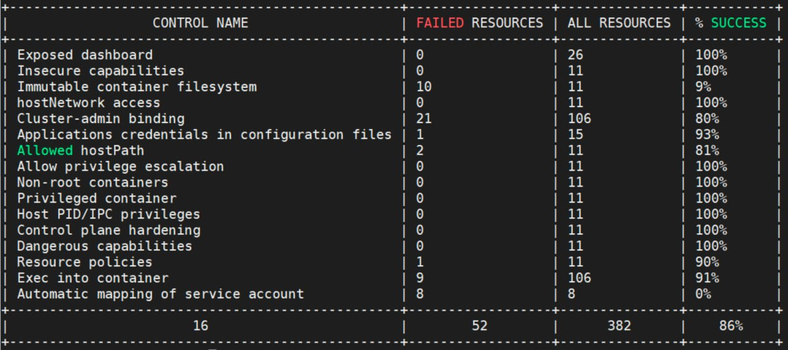
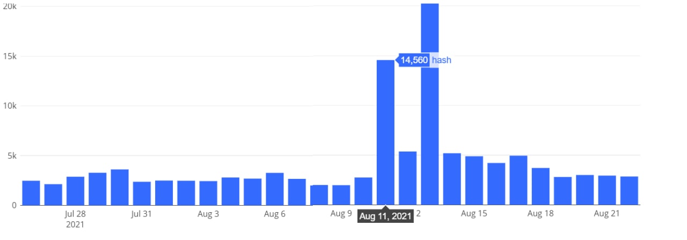
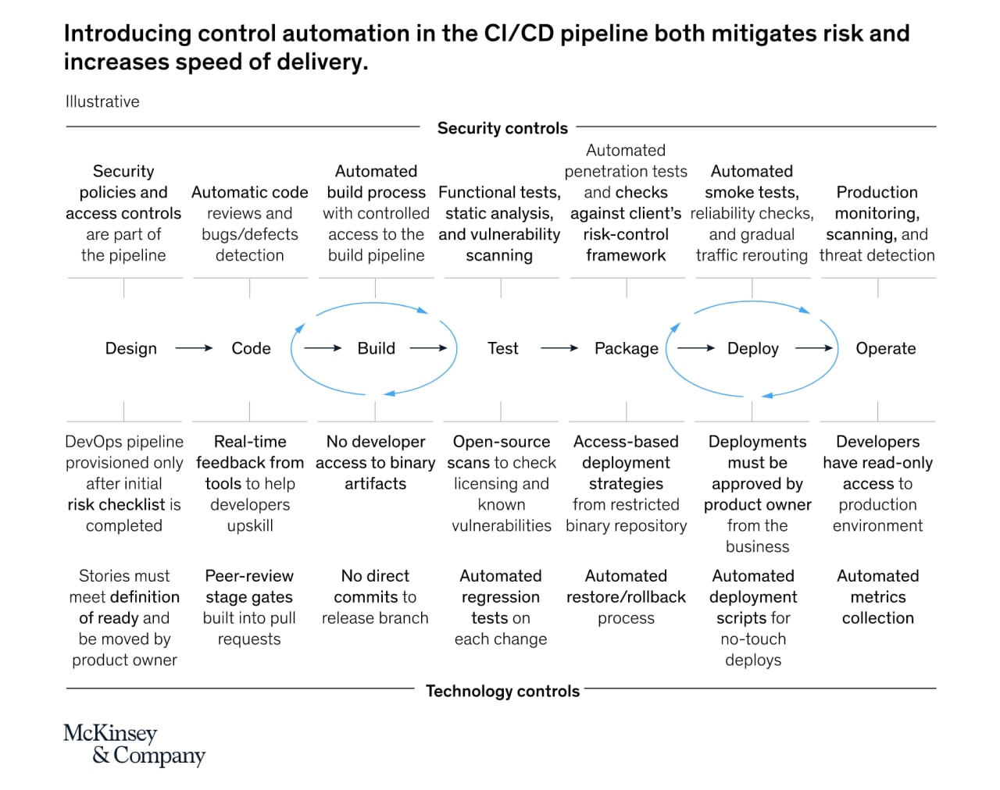

# defcon_news
`2021-08-27 11:37:15`

<blockquote>
[webapps] CyberPanel 2.1 - Remote Code Execution (RCE) (Authenticated)
https://www.exploit-db.com/exploits/50230

via Exploit Database
</blockquote>

<table><tr><td><b>→</b><a href="https://www.exploit-db.com/exploits/50230">
https://www.exploit-db.com/exploits/50230
</a>
<blockquote>
CyberPanel 2.1 - Remote Code Execution (RCE) (Authenticated).. webapps exploit for Multiple platform
</blockquote>
</td></tr></table>

---

# defcon_news
`2021-08-26 23:56:07`

<blockquote>
U.S. Dept Of Defense: https://██████/ Vulnerable to CVE-2013-3827 (Directory-traversal vulnerability)
https://vulners.com/hackerone/H1:1280188?utm_source&#61;rss&amp;utm_medium&#61;rss&amp;utm_campaign&#61;rss

via Vulners
</blockquote>

<table><tr><td><b>→</b><a href="https://vulners.com/hackerone/H1:1280188?utm_source=rss&utm_medium=rss&utm_campaign=rss">
https://vulners.com/hackerone/H1:1280188?utm_source=rss&utm_medium=rss&utm_campaign=rss
</a>
<blockquote>
Description: Hi team, https:// █████/ using older version of Oracle JavaServer which is vulnerable to CVE-2013-3827.  POC: https:// █████/ ████ References https://www.securityfocus.com/bid/63052/info https://www.exploit-db.com/exploits/38802 Impact  Directory-traversal  System Host(s)  █████ Affected Product(s) and Version(s) Oracle JavaServer CVE Numbers CVE-2013-3827 Steps to Reproduce Go to https:// ██████████/ ██████ Suggested Mitigation/Remediation Actions Update your Oracle...
</blockquote>
</td></tr></table>

---

# defcon_news
`2021-08-26 23:01:44`

<blockquote>
U.S. Dept Of Defense: [CVE-2021-29156] LDAP Injection at https://██████
https://vulners.com/hackerone/H1:1278891?utm_source&#61;rss&amp;utm_medium&#61;rss&amp;utm_campaign&#61;rss

via Vulners
</blockquote>

<table><tr><td><b>→</b><a href="https://vulners.com/hackerone/H1:1278891?utm_source=rss&utm_medium=rss&utm_campaign=rss">
https://vulners.com/hackerone/H1:1278891?utm_source=rss&utm_medium=rss&utm_campaign=rss
</a>
<blockquote>
Description: https:// █████ is vulnerable to CVE-2021-29156 References  https://hackerone.com/reports/1278050 https://nvd.nist.gov/vuln/detail/CVE-2021-29156 https://portswigger.net/research/hidden-oauth-attack-vectors https://github.com/projectdiscovery/nuclei-templates/blob/74db4223c11d27a934ca1c417aa4abca9e70ad35/cves/2021/CVE-2021-29156.yaml  Impact ForgeRock OpenAM before 13.5.1 allows LDAP injection via the Webfinger protocol. For example, an unauthenticated attacker can perform character-by-character retrieval of password hashes, or retrieve a session token or a private key. System Host(s)  ███████ Affected Product(s) and Version(s) CVE Numbers CVE-2021-29156 Steps to Reproduce The references mentioned shall be helpful for successful reproduction, especially the one I reported the earlier day (&#35;1278050) and the PortSwigger one.   Username starting with  ██████████ exists: https:// █████████/ ███/ ███████[200 OK]   Username starting with  ███████ doesn't exist: https:// ██████████/ ██████████/ █████████████[404 Not…
</blockquote>
</td></tr></table>

---

# cyberoffru
`2021-08-26 20:03:35`

<blockquote>
https://github.com/Kennyslaboratory/Ultimate-Hacker-Roadmap
</blockquote>

<table><tr><td><b>→</b><a href="https://github.com/Kennyslaboratory/Ultimate-Hacker-Roadmap">
https://github.com/Kennyslaboratory/Ultimate-Hacker-Roadmap
</a>
<blockquote>
Don't know what to focus on to become a Penetration Tester..? This is the BEST roadmap for becoming a modern penetration tester.  Everything you need to know to land a paying job, categoriz...
</blockquote>
</td></tr></table>

---

# defcon_news
`2021-08-26 12:11:48`

<blockquote>
[webapps] ProcessMaker 3.5.4 - Local File inclusion
https://www.exploit-db.com/exploits/50229

via Exploit Database
</blockquote>

<table><tr><td><b>→</b><a href="https://www.exploit-db.com/exploits/50229">
https://www.exploit-db.com/exploits/50229
</a>
<blockquote>
ProcessMaker 3.5.4 - Local File inclusion.. webapps exploit for Multiple platform
</blockquote>
</td></tr></table>

---

# sysadm_in_channel
`2021-08-25 14:52:49`

<blockquote>
How to: Prevent ransomware by using FSRM

Хоть и старенькая статья, но от этого суть не меняется:

https://community.spiceworks.com/how_to/128744-prevent-ransomware-by-using-fsrm

https://fsrm.experiant.ca
https://github.com/nexxai/CryptoBlocker
</blockquote>

<table><tr><td><b>→</b><a href="https://community.spiceworks.com/how_to/128744-prevent-ransomware-by-using-fsrm">
https://community.spiceworks.com/how_to/128744-prevent-ransomware-by-using-fsrm
</a>
<blockquote>
In this how-to I'm going to show you how to install File Server Resource Manager using PowerShell on Windows Server 2008/2012. I'm then going to show you how...
</blockquote>
</td></tr></table>

---

# defcon_news
`2021-08-25 11:46:13`

<blockquote>
[webapps] Online Leave Management System 1.0 - Arbitrary File Upload to Shell (Unauthenticated)
https://www.exploit-db.com/exploits/50228

via Exploit Database
</blockquote>

<table><tr><td><b>→</b><a href="https://www.exploit-db.com/exploits/50228?utm_source=dlvr.it&utm_medium=twitter">
https://www.exploit-db.com/exploits/50228?utm_source=dlvr.it&utm_medium=twitter
</a>
<blockquote>
Online Leave Management System 1.0 - Arbitrary File Upload to Shell (Unauthenticated).. webapps exploit for PHP platform
</blockquote>
</td></tr></table>

---

# defcon_news
`2021-08-25 11:46:11`

<blockquote>
[webapps] HP OfficeJet 4630/7110 MYM1FN2025AR/2117A - Stored Cross-Site Scripting (XSS)
https://www.exploit-db.com/exploits/50227

via Exploit Database
</blockquote>

<table><tr><td><b>→</b><a href="https://www.exploit-db.com/exploits/50227?utm_source=dlvr.it&utm_medium=twitter">
https://www.exploit-db.com/exploits/50227?utm_source=dlvr.it&utm_medium=twitter
</a>
<blockquote>
HP OfficeJet 4630/7110 MYM1FN2025AR/2117A - Stored Cross-Site Scripting (XSS).. webapps exploit for Hardware platform
</blockquote>
</td></tr></table>

---

# defcon_news
`2021-08-25 11:31:41`

<blockquote>
[webapps] WordPress Plugin Mail Masta 1.0 - Local File Inclusion (2)
https://www.exploit-db.com/exploits/50226

via Exploit Database
</blockquote>

<table><tr><td><b>→</b><a href="https://www.exploit-db.com/exploits/50226?utm_source=dlvr.it&utm_medium=twitter">
https://www.exploit-db.com/exploits/50226?utm_source=dlvr.it&utm_medium=twitter
</a>
<blockquote>
WordPress Plugin Mail Masta 1.0 - Local File Inclusion (2).. webapps exploit for PHP platform
</blockquote>
</td></tr></table>

---

# MPSIEMChat
`2021-08-24 21:25:33`

<blockquote>
https://github.com/feedb/MPSiem_addons/tree/master/mpsiemlib
Добавлена поддержка 24.1
sdk работает с 23.0 - 24.1
</blockquote>

<table><tr><td><b>→</b><a href="https://github.com/feedb/MPSiem_addons/tree/master/mpsiemlib">
https://github.com/feedb/MPSiem_addons/tree/master/mpsiemlib
</a>
<blockquote>
реп полезностей для PT MaxPatrol SIEM. Contribute to feedb/MPSiem_addons development by creating an account on GitHub.
</blockquote>
</td></tr></table>

---

# sysadm_in_channel
`2021-08-24 18:56:44`

<blockquote>
Комментарий по поводу уязвимости OpenSSL от Мэтта Касвелла из OpenSSL Project -  изменения, которые может сделать злоумышленник, зависят от целевого приложения и типа данных, которые оно хранит в куче сразу после буфера переполнения.

&quot;Подумайте о любых данных, которые приложение может хранить в памяти (например, финансовые, учетные данные и т. Д.), А затем подумайте, что может произойти, если злоумышленник сможет их изменить&quot;  - пояснил он

Если кратко: кто использует - обновляйтесь:

https://www.openssl.org/news/vulnerabilities.html&#35;CVE-2021-3711
</blockquote>

<table><tr><td><b>→</b><a href="https://www.openssl.org/news/vulnerabilities.html">
https://www.openssl.org/news/vulnerabilities.html
</a>
</td></tr></table>

---

# isast
`2021-08-24 13:45:14`

<blockquote>
Rust Memory Safety &amp; Undefined Behavior Detection.

Rudra is a static analyzer to detect common undefined behaviors in &#35;rust programs. It is capable of analyzing single Rust packages as well as all the packages on crates.io.

Features:
- Panic Safety (Unsafe code that can create memory-safety issues when panicked)
- Higher Order Invariant (Assumed properties about traits)
- Send Sync Variance (Unrestricted Send or Sync on generic types)

https://github.com/sslab-gatech/Rudra
</blockquote>

<table><tr><td><b>→</b><a href="https://github.com/sslab-gatech/Rudra">
https://github.com/sslab-gatech/Rudra
</a>
<blockquote>
Rust Memory Safety &amp; Undefined Behavior Detection. Contribute to sslab-gatech/Rudra development by creating an account on GitHub.
</blockquote>
</td></tr></table>

---

# exploitex
`2021-08-24 09:13:01`

* https://telegra.ph/file/7c300e8dd6b9e47e05012.jpg
* https://github.com/daspartho/SpotiByeAds
* https://www.exploit.media/note/kak-ubirat-rieklamu-iz-prilozhieniia-spotify/
* https://chrome.google.com/webstore/detail/spotiads/mghhlojofjipigjobacbjdngmjafdeim
* https://chrome.google.com/webstore/detail/ublock-origin/cjpalhdlnbpafiamejdnhcphjbkeiagm

<blockquote>
​Как бесплатно слушать музыку на Spotify без рекламы

Халяву любят все. Конечно, можно платить за подписку и жить без проблем. И это наверно верный, экологичный и разумный выбор. Но в жизни бывает разное, и все мы разные. Кто-то любит и может платить за сервис, а кто-то принципиально отказывается это делать.

Так вот, рекламные аудиодорожки и баннеры на Spotify можно блокировать с помощью этого скрипта, подойдёт для приложения Spotify на ПК. Подробная инструкция, как это осуществить, есть здесь. Понадобится немного повозиться с командной строкой и даже немного залезть в код, чтобы насладиться красивыми подборками из Spotify без рекламы.

Обойти рекламу можно также и просто с помощью расширений для браузера. Для Chrome есть для этого расширение SpotiAds. Рекламу ещё могут обойти некоторые блокировщики рекламы. Например, uBlock Origin. А за идею для поста спасибо Алексею :)

&#35;полезно
</blockquote>

<table><tr><td><b>→</b><a href="https://telegra.ph/file/7c300e8dd6b9e47e05012.jpg">
https://telegra.ph/file/7c300e8dd6b9e47e05012.jpg
</a>
</td></tr></table>

---

# sysadm_in_channel
`2021-08-23 14:56:03`

<blockquote>
CISA (Urgent: Protect Against Active Exploitation of ProxyShell Vulnerabilities)

Уведомляет владельцев Exchange - https://us-cert.cisa.gov/ncas/current-activity/2021/08/21/urgent-protect-against-active-exploitation-proxyshell

Как это работает:
https://doublepulsar.com/multiple-threat-actors-including-a-ransomware-gang-exploiting-exchange-proxyshell-vulnerabilities-c457b1655e9c
</blockquote>

<table><tr><td><b>→</b><a href="https://us-cert.cisa.gov/ncas/current-activity/2021/08/21/urgent-protect-against-active-exploitation-proxyshell">
https://us-cert.cisa.gov/ncas/current-activity/2021/08/21/urgent-protect-against-active-exploitation-proxyshell
</a>
<blockquote>
Malicious cyber actors are actively exploiting the following ProxyShell vulnerabilities: CVE-2021-34473, CVE-2021-34523, and CVE-2021-31207. An attacker exploiting these vulnerabilities could execute arbitrary code on a vulnerable machine.
</blockquote>
</td></tr></table>

---

# isast
`2021-08-23 13:30:23`

* https://telegra.ph/file/93c25a1d61c2ef2aac00a.jpg

<blockquote>
​​A static analysis tool for securing &#35;go code 

GoKart is a static analysis tool for Go that finds vulnerabilities using the SSA (single static assignment) form of Go source code. It is capable of tracing the source of variables and function arguments to determine whether input sources are safe, which reduces the number of false positives compared to other Go security scanners. For instance, a SQL query that is concatenated with a variable might traditionally be flagged as SQL injection; however, GoKart can figure out if the variable is actually a constant or constant equivalent, in which case there is no vulnerability.

The motivation for GoKart was to address this: could we create a scanner with significantly lower false positive rates than existing tools? Based on our experimentation the answer is yes. By leveraging source-to-sink tracing and SSA, GoKart is capable of tracking variable taint between variable assignments, significantly improving the accuracy of findings. Our focus is on usability: pragmatically, that means we have optimized our approaches to reduce false alarms.

https://github.com/praetorian-inc/gokart
</blockquote>

<table><tr><td><b>→</b><a href="https://telegra.ph/file/93c25a1d61c2ef2aac00a.jpg">
https://telegra.ph/file/93c25a1d61c2ef2aac00a.jpg
</a>
</td></tr></table>

---

# defcon_news
`2021-08-23 12:36:51`

<blockquote>
[webapps] RaspAP 2.6.6 - Remote Code Execution (RCE) (Authenticated)
https://www.exploit-db.com/exploits/50224

via Exploit Database
</blockquote>

<table><tr><td><b>→</b><a href="https://www.exploit-db.com/exploits/50224?utm_source=dlvr.it&utm_medium=twitter">
https://www.exploit-db.com/exploits/50224?utm_source=dlvr.it&utm_medium=twitter
</a>
<blockquote>
RaspAP 2.6.6 - Remote Code Execution (RCE) (Authenticated).. webapps exploit for PHP platform
</blockquote>
</td></tr></table>

---

# defcon_news
`2021-08-23 12:26:50`

<blockquote>
[webapps] Simple Phone book/directory 1.0 - 'Username' SQL Injection (Unauthenticated)
https://www.exploit-db.com/exploits/50223

via Exploit Database
</blockquote>

<table><tr><td><b>→</b><a href="https://www.exploit-db.com/exploits/50223?utm_source=dlvr.it&utm_medium=twitter">
https://www.exploit-db.com/exploits/50223?utm_source=dlvr.it&utm_medium=twitter
</a>
<blockquote>
Simple Phone book/directory 1.0 - 'Username' SQL Injection (Unauthenticated).. webapps exploit for PHP platform
</blockquote>
</td></tr></table>

---

# defcon_news
`2021-08-23 12:01:37`

<blockquote>
[webapps] Online Traffic Offense Management System 1.0 - Remote Code Execution (RCE) (Unauthenticated)
https://www.exploit-db.com/exploits/50221

via Exploit Database
</blockquote>

<table><tr><td><b>→</b><a href="https://www.exploit-db.com/exploits/50221?utm_source=dlvr.it&utm_medium=twitter">
https://www.exploit-db.com/exploits/50221?utm_source=dlvr.it&utm_medium=twitter
</a>
<blockquote>
Online Traffic Offense Management System 1.0 - Remote Code Execution (RCE) (Unauthenticated).. webapps exploit for PHP platform
</blockquote>
</td></tr></table>

---

# sysadm_in_channel
`2021-08-23 12:01:05`

* https://i.ibb.co/vJVHQmM/Check-Windows-and-Control-Configs-and-Security-Google-2021-08-23-11-32-29.jpg
* https://sysconf.io/
* https://github.com/m0zgen/cwiccs
* https://sys-adm.in/systadm/windows/933-cwiccs-check-windows-and-control-configs-and-security-powershell-instrument-dlya-proverki-i-kontrolya-windows-konfiguratsij.html
* https://docs.google.com/presentation/d/1OHhjebBtccALlg5KQQdF_3vEKR3dd7gYHmdHmN7T7_g/edit?usp=sharing
* https://docs.google.com/forms/d/e/1FAIpQLSdD1hbrFAoTUBgTgSR-qP3TwN9YinIAwGS52pXKxJyG-wIUkA/viewform?usp=sf_link

<blockquote>
 
Check Windows and Control Configs and Security (CWiCCS) (практический вебинар)

Всем приветы, на последнем SysConf'21 я рассказывал про соблюдение и контроль соответствия конфигураций Windows и про автоматизацию этого дела в Windows средах.

Практическое демо провести не представилось возможности, поэтому предлагаю в эту пятницу в 12 дня по МСК провести онлайн встречу:

•  Зачем оно надо, как использовать, примеры кейсов
•  Практическое использование PowerShell
•  Создание профилей проверок для разных семейств серверов
•  Применение. Очеты.

Примерно на час-полтора. Доп. ссылки:

•  CWiCCS репо
•  Краткий обзор возможностей в статье CWiCCS - PowerShell инструмент для проверки и контроля Windows конфигураций
•  Презентация SysConf'21 Check Windows and Control Configs and Security
•  Фидбек для тех кто слышал, пользовал. смотрел

•  12 дня по МСК (15 дня Алматы). Ссылка будет ближе к дате встречи.
 
</blockquote>

<table><tr><td><b>→</b><a href="https://i.ibb.co/vJVHQmM/Check-Windows-and-Control-Configs-and-Security-Google-2021-08-23-11-32-29.jpg">
https://i.ibb.co/vJVHQmM/Check-Windows-and-Control-Configs-and-Security-Google-2021-08-23-11-32-29.jpg
</a>
</td></tr></table>

---

# isast
`2021-08-23 09:55:03`

<blockquote>
kubescape

Кажется уже все слышали, что NSA (National Security Agency) выпустили Kubernetes Hardening Guidance, но не все знают, что вслед за этим вышел open-source инструмент Kubescape от компании Armo для проверки кластера на соответствие этому гайду. Подобный набор проверок можно встретить в том же kubeaudit, но kubescape отличает тот факт, что правила написаны на языке OPA (Rego). Тут стоит отметить, что речь идет именно о кластере, а не о манифестах, которые хранятся в git, где может подойти любой IaC сканер вроде kics. 

&#35;k8s &#35;ops
</blockquote>

---

# phd_soc
`2021-08-23 09:17:55`

<blockquote>
Возвращаясь к теме.
Решил глянуть как эта &quot;утечка&quot; видна в открытых источниках.
Итог: все хэши в фидах появились в тот же день (исходный твит от 11 августа).
На картинке кол-во уникальных хэшей, собранных за сутки.
</blockquote>

---

# defcon_news
`2021-08-23 01:06:35`

<blockquote>
CVE-2021-32682 / CVE-2021-23394 - Write-up of several pre-auth RCEs in elFinder &lt; 2.1.59
https://www.reddit.com/r/netsec/comments/p9guk7/cve202132682_cve202123394_writeup_of_several/

via /r/netsec - Information Security News &amp; Discussion
</blockquote>

<table><tr><td><b>→</b><a href="https://www.reddit.com/r/netsec/comments/p9guk7/cve202132682_cve202123394_writeup_of_several/">
https://www.reddit.com/r/netsec/comments/p9guk7/cve202132682_cve202123394_writeup_of_several/
</a>
<blockquote>
Posted in r/netsec by u/monoimpact • 27 points and 0 comments
</blockquote>
</td></tr></table>

---

# defcon_news
`2021-08-21 19:16:46`

<blockquote>
Urgent: Protect Against Active Exploitation of ProxyShell Vulnerabilities
https://us-cert.cisa.gov/ncas/current-activity/2021/08/21/urgent-protect-against-active-exploitation-proxyshell

via CISA Current Activity
</blockquote>

<table><tr><td><b>→</b><a href="https://us-cert.cisa.gov/ncas/current-activity/2021/08/21/urgent-protect-against-active-exploitation-proxyshell">
https://us-cert.cisa.gov/ncas/current-activity/2021/08/21/urgent-protect-against-active-exploitation-proxyshell
</a>
<blockquote>
Malicious cyber actors are actively exploiting the following ProxyShell vulnerabilities: CVE-2021-34473, CVE-2021-34523, and CVE-2021-31207. An attacker exploiting these vulnerabilities could execute arbitrary code on a vulnerable machine.
</blockquote>
</td></tr></table>

---

# defcon_news
`2021-08-20 14:51:23`

<blockquote>
SEC Consult SA-20210820-0 :: Multiple Vulnerabilities in NetModule Router Software
https://seclists.org/fulldisclosure/2021/Aug/22

via Full Disclosure
</blockquote>

<table><tr><td><b>→</b><a href="https://seclists.org/fulldisclosure/2021/Aug/22">
https://seclists.org/fulldisclosure/2021/Aug/22
</a>
</td></tr></table>

---

# sysadm_in_channel
`2021-08-20 14:35:31`

<blockquote>
0patch Blog: Free Micropatches for &quot;PetitPotam&quot; (CVE-2021-36942)
https://blog.0patch.com/2021/08/free-micropatches-for-petitpotam.html
</blockquote>

<table><tr><td><b>→</b><a href="https://blog.0patch.com/2021/08/free-micropatches-for-petitpotam.html">
https://blog.0patch.com/2021/08/free-micropatches-for-petitpotam.html
</a>
<blockquote>
  by Mitja Kolsek, the 0patch Team Update 8/11/2021-A: August 2021 Windows Updates brought a fix for PetitPotam , which, in contrast to our ...
</blockquote>
</td></tr></table>

---

# sysadm_in_channel
`2021-08-20 14:31:53`

<blockquote>
ISC Releases Security Advisory for BIND | CISA

 Отказ в обслуживании BIND. CVE-2021-25218, затрагивает версии BIND 9.16.19, 9.17.16 и 9.16.19-S1. Патчи включены в версии 9.17.17, 9.16.20:

https://us-cert.cisa.gov/ncas/current-activity/2021/08/19/isc-releases-security-advisory-bind
</blockquote>

<table><tr><td><b>→</b><a href="https://us-cert.cisa.gov/ncas/current-activity/2021/08/19/isc-releases-security-advisory-bind">
https://us-cert.cisa.gov/ncas/current-activity/2021/08/19/isc-releases-security-advisory-bind
</a>
<blockquote>
The Internet Systems Consortium (ISC) has released a security advisory that addresses a vulnerability affecting multiple versions of the ISC Berkeley Internet Name Domain (BIND). A remote attacker could exploit this vulnerability to cause a denial-of-service condition.

CISA encourages users and administrators to review ISC advisory CVE-2021-25218 and apply the necessary updates or workarounds.
</blockquote>
</td></tr></table>

---

# defcon_news
`2021-08-20 13:41:21`

<blockquote>
[webapps] Laundry Booking Management System 1.0 - 'Multiple' Stored Cross-Site Scripting (XSS)
https://www.exploit-db.com/exploits/50220

via Exploit Database
</blockquote>

<table><tr><td><b>→</b><a href="https://www.exploit-db.com/exploits/50220?utm_source=dlvr.it&utm_medium=twitter">
https://www.exploit-db.com/exploits/50220?utm_source=dlvr.it&utm_medium=twitter
</a>
<blockquote>
Laundry Booking Management System 1.0 - 'Multiple' Stored Cross-Site Scripting (XSS).. webapps exploit for PHP platform
</blockquote>
</td></tr></table>

---

# defcon_news
`2021-08-20 13:16:54`

<blockquote>
[webapps] Laundry Booking Management System 1.0 - 'Multiple' SQL Injection
https://www.exploit-db.com/exploits/50219

via Exploit Database
</blockquote>

<table><tr><td><b>→</b><a href="https://www.exploit-db.com/exploits/50219?utm_source=dlvr.it&utm_medium=twitter">
https://www.exploit-db.com/exploits/50219?utm_source=dlvr.it&utm_medium=twitter
</a>
<blockquote>
Laundry Booking Management System 1.0 - 'Multiple' SQL Injection.. webapps exploit for PHP platform
</blockquote>
</td></tr></table>

---

# defcon_news
`2021-08-20 13:16:53`

<blockquote>
[webapps] Online Traffic Offense Management System 1.0 - 'id' SQL Injection (Authenticated)
https://www.exploit-db.com/exploits/50218

via Exploit Database
</blockquote>

<table><tr><td><b>→</b><a href="https://www.exploit-db.com/exploits/50218?utm_source=dlvr.it&utm_medium=twitter">
https://www.exploit-db.com/exploits/50218?utm_source=dlvr.it&utm_medium=twitter
</a>
<blockquote>
Online Traffic Offense Management System 1.0 - 'id' SQL Injection (Authenticated).. webapps exploit for PHP platform
</blockquote>
</td></tr></table>

---

# phd_soc
`2021-08-20 12:27:24`

<blockquote>
https://github.com/rapid7/metasploitable3
</blockquote>

<table><tr><td><b>→</b><a href="https://github.com/rapid7/metasploitable3">
https://github.com/rapid7/metasploitable3
</a>
<blockquote>
Metasploitable3 is a VM that is built from the ground up with a large amount of security vulnerabilities. - GitHub - rapid7/metasploitable3: Metasploitable3 is a VM that is built from the ground up...
</blockquote>
</td></tr></table>

---

# cyberoffru
`2021-08-20 10:41:59`

* https://www.oig.doc.gov/OIGPublications/OIG-21-034-A.pdf
* http://t.me/cpartisans/246
* https://www.oig.doc.gov/OIGPublications/OIG-21-034-A.pdf

<blockquote>
​​Три недели назад белорусские Кибер-Партизаны ломанули АИС Паспорт белорусского МВД. Новость была громкая и прошла по многим новостным ресурсам. 

Как пишут про это зарубежные инфосек ресурсы - &quot;разрозненная группа технических экспертов, живущих за пределами страны собирает данные о режиме, чтобы вмешаться в нужный момент в его информационную инфраструктуру и свергнуть правительство&quot;. В качестве эксперта при этом выступает заместитель директора Лаборатории цифровой криминалистики при НАТО Лукас Андрюкайтис.

Нам такой дискурс очень даже нравится, поэтому продолжим подавать новости в схожем ключе.

Как стало известно согласно сообщению Управления генерального инспектора США (OIG), серверы американского Бюро переписи населения (USCB) были взломаны 11 января 2020 года .

Для проникновения в сеть использовалась уязвимость в Citrix ADC. Атакующие получили доступ к ряду сетей USCB, но, по уверениям OIG, доступа к серверам с данными переписи американского народонаселения не получили.

При всем этом атака оставалась незамеченной в течение двух с половиной недель, в течение которых атаковавшие имели доступ к внутренним ресурсам USCB.

Кто-же стоял за атакой? Судя по использованию CVE-2019-19781 в Citrix ADC в качестве первичного вектора атаки, за нападением на USCB стояла  разрозненная группа технических экспертов, живущих за пределами США, которая собирает данные об американском режиме, чтобы вмешаться в нужный момент в его информационную инфраструктуру и свергнуть правительство.

Правда почему-то американские инфосек эксперты называют их хакерами из китайской прогосударственной группы APT 41.
</blockquote>

<table><tr><td><b>→</b><a href="https://www.oig.doc.gov/OIGPublications/OIG-21-034-A.pdf">
https://www.oig.doc.gov/OIGPublications/OIG-21-034-A.pdf
</a>
</td></tr></table>

---

# defcon_news
`2021-08-19 23:01:49`

<blockquote>
U.S. Dept Of Defense: [CVE-2021-29156 on ForgeRock OpenAm] LDAP Injection in Webfinger Protocol!
https://vulners.com/hackerone/H1:1278050?utm_source&#61;rss&amp;utm_medium&#61;rss&amp;utm_campaign&#61;rss

via Vulners
</blockquote>

<table><tr><td><b>→</b><a href="https://vulners.com/hackerone/H1:1278050?utm_source=rss&utm_medium=rss&utm_campaign=rss">
https://vulners.com/hackerone/H1:1278050?utm_source=rss&utm_medium=rss&utm_campaign=rss
</a>
<blockquote>
Description: https:// ████████ is vulnerable to CVE-2021-29156.  References  https://nvd.nist.gov/vuln/detail/CVE-2021-29156 https://portswigger.net/research/hidden-oauth-attack-vectors https://github.com/projectdiscovery/nuclei-templates/blob/74db4223c11d27a934ca1c417aa4abca9e70ad35/cves/2021/CVE-2021-29156.yaml  Impact ForgeRock OpenAM before 13.5.1 allows LDAP injection via the Webfinger protocol. For example, an unauthenticated attacker can perform character-by-character retrieval of password hashes, or retrieve a session token or a private key. System Host(s)  ████████ Affected Product(s) and Version(s) CVE Numbers CVE-2021-29156 Steps to Reproduce The references mentioned shall be helpful for successful reproduction. Suggested Mitigation/Remediation...
</blockquote>
</td></tr></table>

---

# defcon_news
`2021-08-19 23:01:48`

<blockquote>
U.S. Dept Of Defense: XSS due to CVE-2020-3580 [███.mil]
https://vulners.com/hackerone/H1:1277383?utm_source&#61;rss&amp;utm_medium&#61;rss&amp;utm_campaign&#61;rss

via Vulners
</blockquote>

<table><tr><td><b>→</b><a href="https://vulners.com/hackerone/H1:1277383?utm_source=rss&utm_medium=rss&utm_campaign=rss">
https://vulners.com/hackerone/H1:1277383?utm_source=rss&utm_medium=rss&utm_campaign=rss
</a>
<blockquote>
Multiple vulnerabilities in the web services interface of Cisco Adaptive Security Appliance (ASA) Software and Cisco Firepower Threat Defense (FTD) Software could allow an unauthenticated, remote attacker to conduct cross-site scripting (XSS) attacks against a user of the web services interface of an affected device.  Steps To Reproduce  Go to this  URL   ██████████████.mil.html  HTML POC:      history.pushState('', '', '/')          document.forms[0].submit();    Impact  An attacker could exploit these vulnerabilities by persuading a user of the interface to click a crafted link. A successful exploit could allow the attacker to execute arbitrary script code in the context of the interface or allow the attacker to access sensitive, browser-based information.   Note: These vulnerabilities affect only specific AnyConnect and WebVPN configurations. Supporting Material References  https://www.exploit-db.com/exploits/47988 ...
</blockquote>
</td></tr></table>

---

# defcon_news
`2021-08-19 18:57:06`

<blockquote>
ISC Releases Security Advisory for BIND
https://us-cert.cisa.gov/ncas/current-activity/2021/08/19/isc-releases-security-advisory-bind

via CISA Current Activity
</blockquote>

<table><tr><td><b>→</b><a href="https://us-cert.cisa.gov/ncas/current-activity/2021/08/19/isc-releases-security-advisory-bind">
https://us-cert.cisa.gov/ncas/current-activity/2021/08/19/isc-releases-security-advisory-bind
</a>
<blockquote>
The Internet Systems Consortium (ISC) has released a security advisory that addresses a vulnerability affecting multiple versions of the ISC Berkeley Internet Name Domain (BIND). A remote attacker could exploit this vulnerability to cause a denial-of-service condition.

CISA encourages users and administrators to review ISC advisory CVE-2021-25218 and apply the necessary updates or workarounds.
</blockquote>
</td></tr></table>

---

# defcon_news
`2021-08-19 12:36:51`

<blockquote>
SEC Consult SA-20210819-0 :: Multiple critical vulnerabilities in Altus Nexto and Hadron series
https://seclists.org/fulldisclosure/2021/Aug/21

via Full Disclosure
</blockquote>

<table><tr><td><b>→</b><a href="https://seclists.org/fulldisclosure/2021/Aug/21">
https://seclists.org/fulldisclosure/2021/Aug/21
</a>
</td></tr></table>

---

# defcon_news
`2021-08-19 12:06:58`

<blockquote>
[webapps] Charity Management System CMS 1.0 - Multiple Vulnerabilities
https://www.exploit-db.com/exploits/50217

via Exploit Database
</blockquote>

<table><tr><td><b>→</b><a href="https://www.exploit-db.com/exploits/50217?utm_source=dlvr.it&utm_medium=twitter">
https://www.exploit-db.com/exploits/50217?utm_source=dlvr.it&utm_medium=twitter
</a>
<blockquote>
Charity Management System CMS 1.0 - Multiple Vulnerabilities.. webapps exploit for PHP platform
</blockquote>
</td></tr></table>

---

# defcon_news
`2021-08-19 04:12:23`

<blockquote>
Sophos UTM Preauth RCE: A Deep Dive into CVE-2020-25223
https://www.reddit.com/r/netsec/comments/p6z37g/sophos_utm_preauth_rce_a_deep_dive_into/

via /r/netsec - Information Security News &amp; Discussion
</blockquote>

<table><tr><td><b>→</b><a href="https://www.reddit.com/r/netsec/comments/p6z37g/sophos_utm_preauth_rce_a_deep_dive_into/">
https://www.reddit.com/r/netsec/comments/p6z37g/sophos_utm_preauth_rce_a_deep_dive_into/
</a>
<blockquote>
Posted in r/netsec by u/juken • 4 points and 0 comments
</blockquote>
</td></tr></table>

---

# cyberoffru
`2021-08-18 21:30:57`

* https://news.ycombinator.com/item?id=28219068
* https://news.ycombinator.com/item?id=28106867

<blockquote>
https://github.com/AsuharietYgvar/AppleNeuralHash2ONNX/issues/1
https://gist.github.com/unrealwill/c480371c3a4bf3abb29856c29197c0be
(HN)

Dont upload these harmless generated images to iCloud as Apple will assume its Child Porn
https://drive.google.com/drive/folders/1c3-a8-XQ1X0CxXuFL0N3XVkglUD2OJS_
(HN)
</blockquote>

<table><tr><td><b>→</b><a href="https://github.com/AsuharietYgvar/AppleNeuralHash2ONNX/issues/1">
https://github.com/AsuharietYgvar/AppleNeuralHash2ONNX/issues/1
</a>
<blockquote>
Can you verify that these two images collide? Here's what I see from following your directions: $ python3 nnhash.py NeuralHash/model.onnx neuralhash_128x96_seed1.dat beagle360.png 59a34eabe...
</blockquote>
</td></tr></table>

---

# defcon_news
`2021-08-18 12:11:19`

<blockquote>
[remote] crossfire-server 1.9.0 - 'SetUp()' Remote Buffer Overflow
https://www.exploit-db.com/exploits/50216

via Exploit Database
</blockquote>

<table><tr><td><b>→</b><a href="https://www.exploit-db.com/exploits/50216?utm_source=dlvr.it&utm_medium=twitter">
https://www.exploit-db.com/exploits/50216?utm_source=dlvr.it&utm_medium=twitter
</a>
<blockquote>
crossfire-server 1.9.0 - 'SetUp()' Remote Buffer Overflow. CVE-2006-1236 . remote exploit for Linux platform
</blockquote>
</td></tr></table>

---

# defcon_news
`2021-08-18 12:11:17`

<blockquote>
[webapps] COVID19 Testing Management System 1.0 - 'Multiple' SQL Injections
https://www.exploit-db.com/exploits/50215

via Exploit Database
</blockquote>

<table><tr><td><b>→</b><a href="https://www.exploit-db.com/exploits/50215?utm_source=dlvr.it&utm_medium=twitter">
https://www.exploit-db.com/exploits/50215?utm_source=dlvr.it&utm_medium=twitter
</a>
<blockquote>
COVID19 Testing Management System 1.0 - 'Multiple' SQL Injections.. webapps exploit for PHP platform
</blockquote>
</td></tr></table>

---

# defcon_news
`2021-08-18 12:11:16`

<blockquote>
[webapps] Simple Image Gallery 1.0 - Remote Code Execution (RCE) (Unauthenticated)
https://www.exploit-db.com/exploits/50214

via Exploit Database
</blockquote>

<table><tr><td><b>→</b><a href="https://www.exploit-db.com/exploits/50214?utm_source=dlvr.it&utm_medium=twitter">
https://www.exploit-db.com/exploits/50214?utm_source=dlvr.it&utm_medium=twitter
</a>
<blockquote>
Simple Image Gallery 1.0 - Remote Code Execution (RCE) (Unauthenticated).. webapps exploit for PHP platform
</blockquote>
</td></tr></table>

---

# defcon_news
`2021-08-18 11:46:44`

<blockquote>
[webapps] Crime records Management System 1.0 - 'Multiple' SQL Injection (Authenticated)
https://www.exploit-db.com/exploits/50213

via Exploit Database
</blockquote>

<table><tr><td><b>→</b><a href="https://www.exploit-db.com/exploits/50213?utm_source=dlvr.it&utm_medium=twitter">
https://www.exploit-db.com/exploits/50213?utm_source=dlvr.it&utm_medium=twitter
</a>
<blockquote>
Crime records Management System 1.0 - 'Multiple' SQL Injection (Authenticated).. webapps exploit for PHP platform
</blockquote>
</td></tr></table>

---

# defcon_news
`2021-08-17 21:46:51`

<blockquote>
Обновление Tor 0.3.5.16, 0.4.5.10 и 0.4.6.7 с устранением уязвимости
https://www.opennet.ru/opennews/art.shtml?num&#61;55650

via OpenNews.opennet.ru: Проблемы безопасности
</blockquote>

<table><tr><td><b>→</b><a href="https://www.opennet.ru/opennews/art.shtml?num=55650">
https://www.opennet.ru/opennews/art.shtml?num=55650
</a>
<blockquote>
Представлены корректирующие выпуски инструментария Tor (0.3.5.16, 0.4.5.10 и 0.4.6.7), используемого для организации работы анонимной сети Tor. В новых версиях устранена проблема с безопасностью (CVE-2021-38385), которую можно использовать для удалённого инициирования отказа в обслуживании. Проблема приводит к завершению процесса из-за срабатывания assert-проверки в случае расхождения поведения в коде для проверки цифровых подписей по отдельности и в пакетном режиме.
</blockquote>
</td></tr></table>

---

# freedomf0x
`2021-08-17 15:50:49`

<blockquote>
https://github.com/ktecv2000/ProxyShell
</blockquote>

<table><tr><td><b>→</b><a href="https://github.com/ktecv2000/ProxyShell">
https://github.com/ktecv2000/ProxyShell
</a>
<blockquote>
ProxyShell POC Exploit : Exchange Server RCE (ACL Bypass + EoP + Arbitrary File Write) - GitHub - ktecv2000/ProxyShell: ProxyShell POC Exploit : Exchange Server RCE (ACL Bypass + EoP + Arbitrary Fi...
</blockquote>
</td></tr></table>

---

# defcon_news
`2021-08-17 14:52:53`

<blockquote>
CVE-2021-31956 Exploiting the Windows Kernel (NTFS with WNF) - Part 2 - We look at exploitation without the CVE-2021-31955 information disclosure, enabling better exploit primitives through PreviousMode, reliability, stability and exploit clean-up and well as thoughts on detection
https://www.reddit.com/r/netsec/comments/p5zoiy/cve202131956_exploiting_the_windows_kernel_ntfs/

via /r/netsec - Information Security News &amp; Discussion
</blockquote>

<table><tr><td><b>→</b><a href="https://www.reddit.com/r/netsec/comments/p5zoiy/cve202131956_exploiting_the_windows_kernel_ntfs/">
https://www.reddit.com/r/netsec/comments/p5zoiy/cve202131956_exploiting_the_windows_kernel_ntfs/
</a>
<blockquote>
Posted in r/netsec by u/digicat • 1 point and 0 comments
</blockquote>
</td></tr></table>

---

# MPSIEMChat
`2021-08-17 12:36:20`

<blockquote>
Можете попробовать реализовать https://github.com/feedb/MPSiem_addons/tree/master/geoip
</blockquote>

<table><tr><td><b>→</b><a href="https://github.com/feedb/MPSiem_addons/tree/master/geoip">
https://github.com/feedb/MPSiem_addons/tree/master/geoip
</a>
<blockquote>
реп полезностей для PT MaxPatrol SIEM. Contribute to feedb/MPSiem_addons development by creating an account on GitHub.
</blockquote>
</td></tr></table>

---

# cyberoffru
`2021-08-17 11:32:49`

<blockquote>
https://t.me/CyberJobsRussia
</blockquote>

<table><tr><td><b>→</b><a href="https://t.me/CyberJobsRussia">
https://t.me/CyberJobsRussia
</a>
<blockquote>
Rules https://github.com/cyberjobsrussia/rules/blob/main/README.md
Team @elijahduboff - Илья, @TeErevia - Павел, @alexbodryk - Александр \ при поддержке www.cyberlands.io - API Penetration Testing. Попасть в канал? cjr_post@cyberlands.io
</blockquote>
</td></tr></table>

---

# defcon_news
`2021-08-17 11:31:32`

<blockquote>
[local] SonicWall NetExtender 10.2.0.300 - Unquoted Service Path
https://www.exploit-db.com/exploits/50212

via Exploit Database
</blockquote>

<table><tr><td><b>→</b><a href="https://www.exploit-db.com/exploits/50212?utm_source=dlvr.it&utm_medium=twitter">
https://www.exploit-db.com/exploits/50212?utm_source=dlvr.it&utm_medium=twitter
</a>
<blockquote>
SonicWall NetExtender 10.2.0.300 -  Unquoted Service Path. CVE-2020-5147 . local exploit for Windows platform
</blockquote>
</td></tr></table>

---

# defcon_news
`2021-08-17 11:21:41`

<blockquote>
[webapps] GeoVision Geowebserver 5.3.3 - LFI / XSS / HHI / RCE
https://www.exploit-db.com/exploits/50211

via Exploit Database
</blockquote>

<table><tr><td><b>→</b><a href="https://www.exploit-db.com/exploits/50211?utm_source=dlvr.it&utm_medium=twitter">
https://www.exploit-db.com/exploits/50211?utm_source=dlvr.it&utm_medium=twitter
</a>
<blockquote>
GeoVision Geowebserver 5.3.3 - LFI / XSS / HHI / RCE.. webapps exploit for Hardware platform
</blockquote>
</td></tr></table>

---

# defcon_news
`2021-08-17 09:16:05`

<blockquote>
Уязвимось в Glibc, позволяющая вызвать крах чужого процесса
https://www.opennet.ru/opennews/art.shtml?num&#61;55646

via OpenNews.opennet.ru: Проблемы безопасности
</blockquote>

<table><tr><td><b>→</b><a href="https://www.opennet.ru/opennews/art.shtml?num=55646">
https://www.opennet.ru/opennews/art.shtml?num=55646
</a>
<blockquote>
В Glibc выявлена уязвимость (CVE-2021-38604), дающая возможность инициировать крах процессов в системе через отправку специально оформленного сообщения через POSIX message queues API. В дистрибутивах проблема не успела проявиться, так как присутствует только в выпуске 2.34, опубликованном две недели назад.
</blockquote>
</td></tr></table>

---

# defcon_news
`2021-08-17 07:07:45`

<blockquote>
Cyberoam NetGenie (C0101B1-20141120-NG11VO) - Cross Site Scripting (XSS)
https://seclists.org/fulldisclosure/2021/Aug/20

via Full Disclosure
</blockquote>

<table><tr><td><b>→</b><a href="https://seclists.org/fulldisclosure/2021/Aug/20">
https://seclists.org/fulldisclosure/2021/Aug/20
</a>
</td></tr></table>

---

# defcon_news
`2021-08-17 07:07:44`

<blockquote>
New BlackArch Linux ISOs + OVA Image released!
https://seclists.org/fulldisclosure/2021/Aug/19

via Full Disclosure
</blockquote>

<table><tr><td><b>→</b><a href="https://seclists.org/fulldisclosure/2021/Aug/19">
https://seclists.org/fulldisclosure/2021/Aug/19
</a>
</td></tr></table>

---

# defcon_news
`2021-08-17 07:03:10`

<blockquote>
CVE-2021-22929 – Brave Browser 1.27 and below permanently logs the server connection time for all v2 tor domains to ~/.config/BraveSoftware/Brave-Browser/tor/data/tor.log (fixed in 1.28.x)
https://www.reddit.com/r/netsec/comments/p5p1ka/cve202122929_brave_browser_127_and_below/

via /r/netsec - Information Security News &amp; Discussion
</blockquote>

<table><tr><td><b>→</b><a href="https://www.reddit.com/r/netsec/comments/p5p1ka/cve202122929_brave_browser_127_and_below/">
https://www.reddit.com/r/netsec/comments/p5p1ka/cve202122929_brave_browser_127_and_below/
</a>
<blockquote>
Posted in r/netsec by u/docker-osx • 11 points and 0 comments
</blockquote>
</td></tr></table>

---

# sysadm_in_channel
`2021-08-17 05:14:10`

<blockquote>
TuxCare Team identifies CVE-2021-38604, a new vulnerability in glibc
https://blog.tuxcare.com/cve/tuxcare-team-identifies-cve-2021-38604-a-new-vulnerability-in-glibc
</blockquote>

<table><tr><td><b>→</b><a href="https://blog.tuxcare.com/cve/tuxcare-team-identifies-cve-2021-38604-a-new-vulnerability-in-glibc">
https://blog.tuxcare.com/cve/tuxcare-team-identifies-cve-2021-38604-a-new-vulnerability-in-glibc
</a>
<blockquote>
The TuxCare Team identified a new vulnerability in glibc. It was assigned CVE-2021-38604.
</blockquote>
</td></tr></table>

---

# chkpchat
`2021-08-16 21:03:01`

<blockquote>
https://t.me/CyberJobsRussia вам наверное лучше сюда
</blockquote>

<table><tr><td><b>→</b><a href="https://t.me/CyberJobsRussia">
https://t.me/CyberJobsRussia
</a>
<blockquote>
Rules https://github.com/cyberjobsrussia/rules/blob/main/README.md
Team @elijahduboff - Илья, @TeErevia - Павел, @alexbodryk - Александр \ при поддержке www.cyberlands.io - API Penetration Testing. Попасть в канал? cjr_post@cyberlands.io
</blockquote>
</td></tr></table>

---

# sysadm_in_channel
`2021-08-16 14:30:30`

<blockquote>
ventoy/Ventoy: A new bootable USB solution.
https://github.com/ventoy/Ventoy
</blockquote>

<table><tr><td><b>→</b><a href="https://github.com/ventoy/Ventoy">
https://github.com/ventoy/Ventoy
</a>
<blockquote>
A new bootable USB solution. Contribute to ventoy/Ventoy development by creating an account on GitHub.
</blockquote>
</td></tr></table>

---

# defcon_news
`2021-08-16 13:16:22`

<blockquote>
CamRaptor – a tool that exploits several vulnerabilities in popular DVR cameras to obtain network camera credentials
https://hakin9.org/camraptor-a-tool-that-exploits-several-vulnerabilities-in-popular-dvr-cameras/

via Hakin9 – IT Security Magazine
</blockquote>

<table><tr><td><b>→</b><a href="https://hakin9.org/camraptor-a-tool-that-exploits-several-vulnerabilities-in-popular-dvr-cameras/">
https://hakin9.org/camraptor-a-tool-that-exploits-several-vulnerabilities-in-popular-dvr-cameras/
</a>
<blockquote>
Features     
Exploits vulnerabilities in most popular camera models such as Novo, CeNova and QSee.   
Optimized to exploit multiple cameras at one time from list with threading enabled.   
Simple CLI and API usage.    Installation    pip3 install git+https://github.com/EntySec/CamRaptor    Basic usage  To use CamRaptor just type camraptor in
</blockquote>
</td></tr></table>

---

# defcon_news
`2021-08-16 12:51:37`

<blockquote>
[webapps] COMMAX CVD-Axx DVR 5.1.4 - Weak Default Credentials Stream Disclosure
https://www.exploit-db.com/exploits/50210

via Exploit Database
</blockquote>

<table><tr><td><b>→</b><a href="https://www.exploit-db.com/exploits/50210?utm_source=dlvr.it&utm_medium=twitter">
https://www.exploit-db.com/exploits/50210?utm_source=dlvr.it&utm_medium=twitter
</a>
<blockquote>
COMMAX CVD-Axx DVR 5.1.4 - Weak Default Credentials Stream Disclosure.. webapps exploit for Hardware platform
</blockquote>
</td></tr></table>

---

# defcon_news
`2021-08-16 12:51:36`

<blockquote>
[webapps] COMMAX Smart Home Ruvie CCTV Bridge DVR Service - Config Write / DoS (Unauthenticated)
https://www.exploit-db.com/exploits/50209

via Exploit Database
</blockquote>

<table><tr><td><b>→</b><a href="https://www.exploit-db.com/exploits/50209?utm_source=dlvr.it&utm_medium=twitter">
https://www.exploit-db.com/exploits/50209?utm_source=dlvr.it&utm_medium=twitter
</a>
<blockquote>
COMMAX Smart Home Ruvie CCTV Bridge DVR Service - Config Write / DoS (Unauthenticated).. webapps exploit for Hardware platform
</blockquote>
</td></tr></table>

---

# defcon_news
`2021-08-16 12:51:35`

<blockquote>
[webapps] COMMAX Smart Home Ruvie CCTV Bridge DVR Service - RTSP Credentials Disclosure
https://www.exploit-db.com/exploits/50208

via Exploit Database
</blockquote>

<table><tr><td><b>→</b><a href="https://www.exploit-db.com/exploits/50208?utm_source=dlvr.it&utm_medium=twitter">
https://www.exploit-db.com/exploits/50208?utm_source=dlvr.it&utm_medium=twitter
</a>
<blockquote>
COMMAX Smart Home Ruvie CCTV Bridge DVR Service - RTSP Credentials Disclosure.. webapps exploit for Hardware platform
</blockquote>
</td></tr></table>

---

# defcon_news
`2021-08-16 12:41:50`

<blockquote>
[webapps] COMMAX Smart Home IoT Control System CDP-1020n - SQL Injection Authentication Bypass
https://www.exploit-db.com/exploits/50207

via Exploit Database
</blockquote>

<table><tr><td><b>→</b><a href="https://www.exploit-db.com/exploits/50207?utm_source=dlvr.it&utm_medium=twitter">
https://www.exploit-db.com/exploits/50207?utm_source=dlvr.it&utm_medium=twitter
</a>
<blockquote>
COMMAX Smart Home IoT Control System CDP-1020n - SQL Injection Authentication Bypass.. webapps exploit for Hardware platform
</blockquote>
</td></tr></table>

---

# defcon_news
`2021-08-16 12:41:49`

<blockquote>
[webapps] COMMAX Biometric Access Control System 1.0.0 - Authentication Bypass
https://www.exploit-db.com/exploits/50206

via Exploit Database
</blockquote>

<table><tr><td><b>→</b><a href="https://www.exploit-db.com/exploits/50206?utm_source=dlvr.it&utm_medium=twitter">
https://www.exploit-db.com/exploits/50206?utm_source=dlvr.it&utm_medium=twitter
</a>
<blockquote>
COMMAX Biometric Access Control System 1.0.0 - Authentication Bypass.. webapps exploit for Hardware platform
</blockquote>
</td></tr></table>

---

# defcon_news
`2021-08-16 12:41:48`

<blockquote>
[webapps] Simple Water Refilling Station Management System 1.0 - Remote Code Execution (RCE) through File Upload
https://www.exploit-db.com/exploits/50205

via Exploit Database
</blockquote>

<table><tr><td><b>→</b><a href="https://www.exploit-db.com/exploits/50205?utm_source=dlvr.it&utm_medium=twitter">
https://www.exploit-db.com/exploits/50205?utm_source=dlvr.it&utm_medium=twitter
</a>
<blockquote>
Simple Water Refilling Station Management System 1.0 - Remote Code Execution (RCE) through File Upload.. webapps exploit for PHP platform
</blockquote>
</td></tr></table>

---

# defcon_news
`2021-08-16 12:41:47`

<blockquote>
[webapps] Simple Water Refilling Station Management System 1.0 - Authentication Bypass
https://www.exploit-db.com/exploits/50204

via Exploit Database
</blockquote>

<table><tr><td><b>→</b><a href="https://www.exploit-db.com/exploits/50204?utm_source=dlvr.it&utm_medium=twitter">
https://www.exploit-db.com/exploits/50204?utm_source=dlvr.it&utm_medium=twitter
</a>
<blockquote>
Simple Water Refilling Station Management System 1.0 - Authentication Bypass.. webapps exploit for PHP platform
</blockquote>
</td></tr></table>

---

# defcon_news
`2021-08-16 12:01:17`

<blockquote>
[webapps] NetGear D1500 V1.0.0.21_1.0.1PE - 'Wireless Repeater' Stored Cross-Site Scripting (XSS)
https://www.exploit-db.com/exploits/50201

via Exploit Database
</blockquote>

<table><tr><td><b>→</b><a href="https://www.exploit-db.com/exploits/50201?utm_source=dlvr.it&utm_medium=twitter">
https://www.exploit-db.com/exploits/50201?utm_source=dlvr.it&utm_medium=twitter
</a>
<blockquote>
NetGear D1500 V1.0.0.21_1.0.1PE - 'Wireless Repeater' Stored Cross-Site Scripting (XSS).. webapps exploit for Hardware platform
</blockquote>
</td></tr></table>

---

# defcon_news
`2021-08-16 11:51:58`

<blockquote>
[webapps] CentOS Web Panel 0.9.8.1081 - Stored Cross-Site Scripting (XSS)
https://www.exploit-db.com/exploits/50200

via Exploit Database
</blockquote>

<table><tr><td><b>→</b><a href="https://www.exploit-db.com/exploits/50200?utm_source=dlvr.it&utm_medium=twitter">
https://www.exploit-db.com/exploits/50200?utm_source=dlvr.it&utm_medium=twitter
</a>
<blockquote>
CentOS Web Panel 0.9.8.1081 - Stored Cross-Site Scripting (XSS).. webapps exploit for Linux platform
</blockquote>
</td></tr></table>

---

# freedomf0x
`2021-08-16 07:25:06`

<blockquote>
https://youtu.be/HEqt7ew7cGU

https://github.com/dmaasland/proxyshell-poc

&#35;exchange &#35;PoC
</blockquote>

<table><tr><td><b>→</b><a href="https://youtu.be/HEqt7ew7cGU">
https://youtu.be/HEqt7ew7cGU
</a>
</td></tr></table>

---

# sysadm_in_channel
`2021-08-16 05:03:05`

<blockquote>
Windows Exploit Suggester:
https://github.com/bitsadmin/wesng

Same analog for Linux:
https://github.com/mzet-/linux-exploit-suggester
</blockquote>

<table><tr><td><b>→</b><a href="https://github.com/bitsadmin/wesng">
https://github.com/bitsadmin/wesng
</a>
<blockquote>
Windows Exploit Suggester - Next Generation. Contribute to bitsadmin/wesng development by creating an account on GitHub.
</blockquote>
</td></tr></table>

---

# defcon_news
`2021-08-14 00:49:35`

<blockquote>
HackTool.Win32.HKit / Unauthenticated Remote Command Execution
https://seclists.org/fulldisclosure/2021/Aug/18

via Full Disclosure
</blockquote>

<table><tr><td><b>→</b><a href="https://seclists.org/fulldisclosure/2021/Aug/18">
https://seclists.org/fulldisclosure/2021/Aug/18
</a>
</td></tr></table>

---

# defcon_news
`2021-08-14 00:49:34`

<blockquote>
HackTool.Win32.Hidd.b / Remote Stack Buffer Overflow (UDP Datagram)
https://seclists.org/fulldisclosure/2021/Aug/17

via Full Disclosure
</blockquote>

<table><tr><td><b>→</b><a href="https://seclists.org/fulldisclosure/2021/Aug/17">
https://seclists.org/fulldisclosure/2021/Aug/17
</a>
</td></tr></table>

---

# defcon_news
`2021-08-14 00:49:25`

<blockquote>
Backdoor.Win32.IRCBot.gen / Hardcoded Weak Password
https://seclists.org/fulldisclosure/2021/Aug/16

via Full Disclosure
</blockquote>

<table><tr><td><b>→</b><a href="https://seclists.org/fulldisclosure/2021/Aug/16">
https://seclists.org/fulldisclosure/2021/Aug/16
</a>
</td></tr></table>

---

# defcon_news
`2021-08-14 00:49:24`

<blockquote>
Trojan-Proxy.Win32.Raznew.gen / Unauthenticated Open Proxy
https://seclists.org/fulldisclosure/2021/Aug/15

via Full Disclosure
</blockquote>

<table><tr><td><b>→</b><a href="https://seclists.org/fulldisclosure/2021/Aug/15">
https://seclists.org/fulldisclosure/2021/Aug/15
</a>
</td></tr></table>

---

# defcon_news
`2021-08-14 00:49:22`

<blockquote>
firebase/php-jwt Algorithm Confusion with Key IDs
https://seclists.org/fulldisclosure/2021/Aug/14

via Full Disclosure
</blockquote>

<table><tr><td><b>→</b><a href="https://seclists.org/fulldisclosure/2021/Aug/14">
https://seclists.org/fulldisclosure/2021/Aug/14
</a>
</td></tr></table>

---

# defcon_news
`2021-08-14 00:49:21`

<blockquote>
[SYSS-2021-042] TJWS - Reflected Cross-Site Scripting (CVE-2021-37573)
https://seclists.org/fulldisclosure/2021/Aug/13

via Full Disclosure
</blockquote>

<table><tr><td><b>→</b><a href="https://seclists.org/fulldisclosure/2021/Aug/13">
https://seclists.org/fulldisclosure/2021/Aug/13
</a>
</td></tr></table>

---

# isast
`2021-08-13 15:04:10`

<blockquote>
https://github.com/nvuillam/mega-linter
</blockquote>

<table><tr><td><b>→</b><a href="https://github.com/nvuillam/mega-linter">
https://github.com/nvuillam/mega-linter
</a>
<blockquote>
🦙 Mega-Linter analyzes 47 languages, 22 formats, 18 tooling formats , abusive copy-pastes and spelling mistakes in your repository sources , with a GitHub Action, other CI tools or locally - GitHub...
</blockquote>
</td></tr></table>

---

# defcon_news
`2021-08-13 12:50:17`

<blockquote>
[webapps] RATES SYSTEM 1.0 - Authentication Bypass
https://www.exploit-db.com/exploits/50199

via Exploit Database
</blockquote>

<table><tr><td><b>→</b><a href="https://www.exploit-db.com/exploits/50199?utm_source=dlvr.it&utm_medium=twitter">
https://www.exploit-db.com/exploits/50199?utm_source=dlvr.it&utm_medium=twitter
</a>
<blockquote>
RATES SYSTEM 1.0 - Authentication Bypass.. webapps exploit for PHP platform
</blockquote>
</td></tr></table>

---

# defcon_news
`2021-08-13 12:50:16`

<blockquote>
[webapps] Care2x Open Source Hospital Information Management 2.7 Alpha - 'Multiple' Stored XSS
https://www.exploit-db.com/exploits/50197

via Exploit Database
</blockquote>

<table><tr><td><b>→</b><a href="https://www.exploit-db.com/exploits/50197?utm_source=dlvr.it&utm_medium=twitter">
https://www.exploit-db.com/exploits/50197?utm_source=dlvr.it&utm_medium=twitter
</a>
<blockquote>
Care2x Open Source Hospital Information Management 2.7 Alpha - 'Multiple' Stored XSS.. webapps exploit for PHP platform
</blockquote>
</td></tr></table>

---

# defcon_news
`2021-08-13 12:50:16`

<blockquote>
[webapps] Simple Image Gallery System 1.0 - 'id' SQL Injection
https://www.exploit-db.com/exploits/50198

via Exploit Database
</blockquote>

<table><tr><td><b>→</b><a href="https://www.exploit-db.com/exploits/50198">
https://www.exploit-db.com/exploits/50198
</a>
<blockquote>
Simple Image Gallery System 1.0 - 'id' SQL Injection.. webapps exploit for PHP platform
</blockquote>
</td></tr></table>

---

# defcon_news
`2021-08-13 12:50:14`

<blockquote>
[webapps] Police Crime Record Management System 1.0 - 'casedetails' SQL Injection
https://www.exploit-db.com/exploits/50196

via Exploit Database
</blockquote>

<table><tr><td><b>→</b><a href="https://www.exploit-db.com/exploits/50196?utm_source=dlvr.it&utm_medium=twitter">
https://www.exploit-db.com/exploits/50196?utm_source=dlvr.it&utm_medium=twitter
</a>
<blockquote>
Police Crime Record Management System 1.0 - 'casedetails' SQL Injection.. webapps exploit for PHP platform
</blockquote>
</td></tr></table>

---

# defcon_news
`2021-08-13 11:49:10`

<blockquote>
[webapps] 4images 1.8 - 'limitnumber' SQL Injection (Authenticated)
https://www.exploit-db.com/exploits/50193

via Exploit Database
</blockquote>

<table><tr><td><b>→</b><a href="https://www.exploit-db.com/exploits/50193">
https://www.exploit-db.com/exploits/50193
</a>
<blockquote>
4images 1.8 - 'limitnumber' SQL Injection (Authenticated).. webapps exploit for PHP platform
</blockquote>
</td></tr></table>

---

# freedomf0x
`2021-08-13 04:29:40`

<blockquote>
https://github.com/xairy/vmware-exploitation
</blockquote>

<table><tr><td><b>→</b><a href="https://github.com/xairy/vmware-exploitation">
https://github.com/xairy/vmware-exploitation
</a>
<blockquote>
A collection of links related to VMware escape exploits - GitHub - xairy/vmware-exploitation: A collection of links related to VMware escape exploits
</blockquote>
</td></tr></table>

---

# cyberoffru
`2021-08-12 19:50:10`

<blockquote>
https://xakep.ru/2021/08/12/one-more-printnightmare/
</blockquote>

<table><tr><td><b>→</b><a href="https://xakep.ru/2021/08/12/one-more-printnightmare/">
https://xakep.ru/2021/08/12/one-more-printnightmare/
</a>
<blockquote>
Microsoft выпустила уведомление о новой уязвимости в Print Spooler (CVE-2021-36958), которая позволяет локальным злоумышленникам получить системные привилегии на компьютере.
</blockquote>
</td></tr></table>

---

# defcon_news
`2021-08-12 19:49:44`

<blockquote>
Microsoft предупредила о новой уязвимости, связанной с Print Spooler
https://xakep.ru/2021/08/12/one-more-printnightmare/

via «Хакер»
</blockquote>

<table><tr><td><b>→</b><a href="https://xakep.ru/2021/08/12/one-more-printnightmare/">
https://xakep.ru/2021/08/12/one-more-printnightmare/
</a>
<blockquote>
Microsoft выпустила уведомление о новой уязвимости в Print Spooler (CVE-2021-36958), которая позволяет локальным злоумышленникам получить системные привилегии на компьютере.
</blockquote>
</td></tr></table>

---

# phd_soc
`2021-08-12 15:13:31`

<blockquote>
Ресерчер из твиттера расшифровал сигнатуры от Elastic EDR (бывший Endgame) и выложил их в свободный доступ https://twitter.com/d35hax/status/1425499072748740612
</blockquote>

<table><tr><td><b>→</b><a href="https://twitter.com/d35hax/status/1425499072748740612">
https://twitter.com/d35hax/status/1425499072748740612
</a>
<blockquote>
Just decrypted the @elastic security EDR signature database [drive.google.com/file/d/1doTCZK…]; including ML models, detection rules, encoded lua scripts, yara rules, exception-lists and block-lists.
</blockquote>
</td></tr></table>

---

# sysadm_in_channel
`2021-08-12 14:52:42`

<blockquote>
Visual Studio Code .ipynb Jupyter Notebook XSS (Arbitrary File Read)

OVE-20210809-0001: Version 1.59.0 of Visual Studio Code introduced built-in support for Jupyter Notebook files (.ipynb). Ррасширение позволяет просматривать и редактировать файлы Jupyter Notebook в редакторе.

Вредоносный файл Jupyter Notebook может указывать ячейку с выводом типа display_data, содержащим данные типа MIME text/markdown. Это будет отображаться как Markdown сразу после открытия файла Notebook, без какого-либо дальнейшего взаимодействия с пользователем и без установленных дополнительных расширений. Данные Markdown могут содержать произвольные HTML и JavaScript, которые будут отображаться в редакторе без каких-либо значимых средств защиты Политики безопасности контента, что позволяет использовать XSS в контексте приложения Electron.

https://github.com/justinsteven/advisories/blob/master/2021_vscode_ipynb_xss_arbitrary_file_read.md

P.S. Thx for the link @Thatskriptkid ✌️
</blockquote>

<table><tr><td><b>→</b><a href="https://github.com/justinsteven/advisories/blob/master/2021_vscode_ipynb_xss_arbitrary_file_read.md">
https://github.com/justinsteven/advisories/blob/master/2021_vscode_ipynb_xss_arbitrary_file_read.md
</a>
<blockquote>
Contribute to justinsteven/advisories development by creating an account on GitHub.
</blockquote>
</td></tr></table>

---

# defcon_news
`2021-08-12 12:50:18`

<blockquote>
[webapps] RATES SYSTEM 1.0 - 'Multiple' SQL Injections
https://www.exploit-db.com/exploits/50192

via Exploit Database
</blockquote>

<table><tr><td><b>→</b><a href="https://www.exploit-db.com/exploits/50192?utm_source=dlvr.it&utm_medium=twitter">
https://www.exploit-db.com/exploits/50192?utm_source=dlvr.it&utm_medium=twitter
</a>
<blockquote>
RATES SYSTEM 1.0 - 'Multiple' SQL Injections.. webapps exploit for PHP platform
</blockquote>
</td></tr></table>

---

# defcon_news
`2021-08-12 12:50:17`

<blockquote>
[webapps] Altova MobileTogether Server 7.3 - XML External Entity Injection (XXE)
https://www.exploit-db.com/exploits/50191

via Exploit Database
</blockquote>

<table><tr><td><b>→</b><a href="https://www.exploit-db.com/exploits/50191">
https://www.exploit-db.com/exploits/50191
</a>
<blockquote>
Altova MobileTogether Server 7.3 - XML External Entity Injection (XXE). CVE-2021-37425 . webapps exploit for Multiple platform
</blockquote>
</td></tr></table>

---

# defcon_news
`2021-08-12 11:49:55`

<blockquote>
[webapps] COVID19 Testing Management System 1.0 - 'searchdata' SQL Injection
https://www.exploit-db.com/exploits/50190

via Exploit Database
</blockquote>

<table><tr><td><b>→</b><a href="https://www.exploit-db.com/exploits/50190?utm_source=dlvr.it&utm_medium=twitter">
https://www.exploit-db.com/exploits/50190?utm_source=dlvr.it&utm_medium=twitter
</a>
<blockquote>
COVID19 Testing Management System 1.0 - 'searchdata' SQL Injection.. webapps exploit for PHP platform
</blockquote>
</td></tr></table>

---

# isast
`2021-08-12 09:42:49`

<blockquote>
Security as code: The best (and maybe only) path to securing cloud applications and systems

Статья на тему, как выстроить &quot;безопасность как код&quot; (SaC) по мнению McKinsey. Обратите внимание на картинку с описанием мер безопасности на каждом этапе процесса разработки (No developer access to binary artifacts, Deployments must be approved by product owner, ...).

Чего мне не хватает в подобных статьях, так это примеров. Особенно, если говорить про &quot;SaC&quot;, то есть то, что вообще нечасто встретишь в enterpise. Для меня, например, одна из реализаций SaC - это внедрение подхода BDD с помощью Gauntlt. У кого-то SaC - это прежде всего &quot;Compliance as Code&quot; в виде Chef InSpec или OpenSCAP.  У кого-то это реализация policy engine в виде OPA. Сами McKinsey приводят в качестве примера автоматическое шифрование ПДн, которое &quot;запускается всякий раз, когда разработчик отправляет код.&quot;

А что для вас Security as Code? 

&#35;dev &#35;ops
</blockquote>

---

# R0_Crew
`2021-08-12 05:08:25`

<blockquote>
Introducing Lumen Server Protocol
https://abda.nl/posts/introducing-lumen/

A private Lumina server for IDA Pro
https://github.com/naim94a/lumen

Investigating IDA Lumina Feature
https://www.synacktiv.com/en/publications/investigating-ida-lumina-feature.html

Local server for IDA Lumina feature
https://github.com/synacktiv/lumina_server

&#35;reverse &#35;tools &#35;lumina &#35;server &#35;protocol &#35;rpc &#35;poc &#35;darw1n
</blockquote>

<table><tr><td><b>→</b><a href="https://abda.nl/posts/introducing-lumen/">
https://abda.nl/posts/introducing-lumen/
</a>
<blockquote>
Lumen - A private Lumina server for IDA Pro
</blockquote>
</td></tr></table>

---

# isast
`2021-08-12 03:02:56`

<blockquote>
Смотрите &quot;Reaching Vulnerable Code in sudo (C code review)&quot; на YouTube
https://youtu.be/RZiGBjrOLY8
</blockquote>

<table><tr><td><b>→</b><a href="https://youtu.be/RZiGBjrOLY8">
https://youtu.be/RZiGBjrOLY8
</a>
<blockquote>
A bit more code review of sudo to understand why it's vulnerable and what the conditions are to get there.

Full Playlist: https://www.youtube.com/watch?v&#61;TLa2VqcGGEQ&amp;list&#61;PLhixgUqwRTjy0gMuT4C3bmjeZjuNQyqdx

Grab the files: https://github.com/LiveOverflow/pwnedit

Episode 08:
00:00 - Intro
00:18 - The Heap Overflow
02:27 - Identifying the Conditions to Reach the Vulnerable Code
03:00 - The sudo Modes
03:40 - Sudo is Escaping The Arguments!
04:25 - How to Skip the Escaping?
05:16 - The Curious Case of &quot;sudoedit&quot;
06:15 - Exploring Alternative sudo modes
07:05 - Outro
07:35 - &#35;ads

-&#61;[ ❤️ Support ]&#61;-

→ per Video: https://www.patreon.com/join/liveoverflow
→ per Month: https://www.youtube.com/channel/UClcE-kVhqyiHCcjYwcpfj9w/join

-&#61;[ 🐕 Social ]&#61;-

→ Twitter: https://twitter.com/LiveOverflow/
→ Website: https://liveoverflow.com/
→ Subreddit: https://www.reddit.com/r/LiveOverflow/
→ Facebook: https://www.facebook.com/LiveOverflow/
</blockquote>
</td></tr></table>

---

# MPSIEMChat
`2021-08-11 19:54:26`

<blockquote>
Но есть же профильные группы во множестве. Там точно больше толку будет
https://t.me/RuSecJobs
https://t.me/CyberJobsRussia
</blockquote>

<table><tr><td><b>→</b><a href="https://t.me/RuSecJobs">
https://t.me/RuSecJobs
</a>
<blockquote>
Вакансии и Резюме ИБ в России - без обсуждений
Правила https://github.com/cyberjobsrussia/rules/blob/main/README.md       
Вакансии и вопросы cjr_post@cyberlands.io
</blockquote>
</td></tr></table>

---

# defcon_news
`2021-08-11 00:49:31`

<blockquote>
Building an exploit for a Use-After-Free in ProFTPd (CVE-2020-9273)
https://www.reddit.com/r/netsec/comments/p1t9gf/building_an_exploit_for_a_useafterfree_in_proftpd/

via /r/netsec - Information Security News &amp; Discussion
</blockquote>

<table><tr><td><b>→</b><a href="https://www.reddit.com/r/netsec/comments/p1t9gf/building_an_exploit_for_a_useafterfree_in_proftpd/?utm_source=ifttt">
https://www.reddit.com/r/netsec/comments/p1t9gf/building_an_exploit_for_a_useafterfree_in_proftpd/?utm_source=ifttt
</a>
<blockquote>
Posted in r/netsec by u/gid0rah • 0 points and 0 comments
</blockquote>
</td></tr></table>

---

# defcon_news
`2021-08-10 16:49:47`

<blockquote>
[RT-SA-2021-002] XML External Entity Expansion in MobileTogether Server
https://seclists.org/fulldisclosure/2021/Aug/12

via Full Disclosure
</blockquote>

<table><tr><td><b>→</b><a href="https://seclists.org/fulldisclosure/2021/Aug/12">
https://seclists.org/fulldisclosure/2021/Aug/12
</a>
</td></tr></table>

---

# defcon_news
`2021-08-10 16:49:42`

<blockquote>
Re: Spammers Using storage[.]googleapis[.]com ?!!?
https://seclists.org/fulldisclosure/2021/Aug/11

via Full Disclosure
</blockquote>

<table><tr><td><b>→</b><a href="https://seclists.org/fulldisclosure/2021/Aug/11">
https://seclists.org/fulldisclosure/2021/Aug/11
</a>
</td></tr></table>

---

# defcon_news
`2021-08-10 16:49:41`

<blockquote>
Accept Facebook friend requests without unlocking your Android [Unpatched]
https://seclists.org/fulldisclosure/2021/Aug/10

via Full Disclosure
</blockquote>

<table><tr><td><b>→</b><a href="https://seclists.org/fulldisclosure/2021/Aug/10">
https://seclists.org/fulldisclosure/2021/Aug/10
</a>
</td></tr></table>

---

# defcon_news
`2021-08-10 13:50:08`

<blockquote>
[webapps] Simple Library Management System 1.0 - 'rollno' SQL Injection
https://www.exploit-db.com/exploits/50189

via Exploit Database
</blockquote>

<table><tr><td><b>→</b><a href="https://www.exploit-db.com/exploits/50189?utm_source=dlvr.it&utm_medium=twitter">
https://www.exploit-db.com/exploits/50189?utm_source=dlvr.it&utm_medium=twitter
</a>
<blockquote>
Simple Library Management System 1.0 - 'rollno' SQL Injection.. webapps exploit for PHP platform
</blockquote>
</td></tr></table>

---

# defcon_news
`2021-08-10 12:49:42`

<blockquote>
[webapps] WordPress Plugin LifterLMS 4.21.1 - Access Other Student Grades/Answers via IDOR
https://www.exploit-db.com/exploits/50186

via Exploit Database
</blockquote>

<table><tr><td><b>→</b><a href="https://www.exploit-db.com/exploits/50186">
https://www.exploit-db.com/exploits/50186
</a>
<blockquote>
WordPress Plugin LifterLMS 4.21.1 - Access Other Student Grades/Answers via IDOR.. webapps exploit for PHP platform
</blockquote>
</td></tr></table>

---

# defcon_news
`2021-08-10 12:49:42`

<blockquote>
[webapps] WordPress Plugin Picture Gallery 1.4.2 - 'Edit Content URL' Stored Cross-Site Scripting (XSS)
https://www.exploit-db.com/exploits/50187

via Exploit Database
</blockquote>

<table><tr><td><b>→</b><a href="https://www.exploit-db.com/exploits/50187">
https://www.exploit-db.com/exploits/50187
</a>
<blockquote>
WordPress Plugin Picture Gallery 1.4.2 - 'Edit Content URL' Stored Cross-Site Scripting (XSS).. webapps exploit for PHP platform
</blockquote>
</td></tr></table>

---

# defcon_news
`2021-08-10 10:50:00`

<blockquote>
[webapps] Cockpit CMS 0.11.1 - 'Username Enumeration &amp; Password Reset' NoSQL Injection
https://www.exploit-db.com/exploits/50185

via Exploit Database
</blockquote>

<table><tr><td><b>→</b><a href="https://www.exploit-db.com/exploits/50185?utm_source=dlvr.it&utm_medium=twitter">
https://www.exploit-db.com/exploits/50185?utm_source=dlvr.it&utm_medium=twitter
</a>
<blockquote>
Cockpit CMS 0.11.1 - 'Username Enumeration &amp; Password Reset' NoSQL Injection. CVE-2020-35848CVE-2020-35847 . webapps exploit for Multiple platform
</blockquote>
</td></tr></table>

---

# defcon_news
`2021-08-10 10:49:59`

<blockquote>
[local] Amica Prodigy 1.7 - Privilege Escalation
https://www.exploit-db.com/exploits/50184

via Exploit Database
</blockquote>

<table><tr><td><b>→</b><a href="https://www.exploit-db.com/exploits/50184">
https://www.exploit-db.com/exploits/50184
</a>
<blockquote>
Amica Prodigy 1.7 - Privilege Escalation.. local exploit for Windows platform
</blockquote>
</td></tr></table>

---

# MPSIEMChat
`2021-08-09 18:36:57`

<blockquote>
Привет! проблема с правилом Detect_LAPS_ENUM  будет поправлена к 25 релизу. Задумка правила была ловить командлеты из AdmPwd.PS и https://github.com/leoloobeek/LAPSToolkit/blob/master/LAPSToolkit.ps1, а сейчас оно фолзит очень много на путь LAPS в стартах процесса
</blockquote>

<table><tr><td><b>→</b><a href="https://github.com/leoloobeek/LAPSToolkit/blob/master/LAPSToolkit.ps1">
https://github.com/leoloobeek/LAPSToolkit/blob/master/LAPSToolkit.ps1
</a>
<blockquote>
Tool to audit and attack LAPS environments. Contribute to leoloobeek/LAPSToolkit development by creating an account on GitHub.
</blockquote>
</td></tr></table>

---

# sysadm_in_channel
`2021-08-09 16:50:32`

<blockquote>
topotam/PetitPotam
https://github.com/topotam/PetitPotam
</blockquote>

<table><tr><td><b>→</b><a href="https://github.com/topotam/PetitPotam">
https://github.com/topotam/PetitPotam
</a>
<blockquote>
PoC tool to coerce Windows hosts to authenticate to other machines via MS-EFSRPC EfsRpcOpenFileRaw or other functions. - GitHub - topotam/PetitPotam: PoC tool to coerce Windows hosts to authenticat...
</blockquote>
</td></tr></table>

---

# defcon_news
`2021-08-09 13:49:47`

<blockquote>
CVE-2021-2109: Oracle Weblogic/Peoplesoft Malware attack and Analysis
https://www.reddit.com/r/netsec/comments/p0w6el/cve20212109_oracle_weblogicpeoplesoft_malware/

via /r/netsec - Information Security News &amp; Discussion
</blockquote>

<table><tr><td><b>→</b><a href="https://www.reddit.com/r/netsec/comments/p0w6el/cve20212109_oracle_weblogicpeoplesoft_malware/">
https://www.reddit.com/r/netsec/comments/p0w6el/cve20212109_oracle_weblogicpeoplesoft_malware/
</a>
<blockquote>
Posted in r/netsec by u/thatmemforensicsguy • 1 point and 0 comments
</blockquote>
</td></tr></table>

---

# leakers_Squad
`2021-08-09 12:49:02`

<blockquote>
🌟🌟CRACK WIFI PASS WITH FLUXION🌟🌟

Work of Fluxion:
Scan for a target wireless network.
Launch the Handshake Snooper attack.
Capture a handshake (necessary for password verification).
Launch Captive Portal attack.
Spawns a rogue (fake) AP, imitating the original access point.
Spawns a DNS server, redirecting all requests to the attacker’s host running the captive portal.
Spawns a web server, serving the captive portal which prompts users for their WPA/WPA2 key.

https://telegra.ph/Fluxion----Crack-WiFi-Passwords-in-Minutes-09-28

🍎Course&#61;https://drive.google.com/drive/u/0/folders/1tgkKt4lSpXD3GnMQRgUb4bbtlmpP9XOE

🍎Course&#61;https://mega.nz/folder/sRJn0KKI&#35;-hxc-Jqd-WlWSOz_WyqDNg

🌟REGARDS&#61; @its_me_kali 

💐WIFI HACKING COURSE💐
</blockquote>

<table><tr><td><b>→</b><a href="https://telegra.ph/Fluxion----Crack-WiFi-Passwords-in-Minutes-09-28">
https://telegra.ph/Fluxion----Crack-WiFi-Passwords-in-Minutes-09-28
</a>
<blockquote>
⭕🖤⭕🇰​🇦​🇱​🇮​™⭕🖤⭕ Work of Fluxion: Scan for a target wireless network. Launch the Handshake Snooper attack. Capture a handshake (necessary for password verification). Launch Captive Portal attack. Spawns a rogue (fake) AP, imitating the original access point. Spawns a DNS server, redirecting all requests to the attacker’s host running the captive portal. Spawns a web server, serving the captive portal which prompts users for their WPA/WPA2 key. Spawns a jammer, de-authenticating all clients from original AP and…
</blockquote>
</td></tr></table>

---

# sysadm_in_channel
`2021-08-09 12:10:05`

<blockquote>
Freshly disclosed vulnerability CVE-2021-20090 exploited in the wild

This vulnerability potentially affects millions of home routers (and other IOT devices using the same vulnerable code base) manufactured by no less than 17 vendors according to Tenable research, including some ISPs.

https://blogs.juniper.net/en-us/security/freshly-disclosed-vulnerability-cve-2021-20090-exploited-in-the-wild
</blockquote>

<table><tr><td><b>→</b><a href="https://blogs.juniper.net/en-us/security/freshly-disclosed-vulnerability-cve-2021-20090-exploited-in-the-wild">
https://blogs.juniper.net/en-us/security/freshly-disclosed-vulnerability-cve-2021-20090-exploited-in-the-wild
</a>
<blockquote>
Juniper Threat Labs has discovered an active exploitation of the CVE-2021-20090 vulnerability. Learn more in this blog.
</blockquote>
</td></tr></table>

---

# R0_Crew
`2021-08-09 10:55:51`

<blockquote>
A BinaryNinja plugin to graph a BNIL instruction tree https://github.com/withzombies/bnil-graph &#35;reverse &#35;binaryninja &#35;dukeBarman
</blockquote>

<table><tr><td><b>→</b><a href="https://github.com/withzombies/bnil-graph">
https://github.com/withzombies/bnil-graph
</a>
<blockquote>
A BinaryNinja plugin to graph a BNIL instruction tree - withzombies/bnil-graph
</blockquote>
</td></tr></table>

---

# freedomf0x
`2021-08-09 10:37:33`

<blockquote>
&#35;OSINT

https://github.com/abhijithb200/investigator
</blockquote>

<table><tr><td><b>→</b><a href="https://github.com/abhijithb200/investigator">
https://github.com/abhijithb200/investigator
</a>
<blockquote>
An online handy-recon tool. Contribute to abhijithb200/investigator development by creating an account on GitHub.
</blockquote>
</td></tr></table>

---

# sysadm_in_channel
`2021-08-09 01:05:05`

<blockquote>
CVE-2021-29922 – rust standard library “net” – Improper Input Validation of octal literals in rust 1.52.0 std::net and below results in indeterminate SSRF &amp; RFI vulnerabilities

https://sick.codes/sick-2021-015/

CVE-2021-29923 – golang standard library “net” – Improper Input Validation of octal literals in golang 1.16.2 and below standard library “net” results in indeterminate SSRF &amp; RFI vulnerabilities

https://sick.codes/sick-2021-016/
</blockquote>

<table><tr><td><b>→</b><a href="https://sick.codes/sick-2021-015/">
https://sick.codes/sick-2021-015/
</a>
<blockquote>
Title CVE-2021-29922 rust standard library &quot;net&quot; - Improper Input Validation of octal literals in rust 1.52.0 std::net and below results
</blockquote>
</td></tr></table>

---

# freedomf0x
`2021-08-08 16:25:42`

<blockquote>
&#35;cobaltstrike 

https://github.com/CCob/BeaconEye
</blockquote>

<table><tr><td><b>→</b><a href="https://github.com/CCob/BeaconEye">
https://github.com/CCob/BeaconEye
</a>
<blockquote>
Hunts out CobaltStrike beacons and logs operator command output - GitHub - CCob/BeaconEye: Hunts out CobaltStrike beacons and logs operator command output
</blockquote>
</td></tr></table>

---

# defcon_news
`2021-08-08 15:49:40`

<blockquote>
CVE-2021-29922 – rust standard library “net” – Improper Input Validation of octal literals in rust 1.52 and below. (See comments for CVE-2021-29923 golang)
https://www.reddit.com/r/netsec/comments/p0d5zk/cve202129922_rust_standard_library_net_improper/

via /r/netsec - Information Security News &amp; Discussion
</blockquote>

<table><tr><td><b>→</b><a href="https://www.reddit.com/r/netsec/comments/p0d5zk/cve202129922_rust_standard_library_net_improper/">
https://www.reddit.com/r/netsec/comments/p0d5zk/cve202129922_rust_standard_library_net_improper/
</a>
<blockquote>
Posted in r/netsec by u/docker-osx • 2 points and 1 comment
</blockquote>
</td></tr></table>

---

# defcon_news
`2021-08-08 14:49:06`

<blockquote>
Уязвимость в сетевых библиотеках языков Rust и Go, позволяющая обойти проверку IP-адресов
https://www.opennet.ru/opennews/art.shtml?num&#61;55607

via OpenNews.opennet.ru: Проблемы безопасности
</blockquote>

<table><tr><td><b>→</b><a href="https://www.opennet.ru/opennews/art.shtml?num=55607">
https://www.opennet.ru/opennews/art.shtml?num=55607
</a>
<blockquote>
В стандартных библиотеках языков Rust и Go выявлены уязвимости, связанные с некорректной обработкой IP-адресов с восьмеричными цифрами в функциях разбора адреса. Уязвимости позволяют обойти проверки допустимых адресов в приложениях, например, для организации обращения к адресам loopback-интерфейса (127.x.x.x) или интранет-подсетям при совершении атак SSRF (Server-side request forgery). Уязвимости продолжают цикл проблем, ранее выявленных в библиотеках node-netmask (JavaScript, CVE-2021-28918, CVE-2021-29418), private-ip (JavaScript, CVE-2020-28360), ipaddress (Python, CVE-2021-29921), Data::Validate::IP (Perl, CVE-2021-29662) и Net::Netmask (Perl, CVE-2021-29424).
</blockquote>
</td></tr></table>

---

# leakers_Squad
`2021-08-08 08:40:37`

<blockquote>
🌸🍎🌺HOW TO BE ETHICAL HACKER🌺🍎🌸

Some of you request to post something about ethical hacking !! There's a lot of courses we leaked daily only for you guys to learn !! But you're just wasting your time in search of insta hacking, fb hacking and in your stupid questions!!

Let's be serious about our career!! 

So let's learn where to start and what to learn !!

4 skills that will make you noob to pro!! 

🌕Networking
https://download.itadmins.net/Networking/

🌕Programming
https://mega.nz/folder/eaBzlAjY&#35;05vx3nezLN9hOtWsREc-bw

🌕Databases
https://youtu.be/HXV3zeQKqGY
https://youtu.be/BPHAr4QGGVE
https://youtu.be/1dWCqjhvF58

🌕Operating systems (Linux and Windows)

🌗https://www.eduonix.com/courses/system-programming/learn-linux-from-scratch

🌗https://drive.google.com/folderview?id&#61;1oAC1M9iwQZMZJi-r6ud21RBuWZgJ_mIa

🌕Books&#61;https://drive.google.com/drive/mobile/folders/0B5rqWHARHFcVNUpNamdoMlRqRm8

🎉For more details check below
article !!
https://telegra.ph/How-to-become-a-ethical-hacker-02-28

🦁REGARDS&#61;@its_me_kali
</blockquote>

<table><tr><td><b>→</b><a href="https://mega.nz/folder/eaBzlAjY">
https://mega.nz/folder/eaBzlAjY
</a>
<blockquote>
109 files and 7 subfolders
</blockquote>
</td></tr></table>

---

# phd_soc
`2021-08-07 10:11:19`

<blockquote>
Интересный проект по вытаскиванию индикаторов из Твиттера. Используют ML, а точнее BERT и XBOOST + деревья для классификации твиттов с индикаторами и без. https://github.com/SamsungLabs/TwiTi
</blockquote>

<table><tr><td><b>→</b><a href="https://github.com/SamsungLabs/TwiTi">
https://github.com/SamsungLabs/TwiTi
</a>
<blockquote>
This is a project of &quot;&#35;Twiti: Social Listening for Threat Intelligence&quot; (TheWebConf 2021) - GitHub - SamsungLabs/TwiTi: This is a project of &quot;&#35;Twiti: Social Listening for...
</blockquote>
</td></tr></table>

---

# defcon_news
`2021-08-06 19:49:57`

<blockquote>
Backdoor.Win32.Zaratustra / Unauthenticated Remote File Write (Remote Code Exec)
https://seclists.org/fulldisclosure/2021/Aug/9

via Full Disclosure
</blockquote>

<table><tr><td><b>→</b><a href="https://seclists.org/fulldisclosure/2021/Aug/9">
https://seclists.org/fulldisclosure/2021/Aug/9
</a>
</td></tr></table>

---

# defcon_news
`2021-08-06 19:49:56`

<blockquote>
Backdoor.Win32.Zdemon.126 / Unauthenticated Remote Command Execution
https://seclists.org/fulldisclosure/2021/Aug/8

via Full Disclosure
</blockquote>

<table><tr><td><b>→</b><a href="https://seclists.org/fulldisclosure/2021/Aug/8">
https://seclists.org/fulldisclosure/2021/Aug/8
</a>
</td></tr></table>

---

# defcon_news
`2021-08-06 19:49:55`

<blockquote>
Backdoor.Win32.Zdemon.10 / Unauthenticated Remote Command Execution
https://seclists.org/fulldisclosure/2021/Aug/7

via Full Disclosure
</blockquote>

<table><tr><td><b>→</b><a href="https://seclists.org/fulldisclosure/2021/Aug/7">
https://seclists.org/fulldisclosure/2021/Aug/7
</a>
</td></tr></table>

---

# defcon_news
`2021-08-06 19:49:54`

<blockquote>
Trojan-Dropper.Win32.Small.fp / Unauthenticated Open Proxy
https://seclists.org/fulldisclosure/2021/Aug/6

via Full Disclosure
</blockquote>

<table><tr><td><b>→</b><a href="https://seclists.org/fulldisclosure/2021/Aug/6">
https://seclists.org/fulldisclosure/2021/Aug/6
</a>
</td></tr></table>

---

# defcon_news
`2021-08-06 18:49:26`

<blockquote>
Constructor.Win32.SS.11.c / Unauthenticated Open Proxy
https://seclists.org/fulldisclosure/2021/Aug/5

via Full Disclosure
</blockquote>

<table><tr><td><b>→</b><a href="https://seclists.org/fulldisclosure/2021/Aug/5">
https://seclists.org/fulldisclosure/2021/Aug/5
</a>
</td></tr></table>

---

# defcon_news
`2021-08-06 18:49:25`

<blockquote>
Connect-app (CDU) Version: 3.8 - Cross Site Scripting
https://seclists.org/fulldisclosure/2021/Aug/4

via Full Disclosure
</blockquote>

<table><tr><td><b>→</b><a href="https://seclists.org/fulldisclosure/2021/Aug/4">
https://seclists.org/fulldisclosure/2021/Aug/4
</a>
</td></tr></table>

---

# defcon_news
`2021-08-06 18:49:24`

<blockquote>
Re: Spammers Using storage[.]googleapis[.]com ?!!?
https://seclists.org/fulldisclosure/2021/Aug/3

via Full Disclosure
</blockquote>

<table><tr><td><b>→</b><a href="https://seclists.org/fulldisclosure/2021/Aug/3">
https://seclists.org/fulldisclosure/2021/Aug/3
</a>
</td></tr></table>

---

# defcon_news
`2021-08-06 15:52:22`

<blockquote>
Admin’s Nightmare: Combining HiveNightmare/SeriousSAM and AD CS Attack Path’s for Profit
https://www.blackhillsinfosec.com/admins-nightmare-combining-hivenightmare-serioussam-and-ad-cs-attack-paths-for-profit/

via Black Hills Information Security
</blockquote>

<table><tr><td><b>→</b><a href="https://www.blackhillsinfosec.com/admins-nightmare-combining-hivenightmare-serioussam-and-ad-cs-attack-paths-for-profit/">
https://www.blackhillsinfosec.com/admins-nightmare-combining-hivenightmare-serioussam-and-ad-cs-attack-paths-for-profit/
</a>
<blockquote>
Steve Borosh // The year of 2021 has presented some interesting challenges to securing Windows and Active Directory environments with new flaws that Microsoft has been slow to address.   In June, @Harmj0y and @tifkin_ released some excellent research and a whitepaper discussing some potential attack paths with Active Directory Certificate Services (“AD CS”) (https://posts.specterops.io/certified-pre-owned-d95910965cd2). This was followed by a modified version of impacket (https://github.com/SecureAuthCorp/impacket/pull/1101) which provides […]
</blockquote>
</td></tr></table>

---

# isast
`2021-08-06 13:33:36`

<blockquote>
&quot;This repository lists dynamic analysis tools for all programming languages, build tools, config files and more.
The official website, analysis-tools.dev is based on this repository and adds rankings and user comments for each tool.&quot; 

https://github.com/analysis-tools-dev/dynamic-analysis
</blockquote>

<table><tr><td><b>→</b><a href="https://github.com/analysis-tools-dev/dynamic-analysis">
https://github.com/analysis-tools-dev/dynamic-analysis
</a>
<blockquote>
A curated list of dynamic analysis tools for all programming languages, binaries, and more. - GitHub - analysis-tools-dev/dynamic-analysis: A curated list of dynamic analysis tools for all programm...
</blockquote>
</td></tr></table>

---

# isast
`2021-08-06 13:32:23`

<blockquote>
Почти одноименный, но другой репозиторий про &#35;фаззинг &#35;fuzzing:

https://github.com/cpuu/awesome-fuzzing
</blockquote>

<table><tr><td><b>→</b><a href="https://github.com/cpuu/awesome-fuzzing">
https://github.com/cpuu/awesome-fuzzing
</a>
<blockquote>
A curated list of awesome Fuzzing(or Fuzz Testing) for software security - GitHub - cpuu/awesome-fuzzing: A curated list of awesome Fuzzing(or Fuzz Testing) for software security
</blockquote>
</td></tr></table>

---

# isast
`2021-08-06 09:26:17`

<blockquote>
https://github.com/secfigo/Awesome-Fuzzing
</blockquote>

<table><tr><td><b>→</b><a href="https://github.com/secfigo/Awesome-Fuzzing">
https://github.com/secfigo/Awesome-Fuzzing
</a>
<blockquote>
A curated list of fuzzing resources ( Books, courses - free and paid, videos, tools, tutorials and vulnerable applications to practice on ) for learning Fuzzing and initial phases of Exploit Develo...
</blockquote>
</td></tr></table>

---

# defcon_news
`2021-08-06 00:49:40`

<blockquote>
Uber: CVE-2020-3452 - unauthenticated file read on anyconnect.routematch.com
https://vulners.com/hackerone/H1:1257100?utm_source&#61;rss&amp;utm_medium&#61;rss&amp;utm_campaign&#61;rss

via Vulners
</blockquote>

<table><tr><td><b>→</b><a href="https://vulners.com/hackerone/H1:1257100?utm_source=rss&utm_medium=rss&utm_campaign=rss">
https://vulners.com/hackerone/H1:1257100?utm_source=rss&utm_medium=rss&utm_campaign=rss
</a>
<blockquote>
The CISCO ASA instance at anyconnect.routematch.com was vulnerable to CVE-2020-3452, allowing an unauthenticated attacker to retrieve arbitrary files on the local...
</blockquote>
</td></tr></table>

---

# sysadm_in_channel
`2021-08-05 20:23:01`

<blockquote>
Kubernetes Vulnerability Discovered That Allows Access to Restricted Networks (CVE-2020-8562)

Уязвимость, о которой было сообщено комитету по безопасности Kubernetes 27 апреля 2020 года, была скрыта в течении года:

https://business.blogthinkbig.com/kubernetes-vulnerability-discovered-allows-access-restricted-networks-cve-2020-8562/
</blockquote>

<table><tr><td><b>→</b><a href="https://business.blogthinkbig.com/kubernetes-vulnerability-discovered-allows-access-restricted-networks-cve-2020-8562/">
https://business.blogthinkbig.com/kubernetes-vulnerability-discovered-allows-access-restricted-networks-cve-2020-8562/
</a>
<blockquote>
Kubernetes is an open-source system for automating container operations, used by a multitude of companies in top-level services. Today, it has become the benchmark technology in the industry, which has allowed it to be used in scenarios far beyond its original purpose. Part of its success and popularity is due to the adoption of the […]
</blockquote>
</td></tr></table>

---

# isast
`2021-08-05 15:12:46`

* https://t.me/sec_devops/510
* https://t.me/sec_devops/512
* https://t.me/sec_devops/491
* https://about.gitlab.com/handbook/security/
* https://www.jenkins.io/doc/book/managing/security/#managing-security
* https://www.sans.org/reading-room/whitepapers/bestprac/securing-jenkins-ci-systems-36872
* https://docs.github.com/en/free-pro-team@latest/actions/learn-github-actions/security-hardening-for-github-actions
* https://www.jetbrains.com/help/teamcity/security-notes.html
* https://circleci.com/docs/2.0/security-server/
* https://github.com/theupdateframework/notary
* https://sigstore.dev/
* https://en.wikipedia.org/wiki/Software_bill_of_materials
* https://docs.gitlab.com/ee/user/project/merge_requests/approvals/

<blockquote>
Threat Modelling &amp; Supply-Chain (Part 3: Security Controls)

В прошлых постах [1,2] мы определили угрозы, которые, как нам кажется, более или менее полно покрывают перечень действий, определенных нами в рамках процессов над активами.

Следующее, что нам нужно сделать - определить меры безопасности (security controls). Здесь два варианта - начать указывать их на каждом процессе или потоке данных в рамках схемы, либо выписать отдельной табличкой напротив каждой нашей угрозы (чтобы убедиться, что мы закрываемся от всего, что сами для себя определили). Говоря более предметно, давайте вернемся к supply chain атакам. В частности возьмем за основу упоминаемый ранее фреймворк SLSA и рассмотрим угрозу компрометации CI/CD системы. 

Когда мы говорим про компрометацию системы, то речь, как правило, заходит о полноценности hardening'а этой системы, а именно о таких доменах, как аутентификация, авторизация, сетевая безопасность, конфигурация, логирование и безопасная работа с секретами. Соответственно в этих доменах и пробуем определить полный перечень мер безопасности.

Вот примеры реализации hardening'а для разных решений CI/CD систем:
- Security Practices in GitLab
- Managing Security of Jenkins
- Securing Jenkins CI Systems
- Security hardening for GitHub Actions
- TeamCity Security Notes (лучше всего на мой взгляд сделано здесь)
- CircleCI Security

К мерам защиты CI/CD может относиться ролевая модель, отсутствие анонимной аутентификации, обязательная интеграция с identity-провайдером, запрет на доступ в Интернет для сборки, требование к изолированности агентов от агентов развертывания и обязательному логированию с последующей отправкой в SIEM-систему. Конечный список требований зависит исключительно от возможностей вашей CI/CD системы. 

Рассматривая компрометацию системы хранения кода (Gitlab/Bitbucket) и артефактов (Nexus Repo, Artifactory) формируем требования безопасности по аналогии из тех же доменов. 

Если мы говорим про supply chain атаки, то помимо компрометации самих систем, участвующих в процессе разработки, отдельное внимание надо уделить угрозе нарушения целостности перемещаемых активов, а именно коду и артефактов. Здесь я советую снова обратиться к SLSA-фреймворку.

Примеры угроз, реализуемых внутренним нарушителем:
- Публикация вредоносного кода в релизную ветку от имени скомпрометированной УЗ разработчика
- Указание в системе сборки кода из чужой системы хранения кода
- Указание в системе развертывания артефакта из чужой системы хранения артефактов
- Загрузка в Artifactory артефакта не прошедшего систему сборки

Обратите внимание, что при отсутствии проверки целостности и прохождения дополнительной аутентификации между системами сборки, хранения кода и артефактов нам необязательно получать полный доступ над системами. Например, достаточно указать неверные входные значения (сторонний git-репозиторий) в качестве параметров сборки, либо опубликовать артефакт в Artifactory вручную через CLI минуя security-проверки в рамках централизованного процесса сборки. Ещё один пример - изменить скрипт развёртывания так, чтобы установить вредоносный дистрибутив в прод вместо проверенного security-сканерами.

В помощь сюда приходят проекты вроде Notary или Sigstore. Кто-то реализует это посредством подписи SBOM на всех этапах разработки, кто-то ограничивается тэгированием артефактов без возможности перезаписи разработчиком. Неплохим требованием безопасности будет обязательный merge-approval для всех бизнесовых репозиториев, чтобы избежать нарушения целостности master/release ветки при компрометации УЗ разработчика.

&#35;dev &#35;ops &#35;threatmodeling
</blockquote>

<table><tr><td><b>→</b><a href="https://t.me/sec_devops/510">
https://t.me/sec_devops/510
</a>
<blockquote>
Threat Modelling &amp; Supply-Chain (Part 1: Assets)

Безопасность разработки стала весьма широким доменом в плане охватываемых проблемных зон и инструментов. За последние полгода в одну из решаемых задач попала митигация рисков, связанных с атаками на цепочку поставок (supply-chain attack). Для тех, кто следит за новостями, сразу вспоминаются атаки на SolarWinds (хотя в реальности примеров подобных атак значительно больше). Тем не менее, как связать примеры подобных атак с собственной инфраструктурой и  цепочкой поставок не всегда очевидно (чем активно пользуются производители решений SCA).

Чтобы понять, как мы можем защититься от атак на цепочку поставок, требуется декомпозировать задачу, а именно прибегнуть к процессу моделирования угроз: определить защищаемые активы,  действия над этими активами, пользователей и потенциальные угрозы, связанные с этими действиями. 

Активами могут стать код, зависимости и итоговый артефакт, то есть те компоненты, которые участвуют в цепочке поставок. Также в качестве активов…
</blockquote>
</td></tr></table>

---

# defcon_news
`2021-08-05 12:49:15`

<blockquote>
[webapps] GFI Mail Archiver 15.1 - Telerik UI Component Arbitrary File Upload (Unauthenticated)
https://www.exploit-db.com/exploits/50181

via Exploit Database
</blockquote>

<table><tr><td><b>→</b><a href="https://www.exploit-db.com/exploits/50181">
https://www.exploit-db.com/exploits/50181
</a>
<blockquote>
GFI Mail Archiver 15.1 - Telerik UI Component Arbitrary File Upload (Unauthenticated).. webapps exploit for Multiple platform
</blockquote>
</td></tr></table>

---

# defcon_news
`2021-08-05 12:49:14`

<blockquote>
[webapps] Moodle 3.9 - Remote Code Execution (RCE) (Authenticated)
https://www.exploit-db.com/exploits/50180

via Exploit Database
</blockquote>

<table><tr><td><b>→</b><a href="https://www.exploit-db.com/exploits/50180">
https://www.exploit-db.com/exploits/50180
</a>
<blockquote>
Moodle 3.9 - Remote Code Execution (RCE) (Authenticated).. webapps exploit for PHP platform
</blockquote>
</td></tr></table>

---

# defcon_news
`2021-08-05 12:49:12`

<blockquote>
[webapps] CMSuno 1.7 - 'tgo' Stored Cross-Site Scripting (XSS) (Authenticated)
https://www.exploit-db.com/exploits/50179

via Exploit Database
</blockquote>

<table><tr><td><b>→</b><a href="https://www.exploit-db.com/exploits/50179">
https://www.exploit-db.com/exploits/50179
</a>
<blockquote>
CMSuno 1.7 - 'tgo' Stored Cross-Site Scripting (XSS) (Authenticated). CVE-2021-36654 . webapps exploit for PHP platform
</blockquote>
</td></tr></table>

---

# MPSIEMChat
`2021-08-05 10:33:05`

<blockquote>
https://github.com/microsoftgraph/python-security-rest-sample и https://github.com/microsoftgraph/python-sample-auth &#61;&gt; тут подробнее можно посмотреть
</blockquote>

<table><tr><td><b>→</b><a href="https://github.com/microsoftgraph/python-security-rest-sample">
https://github.com/microsoftgraph/python-security-rest-sample
</a>
<blockquote>
This sample shows how to connect your Python web app to the Security API using Microsoft Graph.  - GitHub - microsoftgraph/python-security-rest-sample: This sample shows how to connect your Python ...
</blockquote>
</td></tr></table>

---

# freedomf0x
`2021-08-05 02:42:09`

<blockquote>
&#35;threatleak &#35;cobaltstrike 

https://labs.sentinelone.com/hotcobalt-new-cobalt-strike-dos-vulnerability-that-lets-you-halt-operations/
</blockquote>

<table><tr><td><b>→</b><a href="https://labs.sentinelone.com/hotcobalt-new-cobalt-strike-dos-vulnerability-that-lets-you-halt-operations/">
https://labs.sentinelone.com/hotcobalt-new-cobalt-strike-dos-vulnerability-that-lets-you-halt-operations/
</a>
<blockquote>
CVE-2021-36798 is a vulnerability in Cobalt Strike server that could allow victims to register a fake Beacon and DoS attackers.
</blockquote>
</td></tr></table>

---

# defcon_news
`2021-08-04 20:49:47`

<blockquote>
Arbitrary file write in node tar - CVE-2021-32804
https://www.reddit.com/r/netsec/comments/oxw1ex/arbitrary_file_write_in_node_tar_cve202132804/

via /r/netsec - Information Security News &amp; Discussion
</blockquote>

<table><tr><td><b>→</b><a href="https://www.reddit.com/r/netsec/comments/oxw1ex/arbitrary_file_write_in_node_tar_cve202132804/">
https://www.reddit.com/r/netsec/comments/oxw1ex/arbitrary_file_write_in_node_tar_cve202132804/
</a>
<blockquote>
Posted in r/netsec by u/Photogurt • 2 points and 1 comment
</blockquote>
</td></tr></table>

---

# defcon_news
`2021-08-04 20:49:46`

<blockquote>
Ubuntu's Snapcraft Packages Come With Extra Baggage: CVE-2020-27348
https://www.reddit.com/r/netsec/comments/oxv68l/ubuntus_snapcraft_packages_come_with_extra/

via /r/netsec - Information Security News &amp; Discussion
</blockquote>

<table><tr><td><b>→</b><a href="https://www.reddit.com/r/netsec/comments/oxv68l/ubuntus_snapcraft_packages_come_with_extra/">
https://www.reddit.com/r/netsec/comments/oxv68l/ubuntus_snapcraft_packages_come_with_extra/
</a>
<blockquote>
Posted in r/netsec by u/gaasedelen • 3 points and 0 comments
</blockquote>
</td></tr></table>

---

# isast
`2021-08-04 12:56:15`

* https://github.com/cncf/tag-security/tree/main/supply-chain-security/compromises
* https://snyk.io/blog/solarwinds-orion-security-breach-a-shift-in-the-software-supply-chain-paradigm/
* https://github.com/michenriksen/drawio-threatmodeling
* https://github.com/cncf/financial-user-group/tree/master/projects/k8s-threat-model

<blockquote>
Threat Modelling &amp; Supply-Chain (Part 1: Assets)

Безопасность разработки стала весьма широким доменом в плане охватываемых проблемных зон и инструментов. За последние полгода в одну из решаемых задач попала митигация рисков, связанных с атаками на цепочку поставок (supply-chain attack). Для тех, кто следит за новостями, сразу вспоминаются атаки на SolarWinds (хотя в реальности примеров подобных атак значительно больше). Тем не менее, как связать примеры подобных атак с собственной инфраструктурой и  цепочкой поставок не всегда очевидно (чем активно пользуются производители решений SCA).

Чтобы понять, как мы можем защититься от атак на цепочку поставок, требуется декомпозировать задачу, а именно прибегнуть к процессу моделирования угроз: определить защищаемые активы,  действия над этими активами, пользователей и потенциальные угрозы, связанные с этими действиями. 

Активами могут стать код, зависимости и итоговый артефакт, то есть те компоненты, которые участвуют в цепочке поставок. Также в качестве активов нередко рассматривают сами системы, которые участвуют в процессе сборки артефактов и их развертывания (CI и CD системы). 

Раскидывая все процессы разработки на схеме (мне нравится обычный draw.io с плагином dfd) мы имеем архитектуру нашего сборочного конвейера совместно с этапом раскатки. Детализация схемы зависит от вашего погружения вместе с DevOps командами. Модель угроз можно декомпозировать вплоть до всех компонентов Kubernetes. Чтобы точно убедиться, что мы ничего не пропустили, мы можем расписать процессы отдельно:

CI Master:
- Вызов сборки
- Конфигурация сборки
- Получение секретов git из встроенного хранилища секретов
- ....

К каждому процессу подписываются защищаемыми нами активы:

A01: секреты git
A02: код бизнес-приложения
A03: итоговый артефакт
A04: зависимость
...

Совместно с определением процессов и активов рекомендуется определить так называемые доверенные зоны (trusted zones). Они помогают определить логические границы, за которых ответственны те или иные администраторы систем, а также поверхности атаки злоумышленника в случае, если он окажется внутри инфраструктуры.

&#35;threatmodeling &#35;dev &#35;ops &#35;talks
</blockquote>

<table><tr><td><b>→</b><a href="https://github.com/cncf/tag-security/tree/main/supply-chain-security/compromises">
https://github.com/cncf/tag-security/tree/main/supply-chain-security/compromises
</a>
<blockquote>
🔐CNCF Security Technical Advisory Group -- secure access, policy control, privacy, auditing, explainability and more! - tag-security/supply-chain-security/compromises at main · cncf/tag-security
</blockquote>
</td></tr></table>

---

# defcon_news
`2021-08-04 12:49:46`

<blockquote>
[webapps] ApacheOfBiz 17.12.01 - Remote Command Execution (RCE) via Unsafe Deserialization of XMLRPC arguments
https://www.exploit-db.com/exploits/50178

via Exploit Database
</blockquote>

<table><tr><td><b>→</b><a href="https://www.exploit-db.com/exploits/50178">
https://www.exploit-db.com/exploits/50178
</a>
<blockquote>
ApacheOfBiz 17.12.01 - Remote Command Execution (RCE) via Unsafe Deserialization of XMLRPC arguments. CVE-2020-9496 . webapps exploit for Java platform
</blockquote>
</td></tr></table>

---

# defcon_news
`2021-08-04 12:49:45`

<blockquote>
[webapps] Client Management System 1.1 - 'cname' Stored Cross-site scripting (XSS)
https://www.exploit-db.com/exploits/50177

via Exploit Database
</blockquote>

<table><tr><td><b>→</b><a href="https://www.exploit-db.com/exploits/50177">
https://www.exploit-db.com/exploits/50177
</a>
<blockquote>
Client Management System 1.1 - 'cname' Stored Cross-site scripting (XSS).. webapps exploit for PHP platform
</blockquote>
</td></tr></table>

---

# defcon_news
`2021-08-04 12:49:43`

<blockquote>
[webapps] qdPM 9.2 - DB Connection String and Password Exposure (Unauthenticated)
https://www.exploit-db.com/exploits/50176

via Exploit Database
</blockquote>

<table><tr><td><b>→</b><a href="https://www.exploit-db.com/exploits/50176">
https://www.exploit-db.com/exploits/50176
</a>
<blockquote>
qdPM 9.2 - DB Connection String and Password Exposure (Unauthenticated).. webapps exploit for PHP platform
</blockquote>
</td></tr></table>

---

# defcon_news
`2021-08-04 12:49:42`

<blockquote>
[webapps] qdPM 9.1 - Remote Code Execution (RCE) (Authenticated)
https://www.exploit-db.com/exploits/50175

via Exploit Database
</blockquote>

<table><tr><td><b>→</b><a href="https://www.exploit-db.com/exploits/50175">
https://www.exploit-db.com/exploits/50175
</a>
<blockquote>
qdPM 9.1 - Remote Code Execution (RCE) (Authenticated). CVE-2020-7246 . webapps exploit for PHP platform
</blockquote>
</td></tr></table>

---

# defcon_news
`2021-08-04 11:49:52`

<blockquote>
[webapps] WordPress Plugin WP Customize Login 1.1 - 'Change Logo Title' Stored Cross-Site Scripting (XSS)
https://www.exploit-db.com/exploits/50174

via Exploit Database
</blockquote>

<table><tr><td><b>→</b><a href="https://www.exploit-db.com/exploits/50174">
https://www.exploit-db.com/exploits/50174
</a>
<blockquote>
WordPress Plugin WP Customize Login 1.1 - 'Change Logo Title' Stored Cross-Site Scripting (XSS).. webapps exploit for PHP platform
</blockquote>
</td></tr></table>

---

# cyberoffru
`2021-08-04 08:07:38`

<blockquote>
Не в этот чат, для вакансий https://t.me/CyberJobsRussia
</blockquote>

<table><tr><td><b>→</b><a href="https://t.me/CyberJobsRussia">
https://t.me/CyberJobsRussia
</a>
<blockquote>
Rules https://github.com/cyberjobsrussia/rules/blob/main/README.md
Team @elijahduboff - Илья, @TeErevia - Павел, @alexbodryk - Александр \ при поддержке www.cyberlands.io - API Penetration Testing. Попасть в канал? cjr_post@cyberlands.io
</blockquote>
</td></tr></table>

---

# defcon_news
`2021-08-03 23:49:54`

<blockquote>
Developing an exploit for the Jira Data Center Ehcache RCE (CVE-2020-36239)
https://www.reddit.com/r/netsec/comments/ox8hlv/developing_an_exploit_for_the_jira_data_center/

via /r/netsec - Information Security News &amp; Discussion
</blockquote>

<table><tr><td><b>→</b><a href="https://www.reddit.com/r/netsec/comments/ox8hlv/developing_an_exploit_for_the_jira_data_center/">
https://www.reddit.com/r/netsec/comments/ox8hlv/developing_an_exploit_for_the_jira_data_center/
</a>
<blockquote>
Posted in r/netsec by u/0xdea • 1 point and 0 comments
</blockquote>
</td></tr></table>

---

# isast
`2021-08-03 21:31:14`

<blockquote>
https://gitlab.com/gitlab-com/support/toolbox/strace-parser

&quot;A tool to analyze raw strace data.
Similar to output provided by the -c flag, but with more detail and capable of handling multiple PIDs.
It can generate the following metrics:

A summary of the top processes, including total syscalls and time spent
Statistics on each type of syscall made for a given number of proccesses
Details of a process, including the statistics, files opened, and related PIDS
A list of all programs executed in session
A list of all file opened in session
A list of the duration spent opening files in a directory and its children
A list of all read/write calls made in session
A histogram showing the quantized distribution of execution times for a given syscall
A pstree style graph of traced processes

The parser will attempt to find all sibling threads of traced processes. For a command executed with or after
the start of the trace this will always be accurate. On existing processes some threads may not be found.
The parser checks for futex calls with a *_PRIVATE flag that share an uaddr; if these do not occur the
parser cannot relate the processes.&quot;

_______________________________

&quot;Инструмент для анализа необработанных straceданных.
Аналогично выводу, предоставляемому -c флагом, но с большей детализацией и способностью обрабатывать несколько PID.
Он может генерировать следующие показатели:

* Сводка основных процессов, включая общее количество системных вызовов и затраченное время
* Статистика по каждому типу системного вызова для заданного количества процессов.
* Подробная информация о процессе, включая статистику, открытые файлы и связанные PIDS.
* Список всех программ, выполняемых в сеансе
* Список всех файлов, открытых в сеансе
* Список продолжительности открытия файлов в каталоге и его дочерних элементах.
* Список всех вызовов чтения / записи, сделанных в сеансе
* Гистограмма, показывающая квантованное распределение времени выполнения для данного системного вызова.
* pstree-стилизованные  графики отслеживаемых процессов

Парсер попытается найти все родственные потоки отслеживаемых процессов. Для команды, выполняемой с началом трассировки или после нее, это всегда будет точным. В существующих процессах некоторые потоки могут не быть найдены. Парсер проверяет futexвызовы с *_PRIVATEфлагом, который разделяет uaddr; если этого не происходит, синтаксический анализатор не может связать процессы.&quot;
</blockquote>

<table><tr><td><b>→</b><a href="https://gitlab.com/gitlab-com/support/toolbox/strace-parser">
https://gitlab.com/gitlab-com/support/toolbox/strace-parser
</a>
<blockquote>
Tool to summarize strace output
</blockquote>
</td></tr></table>

---

# defcon_news
`2021-08-03 20:50:25`

<blockquote>
Backdoor.Win32.WinShell.40 / Unauthenticated Remote Command Execution
https://seclists.org/fulldisclosure/2021/Aug/2

via Full Disclosure
</blockquote>

<table><tr><td><b>→</b><a href="https://seclists.org/fulldisclosure/2021/Aug/2">
https://seclists.org/fulldisclosure/2021/Aug/2
</a>
</td></tr></table>

---

# defcon_news
`2021-08-03 20:50:24`

<blockquote>
Stb_truetype library heap buffer overflows (many CVEs, no CVEs yet)
https://seclists.org/fulldisclosure/2021/Aug/1

via Full Disclosure
</blockquote>

<table><tr><td><b>→</b><a href="https://seclists.org/fulldisclosure/2021/Aug/1">
https://seclists.org/fulldisclosure/2021/Aug/1
</a>
</td></tr></table>

---

# defcon_news
`2021-08-03 20:50:23`

<blockquote>
Spammers Using storage[.]googleapis[.]com ?!!?
https://seclists.org/fulldisclosure/2021/Aug/0

via Full Disclosure
</blockquote>

<table><tr><td><b>→</b><a href="https://seclists.org/fulldisclosure/2021/Aug/0">
https://seclists.org/fulldisclosure/2021/Aug/0
</a>
</td></tr></table>

---

# defcon_news
`2021-08-03 11:49:31`

<blockquote>
[webapps] Hotel Management System 1.0 - Cross-Site Scripting (XSS) Arbitrary File Upload Remote Code Execution (RCE)
https://www.exploit-db.com/exploits/50173

via Exploit Database
</blockquote>

<table><tr><td><b>→</b><a href="https://www.exploit-db.com/exploits/50173">
https://www.exploit-db.com/exploits/50173
</a>
<blockquote>
Hotel Management System 1.0 - Cross-Site Scripting (XSS) Arbitrary File Upload Remote Code Execution (RCE).. webapps exploit for PHP platform
</blockquote>
</td></tr></table>

---

# sysadm_in_channel
`2021-08-03 08:12:07`

<blockquote>
Ускорение вращения земли вызвало проблемы в работе GPSD:

https://gitlab.com/gpsd/gpsd/-/issues/144

P.S. Thx to the channel's friend for the link ✌️
</blockquote>

<table><tr><td><b>→</b><a href="https://gitlab.com/gpsd/gpsd/-/issues/144">
https://gitlab.com/gpsd/gpsd/-/issues/144
</a>
<blockquote>
I just discovered a lurking problem in the timebase.c module in all of the branches for releases &gt;&#61;3.20: In gpsd_gpstime_resolv():
</blockquote>
</td></tr></table>

---

# cibsecurity
`2021-08-02 22:59:33`

* https://threatpost.com/168287-2/168287/

<blockquote>
❌ ❌

Vulnerability Name Affected Component CVE&#35; Date Underflow in udpRXThread HMI3 Control Panel in: Nexus Panel CVE-2021-37161 02/08/2021 Overflow in sccProcessMsg HMI3 Control Panel in: Nexus Panel CVE-2021-37162 02/08/2021 Overflow in hmiProcessMsg HMI3 Control Panel in: Nexus Panel CVE-2021-37165 02/08/2021 Off-by-three stack overflow in tcpTxThread HMI3 Control Panel in: Nexus Panel CVE-2021-37164 02/08/2021 GUI socket Denial […]

📖 Read

via &quot;Threat Post&quot;.
</blockquote>

<table><tr><td><b>→</b><a href="https://threatpost.com/168287-2/168287/">
https://threatpost.com/168287-2/168287/
</a>
<blockquote>
Vulnerability Name Affected Component CVE&#35; Date Underflow in udpRXThread HMI3 Control Panel in: Nexus Panel CVE-2021-37161 02/08/2021 Overflow in sccProcessMsg HMI3 Control Panel in: Nexus Panel CVE-2021-37162 02/08/2021 Overflow in hmiProcessMsg HMI3 Control Panel in: Nexus Panel CVE-2021-37165 02/08/2021 Off-by-three stack overflow in tcpTxThread HMI3 Control Panel in: Nexus Panel CVE-2021-37164 02/08/2021 GUI socket Denial
</blockquote>
</td></tr></table>

---

# defcon_news
`2021-08-02 22:50:03`

<blockquote>
Vulnerability Name Affected Component CVE&#35; Date Underflow in udpRXThread HMI3 Control Panel in: Nexus Panel CVE-2021-37161 02/08/2021 Overflow in sccProcessMsg HMI3 Control Panel in: Nexus Panel CVE-2021-37162 02/08/2021 Overflow in hmiProcessMsg HMI3 Control Panel in: Nexus Panel CVE-2021-37165 02/08/2021 Off-by-three stack overflow in tcpTxThread HMI3 Control Panel in: Nexus Panel CVE-2021-37164 02/08/2021 GUI socket Denial […]
https://threatpost.com/168287-2/168287/

via Threatpost
</blockquote>

<table><tr><td><b>→</b><a href="https://threatpost.com/168287-2/168287/">
https://threatpost.com/168287-2/168287/
</a>
<blockquote>
Vulnerability Name Affected Component CVE&#35; Date Underflow in udpRXThread HMI3 Control Panel in: Nexus Panel CVE-2021-37161 02/08/2021 Overflow in sccProcessMsg HMI3 Control Panel in: Nexus Panel CVE-2021-37162 02/08/2021 Overflow in hmiProcessMsg HMI3 Control Panel in: Nexus Panel CVE-2021-37165 02/08/2021 Off-by-three stack overflow in tcpTxThread HMI3 Control Panel in: Nexus Panel CVE-2021-37164 02/08/2021 GUI socket Denial
</blockquote>
</td></tr></table>

---

# cyberoffru
`2021-08-02 15:07:07`

<blockquote>
https://github.com/Microsoft/BaselineManagement
</blockquote>

<table><tr><td><b>→</b><a href="https://github.com/Microsoft/BaselineManagement">
https://github.com/Microsoft/BaselineManagement
</a>
<blockquote>
Conversion tool used to Convert Group Policy baselines into DSC - GitHub - microsoft/BaselineManagement: Conversion tool used to Convert Group Policy baselines into DSC
</blockquote>
</td></tr></table>

---

# defcon_news
`2021-08-02 12:49:27`

<blockquote>
[webapps] Panasonic Sanyo CCTV Network Camera 2.03-0x - 'Disable Authentication / Change Password' CSRF
https://www.exploit-db.com/exploits/50172

via Exploit Database
</blockquote>

<table><tr><td><b>→</b><a href="https://www.exploit-db.com/exploits/50172">
https://www.exploit-db.com/exploits/50172
</a>
<blockquote>
Panasonic Sanyo CCTV Network Camera 2.03-0x - 'Disable Authentication / Change Password' CSRF.. webapps exploit for Hardware platform
</blockquote>
</td></tr></table>

---

# defcon_news
`2021-08-02 12:49:26`

<blockquote>
[webapps] Online Hotel Reservation System 1.0 - 'Multiple' Cross-site scripting (XSS)
https://www.exploit-db.com/exploits/50171

via Exploit Database
</blockquote>

<table><tr><td><b>→</b><a href="https://www.exploit-db.com/exploits/50171">
https://www.exploit-db.com/exploits/50171
</a>
<blockquote>
Online Hotel Reservation System 1.0 - 'Multiple' Cross-site scripting (XSS).. webapps exploit for PHP platform
</blockquote>
</td></tr></table>

---

# defcon_news
`2021-08-02 12:49:25`

<blockquote>
[remote] Neo4j 3.4.18 - RMI based Remote Code Execution (RCE)
https://www.exploit-db.com/exploits/50170

via Exploit Database
</blockquote>

<table><tr><td><b>→</b><a href="https://www.exploit-db.com/exploits/50170">
https://www.exploit-db.com/exploits/50170
</a>
<blockquote>
Neo4j 3.4.18 - RMI based Remote Code Execution (RCE).. remote exploit for Java platform
</blockquote>
</td></tr></table>

---

# defcon_news
`2021-08-02 12:49:23`

<blockquote>
[webapps] Men Salon Management System 1.0 - SQL Injection Authentication Bypass
https://www.exploit-db.com/exploits/50169

via Exploit Database
</blockquote>

<table><tr><td><b>→</b><a href="https://www.exploit-db.com/exploits/50169">
https://www.exploit-db.com/exploits/50169
</a>
<blockquote>
Men Salon Management System 1.0 - SQL Injection Authentication Bypass.. webapps exploit for PHP platform
</blockquote>
</td></tr></table>

---

# leakers_Squad
`2021-08-02 11:43:55`

<blockquote>
💚DEEPFAKE AI RECOGNITATION TECHNOLOGY💚

Deepfakes are synthetic media in which a person in an existing image or video is replaced with someone else's likeness. 

🏝Tutorial🏝
https://telegra.ph/DEEPFAKE-Guide-03-10 

🍎FACE RECOGNITATION 🍎
https://pimeyes.com/en

🔐Info🔐
https://github.com/iperov/DeepFaceLab

🍎Regards &#61; @its_me_kali
</blockquote>

<table><tr><td><b>→</b><a href="https://telegra.ph/DEEPFAKE-Guide-03-10">
https://telegra.ph/DEEPFAKE-Guide-03-10
</a>
<blockquote>
So today we are going to learn about deepfake ! The term deepfake is typically used to refer to a video that has been edited using an algorithm to replace the person in the original video with someone else (especially a public figure) in a way that makes the video look authentic. The 'deep' in 'deepfake' is likely related to a process called 'deep learning. Types Of Deepfake Recognition : Hand-crafted Features Learning Based Features Artifacts Hand-crafted Features While deepfake procedures make practical…
</blockquote>
</td></tr></table>

---

# leakers_Squad
`2021-08-01 11:25:15`

<blockquote>
🍎🍎CYBERSEC RESEARCH INFO 2021🍎🍎

The cyber security research initiative isan attempt to define a national R&amp;D agenda that is required to enable the country to get ahead of adversaries and produce the technologies. These futuristic technologies can protect information systems and networks.

🍎BlackHat http://www.blackhat.com 

🍎Center for Internet Security https://www.cisecurity.org 

🍎CNET Security https://www.cnet.com/topics/security 

🍎Common Weakness  
Enumeration 
http://cwe.mitre.org 

🍎CSO Online https://www.csoonline.com 

🍎CVE Details https://www.cvedetails.com 

🍎CVE MITRE http://cve.mitre.org 

🍎Dark Reading https://www.darkreading.com 

🍎DShield
https://dshield.org 

🍎Exploit Database https://www.exploit-db.com 

🍎HelpNetSecurity https://www.helpnetsecurity.com 

🍎Information Systems Security  
Association International 
https://issa.site-ym.com 

🍎Infosec Island http://www.infosecisland.com 

🍎Infosecurity Magazine https://www.infosecurity-magazine.com 

🍎Krebs On Security https://krebsonsecurity.com 

🍎Linux Security http://www.linuxsecurity.com 

🍎McAfee Labs https://www.mcafee.com/enterprise/en-us/threat- 
center/mcafee-labs.html 

🍎Microsoft Secure https://www.microsoft.com/en-us/security/default.aspx 

🍎Mozilla Security Blogs https://blog.mozilla.org/security 

🍎Naked Security https://nakedsecurity.sophos.com 

🍎Network World Security https://www.networkworld.com/category/security 

🍎NIST 
https://csrc.nist.gov

🍎Packet Storm Security https://packetstormsecurity.com 

🍎SANS 
https://www.sans.org 

🍎SCMagazine https://www.scmagazine.com 

🍎SecuriTeam http://www.securiteam.com 

🍎Contentby
https://t.me/cidhub

🍎Security Focus https://www.securityfocus.com 

🍎Security Intelligence https://securityintelligence.com 

🍎Security Mailing List Archive http://seclists.org 

🍎Security Tube http://www.securitytube.net 

🍎Security Week https://www.securityweek.com 

🍎Security Wizardry Radar http://www.securitywizardry.com/radar.htm 

🍎Stay Safe Online https://staysafeonline.org/resources 

🍎Stop Think Connect https://stopthinkconnect.org 

🍎Talos Intelligence https://www.talosintelligence.com 

🍎Threatpost https://threatpost.com 

🍎Tripwire State of Security https://www.tripwire.com/state-of-security 

🍎US-CERT https://www.us-cert.gov

🦁Regards&#61;@its_me_kali
</blockquote>

<table><tr><td><b>→</b><a href="https://www.blackhat.com/">
https://www.blackhat.com/
</a>
</td></tr></table>

---

